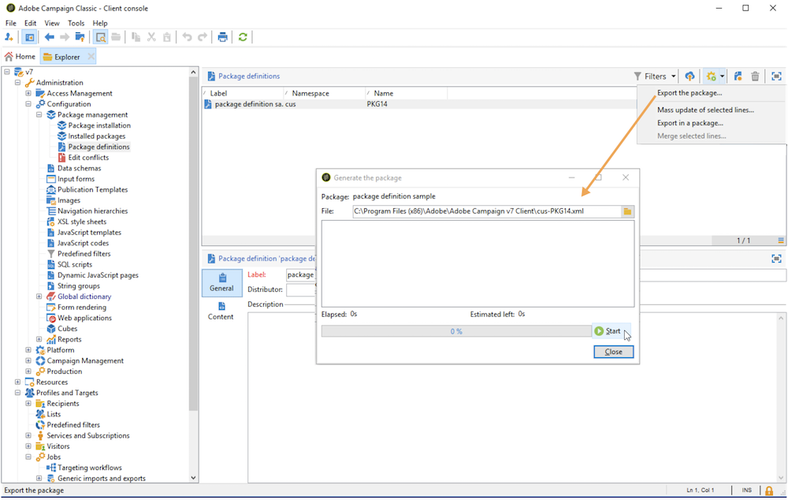

# 데이터 패키지를 사용한 작업{#working-with-data-packages}


## 데이터 패키지 정보 {#about-data-packages}

Adobe Campaign을 사용하면 패키지 시스템을 통해 플랫폼 구성 및 데이터를 내보내거나 가져올 수 있습니다. 패키지에는 필터링되었거나 필터링되지 않은 다양한 종류의 구성, 요소가 포함될 수 있습니다.

데이터 패키지를 사용하면 Adobe Campaign 데이터베이스의 엔터티가 XML 형식의 파일을 통해 표시될 수 있습니다. 패키지에 포함된 각 엔티티는 모든 데이터로 표시됩니다.

의 원칙 **데이터 패키지** 는 데이터 구성을 내보내고 다른 Adobe Campaign 시스템에 통합하는 것입니다. 에서 일관된 데이터 패키지 세트를 유지 관리하는 방법을 알아봅니다. [섹션](#data-package-best-practices).

### 패키지 유형 {#types-of-packages}

내보낼 수 있는 패키지에는 사용자 패키지, 플랫폼 패키지 및 관리 패키지의 세 가지 유형이 있습니다.

* **사용자 패키지**: 내보낼 엔티티 목록을 선택할 수 있습니다. 이 유형의 패키지는 종속성을 관리하고 오류를 확인합니다.
* **플랫폼 패키지**: 추가된 모든 기술 리소스(비표준)(스키마, JavaScript 코드 등)가 포함됩니다.

  

* **관리 패키지**: 추가된 모든 템플릿 및 비즈니스 개체(비표준)(템플릿, 라이브러리 등)가 포함됩니다.

  

>[!CAUTION]
>
>다음 **platform** 및 **admin** 유형에는 내보낼 미리 정의된 엔티티 목록이 포함되어 있습니다. 각 엔티티는 필터링 조건에 연결되어 만들어진 패키지의 기본 리소스를 제거할 수 있습니다.

## 데이터 구조 {#data-structure}

데이터 패키지에 대한 설명은 의 문법을 준수하는 구조화된 XML 문서입니다 **xrk:navtree** 데이터 스키마.

데이터 패키지 예:

```
<package>
  <entities schema="nms:recipient">
    <recipient email="john.smith@adobe.com" lastName="Smith" firstName="John">      
      <folder _operation="none" name="nmsRootFolder"/>      
      <company _operation="none" name="Adobe"/>
    </recipient>
  </entities>
  <entities schema="sfa:company">
    <company name="Adobe">
      location city="London" zipCode="W11 2BQ"/>
    </company>
  </entities>
</package>
```

XML 문서는 다음으로 시작하고 끝나야 합니다 **`<package>`** 요소를 생성하지 않습니다. 임의 **`<entities>`** 뒤에 오는 요소는 문서 유형별로 데이터를 배포합니다.

An **`<entities>`** 요소는에 입력한 데이터 스키마 형식으로 패키지의 데이터를 포함합니다. **스키마** 특성.

패키지의 데이터에는 자동 생성 키( )와 같이 기본 간에 호환되지 않는 내부 키가 포함되지 않아야 합니다.**autopk** 선택 사항).

이 예제에서 &quot;folder&quot; 및 &quot;company&quot; 링크의 조인은 대상 테이블의 소위 &quot;high level&quot; 키로 대체되었습니다.

```
<recipient>
  <folder _operation="none" name="nmsRootFolder"/>
  <company _operation="none" name="Adobe"/>
</recipient>
```

다음 **`operation`** 값이 &quot;none&quot;인 속성은 조정 링크를 정의합니다.

데이터 패키지는 모든 텍스트 편집기에서 수동으로 생성할 수 있습니다. XML 문서의 구조가 &quot;xtk:navtree&quot; 데이터 스키마를 준수하는지 확인하기만 하면 됩니다. Adobe Campaign 콘솔에는 데이터 패키지 내보내기 및 가져오기 모듈이 있습니다.

## 패키지 내보내기 {#exporting-packages}

### 패키지 내보내기 기본 정보 {#about-package-export}

패키지를 다음과 같은 세 가지 방법으로 내보낼 수 있습니다.

* 다음 **[!UICONTROL Package Export Wizard]** 개체 세트를 단일 패키지로 내보낼 수 있습니다. 자세한 내용은 다음을 참조하십시오. [패키지의 개체 집합 내보내기](#exporting-a-set-of-objects-in-a-package)
* A **단일 오브젝트** 패키지를 마우스 오른쪽 단추로 클릭하고 를 선택하여 패키지로 직접 내보낼 수 있습니다 **[!UICONTROL Actions > Export in a package]**.
* **패키지 정의** 나중에 패키지에서 내보낼 개체를 추가하는 패키지 구조를 만들 수 있습니다. 자세한 내용은 다음을 참조하십시오. [패키지 정의 관리](#managing-package-definitions)

패키지를 내보내면 추가된 모든 엔티티와 패키지를 다른 Campaign 인스턴스로 가져올 수 있습니다.

### 패키지의 개체 집합 내보내기 {#exporting-a-set-of-objects-in-a-package}

패키지 내보내기 마법사는 **[!UICONTROL Tools > Advanced > Export package...]** Adobe Campaign 클라이언트 콘솔의 메뉴.


세 가지 유형의 패키지에 대해 마법사는 다음 단계를 제공합니다.

1. 문서 유형별로 내보낼 엔티티 나열:

   

   >[!CAUTION]
   >
   >를 내보내는 경우 **[!UICONTROL Offer category]**, **[!UICONTROL Offer environment]**, **[!UICONTROL Program]** 또는 **[!UICONTROL Plan]** 폴더를 입력하세요. 폴더를 선택하지 마십시오. **xtk:folder** 데이터가 손실될 수 있습니다. 폴더에 해당하는 엔티티를 선택합니다. **nms:offer범주** 오퍼 범주의 경우 **nms:offer환경** 오퍼 환경의 경우 **nms:program** 프로그램 및 **nms:plan** 계획용입니다.

   목록 관리를 사용하면 구성에서 내보낼 엔티티를 추가하거나 삭제할 수 있습니다. 클릭 **[!UICONTROL Add]** 새 엔티티를 선택합니다.

   다음 **[!UICONTROL Detail]** 버튼은 선택한 구성을 편집합니다.

   >[!NOTE]
   >
   >종속성 메커니즘은 엔티티 내보내기 시퀀스를 제어합니다. 자세한 내용은 다음을 참조하십시오. [종속성 관리](#managing-dependencies).

1. 엔티티 구성 화면은 추출할 문서 유형에 대한 필터 쿼리를 정의합니다.

   데이터 추출을 위해 필터링 절을 구성해야 합니다.

   

   >[!NOTE]
   >
   >쿼리 편집기는에 표시됩니다. [이 섹션](../../platform/using/about-queries-in-campaign.md).

1. 클릭 **[!UICONTROL Next]** 추출 중에 데이터의 순서를 지정하려면 정렬 열을 선택합니다.

   

1. 내보내기를 실행하기 전에 추출할 데이터를 미리 봅니다.

   

1. 패키지 내보내기 마법사의 마지막 페이지를 사용하여 내보내기를 시작할 수 있습니다. 데이터는 다음에 표시된 파일에 저장됩니다 **[!UICONTROL File]** 필드.

   

### 종속성 관리 {#managing-dependencies}

내보내기 메커니즘을 사용하면 Adobe Campaign에서 내보낸 다양한 요소 사이의 링크를 추적할 수 있습니다.

이 메커니즘은 다음 두 가지 규칙으로 정의됩니다.

* 이 있는 링크에 연결된 오브젝트 **소유** 또는 **owncopy** 형식 무결성은 내보낸 개체와 동일한 패키지로 내보내집니다.
* 이 있는 링크에 연결된 오브젝트 **중립** 또는 **정의** 형식 무결성(정의된 링크)은 별도로 내보내야 합니다.

>[!NOTE]
>
>스키마 요소에 연결된 무결성 유형은에 정의되어 있습니다. [이 섹션](../../configuration/using/database-mapping.md#links--relation-between-tables).

#### 캠페인 내보내기 {#exporting-a-campaign}

다음은 캠페인을 내보내는 방법에 대한 예입니다. 내보낼 마케팅 캠페인에는 &quot;MyWorkflow&quot; 폴더(노드: 관리/프로덕션/기술 워크플로우/캠페인 프로세스/MyWorkflow)에 작업(레이블: &quot;MyTask&quot;)과 워크플로우(레이블: &quot;CampaignWorkflow&quot;)가 포함되어 있습니다.

일치하는 스키마가 &quot;고유&quot; 유형 무결성의 링크로 연결되므로 작업 및 워크플로는 캠페인과 동일한 패키지로 내보내집니다.

패키지 콘텐츠:

```
<?xml version='1.0'?>
<package author="Administrator (admin)" buildNumber="7974" buildVersion="7.1" img=""
label="" name="" namespace="" vendor="">
 <desc></desc>
 <version buildDate="2013-01-09 10:30:18.954Z"/>
 <entities schema="nms:operation">
  <operation duration="432000" end="2013-01-14" internalName="OP1" label="MyCampaign"
  modelName="opEmpty" start="2013-01-09">
   <controlGroup>
    <where filteringSchema=""/>
   </controlGroup>
   <seedList>
    <where filteringSchema="nms:seedMember"></where>
    <seedMember internalName="SDM1"></seedMember>
   </seedList>
   <parameter useAsset="1" useBudget="1" useControlGroup="1" useDeliveryOutline="1"
   useDocument="1" useFCPValidation="0" useSeedMember="1" useTask="1"
   useValidation="1" useWorkflow="1"></parameter>
   <fcpSeed>
    <where filteringSchema="nms:seedMember"></where>
   </fcpSeed>
   <owner _operation="none" name="admin" type="0"/>
   <program _operation="none" name="nmsOperations"/>
   <task end="2013-01-17 10:07:51.000Z" label="MyTask" name="TSK2" start="2013-01-16 10:07:51.000Z"
   status="1">
    <owner _operation="none" name="admin" type="0"/>
    <operation _operation="none" internalName="OP1"/>
    <folder _operation="none" name="nmsTask"/>
   </task>
   <workflow internalName="WKF12" label="CampaignWorkflow" modelName="newOpEmpty"
   order="8982" scenario-cs="Notification of the workflow supervisor (notifySupervisor)"
   schema="nms:recipient">
    <scenario internalName="notifySupervisor"/>
    <desc></desc>
    <folder _operation="none" name="Folder4"/>
    <operation _operation="none" internalName="OP1"/>
   </workflow>
  </operation>
 </entities>
</package>   
```

패키지 유형에 대한 제휴는 를 사용하는 스키마에서 정의됩니다. **@pkgAdmin 및 @pkgPlatform** 특성. 이러한 속성은 모두 패키지 제휴 조건을 정의하는 XTK 식을 받습니다.

```
<element name="offerEnv" img="nms:offerEnv.png" 
template="xtk:folder" pkgAdmin="@id != 0">
```

마지막으로 **@pkgStatus** 속성을 사용하면 이러한 요소 또는 속성에 대한 내보내기 규칙을 정의할 수 있습니다. 속성 값에 따라 요소 또는 속성은 내보낸 패키지에서 찾을 수 있습니다. 이 속성에 대해 가능한 세 가지 값은 다음과 같습니다.

* **절대 안 함**: 필드/링크를 내보내지 않습니다.
* **항상**: 이 필드에 대해 강제 내보내기
* **preCreate**: 연결된 엔티티 만들기 승인

>[!NOTE]
>
>다음 **preCreate** 값은 링크 유형 이벤트에 대해서만 허용됩니다. 내보낸 패키지에 아직 로드되지 않은 엔티티를 생성하거나 가리키도록 허용합니다.

## 패키지 정의 관리 {#managing-package-definitions}

패키지 정의를 사용하면 나중에 단일 패키지로 내보낼 엔티티를 추가하는 패키지 구조를 만들 수 있습니다. 그러면 이 패키지와 추가된 모든 엔티티를 다른 Campaign 인스턴스로 가져올 수 있습니다.

**관련 항목:**

* [패키지 정의 만들기](#creating-a-package-definition)
* [패키지 정의에 엔티티 추가](#adding-entities-to-a-package-definition)
* [패키지 정의 생성 구성](#configuring-package-definitions-generation)
* [패키지 정의에서 패키지 내보내기](#exporting-packages-from-a-package-definition)

### 패키지 정의 만들기 {#creating-a-package-definition}

패키지 정의는 다음에서 액세스할 수 있습니다. **[!UICONTROL Administration > Configuration > Package management > Package definitions]** 메뉴 아래의 제품에서 사용할 수 있습니다.

패키지 정의를 만들려면 **[!UICONTROL New]** 단추를 누른 다음 패키지 정의 일반 정보를 입력합니다.


그런 다음 패키지 정의에 엔티티를 추가하고 XML 파일 패키지로 내보낼 수 있습니다.

**관련 항목:**

* [패키지 정의에 엔티티 추가](#adding-entities-to-a-package-definition)
* [패키지 정의 생성 구성](#configuring-package-definitions-generation)
* [패키지 정의에서 패키지 내보내기](#exporting-packages-from-a-package-definition)

### 패키지 정의에 엔티티 추가 {#adding-entities-to-a-package-definition}

다음에서 **[!UICONTROL Content]** 탭을 클릭하고 **[!UICONTROL Add]** 단추를 클릭하여 패키지로 내보낼 엔티티를 선택합니다. 엔티티 선택 모범 사례는에 나와 있습니다. [이 섹션](#exporting-a-set-of-objects-in-a-package) 섹션.


엔티티는 인스턴스의 해당 위치에서 패키지 정의에 직접 추가할 수 있습니다. 이렇게 하려면 아래 단계를 수행합니다:

1. 원하는 엔티티를 마우스 오른쪽 버튼으로 클릭한 다음 를 선택합니다 **[!UICONTROL Actions > Export in a package]**.

   

1. 선택 **[!UICONTROL Add to a package definition]**&#x200B;를 클릭한 후 엔티티를 추가할 패키지 정의를 선택합니다.

   

1. 엔티티가 패키지 정의에 추가되면 패키지와 함께 내보내집니다( 참조) [이 섹션](#exporting-packages-from-a-package-definition)).

   

### 패키지 정의 생성 구성 {#configuring-package-definitions-generation}

패키지 정의에서 패키지 생성을 구성할 수 있습니다. **[!UICONTROL Content]** 탭. 이렇게 하려면 **[!UICONTROL Generation parameters]** 링크를 클릭합니다.


* **[!UICONTROL Include the definition]**: 현재 패키지 정의에 사용되는 정의를 포함합니다.
* **[!UICONTROL Include an installation script]**: 패키지 가져오기 시 실행할 javascript 스크립트를 추가할 수 있습니다. 선택한 경우 **[!UICONTROL Script]** 패키지 정의 화면에 탭이 추가됩니다.
* **[!UICONTROL Include default values]**: 모든 엔티티 속성의 값을 패키지에 추가합니다.

  긴 내보내기를 방지하기 위해 이 옵션은 기본적으로 선택되어 있지 않습니다. 즉, 기본값이 있는 엔티티 속성(&#39;empty string&#39;, &#39;0&#39; 및 &#39;false&#39;(스키마에 달리 정의되지 않은 경우)은 패키지에 추가되지 않으므로 내보내지지 않습니다.

  >[!CAUTION]
  >
  >이 옵션을 선택 해제하면 로컬 버전과 가져온 버전이 병합될 수 있습니다.
  >
  >패키지를 가져오는 인스턴스에 패키지의 엔티티와 동일한 엔티티(예: 동일한 외부 ID를 가진 엔티티)가 포함된 경우 해당 속성이 업데이트되지 않습니다. 이 문제는 이전 인스턴스의 속성이 패키지에 포함되지 않았으므로 기본값이 있는 경우에 발생할 수 있습니다.
  >
  >이 경우 **[!UICONTROL Include default values]** 이전 인스턴스의 모든 속성을 패키지와 함께 내보내면 옵션이 버전 병합을 방지합니다.

### 패키지 정의에서 패키지 내보내기 {#exporting-packages-from-a-package-definition}

패키지 정의에서 패키지를 내보내려면 아래 단계를 수행합니다.

1. 내보낼 패키지 정의를 선택한 다음 **[!UICONTROL Actions]** 단추 및 선택 **[!UICONTROL Export the package]**.
1. 내보낸 패키지에 해당하는 XML 파일이 기본적으로 선택됩니다. 패키지 정의 네임스페이스 및 이름에 따라 이름이 지정됩니다.
1. 패키지 이름과 위치가 정의되면 **[!UICONTROL Start]** 단추를 클릭하여 내보내기를 시작합니다.

   

## 패키지 가져오기 {#importing-packages}

패키지 가져오기 마법사는 메인 메뉴를 통해 액세스할 수 있습니다 **[!UICONTROL Tools > Advanced > Import package]** Adobe Campaign 클라이언트 콘솔의

이전에 수행한 내보내기(예: 다른 Adobe Campaign 인스턴스)에서 패키지를 가져오거나 [기본 제공 패키지](../../installation/using/installing-campaign-standard-packages.md), 라이선스 약관에 따라 다릅니다.


### 파일에서 패키지 설치 {#installing-a-package-from-a-file}

기존 데이터 패키지를 가져오려면 XML 파일을 선택하고 **[!UICONTROL Open]**.


가져올 패키지의 콘텐츠가 편집기의 중간 섹션에 표시됩니다.

클릭 **[!UICONTROL Next]** 및 **[!UICONTROL Start]** 가져오기를 시작합니다.


### 기본 제공 패키지 설치 {#installing-a-standard-package}

표준 패키지는 Adobe Campaign 구성 시 설치되는 기본 제공 패키지입니다. 사용 권한 및 배포 모델에 따라 새 옵션 또는 추가 기능을 획득하거나 새 오퍼로 업그레이드하는 경우 새 표준 패키지를 가져올 수 있습니다.

설치할 수 있는 패키지를 확인하려면 사용권 계약을 참조하십시오.

기본 제공 패키지에 대한 자세한 내용은 [이 페이지](../../installation/using/installing-campaign-standard-packages.md).

## 데이터 패키지 모범 사례 {#data-package-best-practices}

이 섹션에서는 프로젝트 기간 동안 일관된 방식으로 데이터 패키지를 구성하는 방법에 대해 설명합니다.

패키지에는 필터링되었거나 필터링되지 않은 다양한 종류의 구성 및 요소가 포함될 수 있습니다. 일부 요소를 놓치거나 요소/패키지를 올바른 순서로 가져오지 않으면 플랫폼 구성이 중단될 수 있습니다.

또한 여러 사람이 서로 다른 기능을 가진 동일한 플랫폼에서 작업하므로 패키지 사양 폴더가 빠르게 복잡해질 수 있습니다.

필수는 아니지만, 이 섹션에서는 대규모 프로젝트를 위해 Adobe Campaign에서 패키지를 구성하고 사용하는 데 도움이 되는 솔루션을 제공합니다.

주요 제한 사항은 다음과 같습니다.
* 패키지를 구성하고 변경 사항 및 시기 추적
* 구성이 업데이트되면 업데이트와 직접 연결되지 않은 문제를 일으킬 위험을 최소화하십시오

>[!NOTE]
>
>패키지를 자동으로 내보내는 워크플로우 설정에 대한 자세한 내용은 [이 페이지](https://helpx.adobe.com/campaign/kb/export-packages-automatically.html).

### 권장 사항 {#data-package-recommendations}

항상 동일한 버전의 플랫폼 내에서 가져옵니다. 빌드가 동일한 두 인스턴스 간에 패키지를 배포하는지 확인해야 합니다. 가져오기를 강제로 수행하지 않고 항상 먼저 플랫폼을 업데이트합니다(빌드가 다른 경우).

>[!IMPORTANT]
>
>Adobe은 다른 버전 간 가져오기를 지원하지 않습니다.
<!--This is not allowed. Importing from 6.02 to 6.1, for example, is prohibited. If you do so, R&D won’t be able to help you resolve any issues you encounter.-->

스키마와 데이터베이스 구조에 주의하십시오. 스키마를 사용한 패키지 가져오기 뒤에는 스키마 생성이 있어야 합니다.

### 솔루션 {#data-package-solution}

#### 패키지 유형 {#package-types}

먼저 다양한 유형의 패키지를 정의합니다. 다음 네 가지 유형만 사용됩니다.

**엔티티**
* 스키마, 양식, 폴더, 게재 템플릿 등과 같은 Adobe Campaign의 모든 &quot;xtk&quot; 및 &quot;nms&quot; 특정 요소
* 엔티티를 &quot;admin&quot; 및 &quot;platform&quot; 요소로 고려할 수 있습니다.
* Campaign 인스턴스에 업로드할 때 패키지에 둘 이상의 엔티티를 포함해서는 안 됩니다.

<!--Nothing “works” alone. An entity package does not have a specific role or objective.-->

새 인스턴스에 구성을 배포해야 하는 경우 모든 엔티티 패키지를 가져올 수 있습니다.

**기능**

이 유형의 패키지:
* 클라이언트 요구 사항/사양에 대한 답변입니다.
* 하나 이상의 기능을 포함합니다.
* 다른 패키지 없이 기능을 실행할 수 있도록 모든 종속성을 포함해야 합니다.

**캠페인**

이 패키지는 필수가 아닙니다. 캠페인이 기능으로 보여질 수 있더라도 모든 캠페인에 대한 특정 유형을 만드는 것이 유용한 경우가 있습니다.

**업데이트**

구성하고 나면 기능을 다른 환경으로 내보낼 수 있습니다. 예를 들어 패키지를 개발 환경에서 테스트 환경으로 내보낼 수 있습니다. 이 검사에서는 결함이 드러납니다. 먼저 개발 환경에서 수정해야 합니다. 그런 다음 패치를 테스트 플랫폼에 적용해야 합니다.

첫 번째 해결 방법은 전체 기능을 다시 내보내는 것입니다. 그러나 위험(원치 않는 요소 업데이트)을 방지하려면 수정만 포함된 패키지를 갖는 것이 안전합니다.

따라서 기능의 엔티티 유형이 하나만 포함된 &quot;업데이트&quot; 패키지를 만드는 것이 좋습니다.

업데이트는 수정일 뿐만 아니라 엔티티/기능/캠페인 패키지의 새 요소도 될 수 있습니다. 전체 패키지를 배포하지 않도록 업데이트 패키지를 내보낼 수 있습니다.

### 이름 지정 규칙 {#data-package-naming}

이제 유형이 정의되었으므로 명명 규칙을 지정해야 합니다. Adobe Campaign에서는 패키지 사양에 대한 하위 폴더를 만들 수 없습니다. 즉, 숫자는 조직화된 상태를 유지하는 데 가장 적합한 솔루션입니다. 번호는 패키지 이름에 접두사로 사용됩니다. 다음 규칙을 사용할 수 있습니다.

* 엔티티: 1부터 99까지
* 기능: 부터 100 - 199
* 캠페인: 200부터 299까지
* 업데이트: 5000에서 5999로

### 패키지 {#data-packages}

>[!NOTE]
>
>올바른 패키지 수를 정의하기 위한 규칙을 설정하는 것이 좋습니다.

#### 엔티티 패키지 순서 {#entity-packages-order}

가져오기를 지원하기 위해 개체 패키지는 가져올 때 주문해야 합니다. 예제:
* 001 - 스키마
* 002 - 양식
* 003 - 이미지
* 등

>[!NOTE]
>
>Forms은 스키마 업데이트 후에만 가져와야 합니다.

#### 패키지 200 {#package-200}

패키지 번호 &quot;200&quot;은 특정 캠페인에 사용하면 안 됩니다. 이 번호는 모든 캠페인과 관련된 항목을 업데이트하는 데 사용됩니다.

#### 패키지 업데이트 {#update-package}

마지막 사항은 업데이트 패키지 번호 매기기에 관한 것입니다. 접두사로 &quot;5&quot;가 있는 패키지 번호(엔티티, 기능 또는 캠페인)입니다. 예제:
* 스키마 1개를 업데이트하는 5001
* 5200: 모든 캠페인 업데이트
* 5101 - 101 기능 업데이트

업데이트 패키지는 쉽게 재사용할 수 있도록 한 개의 특정 엔티티만 포함해야 합니다. 분할하려면 새 숫자를 추가합니다(1부터 시작). 이 패키지에 대한 특정 주문 규칙은 없습니다. 더 잘 이해하기 위해, 우리가 101 기능, 소셜 응용 프로그램을 가지고 있다고 상상해 보십시오.
* 여기에는 웹 앱과 외부 계정이 포함되어 있습니다.
   * 패키지 레이블은 101 - 소셜 애플리케이션(socialApplication)입니다.
* 웹 앱에 오류가 있습니다.
   * wepApp이 수정되었습니다.
   * 5101 - 1 - 소셜 애플리케이션 웹 앱(socialApplication_webApp) 이름으로 수정 패키지를 만들어야 합니다.
* 소셜 기능을 사용하려면 새 외부 계정을 추가해야 합니다.
   * 외부 계정이 생성되었습니다.
   * 새 패키지는 5101 - 2 - 소셜 애플리케이션 외부 계정(socialApplication_extAccount)입니다.
   * 동시에 101 패키지가 외부 계정에 추가되도록 업데이트되지만 배포되지 않습니다.
     

#### 패키지 설명서 {#package-documentation}

패키지를 업데이트할 때 항상 설명 필드에 설명을 추가하여 수정 사항 및 이유를 자세히 설명해야 합니다(예: &quot;새 스키마 추가&quot; 또는 &quot;오류 수정&quot;).


댓글에 날짜도 지정해야 합니다. 업데이트 패키지에 대한 의견을 항상 &quot;상위&quot;(5개의 접두사가 없는 패키지)에 보고합니다.

>[!IMPORTANT]
>
>설명 필드는 2.000자까지만 포함할 수 있습니다.
