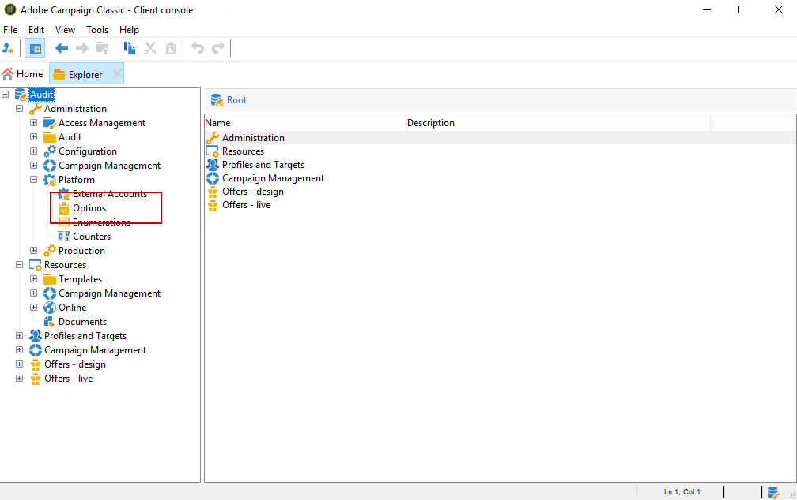

# 감사 추적{#audit-trail}

Adobe Campaign에서, **[!UICONTROL Audit trail]** 는 인스턴스 내에서 수행된 변경 사항의 전체 기록에 액세스할 수 있도록 해줍니다.

**[!UICONTROL Audit trail]** 캡처합니다. 여기에는 다음과 같은 질문에 답하는 데 도움이 되는 데이터 기록에 직접 액세스하는 방법이 포함되어 있습니다.워크플로우가 어떻게 처리되었는지, 마지막으로 업데이트한 사용자 또는 인스턴스에서 사용자가 수행한 작업

>[!NOTE]
>
>Adobe Campaign은 사용자 권한, 템플릿, 개인화 또는 캠페인 내에서 수행된 변경 사항을 감사하지 않습니다.\
>감사 추적은 인스턴스의 관리자만 관리할 수 있습니다.

감사 추적은 다음 세 가지 구성 요소로 구성됩니다.

* **스키마 감사 추적**:활동 및 스키마를 마지막으로 수정한 내용을 확인합니다.

   스키마에 대한 자세한 내용은 이 [페이지를](../../configuration/using/data-schemas.md)참조하십시오.

* **워크플로우 감사 추적**:워크플로우에 수행한 활동 및 마지막 수정 사항과 다음과 같은 워크플로우의 상태를 확인합니다.

   * 시작
   * 일시 중지
   * 중지
   * 다시 시작
   * 작업에 해당하는 정리 삭제 삭제 내역
   * 시뮬레이션 모드에서 시작 동작과 일치하는 항목 시뮬레이션
   * 작업에 해당하는 작업 해제 지금 대기 중인 작업 실행
   * 무조건적 중지
   워크플로우에 대한 자세한 내용은 이 [페이지를](../../workflow/using/about-workflows.md)참조하십시오.

   워크플로우를 모니터링하는 방법에 대한 자세한 내용은 [전용 섹션을](../../workflow/using/monitoring-workflow-execution.md)참조하십시오.

* **옵션 감사 추적**:활동 및 마지막으로 수행한 옵션을 확인합니다.

   옵션에 대한 자세한 내용은 이 [페이지를](../../installation/using/configuring-campaign-options.md)참조하십시오.

## 감사 추적 액세스 {#accessing-audit-trail}

인스턴스의 에 액세스하려면 **[!UICONTROL Audit trail]** :

1. 인스턴스의 **[!UICONTROL Explorer]** 메뉴에 액세스합니다.
1. 메뉴에서 을 **[!UICONTROL Administration]** 선택합니다 **[!UICONTROL Audit]** .

   

1. 엔티티 목록이 있는 창이 **[!UICONTROL Audit trail]** 열립니다. Adobe Campaign은 워크플로우, 옵션 및 스키마에 대한 만들기, 편집 및 삭제 작업을 감사합니다.

   개체 중 하나를 선택하여 마지막 수정 사항에 대해 자세히 알아보십시오.

   

1. 이 **[!UICONTROL Audit entity]** 창에서는 선택한 엔티티에 대한 다음과 같은 자세한 정보를 제공합니다.

   * **[!UICONTROL Type]** :워크플로우, 옵션 또는 스키마를 참조하십시오.
   * **[!UICONTROL Entity]** :활동의 내부 이름입니다.
   * **[!UICONTROL Modified by]** :이 엔티티를 마지막으로 수정한 마지막 사람의 사용자 이름입니다.
   * **[!UICONTROL Action]** :이 엔티티에 대해 수행된 마지막 작업(작성됨, 편집됨 또는 삭제됨)입니다.
   * **[!UICONTROL Modification date]** :이 엔티티에 대해 수행된 마지막 작업의 날짜입니다.
   코드 블록은 엔티티에서 정확히 변경된 내용에 대한 자세한 정보를 제공합니다.

   

>[!NOTE]
>
>기본적으로 보존 기간은 에 대해 180일로 **[!UICONTROL Audit logs]** 설정됩니다. 보존 기간을 변경하는 방법에 대한 자세한 내용은 이 [페이지를](../../production/using/database-cleanup-workflow.md#deployment-wizard)참조하십시오.

## 감사 추적 활성화/비활성화 {#enable-disable-audit-trail}

예를 들어 데이터베이스에 공간을 절약하려는 경우 특정 활동에 대해 감사 추적을 쉽게 활성화하거나 비활성화할 수 있습니다.

이렇게 하려면 다음을 수행하십시오.

1. 인스턴스의 **[!UICONTROL Explorer]** 메뉴에 액세스합니다.
1. 메뉴에서 **[!UICONTROL Administration]** 을 **[!UICONTROL Platform]** **[!UICONTROL Options]** 선택합니다.

   

1. 활성화/비활성화할 엔티티에 따라 다음 옵션 중 하나를 선택합니다.

   * 워크플로우의 경우: **[!UICONTROL XtkAudit_Workflows]**
   * 스키마: **[!UICONTROL XtkAudit_DataSchema]**
   * 옵션: **[!UICONTROL XtkAudit_Option]**
   * 모든 엔티티에 대해: **[!UICONTROL XtkAudit_Enable_All]**
   

1. 엔티티를 활성화하려면 **[!UICONTROL Value]** 1로 변경하고 비활성화하려면 0으로 변경합니다.

   

1. 클릭 **[!UICONTROL Save]** .

