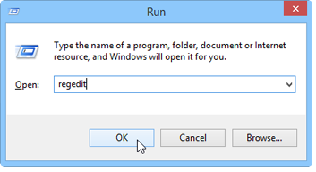
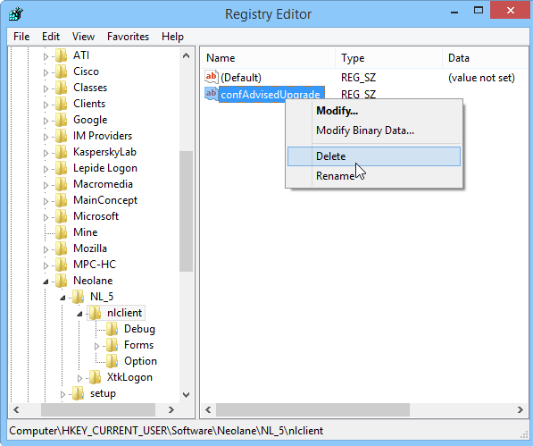

# 콘솔 업데이트{#console-update}

**[!UICONTROL Do not request console update]** 옵션을 선택하고 업데이트 요청을 다시 활성화하려면 다음 절차를 적용합니다.

1. Windows **[!UICONTROL Start > Execute]** 메뉴의 **regedit** 명령을 사용하여 레지스트리 데이터베이스의 편집기를 엽니다.

   

1. 트리에서 **[!UICONTROL HKEY_CURRENT_USERSoftwareneolaneNL_6nlclient]** 노드의 옵션을 표시합니다.
1. **[!UICONTROL confAdvisedUpgrade]** 항목을 삭제하고 레지스트리 편집기를 닫습니다.

   
