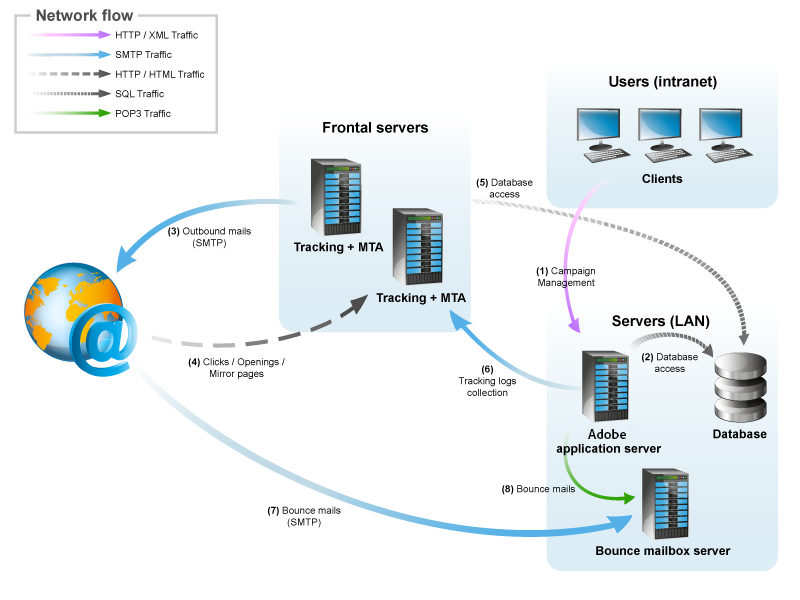

# 일반 아키텍처{#general-architecture}

## 최소 아키텍처 {#minimum-architecture}

Adobe Campaign은 최소 구성에서 다음과 같이 작동합니다.

* adobe campaign 응용 프로그램 서버,
* 데이터베이스를 참조하십시오.

   

이 다이어그램은 최소 아키텍처 컨텍스트와 관련된 유일한 트래픽은 다음과 같습니다.

1. 인터넷을 통해 Adobe Campaign 서버에 대한 HTTP 프로토콜 트래픽,
1. 인터넷을 통해 Adobe Campaign 서버로부터의 SMTP 프로토콜 트래픽

## 분산 아키텍처 {#distributed-architecture}

Adobe Campaign은 여러 대의 시스템으로 분류할 수 있는 여러 모듈로 구성되어 있습니다. 이 운영 모드는 다음과 같은 여러 이점을 제공합니다.

* 부하 균형 조정,
* 모듈 중복 설정,
* 여러 서비스 제공업체를 통해 세분화된 아키텍처 구축(제공된 서비스의 세분화)

여러 시스템에 모듈을 배포하면 사용 유연성과 향상된 적응성이 제공됩니다.

>[!NOTE]
>
>다양한 아키텍처에 대한 자세한 내용은 [이 섹션](../../installation/using/general-architecture.md)을 참조하십시오.

## 열려 있는 포트 목록 {#list-of-open-ports}

| 포트 번호 | 관련 Adobe Campaign 모듈 또는 응용 프로그램 | 구성 가능 |
|---|---|---|
| 443/tcp 또는 80/tcp | 웹 서버(Apache/IIS) | 예 |
| 6666/udp(로컬) | Adobe Campaign:Sylogd | 예 |
| 8005/tcp(로컬) | Adobe Campaign:웹 모듈 | 예 |
| 8080/tcp | Adobe Campaign:웹 모듈(tomcat) | 예 |
| 7777년 | 통계 서버(시작 서버) | 예 |

