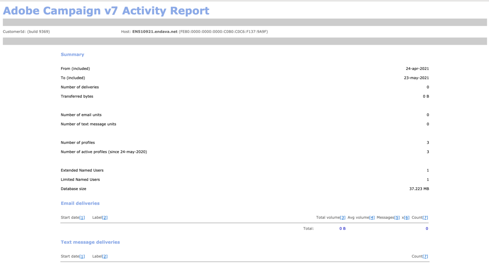

# 모니터링 프로세스{#monitoring-processes}

응용 프로그램 서버와 리디렉션 서버(**추적**)는 수동 또는 자동으로 모니터링할 수 있습니다.

## 수동 모니터링 {#manual-monitoring}

Adobe Campaign 프로세스 모니터링 페이지로 **[!UICONTROL Monitoring]** 이동하여 **[!UICONTROL Overview]** 링크를 클릭합니다.


표시된 페이지를 사용하여 연결된 인스턴스의 상태(예:

* 인스턴스에 대한 정보:버전, 이름, 데이터베이스 엔진, 설치된 패키지, 서버 시스템 표시기
* 누락된 프로세스 및 실행 정보 목록(시작 날짜, PID 등),
* 워크플로우 및 게재 보기.

다른 캠페인 프로세스를 모니터링하는 추가 방법이 [이 페이지에](https://helpx.adobe.com/campaign/kb/acc-maintenance.html)표시됩니다.

### 로그 저널 {#log-journal}

프로세스와 관련된 로그 저널을 표시할 수 있습니다. 이렇게 하려면 프로세스를 클릭하고 **mta** 등을 클릭한 다음 **[!UICONTROL Open the log journal]** 을 클릭합니다.


### 시스템 표시기 {#system-indicators}

시스템 표시기 목록을 사용하면 물리적 및 가상 메모리, 활성 프로세스 및 사용 가능한 디스크 공간 등 시스템 관련 정보를 표시할 수 있습니다. Linux 및 Windows 운영 체제에서는 지표가 다릅니다. 페이지로 이동하여 **[!UICONTROL Instance Monitoring]** **[!UICONTROL Display]** 링크를 클릭하여 지표 목록을 엽니다.

#### Windows {#in-windows}

* **[!UICONTROL Pending events queued]** :메시지 센터 관련 **표시기**. 자세한 내용은 [이 섹션을](../../message-center/using/monitoring-thresholds.md) 참조하십시오.
* **[!UICONTROL Memory]** :실제 메모리(RAM)에 대한 정보입니다.

   **[!UICONTROL Current value]** :실제 메모리 사용량.

   **[!UICONTROL Max Value]** :설치된 총 메모리 양.

   **[!UICONTROL Available]** :사용 가능한 메모리 양.

   **[!UICONTROL Warning]** :이 표시기는 메모리 사용량이 전체 용량의 80%에 도달하면 표시됩니다.

   **[!UICONTROL Alert]** :이 표시기는 메모리 사용량이 전체 용량의 90%에 도달하면 표시됩니다.

   표시기와 표시기가 표시되면 Adobe Campaign 서버가 설치되어 있는 컴퓨터에 RAM을 추가하여 문제를 해결할 수 있습니다. **[!UICONTROL Warning]** **[!UICONTROL Alert]** 전용 컴퓨터에 Adobe Campaign 서버를 설치하기로 결정할 수도 있습니다.

* **[!UICONTROL Swap Memory]** :페이징 파일과 일치하는 가상 메모리와 관련된 정보:Windows에서 RAM처럼 사용하는 하드 디스크의 영역.

   **[!UICONTROL Current value]** :실제 메모리 사용량.

   **[!UICONTROL Max Value]** :총 메모리 양.

   **[!UICONTROL Available]** :사용 가능한 메모리 양.

   **[!UICONTROL Warning]** :이 표시기는 메모리 사용량이 전체 용량의 80%에 도달하면 표시됩니다.

   **[!UICONTROL Alert]** :이 표시기는 메모리 사용량이 전체 용량의 90%에 도달하면 표시됩니다.

   지표 **[!UICONTROL Warning]** 및 **[!UICONTROL Alert]** 표시기가 표시되면 고급 Windows 설정에서 Exchange 파일의 크기를 늘려 문제를 해결할 수 있습니다.

* **[!UICONTROL Disk XXX]** :시스템 독자와 관련된 정보입니다.

   **[!UICONTROL Current value]** :실제로 사용된 디스크 공간.

   **[!UICONTROL Max Value]** :총 디스크 용량.

   **[!UICONTROL Available]** :사용 가능한 디스크 공간

   **[!UICONTROL Used]** :사용된 디스크의 백분율입니다.

   **[!UICONTROL Warning]** :이 표시기는 사용 가능한 디스크 공간이 전체 용량의 80%에 도달할 때 표시됩니다.

   **[!UICONTROL Alert]** :이 표시기는 사용 가능한 디스크 공간이 전체 용량의 90%에 도달할 때 표시됩니다.

* **[!UICONTROL Number of processes too old]** :하루 이상 활성화된 Adobe Campaign 프로세스에 대한 정보입니다.

   **[!UICONTROL Current value]** :현재 활성 상태인 프로세스 수입니다.

   **[!UICONTROL Max Value]** :인증된 최대 프로세스 수(1).

   **[!UICONTROL Alert]** :프로세스 수가 1인 경우 이 표시기가 표시됩니다.

   표시기가 **[!UICONTROL Alert]** 표시되면 관련 프로세스가 SQL 데이터베이스 엔진에 의해 잠겨 있거나 무한 루프에 고정되어 있을 수 있습니다. Adobe Campaign에서 제공하는 **감시** 프로세스는 매일 모든 프로세스를 자동으로 다시 시작하여 이 문제를 해결할 수 있도록 해줍니다. 그러나, 여러분은 또한 관련된 과정을 중지하여 다시 시작할 수 있습니다.

#### Linux {#in-linux}


* **[!UICONTROL Pending events queued]** :메시지 센터 관련 **표시기**. 자세한 내용은 [이 섹션을](../../message-center/using/monitoring-thresholds.md) 참조하십시오.
* **[!UICONTROL Load average (1/5/15 minutes)]** :부하에 관한 정보(즉, 지난 분, 5분 또는 15분 동안 컴퓨터에서 실행 중인 프로세스에 의한 프로세서 사용률)

   **[!UICONTROL Current value]** :시스템의 실제 로드.

   **[!UICONTROL Max value]** :시스템의 프로세스 최대 사용 로드

   **[!UICONTROL Warning]** :이 표시기는 로드가 마지막 분, 5분 또는 15분 동안 승인된 최대 값의 80%에 도달할 때 표시됩니다.

   **[!UICONTROL Alert]** :이 표시기는 로드가 마지막 분, 5분 또는 15분 동안 인증된 최대 값의 90%에 도달할 때 표시됩니다.

* **[!UICONTROL Memory]** :실제 메모리(RAM)에 대한 정보입니다.

   **[!UICONTROL Current value]** :실제 메모리 사용량.

   **[!UICONTROL Max Value]** :설치된 총 메모리 양.

   **[!UICONTROL Available]** :사용 가능한 메모리 양.

   **[!UICONTROL Warning]** :이 표시기는 메모리 사용량이 전체 용량의 80%에 도달하면 표시됩니다.

   **[!UICONTROL Alert]** :이 표시기는 메모리 사용량이 전체 용량의 90%에 도달하면 표시됩니다.

   표시기와 표시기가 표시되면 Adobe Campaign 서버가 설치되어 있는 컴퓨터에 RAM을 추가하여 문제를 해결할 수 있습니다. **[!UICONTROL Warning]** **[!UICONTROL Alert]** 전용 컴퓨터에 Adobe Campaign 서버를 설치하기로 결정할 수도 있습니다.

* **[!UICONTROL Swap Memory]** :페이징 파일과 일치하는 가상 메모리와 관련된 정보:Windows에서 RAM처럼 사용하는 하드 디스크의 영역.

   **[!UICONTROL Current value]** :실제 메모리 사용량.

   **[!UICONTROL Max Value]** :총 메모리 양.

   **[!UICONTROL Available]** :사용 가능한 메모리 양.

   **[!UICONTROL Warning]** :이 표시기는 메모리 사용량이 전체 용량의 80%에 도달하면 표시됩니다.

   **[!UICONTROL Alert]** :이 표시기는 메모리 사용량이 전체 용량의 90%에 도달하면 표시됩니다.

   표시기와 **[!UICONTROL Warning]** **[!UICONTROL Alert]** 표시기가 표시되면 교환 파일의 크기를 늘려 문제를 해결할 수 있습니다.

* **[!UICONTROL Core Files]** :adobe Campaign 프로세스의 작동 중단으로 생성된 파일에 대한 정보입니다. 이러한 파일을 사용하면 충돌 원인을 진단할 수 있습니다.

   **[!UICONTROL Current Value]** :기존 파일 수입니다.

   **[!UICONTROL Max Value]** :인증된 최대 파일 수(1)

   **[!UICONTROL Warning]** :이 표시기는 파일 수가 1에 가까워지면 표시됩니다.

   **[!UICONTROL Alert]** :이 표시기는 파일 수가 1이면 표시됩니다.

   충돌로 인해 프로세스가 누락되면 프로세스 목록에 빨간색으로 표시되고 Adobe Campaign에서 제공하는 **감시** 프로세스에 의해 자동으로 다시 시작됩니다.

* **[!UICONTROL Number of shared memory segments]** :모든 Adobe Campaign 프로세스에서 공유하는 메모리 세그먼트에 대한 정보입니다.

   **[!UICONTROL Current value]** :현재 사용 중인 메모리 세그먼트 수입니다.

   **[!UICONTROL Max Value]** :인증된 최대 메모리 세그먼트 수(2).

   **[!UICONTROL Warning]** :이 표시기는 메모리 세그먼트 수가 1에 도달하면 표시됩니다.

   **[!UICONTROL Alert]** :이 표시기는 메모리 세그먼트 수가 2에 도달하면 표시됩니다.

* **[!UICONTROL Number of processes too old]** :하루 이상 활성화된 프로세스에 대한 정보입니다.

   **[!UICONTROL Current value]** :현재 활성 상태인 프로세스 수입니다.

   **[!UICONTROL Max Value]** :인증된 최대 프로세스 수

   **[!UICONTROL Warning]** :이 표시기는 프로세스 수가 인증된 임계값의 80%에 도달하면 표시됩니다.

   **[!UICONTROL Alert]** :이 표시기는 프로세스 수가 인증된 임계값의 90%에 도달하면 표시됩니다.

* **[!UICONTROL File Handles]** :파일 설명자에 대한 정보(예: 프로세스당 열린 파일 수)

   **[!UICONTROL Current value]** :현재 파일 설명자 수입니다.

   **[!UICONTROL Max Value]** :운영 체제에서 인증한 최대 파일 설명자 수입니다.

   **[!UICONTROL Warning]** :이 표시기는 인증된 파일 설명자 수가 80% 임계값에 도달하면 표시됩니다.

   **[!UICONTROL Alert]** :이 표시기는 인증된 파일 설명자 수가 90% 임계값에 도달하면 표시됩니다.

* **[!UICONTROL Processes]** :시스템 프로세스에 대한 정보입니다.

   **[!UICONTROL Current value]** :현재 활성 상태인 프로세스 수입니다.

   **[!UICONTROL Max Value]** :인증된 최대 프로세스 수

   **[!UICONTROL Active Processes]** :활성 프로세스 수입니다.

   **[!UICONTROL Inactive Processes]** :비활성 프로세스 수.

   **[!UICONTROL Warning]** :이 표시기는 승인된 프로세스 수가 80% 임계값에 도달하면 표시됩니다.

   **[!UICONTROL Alert]** :이 표시기는 승인된 프로세스 수가 90% 임계값에 도달하면 표시됩니다.

* **[!UICONTROL Zombie Processes]** :중지되었지만 여전히 프로세스 식별자(PID)가 있고 프로세스 테이블에 계속 표시되는 프로세스에 대한 정보입니다.

   **[!UICONTROL Current value]** :현재 활성 상태인 좀비 프로세스 수입니다.

   **[!UICONTROL Max Value]** :최대 권한 부여 좀비 프로세스 수(2).

   **[!UICONTROL Warning]** :이 표시기는 좀비 프로세스 수가 2에 가까워지면 표시됩니다.

   **[!UICONTROL Alert]** 이 표시기는 좀비 프로세스 수가 2에 도달할 때 표시됩니다.

#### 사용자 정의 지표 {#customized-indicators}

Adobe Campaign을 사용하면 지표를 사용자 정의할 수 있습니다. 이렇게 하려면:

1. .sh **파일을 만들고 이름을** **[!UICONTROL cust_indicators.sh]** 지정합니다.
1. 이 파일에 사용자 정의된 지표를 추가합니다. 예:

   ```
   #!/bin/bash 
   echo "<indicator name='Zombie Processes'>  
   <current label='Current Value' value='0' display=''/>  
   <warning value='2'/>  <alert value='2'/>  
   <max label='Max Value' value='2'/>
   </indicator>"
   ```

   or

   ```
   #!/bin/bash 
   echo "<indicator name='Availability'>  
   <current label='Last update of data' display='2012-09-03 10:00'/>  
   <current label='Availability last month' display='100.00%'/>  
   <current label='Availability this month' display='100.00%'/> 
   <current label='Recent downtime periods' display='2012-07-04 11:10:00 - 11:19:59'/>
   </indicator>"
   ```

1. 파일을 **[!UICONTROL usr/local/neolane/nl6]** 폴더에 넣습니다.

이 파일은 Adobe Campaign에서 호출됩니다.

## SMTP 보고서 {#smtp-reports}

SMTP 배달 모니터링 보고서는 Adobe Campaign 플랫폼에 통합됩니다. 콘솔이나 웹 액세스를 통해 액세스할 수 있습니다.

이 보고서는 SMTP 배달 통계 및 도메인별 SMTP 오류를 표시합니다.

이 파일에 액세스하려면 운영자에게 관리 권한이 있어야 합니다.

이 변수들은 모니터링 > **&#39;SMTP 모니터링** &#39;에서 그룹화됩니다.


>[!CAUTION]
>
>* SMTP 모니터링과 관련된 정보는 이메일 채널이 활성화된 경우에만 사용할 수 있습니다.
>* 이 **[!UICONTROL SMTP sending statistics]** 값은 통계 서버가 인스턴스에서 시작된 경우에만 제공됩니다.
>


### SMTP 전송 통계 {#smtp-sending-statistics}

이 **[!UICONTROL SMTP sending statistics]** 보고서를 사용하면 서버 활동을 제어할 수 있습니다. 각 매츠의 합성을 표시합니다.


이 보고서의 지표 목록은 차트 아래에 표시됩니다.

1. 보낸 총 메시지 수입니다.
1. 
   * 파란색 선:SMTP 전송 전 마지막 단계(수신 데이터와 일치)와 같이 Shaper에 도착한 메시지를 보낼 준비가 되었습니다.

   * 녹색 선:메시지가 성공적으로 전송되었습니다(나가는 데이터와 일치함).

   * 빨간색 선:메시지가 Shaper에 의해 중단된 후 **mta** (이 복구에서 거부된 데이터와 일치)로 반환되었습니다.
   이러한 값은 시간당 메시지 수로 표시됩니다.

1. Shaper의 두 큐를 나타냅니다.

   * 파란색 곡선:활성 메시지의 대기열입니다. 이러한 메시지는 가능한 한 빨리 전송됩니다.

   * 키 곡선:&#39;deferred&#39; 큐. 전송률 조절 또는 대상에 연결할 수 없기 때문에 이 메시지를 즉시 반환할 수 없습니다. 재시도 횟수는 5초, 10초, 20초, 40초, 2분 등입니다. 을(를) 포기하기 **전에 정의된** MaxAgeSec 시간에 대해 지정합니다.

1. 이 차트는 중단된 메시지(2차 차트의 빨간색 곡선)에 대한 세부 정보를 보여줍니다.다시 시도 없이 중단된 메시지의 비율과 전송 실패 메시지(빨간색)가 비교하여 표시됩니다. 그러면 통계 서버의 제한(조절) 또는 원격 서버의 사용 불능 때문에 주어진 기간 내에 처리되지 않은 메시지의 비율을 볼 수 있습니다.
1. SMTP 연결이 열려 있거나 열려 있습니다.
1. 일별 수를 **예측합니다**.

>[!NOTE]
>
>이 보고서는 이메일 트래픽 셰이퍼 구성 요소의 상태와 관련이 있습니다.

### 도메인당 SMTP 오류 {#smtp-errors-per-domain}

이 보고서를 사용하면 설정된 기간 동안 도메인별로 분류된 배달 오류를 볼 수 있습니다.

>[!NOTE]
>
>serverConf.xml **파일의 minConnectionsToLog****,** minErrorsToLog **및** minMessagesToLog **옵션은** 위의 연결 통계를 계산할 임계값을 정의합니다.


이 보고서의 지표 목록은 표 아래에 표시됩니다.

* [ **도메인** ] 열에는 메시지가 전송될 도메인의 이름(예: yahoo.fr의 실제 도메인 이름, yahoo.com)이 들어 있습니다.
* Cnx **열에** 이 도메인에 대해 열린 SMTP 연결 수가 표시됩니다.
* 전송 **열은** 이 도메인으로 전송된 메시지 수에 해당합니다.
* 볼륨 **** 열에는 이 도메인으로 보내려고 시도한 메시지의 볼륨(대략적인 값)이 표시됩니다.
* 오류 **열은** 기간 동안 이 도메인에 대한 오류 볼륨 표시기를 표시합니다.
* 마지막 **응답** 열에는 이 도메인에 대해 수신된 마지막 SMTP 응답 메시지가 표시됩니다.
* 날짜 **열은** 이 도메인에 대해 수신된 마지막 SMTP 응답 날짜를 표시합니다.

>[!NOTE]
>
>Cnx, Sent **및** Volume ****&#x200B;열에 표시되는 **값은** **[!UICONTROL Period]** 필드에서 선택한 기간과 관련하여 계산됩니다.

도메인 이름을 클릭하여 오류를 확인합니다.

PublicId로 분류됩니다.이 식별자는 라우터 뒤에 있는 여러 Adobe Campaign 태그가 공유하는 IP 주소에 해당합니다. 통계 서버는 이 식별자를 사용하여 이 시작점과 대상 서버 사이의 연결 및 배달 통계를 암기합니다.


이 **[!UICONTROL Owner of domain]** 필드를 사용하면 동일한 레이블 아래에서 다양한 도메인 이름을 그룹화할 수 있습니다. 초기 보고서 보기에서는 모든 MX 도메인 이름이 이 소유자와 연결됩니다.

자세한 내용을 보려면 PublicId 식별자를 클릭합니다.


>[!NOTE]
>
>오류 비율은 두 개의 차트로 표시됩니다. 첫 번째는 검은색 배경의 가로 진행률 표시줄입니다. 두 번째 차트는 시간 기준이다. 선택한 기간은 12개의 시간 간격으로 나누며, 각 기간은 세로 진행률 표시줄로 표시됩니다. 두 표현 모두에서 오류가 감지되지 않으면 막대가 검정으로 표시됩니다. 막대의 색상은 발생하는 오류 비율(노란색, 주황색, 마지막, 빨간색)에 따라 달라집니다. 색상 회색은 중요한 데이터 볼륨을 찾을 수 없음을 의미합니다. 차트에 커서를 두면 정확한 오류 비율을 표시할 수 있습니다.

>[!NOTE]
>
>SMTP 오류 및 Adobe Campaign에서의 관리에 대한 자세한 내용은 [이 섹션을](../../installation/using/email-deliverability.md)참조하십시오.

## 청구 보고서 {#billing-report}

기술 **[!UICONTROL Billing]** 워크플로우는 시스템 활동 보고서를 이메일로 &#39;과금&#39; 운영자에게 보냅니다. 매월 25일에 기본적으로 트리거됩니다.

기술 워크로우는 다음 노드의 하위 폴더에서 찾을 수 있습니다.관리 **>** 프로덕션 **>** 기술 **워크플로우**.


매달 25일마다 작업이 시작되면, 청구 운영자는 다음 보고서를 받은 편지함에 받게 됩니다.



다음 지표를 사용하여 배달을 추적할 수 있습니다.

* **[!UICONTROL Start date]** :배달 시작 날짜. 보고서의 &quot;시작&quot; 날짜 이전일 수 있습니다.
* **[!UICONTROL Label]** :게재의 레이블입니다. 보낼 메시지가 100개 미만인 배달은 너무 작은 것으로 간주되므로 시작 날짜별로 집계됩니다. 이 경우 레이블에 집계 수가 표시됩니다(예: [작은 배달]3개 집계).
* **[!UICONTROL Total volume]** :배달에 대해 전송된 총 바이트 볼륨.
* **[!UICONTROL Avg volume]** :전송된 평균 바이트 볼륨. 이것은 **지표의 계산 기반인 다음 공식(총 볼륨/메시지)****[!UICONTROL Multiplier]** 결과입니다.
* **[!UICONTROL Messages]** :보낸 메시지 수입니다. 여기에는 성공적으로 전송된 메시지와 다시 시도(연결된 서버에서 바운스 메시지가 수신한 후)가 모두 포함됩니다.
* **[!UICONTROL Multiplier (x)]** :승수 값은 메시지의 평균 볼륨에서 추론됩니다.
* **[!UICONTROL Count]** :메시지 및 승수 곱의 결과.

## 자동 모니터링 {#automatic-monitoring}

Adobe Campaign은 다음과 같은 몇 가지 자동 모니터링 방법을 제공합니다.

### 명령줄 {#command-line}

명령

**nlserver 모니터**

Adobe Campaign 모듈 및 시스템에 대한 지표 세트를 나열할 수 있습니다.

쉽게 처리된 XML 포맷으로 출력을 생성합니다.

이 명령은 **누락된** 매개 변수와 함께 실행할 수도 있습니다. 이 매개 변수에는 구성 파일이 실행해야 한다고 말할 때 이 인스턴스에서 누락된 프로세스가 나열됩니다.

```
nlserver monitor -missing
HH:MM:SS > Application server for Adobe Campaign Classic (7.X YY.R build XXX@SHA1) of DD/MM/YYYY
mta@prod
stat@prod
wfserver@prod
```

### 서버에서 게시한 정보 {#information-published-by-the-server}

#### /r/test {#r-test}

리디렉션 서버를 테스트하는 데 **http(s)://`<application>`/r/test** 페이지가 사용됩니다. 추적에 사용되는 전두엽 서버를 테스트하려면 이 동일한 방법을 사용하는 것이 좋습니다. 이 페이지를 사용하여 로드 디스패처를 테스트할 수도 있습니다.

다음과 같은 행을 XML 형식으로 표시합니다.

```
<redir status='OK' date='YYYY-MM-DD HH:MM:SS.112Z' build='XXXX' host='<hostname>' localHost='<servername>'/>
```

**빈도**:이 테스트는 부하를 사용하지 않으므로 매우 자주(예: 매 초마다 한 번) 실행할 수 있습니다.

#### /nl/jsp/ping.jsp {#nl-jsp-ping-jsp}

이 **http(s)://`<Application server url>`/nl/jsp/ping.jsp** 페이지는해당 네트워크와 동일한 방식으로 작동합니다.apache/tomcat/web module/database를 통해 전달되는 전체 쿼리를 테스트하고 클라이언트에 업로드합니다. 모든 것이 제대로 작동하면 &quot;OK&quot;가 반환됩니다. 데이터베이스(예: 태그 및 설문 조사)에 액세스할 수 있는 시스템에서 이 테스트를 실행하는 것이 좋습니다.

**사용**:원격으로 로그인하려면 연산자 로그인과 연결된 세션 토큰을 인수로 전달해야 합니다(Adobe Campaign 스크립트를 [통한 자동 모니터링의 팁](#automatic-monitoring-via-adobe-campaign-scripts)참조).

예:


연산자 이름 및 로그인은 이전에 데이터베이스 권한으로 Adobe Campaign 클라이언트 콘솔에서 구성해야 합니다.


**빈도**:이 테스트는 거의 대역폭을 사용하지 않습니다. 따라서 1분에 한 번 이상은 아니더라도 꽤 자주 실행될 수 있습니다.

#### /nl/jsp/monitor.jsp {#nl-jsp-monitor-jsp}

운영자가 웹 페이지를 통해 Adobe Campaign 서버에 액세스할 수 있는지 확인하는 테스트입니다.클라이언트 콘솔 메뉴를 통해 액세스한 것과 동일한 웹 페이지. 감시 도구(Tivoli, Nagios 등)에서 이 페이지를 호출할 수 있습니다.


**사용**:인스턴스에 연결할 수 있는 연산자 로그인과 연결된 세션 토큰은 인수로 사용해야 합니다(Adobe Campaign 스크립트를 [통한 자동 모니터링의 팁](#automatic-monitoring-via-adobe-campaign-scripts)참조).

이전에 적절한 데이터베이스 권한 및 제한 사항을 사용하여 Adobe Campaign 클라이언트 콘솔에서 연산자 및 해당 로그인을 구성해야 합니다.

**빈도**:전체 서버 테스트이며 자주 실행할 필요가 없습니다(예: 10분마다 한 번씩 수행 가능).

#### /nl/jsp/soaprouter.jsp {#nl-jsp-soaprouter-jsp}

이 **jsp** 는 Adobe Campaign 애플리케이션 API의 시작 지점을 나타냅니다. 따라서 응용 프로그램에 대한 세부 모니터링을 제공할 수 있습니다. 또한 Adobe Campaign 웹 서비스를 모니터링하는 데 사용할 수 있습니다. 모니터링 스크립트에서 사용되지만 전원 사용자들만을 위한 것입니다.

### 배포 유형 기반 모니터링 {#monitoring-based-on-deployment-types}

Adobe Campaign은 다양한 배포 구성을 활성화합니다(자세한 내용은 [이 섹션을](../../installation/using/hosting-models.md)참조하십시오). 이 섹션에서는 설치 유형에 따라 적용할 다양한 자동 모니터링 기술에 대해 자세히 설명합니다.

<table> 
 <thead> 
  <tr> 
   <th> 배포 유형 </th> 
   <th> 모니터링 </th> 
  </tr> 
 </thead> 
 <tbody> 
  <tr> 
   <td> 독립 실행형 </td> 
   <td> 
    <ul> 
     <li><p> <span class="uicontrol">/r/test</span> and <span class="uicontrol">/nl/jsp/monitor.jsp</span> on the Adobe Campaign server</p> </li> 
    </ul> </td> 
  </tr> 
  <tr> 
   <td> Standard </td> 
   <td> 
    <ul> 
     <li><p> <span class="uicontrol">/r/test</span> and <span class="uicontrol">/nl/jsp/ping.jsp</span> 서버 기반</p> </li> 
     <li><p> <span class="uicontrol">/nl/jsp/monitor.jsp</span> 응용 프로그램 서버에 대한 보안</p> </li> 
    </ul> </td> 
  </tr> 
  <tr> 
   <td> 엔터프라이즈 </td> 
   <td> 
    <ul> 
     <li><p> <span class="uicontrol">/r/test</span> and <span class="uicontrol">/nl/jsp/ping.jsp</span> 서버 기반</p> </li> 
     <li><p> <span class="uicontrol">/r/test</span> and <span class="uicontrol">/nl/jsp/monitor.jsp</span> on application server</p> </li> 
    </ul> </td> 
  </tr> 
  <tr> 
   <td> 중간 소싱 </td> 
   <td> 
    <ul> 
     <li><p> <span class="uicontrol">/nl/jsp/monitor.jsp</span> 응용 프로그램 서버에 대한 보안</p> </li> 
    </ul> </td> 
  </tr> 
 </tbody> 
</table>

## Adobe Campaign 스크립트를 통한 자동 모니터링 {#automatic-monitoring-via-adobe-campaign-scripts}

Adobe Campaign은 감지된 예외 항목과 관련하여 이메일로 보고서를 전송할 수 있는 인스턴스 모니터링 도구(넷보고서)를 제공할 수 있습니다.


>[!CAUTION]
>
>이 도구는 인스턴스를 모니터링하는 데 사용할 수 있지만 Adobe Campaign에서는 지원되지 않습니다. 자세한 내용은 캠페인 관리자에게 문의하십시오.

### 필수 요소 {#required-elements}

자동 모니터링에는 다음 사전 설치 주의사항이 필요합니다.

* **netreport.tgz **(Linux 설치) 또는 **netreport.zip** (Windows 설치) 파일이 있어야 합니다.
* 모니터링 시스템을 설치하지 말라고 강력히 권고합니다
* JRE 또는 JDK가 설치된 컴퓨터에 설치해야 합니다.
* linux에서 모니터링되는 컴퓨터에는 **bc 패키지가** 있어야 합니다. For more on this, refer to [this section](../../installation/using/installing-packages-with-linux.md#distribution-based-on-rpm--packages).

### 설치 절차 {#installation-procedure}

설치 절차는 다음과 같습니다.

1. 필요한 경우 콘솔에서 새 연산자(&#39;모니터링&#39; 사용자가 이미 있음)를 만들지만 권한을 할당하지 않습니다.
1. 아카이브 추출 실행
1. Readme **파일을** 참조하십시오.
1. netconf. **xml** 구성 파일을 업데이트합니다.
1. netreport.bat( **Windows** ) 또는 **netreport.sh **(Linux) 파일을 업데이트합니다.

### netconf.xml 파일 구성 {#configuring-the-netconf-xml-file}

XML 구성 파일에는 다음 요소가 포함되어 있습니다.

* [&#39;속성&#39; 요소](#properties--element)
* [&#39;인스턴스&#39; 요소](#instance--element)
* [&#39;호스트&#39; 요소](#host--element)
* [하위 요소](#sub-elements)

다음은 구성 예입니다.

```
<?xml version="1.0" encoding="ISO-8859-1"?>
<netconf>
  <properties mailServer="mail.adobe.net" mailFrom="mail@adobe.com" recipientList="recipient@adobe.com">
    <nightMode start="00:00 am" end="07:00 am"/>
    <buildRange minimum="7829" maximum="8180"/>
    <buildRange minimum="8300" maximum="8400"/>
    <sla/>
  </properties>

  <instance name="dev" recipientList="mail@mail.com,mail2@mail.com">
                <host name="devrd.domain.com" alias="devrd" sessiontoken="monitoring" criticalLevel="1" filter="wkf;new">
                                <ncs instance="devrd" url="/nl/jsp/soaprouter.jsp" includeDead="false" isSecure="false"/>
                                <redir url="/r/test"/>
                                <http url="/nl/jsp/ping.jsp"/>
                </host>
                <host name="devtrk.domain.com" alias="devtrk" sessiontoken="monitoring" criticalLevel="0" filter="wkf;new">
                                <ncs instance="devrd" url="/nl/jsp/soaprouter.jsp" includeDead="true" isSecure="false"/>
                </host>
  </instance>
  <host name="dev-test" alias="dev-test" sessiontoken="monitoring" criticalLevel="2">
                <ncs instance="dev" url="/nl/jsp/soaprouter.jsp" includeDead="false"/>
  </host>
</netconf>
```

>[!NOTE]
>
>다음과 같이 **netconf.xml** 파일에 접미어를 추가하여 다양한 구성을 지정할 수 있습니다(예: **netconf-dev.xml**, **netconf-prod.xml**&#x200B;등). 그런 다음 **$JAVA_HOME/bin/java netreport dev** 또는 **@%JAVA_HOME%ninjavanetreport 예를 들어, netreport.sh** 파일을 추가하여 **netreport.bat** 또는 **netreport.sh** 파일에서 netreport를 실행하는 데 사용할 구성을 지정합니다.

>[!CAUTION]
>
>모니터링 **연산자가 작동하려면 netreport가 실행되는 컴퓨터가 sessionTokenOnly** 모드에 있는 보안 영역에 있어야 합니다 **** . 이 연산자에 대해 신뢰할 수 있는 IP 마스크가 지정되지 않은 경우 보안 영역이 **allowEmptyPassword** 및 **allowUserPassword 모드여야** 합니다.

#### &#39;속성&#39; 요소 {#properties--element}

이 요소는 이메일 구성을 채우는 데 사용됩니다(예:

* **mailServer**:전자 메일을 보내는 데 사용되는 SMTP 서버(예:smtp.domain.net).
* **mailFrom**:보고서 보낸 사람의 이메일 주소(예:monitoring@domain.net).
* **recipientList**:모니터링 받는 사람의 이메일 주소 목록입니다. 주소는 쉼표로 구분해야 합니다(공백 없음).
* &#39;**야간**&#39; 모드(선택 사항)는 지정된 기간 사이에 이메일을 보내지 않는 데 사용됩니다. 대신 데이터가 통합되고 밤 활동에 대한 이메일이 종료 시간(기본적으로 7:00) 후에 전송됩니다.
* buildRange **** 하위 요소(선택 사항)를 사용하면 최소 및 최대 빌드 번호를 지정할 수 있습니다. 빌드 번호가 이 범위에 속하지 않는 모든 컴퓨터에 오류가 생성됩니다.

   ```
   <buildRange minimum="0000" maximum="9999"/>
   ```

* 속성 **`<sla>`** 요소에 **** (선택 사항) 하위 요소를 추가할 수 있습니다. 네트워크 보고서가 실행될 때마다 로그 파일이 생성됩니다. 파일의 이름에는 구성 이름, 날짜 및 시간이 포함됩니다(예: **dev_06_12_13_16_47_05.tmp**). 파일에는 다음 정보가 포함되어 있습니다.인스턴스 이름, 시스템 이름, 심각도 수준, (0 ~ 3, 최소에서 가장 중요도에 이르기까지), 날짜(타임스탬프 형식), 쿼리와 응답 사이의 경과 시간(밀리초), 사용된 서비스(http, ncs, ncsex, 리디렉션). 이 정보는 각 서비스 끝 부분에서 표 표시 및 줄 바꿈으로 구분됩니다.

>[!NOTE]
>
>요소에 대해 **값이 &quot;true&quot;인 persistHtmlFile** 속성은 **`<property>`** netreport.md 파일에서 최신 모니터링 상태를 기록하는 데 **사용됩니다**. 이 파일은 설치 디렉토리에 저장됩니다.

#### &#39;인스턴스&#39; 요소 {#instance--element}

이 요소를 사용하면 여러 시스템(호스트)을 동일한 인스턴스로 다시 그룹화할 수 있습니다. 인스턴스 이름은 모니터링 이메일의 첫 번째 부분에 나타납니다. 인스턴스 이름을 클릭하여 각 시스템과 관련된 세부 정보에 액세스할 수 있습니다.

```
instance name="instanceName" recipientList="mail@mail.com,mail2@mail.com">
                <host name="devcamp.domain.com" ...>
                       ...
                </host>
                <host name="devtrack.domain.com" ...>
                       ...
                </host>
</instance
```

* **이름**:이메일의 첫 번째 부분에 표시되는 인스턴스 이름입니다.
* **recipientList** (선택 사항):특정 인스턴스에 대한 모니터링 보고서를 이메일로 보낼 수 있습니다.

#### &#39;호스트&#39; 요소 {#host--element}

이 요소는 호스트의 지정된 서버(예:

* **이름**:모니터링할 시스템의 이름입니다.
* **별칭** (선택 사항):보고서에 표시될 모니터된 컴퓨터의 이름입니다.
* **sessionToken**:인증된 세션 토큰을 통해 로그인 인증을 제공합니다.

   세션 토큰을 구성하려면 Adobe Campaign 콘솔에서 **모니터링** 연산자를 선택합니다. 액세스 **권한** 탭에서 이 인스턴스를 모니터링할 수 있는 컴퓨터의 IP 주소를 지정합니다. 그런 다음 **모니터링** 식별자를 사용하여 암호를 지정하지 않고도 해당 시스템에서 모니터링 페이지에 연결할 수 있습니다.

   

* **criticalLevel** (선택 사항):심각도 수준별로 표시할 오류를 정렬할 수 있습니다. 가능한 값은 &#39;0&#39;(모든 수준이 표시됨), &#39;1&#39;(높거나 중요한 오류만 표시됨) 및 &#39;2&#39;(위험 오류만 표시됨)입니다. 이 속성이 제공되지 않으면 모든 오류 수준이 표시됩니다.
* **필터** (선택 사항):특정 워크플로우 오류(예: **filter=&quot;wkf;wkf1&quot;**)를 제외시킬 수 있습니다. 워크플로 레이블은 세미콜론으로 구분해야 합니다.

#### 하위 요소 {#sub-elements}

* **tcp**:서버가 작동 중인지 또는 작동 중지되었는지 확인합니다. 포트 번호를 입력해야 합니다.
* **http**:웹 서버가 있는지 확인합니다(응용 프로그램 서버가 작동 중임).
* **ncs**:&#39;instance&#39; 속성에 입력된 인스턴스의 프로세스(워크플로우 오류, 메모리 사용 등)를 확인합니다. included **** (필수) 속성은 죽은 프로세스(&#39;true&#39; 또는 &#39;false&#39; 값)를 표시하는 옵션을 제공합니다.
* **리디렉션**:추적을 확인합니다.

대부분의 경우 **ncs** 및 **리디렉션** 하위 요소만 유지할 수 있습니다.

어떤 경우든, 특정 노드는 하위 요소(예: 노드 **포트=75** )에서 http, ncs 또는 리디렉션 연결에 사용되는 포트를 오버로드하도록 오버로드될 수 있습니다.

```
<ncs instance="clap40" url="/nl/jsp/soaprouter.jsp" includeDead="false" port="80"/>
```

redir ****&#x200B;및 **http** **** 하위 요소에서 isSecure **속성(선택 사항)을 추가하여 https 프로토콜(&#39;true&#39; 또는 &#39;false&#39; 값)을 사용할지 여부를 선택할 수 있습니다** . 이 속성이 제공되지 않으면 http 프로토콜이 사용됩니다.

### netreport.bat 또는 netreport.sh 파일 구성 {#configuring-the-netreport-bat-or-netreport-sh--file}

이 파일을 구성하려면 이 파일을 편집하고 JRE 또는 JDK가 설치되어 있는 디렉토리를 지정합니다.

### 모니터링 시작 {#launching-monitoring}

모니터링을 시작하려면 스크립트를 통해 정기적으로 **netreport.bat** 또는 **netreport.sh** 파일을 실행합니다. 보고서는 첫 번째 실행 후에 전송된 다음 상태가 변경될 때만 전송됩니다.

### 모니터링 테스트 {#testing-monitoring}

모니터링을 테스트하려면 **netreport.bat** 또는 **netreport.sh** 파일을 실행합니다.

netconf.xml **파일의 recipientList에 지정된 수신자에게 이메일이 전송됩니다** **** .
