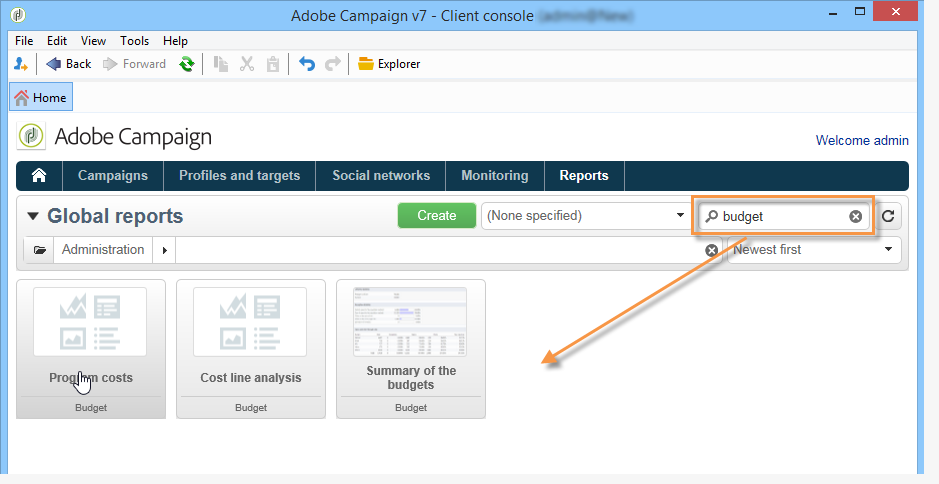

# 캠페인 기본 제공 보고서 정보{#about-campaign-built-in-reports}

이 장에서는 Adobe Campaign 기본 제공 보고서, 해당 컨텐츠 및 컨텍스트 목록을 제공합니다. 아래 정보를 통해 이미 플랫폼에서 사용할 수 있는 보고서를 만들지 않아도 됩니다.

>[!NOTE]
>
>또한 **[!UICONTROL Reports]** 탭에 보고서를 추가하는 방법을 배울 수 있습니다. 자세한 내용은 이 [페이지를](../../reporting/using/configuring-access-to-the-report.md#defining-the-filtering-options)참조하십시오.

이러한 보고서 및 내용은 해당 보고서와 관련된 기능에 대해 자세히 설명합니다.

Adobe Campaign은 고객 콘솔 또는 인터넷 브라우저를 통해 액세스할 수 있는 다양한 유형의 보고서를 제공합니다.

다음 유형의 보고서를 사용할 수 있습니다.

* 전체 플랫폼에 대한 보고서는 글로벌 [보고서를](../../reporting/using/global-reports.md)참조하십시오.
* 배달 보고서(배달 [보고서](../../reporting/using/delivery-reports.md))를 참조하십시오.
* 누적 보고서는 누적 [보고서를](../../reporting/using/cumulative-reports.md)참조하십시오.

클라이언트 콘솔 홈 페이지, 보고서 대시보드 또는 배달 목록에서 보고서에 액세스할 수 있습니다. 보고서의 표시 모드는 컨텍스트에 따라 다릅니다. 기본 보고서 목록은 홈 페이지에서 사용할 수 있으며 배달 데이터에 빠르게 액세스할 수 있습니다. 이 목록은 사용자의 요구 사항에 맞게 변경할 수 있습니다. 자세한 내용은 [이 섹션을](../../reporting/using/about-reports-creation-in-campaign.md) 참조하십시오.

Campaign 내장 보고서에 액세스하려면:

1. Adobe Campaign 인터페이스의 **[!UICONTROL Reports]** 탭을 선택합니다.

   

1. 검색 필드를 사용하여 표시된 보고서를 필터링합니다.

1. 그런 다음 표시할 보고서를 클릭합니다.

   

1. 화면 상단의 **[!UICONTROL Back]** 링크를 클릭하면 보고서 목록으로 돌아갑니다.

   

편집 중인 보고서에서 가능한 다른 작업은 [이 페이지에](../../reporting/using/actions-on-reports.md)자세히 설명되어 있습니다.

캠페인 또는 게재와 관련된 보고서는 해당 대시보드를 통해 액세스할 수 있습니다.

목록, 서비스, 제안 등은 동일합니다. 다음과 같이 표시됩니다.

