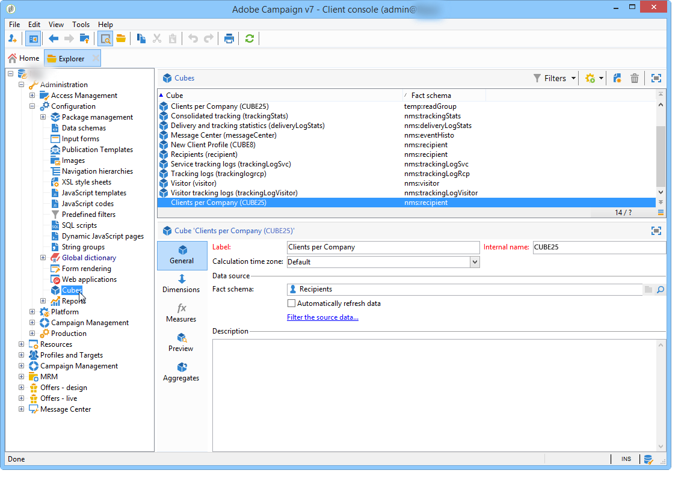

# 큐브 정보{#about-cubes}

데이터베이스의 데이터 탐사는 마케팅 분석 모듈을 통해 **제공됩니다** . 데이터를 분석 및 측정하고 통계를 계산하며 보고서 작성 및 계산을 단순화 및 최적화할 수 있습니다. 이 외에도 Marketing Analytics를 사용하여 보고서를 만들고 타겟 모집단을 만들 수 있습니다. 이러한 항목이 식별되면 Adobe Campaign(타깃팅, 세그멘테이션 등)에서 사용할 수 있는 목록에 저장됩니다.

큐브는 배달 보고서(배달 추적, 클릭, 열기 등)를 비롯한 특정 내장 보고서를 생성하는 데 사용됩니다. 큐브 기반 보고서는 500만 개의 팩트 라인 미만 데이터 볼륨에 대한 표준으로만 사용할 수 있습니다.

최종 사용자가 보고서 및 테이블을 쉽게 구성할 수 있도록 하면서 데이터베이스 탐색 및 분석 용량을 확장할 수 있습니다.보고서 또는 표를 만들 때 계산, 측정 단위 및 통계를 처리할 때 기존(완전히 구성된) 큐브를 선택하면 됩니다.

만들고 구성했으면 큐브가 보고서 쿼리 상자 및 웹 응용 프로그램에서 사용됩니다. 피벗 테이블 내에서 사용하고 조작할 수 있습니다.

>[!CAUTION]
>
>**마케팅** 분석은 Adobe Campaign 모듈입니다. 아래 설명된 기능을 사용하려면 인스턴스에 설치해야 합니다.

Marketing Analytics 모듈에서 Campaign을 사용하면 다음 작업을 수행할 수 있습니다.

1. 다음 보기에서 큐브 만들기:

   * 데이터를 집계하여 작업 표에 저장하여 사용자 요구 사항에 따라 지표를 미리 계산하기 위해
   * 보고서 및 쿼리에 사용되는 다양한 계산과 관련된 데이터 볼륨을 줄여 지표 계산 시간을 크게 최적화합니다.
   * 데이터에 대한 액세스를 간소화하여 사용자가 다양한 차원에 따라 데이터(사전 취합 여부)를 조작할 수 있도록 합니다.
   자세한 내용은 지표 [만들기를 참조하십시오](../../reporting/using/creating-indicators.md).

1. 다음 보기에서 피벗 테이블 만들기:

   * 계산된 데이터, 구성된 측정 방법 살펴보기
   * 표시할 데이터와 표시 모드 선택
   * 사용된 측정 지표 및 지표 개인화,
   * 전문 지식이 없는 사용자도 인터랙티브한 분석 툴을 제공할 수 있습니다.
   자세한 내용은 큐브 [사용을 참조하여 데이터를](../../reporting/using/using-cubes-to-explore-data.md)탐색하십시오.

1. 큐브에서 계산되고 집계된 데이터를 사용하여 쿼리를 작성합니다.
1. 모집단을 식별하고 목록에서 참조합니다.

## 용어 {#terminology}

큐브 작업 시 다음 개념을 알아야 합니다.

* 큐브

   큐브는 다차원 정보를 나타냅니다.최종 사용자에게 인터랙티브한 데이터 분석을 위해 설계된 구조를 제공합니다.

* 팩트 테이블/스키마

   사실 테이블(또는 팩트 스키마)에는 분석이 기반이 되는 원시 또는 기본 데이터가 포함됩니다. 이러한 표는 주로 긴 계산과 함께 대형 테이블(연결된 테이블 포함)입니다.

   예를 들어 팩트 테이블은 다음과 같을 수 있습니다.로그 테이블, 구매 테이블 등

* 차원

   차원을 사용하면 데이터를 그룹으로 분류할 수 있습니다.일단 생성된 차원은 분석 축으로 사용됩니다. 대부분의 경우 주어진 차원에 대해 몇 가지 수준이 정의됩니다. 예를 들어 임시 차원의 경우 수준이 월, 일, 시간, 분 등이 됩니다. 이 수준 집합은 차원 계층을 나타내며 다양한 수준의 데이터 분석을 활성화합니다.

* 블닝

   일부 필드의 경우 값을 그룹화하여 보다 쉽게 정보를 읽을 수 있도록 베이닝을 정의할 수 있습니다. 시작 값이 수준에 적용됩니다.

   여러 다른 값이 있을 수 있는 경우를 정의하는 것이 좋습니다.

* 측정

   가장 빈번한 측정은 합계, 평균, 최대, 최소, 표준 편차 등입니다.

   측정값은 다음과 같이 계산할 수 있습니다.예를 들어 오퍼의 수락율은 오퍼가 허용된 횟수와 비교하여 오퍼가 표시된 횟수의 비율입니다.

## 큐브 작업 영역 {#cube-workspace}

큐브는 **[!UICONTROL Administration > Configuration > Cubes]** 노드에 저장됩니다.

큐브 사용에 대한 주요 컨텍스트는 다음과 같습니다.

* 데이터 내보내기는 Adobe Campaign 플랫폼의 **[!UICONTROL Reports]** 전반에 맞게 설계된 보고서에서 직접 수행할 수 있습니다.

   이렇게 하려면 새 보고서를 만들고 사용할 큐브를 선택합니다.

   

   큐브는 보고서를 만드는 기준으로 템플릿처럼 표시됩니다. 템플릿을 선택하고 나면 아이콘을 클릭하여 일치하는 보고서를 **[!UICONTROL Create]** 구성하고 봅니다.

   측정을 조정하고, 표시 모드를 변경하거나, 테이블을 구성한 다음, 기본 단추를 사용하여 보고서를 표시할 수 있습니다.

   

* 보고서 **[!UICONTROL Query]** 상자에 있는 큐브를 참조하여 아래에 표시된 대로 지표를 사용할 수도 있습니다.

   

* 큐브를 기반으로 하는 피벗 테이블을 보고서의 모든 페이지에 삽입할 수도 있습니다. 이렇게 하려면 관련 페이지의 피벗 테이블 **[!UICONTROL Data]** 탭에서 사용할 큐브를 참조합니다.

   

   자세한 내용은 보고서에서 [데이터](../../reporting/using/using-cubes-to-explore-data.md#exploring-the-data-in-a-report)탐색을 참조하십시오.

