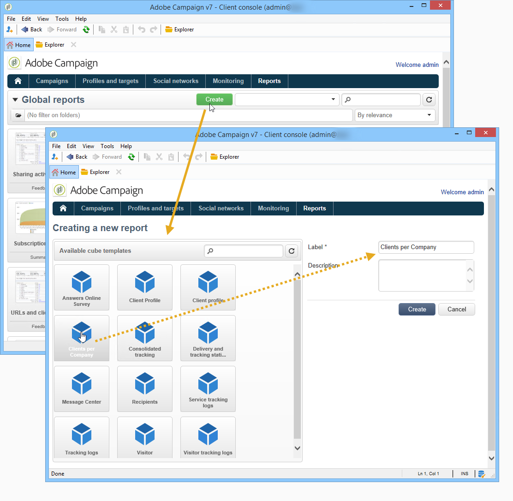
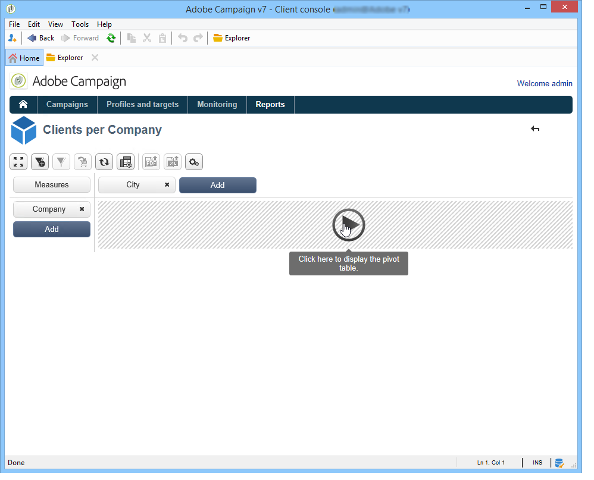

# 큐브 시작{#about-cubes}

## 용어 {#terminology}

큐브로 작업할 때의 특정 용어는 아래에 나와 있습니다.

* **큐브** - 큐브는 다차원 정보를 나타냅니다. 대화형 데이터 분석을 위해 설계된 구조를 최종 사용자에게 제공합니다.

* **팩트 테이블/스키마** - 팩트 테이블(또는 팩트 스키마)에는 분석을 기반으로 할 원시 또는 기본 데이터가 포함되어 있습니다. 이는 주로 긴 계산이 가능한 큰 볼륨 테이블(연결된 테이블일 수 있음)입니다. 예를 들어 팩트 테이블은 브로드로그 테이블, 구매 테이블 등이 될 수 있습니다.

* **Dimension** - 차원을 사용하면 데이터를 그룹으로 분할할 수 있습니다. 차원을 만들면 해당 차원이 분석 축 역할을 합니다. 대부분의 경우 주어진 차원에 대해 여러 수준이 정의됩니다. 예를 들어 임시 차원의 경우 레벨은 월, 일, 시간, 분 등이 됩니다. 이 레벨 세트는 차원 계층을 나타내며 다양한 데이터 분석 레벨을 활성화합니다.

* **빈** - 일부 필드의 경우 그룹 값에 대한 빈을 정의하고 정보를 더 쉽게 읽을 수 있습니다. 빈은 레벨에 적용됩니다. 다양한 값이 있을 수 있는 경우 비닝을 정의하는 것이 좋습니다.

* **측정값** - 가장 빈번한 측정값은 합계, 평균, 최대, 최소, 표준 편차 등입니다. 측정값은 계산할 수 있습니다. 예를 들어, 오퍼 수락율은 오퍼가 수락된 횟수와 비교하여 제공된 횟수의 비율입니다.

## 큐브 작업 영역 {#cube-workspace}

큐브는 **[!UICONTROL Administration > Configuration > Cubes]** 노드에 저장됩니다.

큐브에 대한 주요 사용 컨텍스트는 다음과 같습니다.

* 데이터 내보내기는 Adobe Campaign 플랫폼의 **[!UICONTROL Reports]** 탭에서 설계된 보고서에서 직접 수행할 수 있습니다.

  이렇게 하려면 새 보고서를 만들고 사용할 큐브를 선택합니다.

  

  큐브는 보고서를 작성하는 데 사용하는 템플릿처럼 표시됩니다. 템플릿을 선택하면 **[!UICONTROL Create]**&#x200B;을(를) 클릭하여 일치하는 보고서를 구성하고 봅니다.

  측정값을 조정하거나 표시 모드를 변경하거나 테이블을 구성한 다음 기본 단추를 사용하여 보고서를 표시할 수 있습니다.

  

* 아래와 같이 보고서의 **[!UICONTROL Query]** 상자에서 큐브를 참조하여 해당 지표를 사용할 수도 있습니다.

  

* 큐브를 기반으로 한 피벗 테이블을 보고서의 모든 페이지에 삽입할 수도 있습니다. 이렇게 하려면 관련 페이지의 피벗 테이블의 **[!UICONTROL Data]** 탭에서 사용할 큐브를 참조합니다.

  

  자세한 내용은 [보고서의 데이터 탐색](../../reporting/using/using-cubes-to-explore-data.md#exploring-the-data-in-a-report)을 참조하세요.
