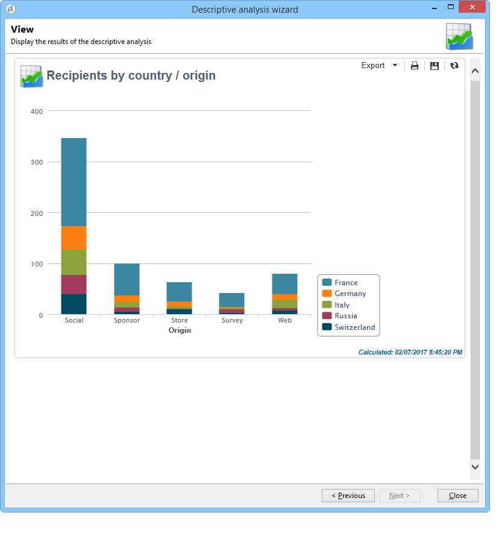

# 설명 분석 정보{#about-descriptive-analysis}

데이터베이스의 데이터에 대한 통계를 만들려면 전용 마법사를 사용하여 설명 분석 보고서를 만들고 필요에 맞게 컨텐츠와 프레젠테이션을 조정합니다.

이러한 보고서는 모집단을 걱정하며 작은 데이터 볼륨만 분석하는 데 사용해야 합니다.

양적 또는 질적 분석 보고서를 생성할 수 있습니다. 질적 분석을 통해 다음과 같이 데이터를 표현할 수 있습니다.

* 표 및 막대 그래프:

   

* 테이블 없이 누적된 값:

   

* 사업별 분류

   

양적 분석은 아래와 같이 선택 항목의 숫자 데이터에 대한 전체 통계를 제공합니다.

이러한 보고서는 다양한 단계를 기반으로 하는 설명 분석 마법사를 통해 생성되며, 만들 보고서 유형과 데이터 및 레이아웃을 선택할 수 있습니다. 보고서는 마지막 단계에 표시됩니다. 필요한 경우 Excel, PDF 또는 OpenDocument 형식으로 내보내거나 인쇄하여 다른 연산자와 보고서를 게시하고 공유할 수 있습니다.

설명 분석 마법사는 Adobe Campaign 보고서처럼 강력하지는 않지만 데이터베이스 컨텐츠나 데이터 선택에 대한 빠른 개요를 제공합니다.

>[!CAUTION]
>
>수사적 분석으로는 대용량 데이터 볼륨을 탐색할 수 없습니다.

