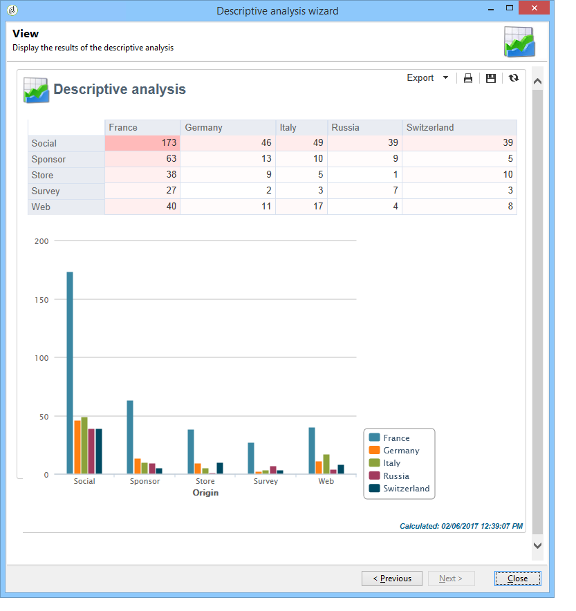

# 설명 분석이란? {#about-descriptive-analysis}

데이터베이스의 데이터에 대한 통계를 생성하려면 전용 도우미를 사용하여 설명 분석 보고서를 만들고 필요에 맞게 콘텐츠와 프레젠테이션을 조정하십시오.

이러한 보고서는 모집단과 관련이 있으므로 작은 데이터 볼륨을 분석하는 데만 사용해야 합니다.

정량적 또는 정성적 분석 보고서를 생성할 수 있습니다. 정성 분석을 통해 다음과 같이 데이터를 나타낼 수 있습니다.

* 표 및 히스토그램:

  

* 테이블 없이 누적된 값:

  

* 사업 부문별 분류

  

정량적 분석은 아래와 같이 선택 항목의 수치 데이터에 대한 전체 통계를 제공합니다.

이러한 보고서는 설명 분석 도우미를 통해 생성되며, 이 도우미를 통해 다양한 단계를 기반으로 데이터 및 레이아웃은 물론 생성하고자 하는 보고서 유형을 선택할 수 있습니다. 보고서는 마지막 단계에 표시됩니다. 필요한 경우 보고서를 게시하고 다른 연산자와 공유하여 인쇄하거나 Excel, PDF 또는 OpenDocument 형식으로 내보낼 수 있습니다.

설명 분석 마법사는 Adobe Campaign 보고서만큼 강력하지는 않지만 데이터베이스 콘텐츠에 대한 간략한 개요나 데이터 선택을 제공합니다.

>[!CAUTION]
>
>설명 분석에서는 대용량 데이터 볼륨을 탐색할 수 없습니다.
