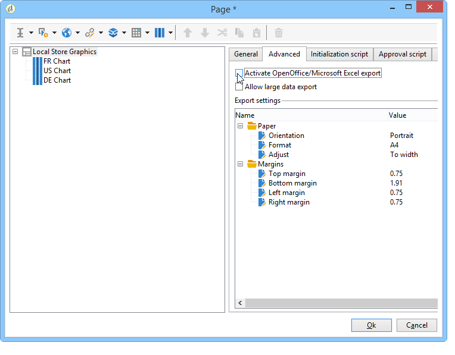
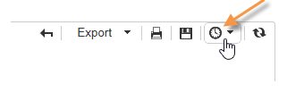

# 보고서에 대한 작업{#actions-on-reports}

보고서를 볼 때 도구 모음을 사용하여 특정 수의 작업을 수행할 수 있습니다. 아래에 자세히 설명되어 있습니다.


도구 모음을 사용하면 보고서를 내보내기, 인쇄, 보관 또는 웹 브라우저에 표시할 수 있습니다.


## 보고서 내보내기 {#exporting-a-report}

드롭다운 목록에서 보고서를 내보낼 형식을 선택합니다. (.xls, .pdf 또는 .ods).


보고서에 여러 페이지가 포함되어 있으면 각 페이지에 대해 작업을 반복해야 합니다.

보고서를 PDF, Excel 또는 OpenOffice 형식으로 내보내는 방법을 보고 구성할 수 있습니다. Adobe Campaign 탐색기를 열고 관련 보고서를 선택합니다.

내보내기 옵션은 **[!UICONTROL Page]** 탭의 보고서 **[!UICONTROL Advanced]** 활동을 통해 액세스합니다.

필요에 따라 **[!UICONTROL Paper]** 및 **[!UICONTROL Margins]** 의 설정을 변경합니다. PDF 형식으로 페이지를 내보낼 경우에만 승인할 수 있습니다. 이렇게 하려면 **[!UICONTROL Activate OpenOffice/Microsoft Excel export]** 옵션을 선택 해제합니다.



### Microsoft Excel로 내보내기 {#exporting-into-microsoft-excel}

Excel로 내보낼 **[!UICONTROL List with group]** 유형 보고서의 경우 다음과 같은 권장 사항과 제한 사항이 적용됩니다.

* 이러한 보고서에는 빈 줄이 없어야 합니다.

   

* 목록의 범례가 숨겨져야 합니다.

   

* 보고서는 셀 수준에서 정의된 특정 서식을 사용할 필요가 없습니다. 표의 셀 형식을 **[!UICONTROL Form rendering]** 정의하는 데 사용하는 것이 좋습니다. 를 통해 액세스할 **[!UICONTROL Form rendering]** 수 **[!UICONTROL Administration > Configuration > Form rendering]**&#x200B;있습니다.
* HTML 컨텐츠를 삽입하는 것은 권장되지 않습니다.
* 보고서에 여러 테이블, 차트 등이 포함되어 있는 경우 문자 요소는 다른 요소 아래에 내보내집니다.
* 다음 셀에서 캐리지 리턴을 강제 적용할 수 있습니다.이 구성은 Excel에 보관됩니다. 자세한 내용은 셀 [형식](../../reporting/using/creating-a-table.md#defining-cell-format)정의를 참조하십시오.

### 내보내기 연기 {#postpone-the-export}

예를 들어 비동기 호출을 기다리는 동안 보고서 내보내기를 연기할 수 있습니다. 이렇게 하려면 페이지의 초기화 스크립트에 다음 매개 변수를 입력합니다.

```
document.nl_waitBeforeRender = true;
```

내보내기를 활성화하고 PDF로 변환하려면 매개 변수 없이 **document.nl_renderToPdf()** 함수를 사용합니다.

### 메모리 할당 {#memory-allocation}

특정 큰 보고서를 내보낼 때 메모리 할당 오류가 발생할 수 있습니다.

특정 경우 serverConf. **xml** 구성 파일에 지정된 JavaScript의 기본값&#x200B;**(호스팅된 인스턴스의 경우 SKMS.** )은 **64MB로** 설정됩니다. 보고서를 내보내는 동안 메모리 오류가 발생하는 경우 이 숫자를 512MB로 늘리는 것이 좋습니다.

```
<javaScript maxMB="512" stackSizeKB="8"/>
```

구성의 변경 내용을 적용하려면 **nlserver** 서비스를 다시 시작해야 합니다.

serverConf. **xml** 파일에 대한 자세한 내용은 [이 섹션을](../../production/using/configuration-principle.md)참조하십시오.

nlserver 서비스에 대한 자세한 **내용은** [이 섹션을](../../production/using/administration.md)참조하십시오.

## 보고서 인쇄 {#printing-a-report}

보고서를 인쇄할 수 있습니다.이렇게 하려면 프린터 아이콘을 클릭합니다.그러면 대화 상자가 열립니다.

더 나은 결과를 얻으려면 Internet Explorer 인쇄 옵션을 편집하고 **[!UICONTROL Print background colors and images]**&#x200B;선택합니다.


## 보고서 아카이브 만들기 {#creating-report-archives}

보고서를 보관하면 특정 기간 동안의 통계를 표시하는 등 다양한 기간에 보고서 보기를 만들 수 있습니다.

아카이브를 만들려면 관련 보고서를 열고 해당 아이콘을 클릭합니다.


기존 아카이브를 표시하거나 숨기려면 표시/숨기기 아이콘을 클릭합니다.



아카이브 날짜는 표시/숨기기 아이콘 아래에 표시됩니다. 아카이브를 클릭하여 봅니다.


보고서 아카이브를 삭제할 수 있습니다. 이렇게 하려면 보고서가 저장된 Adobe Campaign 노드로 이동합니다. 탭을 클릭하고 **[!UICONTROL Archives]** 삭제할 탭을 선택한 다음 클릭합니다 **[!UICONTROL Delete]**.


