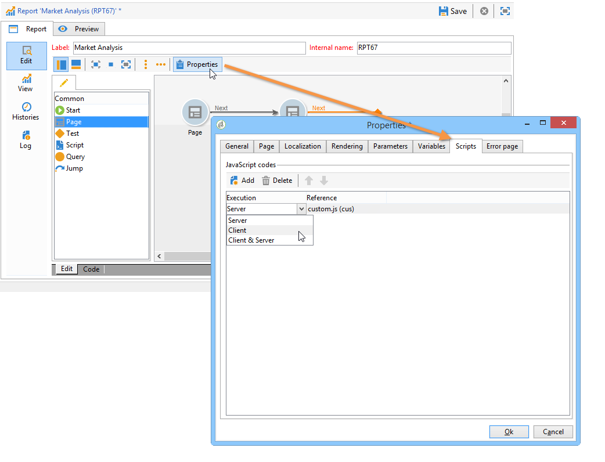

# 고급 기능{#advanced-functionalities}

## 스크립트 추가 {#adding-a-script}

### 스크립트 활동 {#script-activity}

이 활동을 통해 데이터를 처리하고 SQL 언어를 활성화하지 않는 복잡한 쿼리를 쉽게 만들 수 있습니다.

스크립트 창에 쿼리를 입력하면 됩니다.

이 **[!UICONTROL Texts]** 탭에서는 텍스트 문자열을 정의할 수 있습니다. 그런 다음 다음 구문과 함께 사용할 수 있습니다. **$(식별자)**. 텍스트 사용에 대한 자세한 내용은 머리글과 [바닥글](../../reporting/using/element-layout.md#adding-a-header-and-a-footer)추가를 참조하십시오.

>[!CAUTION]
>
>JavaScript 코드를 사용하여 집계를 만드는 것은 권장되지 않습니다.

보고서 내역을 만들려면 보관된 데이터를 저장하려면 JavaScript 쿼리에 다음 줄을 추가하십시오.

```
if( ctx.@_historyId.toString().length == 0 )
```

그렇지 않으면 현재 데이터가 표시됩니다.

### 외부 스크립트 {#external-script}

서버 및/또는 클라이언트측에서 실행할 외부 스크립트를 사용할 수 있습니다. 이렇게 하려면:

1. 보고서 속성을 편집하고 을 클릭합니다 **[!UICONTROL Scripts]**.
1. 을 클릭하고 참조할 스크립트를 **[!UICONTROL Add]** 선택합니다.
1. 그런 다음 실행 모드를 선택합니다.

   여러 스크립트를 추가하는 경우 도구 모음의 화살표를 사용하여 실행 시퀀스를 정의합니다.

   

## 다른 보고서 호출 {#calling-up-another-report}

### 활동 이동 {#jump-activity}

점프란 화살표가 없는 전환과 같습니다.한 활동에서 다른 활동으로 이동하거나 다른 보고서에 액세스할 수 있습니다.
