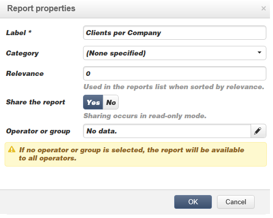

# 큐브 모범 사례{#concepts-and-methodology}

## 데이터 시작 {#data-binning}

시작 기능을 사용하면 기준에 따라 값을 그룹화하여 데이터 표시를 간소화할 수 있습니다. 사용 가능한 정보에 따라 연령 그룹을 정의하고, 이메일 도메인을 함께 그룹화하며, 값 열거형으로 제한하며, 데이터를 명시적으로 제한하여 전용 라인 또는 열 등에서 다른 모든 데이터를 표시하고 그룹화할 수 있습니다.

전반적으로 다음 세 가지 유형의 베이닝을 사용할 수 있습니다.

1. 수동으로 정의된 값 범위 사용. 예를 들어 연령, 평균 장바구니, 열린 배달 수 등) 자세한 내용은 각 저장소 [정의를 참조하십시오](#defining-each-bin).
1. 열거형의 값에 따라 동적으로 다음을 수행합니다.열거형에 포함된 값만 표시하고 다른 모든 값은 &#39;Others&#39;로 그룹화됩니다. 자세한 내용은 동적으로 저장소 [관리를 참조하십시오](#dynamically-managing-bins).
1. 값 범위를 사용하면 다른 모든 항목이 함께 그룹화됩니다. 예를 들어, 18세에서 25세, 26세에서 59세, 그리고 다른 아이들이 있습니다. 자세한 내용은 값 범위 [만들기를 참조하십시오](#creating-value-ranges).

시작하기를 활성화하려면 차원을 생성할 때 적절한 상자를 선택합니다.

저장소를 수동으로 만들거나 기존 열거형에 연결할 수 있습니다.

Adobe Campaign은 자동 시작 길잡이도 제공합니다.값은 N 그룹으로 분류하거나 데이터베이스에서 가장 자주 사용하는 값에 따라 그룹화할 수 있습니다.

### 각 저장소 정의 {#defining-each-bin}

각 저장소를 개별적으로 만들려면 **[!UICONTROL Define each bin]** 옵션을 선택하고 표를 사용하여 다양한 저장소를 만듭니다.

단추를 클릭하여 새 저장소를 만들고 저장소에 그룹화할 값을 나열합니다. **[!UICONTROL Add]**

다음 예에서는 언어가 세 가지 카테고리로 그룹화됩니다.영어/독일어/네덜란드어, 프랑스어/이탈리아어/스페인어 및 기타

SQL 마스크를 사용하여 여러 값을 필터로 결합할 수 있습니다. 이렇게 하려면 **[!UICONTROL Yes]****[!UICONTROL Use an SQL mask]** 열을 선택하고 **[!UICONTROL Value or expression]** 열에 적용할 SQL 필터를 입력합니다.

아래 예에서 **yahoo** (yahoo.fr, yahoo.com, yahoo.be 등)로 시작하거나 **ymail** (ymail.com, ymail.eu 등)로 시작하는 모든 이메일 도메인 은 YAHOO! 레이블로 **그룹화됩니다.**&#x200B;를 포함하여, **rocketmail.com** 도메인의 주소.

### 동적으로 저장소 관리 {#dynamically-managing-bins}

값은 열거형을 통해 동적으로 관리할 수 있습니다. 즉, 열거에 포함된 값만 표시됩니다. 열거형 값이 변경되면 큐브의 컨텐츠가 자동으로 조정됩니다.

이 유형의 값 스킨을 만들려면 다음 단계를 적용합니다.

1. 새 차원을 만들고 시작하기를 활성화합니다.
1. 옵션을 **[!UICONTROL Dynamically link the values to an enumeration]** 선택하고 일치하는 열거형을 선택합니다.

   

   열거형 값이 업데이트될 때마다 일치하는 저장소가 자동으로 조정됩니다.

### 값 범위 만들기 {#creating-value-ranges}

원하는 간격을 기준으로 값을 범위로 그룹화할 수 있습니다.

범위를 수동으로 정의하려면 **[!UICONTROL Add]** 단추를 클릭하고 **[!UICONTROL Define a range]** :

그런 다음 하한 및 상한 제한을 지정하고 클릭하여 **[!UICONTROL Ok]** 확인합니다.

### 저장소 자동 생성 {#generating-bins-automatically}

저장소를 자동으로 생성할 수도 있습니다. 이렇게 하려면 **[!UICONTROL Generate bins...]** 링크를 클릭합니다.

다음 중 하나를 수행할 수 있습니다.

* 가장 자주 사용하는 값 복구

   다음 예에서는 가장 자주 사용되는 4개의 값이 표시되는 반면 나머지 4개의 값은 계산되어 &#39;기타&#39; 카테고리에서 그룹화됩니다.

* 슬롯 형태로 저장소 생성

   다음 예에서 Adobe Campaign은 자동으로 같은 크기의 값 슬롯 4개를 만들어 데이터베이스의 값을 표시합니다.

이 경우 팩트 스키마에서 선택한 필터가 무시됩니다.

### 열거형 {#enumerations}

Adobe Campaign을 사용하면 보고서의 연관성 및 가독성을 향상시키기 위해 특정 열거형을 만들어 다른 값을 동일한 저장소에 다시 그룹화할 수 있습니다. 시작용으로 예약된 이러한 열거형은 큐브에서 참조한 다음 보고서에 표시됩니다.

Adobe Campaign은 다음 예와 같이 데이터베이스에 있는 모든 연락처의 이메일 도메인 목록을 ISP별로 재그룹화하는 데 사용할 수 있는 도메인에 대한 열거형도 제공합니다.

이 템플릿은 다음 템플릿을 사용하여 만들어집니다.

이 열거형을 사용하여 보고서를 만들려면 **[!UICONTROL Email domain]** 차원을 사용하여 큐브를 만듭니다. 그런 다음 **[!UICONTROL Enable binning]** 옵션을 선택합니다 **[!UICONTROL Dynamically link the values to an enumeration]**. 그런 다음 위에 **표시된 대로** 도메인 열거형을 선택합니다. 지정된 별칭이 없는 모든 값은 기타 **레이블 아래에 다시 그룹화됩니다** .

그런 다음 이 큐브를 기반으로 보고서를 만들어 값을 표시합니다.

관련 보고서를 업데이트하려면 열거형만 수정해야 합니다. 예를 들어, Adobe **값을** 만들고 **adobe.com** 별칭을 추가하면 보고서는 열거형 수준에서 Adobe 값으로 자동으로 업데이트됩니다.

열거형은 도메인 목록을 표시하는 내장 보고서를 생성하는 데 사용됩니다. **[!UICONTROL Domains]** 이러한 보고서의 컨텐츠를 조정하기 위해 이 목록을 편집할 수 있습니다.

시작하기 위해 예약된 다른 열거형을 만들어 다른 큐브에서 사용할 수 있습니다.모든 별칭 값은 첫 번째 열거형 탭에 지정된 저장소에 다시 그룹화됩니다.

## 집계 계산 및 사용 {#calculating-and-using-aggregates}

가장 큰 데이터 볼륨은 집계로 계산될 수 있습니다.

집계는 대량의 데이터를 조작할 때 유용합니다. 이러한 템플릿은 전용 워크플로우 상자에 정의된 설정을 기반으로 자동으로 업데이트되므로 최근에 수집된 데이터를 표시기에 통합할 수 있습니다

합계는 각 큐브의 관련 탭에 정의됩니다.

>[!NOTE]
>
>합계 계산 업데이트 워크플로우는 합계 자체에서 구성할 수 있고, 관련 큐브에 연결된 외부 워크플로우를 통해 합계를 업데이트할 수 있습니다.

새 집계를 만들려면 다음 단계를 적용합니다.

1. 큐브의 **[!UICONTROL Aggregates]** 탭을 클릭한 다음 **[!UICONTROL Add]** 단추를 클릭합니다.

   

1. 합계에 대한 레이블을 입력한 다음 계산할 차원을 추가합니다.

   

1. 차원 및 레벨을 선택합니다. 각 차원 및 각 레벨에 대해 이 프로세스를 반복합니다.
1. 탭을 클릭하여 집계 워크플로우를 만듭니다. **[!UICONTROL Workflow]**

   

   * 이 **[!UICONTROL Scheduler]** 활동을 통해 계산 업데이트 빈도를 정의할 수 있습니다. 스케줄러는 [이 섹션에](../../workflow/using/scheduler.md)자세히 설명되어 있습니다.
   * 이 **[!UICONTROL Aggregate update]** 활동을 사용하면 적용할 업데이트 모드를 선택할 수 있습니다.전체 또는 부분

      기본적으로 각 계산 중에 전체 업데이트가 수행됩니다. 부분 업데이트를 활성화하려면 관련 옵션을 선택하고 업데이트 조건을 정의합니다.

      

## 측정값 정의 {#defining-measures}

측정 단위 유형은 큐브의 **[!UICONTROL Measures]** 탭에 정의됩니다. 합계, 평균, 편차 등을 계산할 수 있습니다.

필요한 만큼 측정값을 만들 수 있습니다.그런 다음 표에 표시하거나 숨길 측정을 선택합니다. 자세한 내용은 측정값 [표시를](#displaying-measures)참조하십시오.

새 측정을 정의하려면 다음 단계를 적용합니다.

1. 측정 단위 목록 위의 **[!UICONTROL Add]** 단추를 클릭하고 계산할 측정 유형 및 공식을 선택합니다.

   

1. 필요한 경우, 그리고 연산자에 따라 연산자가 염려하는 표현식을 선택합니다.

   이 **[!UICONTROL Advanced selection]** 단추를 사용하여 복잡한 계산 공식을 만들 수 있습니다. For more on this, refer to [this section](../../platform/using/about-queries-in-campaign.md).

   

1. 이 **[!UICONTROL Filter the measure data...]** 링크를 사용하면 계산 필드를 제한하고 데이터베이스의 특정 데이터에만 적용할 수 있습니다.

   

1. 측정 단위 레이블을 입력하고 설명을 추가한 다음 아이콘을 클릭하여 **[!UICONTROL Finish]** 만듭니다.

## 측정값 표시 {#displaying-measures}

필요에 따라 테이블에 측정값의 표시를 구성할 수 있습니다.

* 측정 단위의 표시 순서(표시 [순서](#display-sequence)참조),
* 보고서에 표시/숨길 정보(디스플레이 [구성 참조](#configuring-the-display))
* 표시할 측정 단위:백분율, 합계, 소수 수 등 (표시되는 [측정 유형 변경을](#changing-the-type-of-measure-displayed)참조하십시오).

### 표시 시퀀스 {#display-sequence}

큐브에서 계산된 측정값은 **[!UICONTROL Measures]** 단추를 통해 구성됩니다.

표시 순서를 변경하려면 라인을 이동합니다. 다음 예제에서는 프랑스어 데이터가 목록 맨 아래로 이동합니다.즉, 마지막 열에 표시됩니다.

### 디스플레이 구성 {#configuring-the-display}

측정 단위, 라인 및 열의 구성은 각 측정 단위 또는 전체에 대해 개별적으로 수행할 수 있습니다. 특정 아이콘을 사용하면 표시 모드 선택 창에 액세스할 수 있습니다.

* 구성 창에 액세스하려면 **[!UICONTROL Edit the configuration of the pivot table]** 아이콘을 클릭합니다.

   측정 단위 레이블을 표시할지 여부를 선택하고 레이아웃(라인 또는 열)을 구성할 수 있습니다.

색상 옵션을 사용하면 중요한 값을 강조 표시하여 쉽게 읽을 수 있습니다.

### 표시된 측정 유형 변경 {#changing-the-type-of-measure-displayed}

각 측정 단위 내에서 적용할 단위 및 서식을 정의할 수 있습니다.

## 보고서 공유 {#sharing-a-report}

보고서가 구성되면 보고서를 저장하고 다른 연산자와 공유할 수 있습니다.

이렇게 하려면 **[!UICONTROL Show the report properties]** 아이콘을 클릭하고 **[!UICONTROL Share this report]** 옵션을 활성화합니다.

보고서가 속한 카테고리와 관련성을 지정합니다. 자세한 내용은 [이 페이지에서](../../reporting/using/configuring-access-to-the-report.md#report-display-context) **시퀀스 표시 및**&#x200B;필터링 옵션 **정의** 섹션을참조하십시오.

이러한 변경 사항을 확인하려면 보고서를 저장해야 합니다.

## 필터 만들기 {#creating-filters}

데이터 섹션을 보기 위한 필터를 만들 수 있습니다.

이렇게 하려면:

1. 아이콘을 **[!UICONTROL Add a filter]** 클릭합니다.

   

1. 필터의 관심 영역 선택

   

1. 필터 유형과 정확한 레벨을 선택합니다.

   

1. 필터가 만들어지면 보고서 위에 필터가 표시됩니다.

   

   필터를 클릭하여 편집합니다.

   십자가를 클릭하여 삭제합니다.

   필요한 만큼 필터를 결합할 수 있습니다.모두 이 영역에 표시됩니다.

   

필터를 수정(추가, 제거, 변경)할 때마다 보고서를 다시 계산해야 합니다.

또한 선택한 항목을 기반으로 필터를 만들 수 있습니다. 이렇게 하려면 소스 셀, 선 및 열을 선택한 다음 **[!UICONTROL Add a filter]** 아이콘을 클릭합니다.

선, 열 또는 셀을 선택하려면 마우스 왼쪽 단추로 클릭합니다. 선택을 취소하려면 을(를) 다시 클릭합니다.

필터가 자동으로 적용되어 보고서 위의 필터 영역에 추가됩니다.

