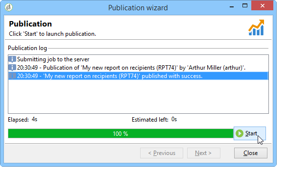

# 보고서에 대한 액세스 구성{#configuring-access-to-the-report}

## 보고서 표시 컨텍스트 {#report-display-context}

Adobe Campaign 플랫폼에서 **[!UICONTROL Display]** 탭을 사용하여 보고서의 표시 컨텍스트를 정의합니다. 보고서에 대한 액세스는 선택 유형, 표시 조건 및 액세스 권한에 따라 달라집니다.

### 선택 유형 {#selection-type}

보고서 액세스는 배달, 수신자, 수신자 선택 등과 같은 특정 컨텍스트 또는 오퍼 공간으로 제한될 수 있습니다. 이 액세스는 **[!UICONTROL Display]** 탭의 **[!UICONTROL Selection type]** 섹션에 구성됩니다.

* **[!UICONTROL Single selection]** :보고서는 특정 엔티티를 선택한 경우에만 액세스할 수 있습니다.
* **[!UICONTROL Multiple selection]** :여러 엔티티를 선택하면 보고서에 액세스합니다.
* **[!UICONTROL Global]** :보고서는 보고서 우주에서 사용할 수 있는 보고서 목록을 통해 액세스합니다.

### 표시 시퀀스 {#display-sequence}

**[!UICONTROL Sequence]** 필드에서 보고서의 표시 순서를 지정하는 숫자 값을 입력할 수 있습니다.

기본적으로 보고서는 관련성에 의해 표시됩니다.이 필드에 입력한 값을 사용하면 가장 높은 값(가장 높은 값)부터 가장 작은 값(가장 작은 값)까지 보고서를 정렬할 수 있습니다.

필요에 따라 사용할 비율을 선택할 수 있습니다.1~10, 0~100, -10~10 등

### 표시 조건 {#display-conditions}

쿼리를 통해 보고서 표시를 조건화할 수도 있습니다.

다음 예에서, 기본 캠페인 채널이 이메일인 경우 보고서가 표시됩니다.

즉, 캠페인의 기본 채널이 DM인 경우 보고서를 캠페인 보고서에서 사용할 수 없게 됩니다.

### 액세스 권한 {#access-authorization}

보고서는 다른 연산자와 공유할 수 있습니다.

보고서에 액세스할 수 있게 하려면 **[!UICONTROL Report shared with other operators]** 옵션을 선택합니다. 이 옵션을 선택하지 않으면 보고서를 만든 연산자만 보고서에 액세스할 수 있습니다.

보고서는 인증 창을 통해 추가된 특정 연산자 또는 연산자 그룹과 공유할 수도 있습니다.

### 필터링 옵션 정의 {#defining-the-filtering-options}

**[!UICONTROL Reports]** 유니버스는 플랫폼에서 사용 가능한 모든 보고서를 표시하며, 연결된 연산자가 액세스 권한을 가지고 있습니다.

기본적으로 관련성별로 정렬되지만 다른 유형의 필터를 적용할 수 있습니다.알파벳순, 연령 등

보고서 카테고리를 기반으로 디스플레이를 필터링할 수도 있습니다.

보고서의 카테고리를 정의하려면 아래와 같이 **[!UICONTROL Display]** 탭을 통해 선택합니다.

여기에 새 카테고리를 입력하여 사용 가능한 카테고리 목록에 추가할 수 있습니다. 일치하는 열거형이 자동으로 업데이트됩니다.

## 보고서 {#creating-a-link-to-a-report-} 링크 만들기

목록, 수신자, 배달 등과 같은 특정 트리 노드를 통해 보고서에 액세스할 수 있도록 만들 수 있습니다. 이렇게 하려면 관련 보고서에 대한 링크를 만들고 사용할 엔티티를 지정하기만 하면 됩니다.

예를 들어 수신자 목록을 통해 보고서에 액세스할 수 있는 링크를 만듭니다.

1. **[!UICONTROL New]**&#x200B;을 클릭하고 보고서 만들기 마법사에서 **[!UICONTROL Create a link to an existing report]**&#x200B;을 선택합니다.

   

1. 드롭다운 목록을 사용하여 링크를 만들 보고서를 선택합니다. 이 예에서는 **국가별 분류** 보고서를 선택합니다.

   

1. 레이블을 입력하고 스키마를 선택합니다. 이 예에서는 수신자 목록 테이블을 선택합니다.

   

   즉, 모든 받는 사람 목록을 통해 보고서에 액세스할 수 있고 해당 통계가 선택한 목록의 받는 사람과 관계가 있음을 의미합니다.

1. 보고서 저장 및 표시
1. 링크 키를 입력합니다. 이 경우 &#39;폴더&#39; 링크의 외래 키입니다.

   

1. 보고서를 게시합니다.
1. 수신자 목록 중 하나로 이동하고 **[!UICONTROL Reports]** 링크를 클릭합니다.방금 만든 보고서에 액세스할 수 있습니다.

   

## 보고서 미리 보기 {#preview-of-the-report}

보고서를 게시하기 전에 **[!UICONTROL Preview]** 탭에 보고서가 올바르게 표시되는지 확인하십시오.

보고서의 미리 보기를 표시하려면 **[!UICONTROL Global]** 또는 **[!UICONTROL Selection]** 옵션을 선택합니다.

이 두 옵션은 보고서의 표시 설정을 기반으로 선택됩니다. 표시 설정이 **[!UICONTROL Global]**&#x200B;이면 **[!UICONTROL Global]** 미리 보기 옵션을 선택해야 합니다. 표시 설정이 **[!UICONTROL Single selection]** 또는 **[!UICONTROL Multiple selection]**&#x200B;이면 **[!UICONTROL Selection]** 미리 보기 옵션을 선택해야 합니다.

자세한 내용은 [보고서 표시 컨텍스트](#report-display-context)를 참조하십시오.

특정 설정을 사용하여 오류를 제어할 수 있습니다. 보고서의 URL에 **_uuid** 설정이 있습니다. **&amp;_preview** 또는 **&amp;_debug** 설정을 추가할 수 있습니다.

이러한 설정에 대한 자세한 내용은 [웹 양식](../../web/using/about-web-forms.md) 장의 **웹 양식 속성 정의** 섹션을 참조하십시오.

## 보고서 {#publishing-the-report} 게시

보고서를 다른 연산자와 공유하고 사용 가능한 보고서 목록에 표시하려면 보고서를 게시해야 합니다([보고서 표시 컨텍스트](#report-display-context) 참조). 이 작업은 보고서가 변경될 때마다 다시 수행해야 합니다.

1. 도구 모음에서 **[!UICONTROL Publish]**&#x200B;을 클릭하여 게시 마법사를 엽니다.

   

1. 게시하려면 **[!UICONTROL Start]**&#x200B;을 클릭합니다.

   

1. **[!UICONTROL Enlarge]** 아이콘을 클릭하여 웹 브라우저에서 보고서를 엽니다.

