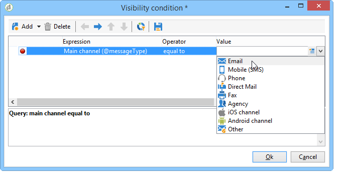

# 보고서에 대한 액세스 구성{#configuring-access-to-the-report}

## 보고서 표시 컨텍스트 {#report-display-context}

Adobe Campaign 플랫폼에서 **[!UICONTROL Display]** 탭을 사용하여 보고서의 표시 컨텍스트를 정의합니다. 보고서에 대한 액세스는 보고서 선택 유형, 표시 조건 및 액세스 권한에 따라 달라집니다.

### 선택 유형 {#selection-type}

보고서 액세스는 배달, 수신자, 선택한 수신자 등의 특정 컨텍스트 또는 오퍼 공간으로 제한할 수 있습니다. 이 액세스는 **[!UICONTROL Selection type]** 탭의 **[!UICONTROL Display]** 섹션에 구성됩니다.

* **[!UICONTROL Single selection]** :보고서는 특정 엔티티를 선택한 경우에만 액세스할 수 있습니다.
* **[!UICONTROL Multiple selection]** :여러 개체를 선택하면 보고서에 액세스합니다.
* **[!UICONTROL Global]** :보고서는 보고서 우주에서 사용 가능한 보고서 목록을 통해 액세스합니다.

### 표시 시퀀스 {#display-sequence}

이 **[!UICONTROL Sequence]** 필드를 사용하면 목록에서 보고서의 표시 순서를 지정하는 숫자 값을 입력할 수 있습니다.

기본적으로 보고서는 연관성에 의해 표시됩니다.이 필드에 입력한 값을 사용하면 가장 높은 값(가장 높은 값)에서 가장 낮은 값(가장 작은 값)으로 보고서를 정렬할 수 있습니다.

필요에 따라 사용할 비율을 선택할 수 있습니다.1 - 10, 0 - 100, -10 - 10 등.

### 표시 조건 {#display-conditions}

쿼리를 통해 보고서 표시를 조건화할 수도 있습니다.

다음 예에서는 기본 캠페인 채널이 이메일인 경우 보고서가 표시됩니다.

즉, 캠페인의 기본 채널이 DM인 경우 캠페인 보고서에서 보고서를 사용할 수 없습니다.

### 액세스 권한 {#access-authorization}

보고서는 다른 연산자와 공유할 수 있습니다.

보고서에 액세스 가능하게 하려면 **[!UICONTROL Report shared with other operators]** 옵션을 선택합니다. 이 옵션을 선택하지 않으면 보고서를 만든 운영자만 보고서에 액세스할 수 있습니다.

또한 보고서는 인증 창을 통해 추가된 특정 연산자 또는 연산자 그룹과 공유할 수 있습니다.

### 필터링 옵션 정의 {#defining-the-filtering-options}

Universe **[!UICONTROL Reports]** 는 플랫폼에서 사용 가능한 모든 보고서를 표시하며 연결된 연산자가 액세스 권한을 가지고 있습니다.

기본적으로 관련성별로 정렬되지만, 다른 유형의 필터를 적용할 수 있습니다.알파벳 순, 연령별 등

보고서 카테고리를 기반으로 디스플레이를 필터링할 수도 있습니다.

보고서의 범주를 정의하려면 아래와 같이 **[!UICONTROL Display]** 탭을 통해 선택합니다.

여기에 새 카테고리를 입력하여 사용 가능한 카테고리 목록에 추가할 수 있습니다. 일치하는 열거형이 자동으로 업데이트됩니다.

## 보고서에 대한 링크 만들기 {#creating-a-link-to-a-report-}

목록, 수신자, 배달 등과 같은 특정 트리 노드를 통해 보고서에 액세스할 수 있도록 만들 수 있습니다. 이렇게 하려면 관련 보고서에 대한 링크를 만들고 사용할 엔티티를 지정하기만 하면 됩니다.

예를 들어, 수신자 목록을 통해 보고서에 액세스할 수 있는 링크를 만듭니다.

1. 보고서 작성 마법사에서 을 **[!UICONTROL New]** 클릭하고 **[!UICONTROL Create a link to an existing report]** 선택합니다.

   

1. 드롭다운 목록을 사용하여 링크를 만들 보고서를 선택합니다. 이 예에서는 국가별 분류 **보고서를** 선택합니다.

   

1. 레이블을 입력하고 스키마를 선택합니다. 이 예에서는 수신자 목록 테이블을 선택합니다.

   

   즉, 모든 수신자 목록을 통해 보고서에 액세스할 수 있으며 해당 통계는 선택한 목록의 받는 사람에게 영향을 줍니다.

1. 보고서 저장 및 표시
1. 링크 키를 입력합니다. 이 경우 &#39;폴더&#39; 링크의 외래 키

   

1. 보고서를 게시합니다.
1. 수신자 목록 중 하나로 이동하고 **[!UICONTROL Reports]** 링크를 클릭합니다.방금 만든 보고서에 액세스할 수 있습니다.

   

## 보고서 미리 보기 {#preview-of-the-report}

보고서를 게시하기 전에 **[!UICONTROL Preview]** 탭에 제대로 표시되는지 확인하십시오.

보고서의 미리 보기를 표시하려면 **[!UICONTROL Global]** 또는 **[!UICONTROL Selection]** 옵션을 선택합니다.

이 두 옵션은 보고서의 표시 설정에 따라 선택됩니다. 표시 설정이 **[!UICONTROL Global]**&#x200B;인 경우 **[!UICONTROL Global]** 미리 보기 옵션을 선택해야 합니다. 표시 설정이 **[!UICONTROL Single selection]** 또는 **[!UICONTROL Multiple selection]**&#x200B;인 경우 **[!UICONTROL Selection]** 미리 보기 옵션을 선택해야 합니다.

자세한 내용은 보고서 표시 [컨텍스트를](#report-display-context)참조하십시오.

특정 설정을 통해 오류를 제어할 수 있습니다. 보고서 URL에 **_uuid** 설정이 있습니다. &amp;_preview **또는** &amp;_debug **** 설정을 추가할 수 있습니다.

이러한 설정에 대한 자세한 내용은 웹 **양식** 장의 웹 양식 속성 [정의](../../web/using/about-web-forms.md) 섹션을참조하십시오.

## 보고서 게시 {#publishing-the-report}

보고서를 다른 연산자와 공유하고 사용 가능한 보고서 목록에 표시하려면 보고서를 게시해야 합니다(보고서 표시 컨텍스트도 참조). 이 작업은 보고서가 변경될 때마다 다시 수행해야 합니다.

1. 도구 모음에서 을 클릭하여 게시 마법사를 **[!UICONTROL Publish]** 엽니다.

   

1. 게시하려면 **[!UICONTROL Start]** 클릭합니다.

   

1. 아이콘을 클릭하여 웹 브라우저에서 보고서를 엽니다. **[!UICONTROL Enlarge]**

