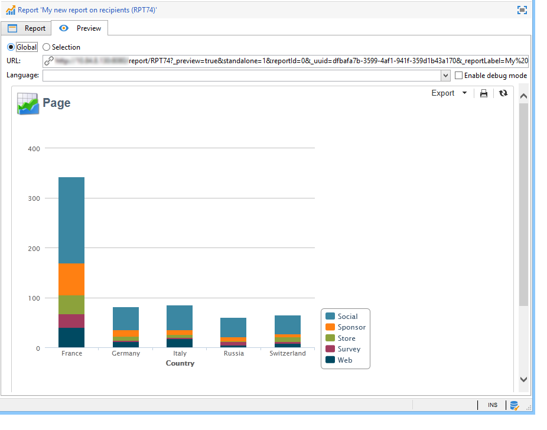

# 보고서에 대한 액세스 구성{#configuring-access-to-the-report}

## 보고서 표시 컨텍스트 {#report-display-context}

다음을 사용하여 Adobe Campaign 플랫폼에서 보고서의 표시 컨텍스트 정의 **[!UICONTROL Display]** 탭. 보고서에 대한 액세스는 선택 유형, 표시 조건 및 액세스 권한에 따라 다릅니다.

### 선택 유형 {#selection-type}

보고서에 대한 액세스는 특정 컨텍스트 또는 오퍼 공간(예: 게재, 수신자, 수신자 선택 등)으로 제한될 수 있습니다. 이 액세스는에서 구성됩니다. **[!UICONTROL Selection type]** 의 섹션 **[!UICONTROL Display]** 탭.

* **[!UICONTROL Single selection]** : 특정 엔티티를 선택한 경우에만 보고서에 액세스할 수 있습니다.
* **[!UICONTROL Multiple selection]** : 여러 엔티티를 선택한 경우 보고서에 액세스합니다.
* **[!UICONTROL Global]** : 보고서는 의 사용 가능한 보고서 목록을 통해 액세스합니다. **[!UICONTROL Reports]** 탭.

### 시퀀스 표시 {#display-sequence}

다음 **[!UICONTROL Sequence]** 필드에서는 목록에 있는 보고서의 표시 순서를 지정하는 숫자 값을 입력할 수 있습니다.

기본적으로 보고서는 관련성을 기준으로 표시됩니다. 이 필드에 입력한 값을 사용하면 보고서를 가장 큰 값(가장 큰 값)에서 가장 작은 값(가장 작은 값)으로 정렬할 수 있습니다.

필요에 따라 사용할 배율을 선택할 수 있습니다(1 ~ 10, 0 ~ 100, -10 ~ 10 등).

### 상태 표시 {#display-conditions}

쿼리를 통해 보고서 표시 조건을 지정할 수도 있습니다.

다음 예에서는 기본 캠페인 채널이 이메일인 경우 보고서가 표시됩니다.

즉, 캠페인의 기본 채널이 DM인 경우 캠페인 보고서에서 보고서를 사용할 수 없습니다.

### 인증 접근 {#access-authorization}

보고서는 다른 운영자와 공유할 수 있습니다.

보고서에 액세스할 수 있도록 하려면 **[!UICONTROL Report shared with other operators]** 옵션을 선택합니다. 이 옵션을 선택하지 않으면 보고서를 만든 연산자만 보고서에 액세스할 수 있습니다.

승인 창을 통해 추가된 특정 연산자 또는 연산자 그룹과 보고서를 공유할 수도 있습니다.

### 필터링 옵션 정의 {#defining-the-filtering-options}

다음 **[!UICONTROL Reports]** 탭에는 플랫폼에서 사용 가능한 모든 보고서가 표시되며 연결된 운영자에게 액세스 권한이 있습니다.

기본적으로 이러한 필터는 관련성을 기준으로 정렬되지만 알파벳순, 연령별 등과 같은 다른 유형의 필터를 적용할 수도 있습니다.

보고서 범주를 기반으로 표시를 필터링할 수도 있습니다.

보고서의 범주를 정의하려면 다음을 통해 선택합니다. **[!UICONTROL Display]** 아래 표시된 대로 탭:

여기에 새 범주를 입력한 후 사용 가능한 범주 목록에 추가할 수 있습니다. 일치하는 열거형은 자동으로 업데이트됩니다.

## 보고서에 대한 링크 만들기 {#creating-a-link-to-a-report-}

목록, 수신자, 게재 등과 같은 트리의 특정 노드를 통해 보고서에 액세스할 수 있도록 할 수 있습니다. 이렇게 하려면 관련 보고서에 대한 링크를 만들고 사용할 수 있도록 할 엔티티를 지정하면 됩니다.

예를 들어 수신자 목록을 통해 액세스할 수 있도록 보고서에 대한 링크를 만들 것입니다.

1. 클릭 **[!UICONTROL New]** 및 선택 **[!UICONTROL Create a link to an existing report]** 을 클릭합니다.

   

1. 드롭다운 목록을 사용하여 링크를 만들 보고서를 선택합니다. 이 예제에서는 **국가별 분류** 보고서.

   

1. 레이블을 입력하고 스키마를 선택합니다. 이 예제에서는 수신자 목록 테이블을 선택합니다.

   

   즉, 모든 수신자 목록을 통해 보고서에 액세스할 수 있고 선택한 목록의 수신자와 관련된 통계가 표시됩니다.

1. 보고서를 저장하고 표시합니다.
1. 링크 키를 입력합니다. 이 경우 &#39;폴더&#39; 링크의 외래 키.

   

1. 보고서 게시.
1. 수신자 목록 중 하나로 이동하여 **[!UICONTROL Reports]** 링크: 방금 만든 보고서에 액세스할 수 있습니다.

   

## 보고서 미리보기 {#preview-of-the-report}

보고서를 게시하기 전에 **[!UICONTROL Preview]** 탭.

보고서 미리보기를 표시하려면 **[!UICONTROL Global]** 또는 **[!UICONTROL Selection]** 옵션을 선택합니다.

이 두 옵션은 보고서의 표시 설정을 기반으로 선택됩니다. 디스플레이 설정이 **[!UICONTROL Global]**, 다음을 선택해야 합니다. **[!UICONTROL Global]** 미리보기 옵션. 표시 설정이 다음과 같은 경우 **[!UICONTROL Single selection]** 또는 **[!UICONTROL Multiple selection]**, **[!UICONTROL Selection]** 미리보기 옵션을 선택해야 합니다.

자세한 내용은 다음을 참조하십시오. [보고서 표시 컨텍스트](#report-display-context).

특정 설정을 사용하면 오류를 제어할 수 있습니다. 다음 **_uuid** 설정은 보고서의 URL에서 찾을 수 있습니다. 다음을 추가할 수 있습니다. **&amp;_preview** 또는 **&amp;_debug** 설정을 지정합니다.

이러한 설정에 대한 자세한 내용은 **웹 양식 속성 정의** 의 섹션 [웹 양식](../../web/using/about-web-forms.md) 챕터.

## 보고서 게시 {#publishing-the-report}

보고서를 다른 운영자와 공유하고 사용 가능한 보고서 목록에 표시하려면 보고서를 게시해야 합니다(또한 [보고서 표시 컨텍스트](#report-display-context)). 보고서를 변경할 때마다 이 작업을 다시 수행해야 합니다.

1. 을 클릭하여 게시 마법사를 엽니다. **[!UICONTROL Publish]** 을 클릭합니다.

   

1. 클릭 **[!UICONTROL Start]** 게시용.

   

1. 다음을 클릭합니다. **[!UICONTROL Enlarge]** 아이콘을 클릭하여 웹 브라우저에서 보고서를 엽니다.
