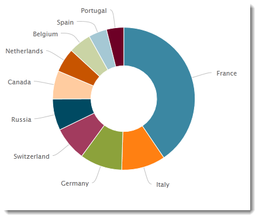
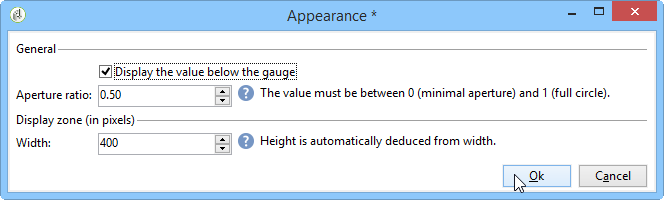

# 차트 만들기{#creating-a-chart}

데이터베이스의 데이터를 수집하고 차트에 표시할 수도 있습니다. Adobe Campaign은 그래픽 표현 세트를 제공합니다. 이 구성 내용은 아래에 자세히 설명되어 있습니다.

차트는 마우스 오른쪽 단추 클릭 메뉴 또는 도구 모음을 통해 보고서 페이지에 직접 삽입됩니다.

## 작성 단계 {#creation-steps}

보고서에서 차트를 만들려면 다음 단계를 적용합니다.

1. 차트를 표시할 페이지를 편집하고 도구 모음에서 차트 유형을 선택합니다.

   

1. 이름과 캡션을 입력합니다. 필요한 경우 드롭다운 목록을 사용하여 캡션의 위치를 변경할 수 있습니다.

   

1. 데이터 소스 및 계산할 시리즈를 정의하려면 **[!UICONTROL Data]** 탭을 클릭합니다.

   차트에 표시할 통계는 쿼리 또는 컨텍스트 데이터(즉, 현재 페이지의 인바운드 변환에서 제공하는 데이터)를 기준으로 계산할 수 있습니다(자세한 내용은 컨텍스트 데이터 [사용을](../../reporting/using/using-the-context.md#using-context-data)참조하십시오).

   * 링크를 클릭하여 데이터베이스의 데이터에 대한 필터링 기준을 정의합니다. **[!UICONTROL Filter data...]**

      

   * 컨텍스트 데이터를 사용하려면 이 옵션을 선택하고 **[!UICONTROL Advanced settings...]** 링크를 클릭합니다. 그런 다음 통계와 관련된 데이터를 선택합니다.

      

      그런 다음 컨텍스트 데이터에 액세스하여 차트에 표시할 값을 정의할 수 있습니다.

      

## 차트 유형 및 변형 {#chart-types-and-variants}

Adobe Campaign은 다양한 유형의 그래픽 표현을 제공합니다. 아래에 자세히 나와 있습니다.

차트 유형은 페이지에 삽입되면 선택됩니다.

차트에 있는 탭의 **[!UICONTROL Chart type]** 섹션을 통해 변경할 수도 **[!UICONTROL General]** 있습니다.

변형은 선택한 차트 유형에 따라 다릅니다. 링크를 통해 **[!UICONTROL Variants...]** 선택됩니다.

### 분류:파이 차트 {#breakdown--pie-charts}

이 유형의 그래픽 표현을 사용하면 측정된 요소의 개요를 표시할 수 있습니다.

파이 차트는 하나의 변수만 분석할 수 있습니다.

이 **[!UICONTROL Variants]** 링크를 사용하면 차트의 전체 렌더링을 개인화할 수 있습니다.

파이 차트를 사용하면 해당 필드에 내부 반경 값을 입력할 수 있습니다.

예:

0.00은 완전한 원을 추적합니다.

0.40은 반경이 40%인 원을 추적합니다.

1.00은 원의 바깥쪽만 추적합니다.

### 진화:곡선 및 영역 {#evolution--curves-and-areas}

이러한 유형의 그래픽 표현을 사용하면 한 개 이상의 측정의 진화를 시간 내에 이해할 수 있습니다.

### 비교:막대 그래프 {#comparison--histograms}

막대 그래프를 사용하면 하나 이상의 변수의 값을 비교할 수 있습니다.

이러한 유형의 차트에는 **[!UICONTROL Variants]** 창에 다음 옵션이 제공됩니다.

차트에 캡션을 표시하고 위치를 선택하려면 **[!UICONTROL Display caption]** 옵션을 선택합니다.

적절한 경우 값을 함께 스택할 수 있습니다.

필요한 경우 값 표시 순서를 반대로 할 수 있습니다. 이렇게 하려면 **[!UICONTROL Reverse stacking]** 옵션을 선택합니다.

### 전환:단계 {#conversion--funnel}

이 유형의 차트를 사용하여 측정된 요소의 대화 비율을 추적할 수 있습니다.

### 진행률:계기 {#progress--gauge}

이 유형의 차트에서는 정의된 목적과 비교하여 값의 진행 상태를 표시할 수 있습니다. 아래 예에서 검은색 다이얼은 100개의 전달 목표에서 성공적으로 전송한(76) 배달 수를 보여줍니다. 측정은 특정 상태에 해당하는 세 개의 범위로 나누어집니다.

이러한 요소는 차트를 구성할 때 정의됩니다.

* 이 **[!UICONTROL Value]** 필드는 차트에서 검은색 다이얼로 표시됩니다. 진행률을 계산할 요소를 나타냅니다. 표시할 값이 이미 저장되었어야 사용할 수 있습니다.
* 이 **[!UICONTROL Goal]** 필드는 달성할 최대 값을 나타냅니다.
* 이 **[!UICONTROL Other mark]** 필드를 사용하여 차트에 두 번째 표시기를 추가할 수 있습니다.
* 이 **[!UICONTROL Display range]** 필드를 사용하면 보고서를 계산할 사이의 값을 지정할 수 있습니다.
* 이 **[!UICONTROL Value ranges]** 필드를 사용하면 상태(없음, 비속함, 허용됨, 양호)를 값 세트에 지정하여 진행 상황을 보다 잘 표현할 수 있습니다.

섹션에서 **[!UICONTROL Display settings]** 차트 표시 방법을 구성할 **[!UICONTROL Change appearance...]** 수 있습니다.

이 **[!UICONTROL Display the value below the gauge]** 옵션을 사용하면 차트 아래에 값 진행 상태를 표시할 수 있습니다.

0과 1 사이의 **[!UICONTROL Aperture ratio]** 필드에서는 보고서의 조리개를 더 작은 원 단위로 편집할 수 있습니다. 위의 예에서 값 0.50은 반원에 해당합니다.

이 **[!UICONTROL Width]** 필드를 사용하여 차트 크기를 편집할 수 있습니다.

## 차트와 상호 작용 {#interaction-with-the-chart}

사용자가 차트를 클릭할 때 작업을 정의할 수 있습니다. 창을 열고 수행할 작업을 선택합니다 **[!UICONTROL Interaction events]** .

가능한 상호 작용 유형과 구성은 [이 섹션에](../../web/using/static-elements-in-a-web-form.md#inserting-html-content)자세히 설명되어 있습니다.

## 통계 계산 {#calculating-statistics}

차트를 사용하면 수집된 데이터에 대한 통계를 표시할 수 있습니다.

이러한 통계는 **[!UICONTROL Series parameters]** 탭의 **[!UICONTROL Data]** 섹션을 통해 정의됩니다.

새 통계를 만들려면 **[!UICONTROL Add]** 아이콘을 클릭하고 적절한 창을 구성합니다. 사용 가능한 계산 유형은 아래에 자세히 설명되어 있습니다.

For more on this, refer to [this section](../../reporting/using/using-the-descriptive-analysis-wizard.md#statistics-calculation).
