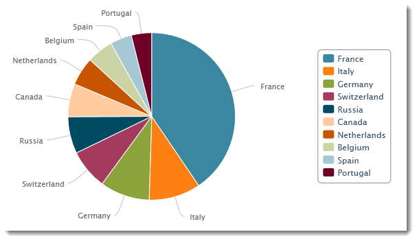

# 차트 만들기{#creating-a-chart}

데이터베이스의 데이터를 수집하고 차트에 표시할 수도 있습니다. Adobe Campaign은 그래픽 표현 세트를 제공합니다. 구성 내용은 아래에 자세히 나와 있습니다.

차트는 마우스 오른쪽 단추 클릭 메뉴 또는 도구 모음을 통해 보고서 페이지에 직접 삽입됩니다.

## 만들기 단계 {#creation-steps}

보고서에서 차트를 만들려면 다음 단계를 적용합니다.

1. 차트를 표시할 페이지를 편집하고 도구 모음에서 차트 유형을 선택합니다.

   

1. 이름과 캡션을 입력합니다. 필요한 경우 드롭다운 목록을 사용하여 캡션의 위치를 변경할 수 있습니다.

   

1. **[!UICONTROL Data]** 탭을 클릭하여 데이터 소스와 계산할 시리즈를 정의합니다.

   차트에 표시할 통계는 쿼리 또는 컨텍스트 데이터(예: 현재 페이지의 인바운드 전환에서 제공하는 데이터)를 기반으로 계산할 수 있습니다(자세한 내용은 [컨텍스트 데이터 사용](../../reporting/using/using-the-context.md#using-context-data) 참조).

   * **[!UICONTROL Filter data...]** 링크를 클릭하여 데이터베이스의 데이터에 대한 필터링 기준을 정의합니다.

      

   * 컨텍스트 데이터를 사용하려면 이 옵션을 선택하고 **[!UICONTROL Advanced settings...]** 링크를 클릭합니다. 그런 다음 통계가 염려할 데이터를 선택합니다.

      

      그런 다음 컨텍스트 데이터에 액세스하여 차트에 표시할 값을 정의할 수 있습니다.

      

## 차트 유형 및 변형 {#chart-types-and-variants}

Adobe Campaign은 다양한 유형의 그래픽 표현을 제공합니다. 아래에 자세히 나와 있습니다.

차트 유형은 페이지에 삽입되면 선택됩니다.

차트에 있는 **[!UICONTROL General]** 탭의 **[!UICONTROL Chart type]** 섹션을 통해 변경할 수도 있습니다.

변형은 선택한 차트 유형에 따라 달라집니다. 이 옵션은 **[!UICONTROL Variants...]** 링크를 통해 선택됩니다.

### 분류:파이 차트 {#breakdown--pie-charts}

이 유형의 그래픽 표현을 사용하면 측정된 요소의 개요를 표시할 수 있습니다.

파이 차트를 사용하면 하나의 변수를 분석할 수 있습니다.

**[!UICONTROL Variants]** 링크를 사용하면 차트의 전체 렌더링을 개인화할 수 있습니다.

파이 차트를 사용하면 해당 필드에 내부 반경 값을 입력할 수 있습니다.

예제:

0.00은 전체 원을 추적합니다.

0.40은 반경이 40%인 원을 추적합니다.

1.00은 원의 바깥쪽만 추적합니다.

### 진행:곡선 및 영역 {#evolution--curves-and-areas}

이러한 유형의 그래픽 표현을 사용하면 하나 이상의 측정의 진화를 시간에 이해할 수 있습니다.

### 비교:막대 그래프 {#comparison--histograms}

막대 그래프를 사용하면 하나 이상의 변수의 값을 비교할 수 있습니다.

이러한 유형의 차트에는 **[!UICONTROL Variants]** 창에 다음 옵션이 제공됩니다.

**[!UICONTROL Display caption]** 옵션을 선택하여 차트와 함께 캡션을 표시하고 위치를 선택합니다.

적절한 경우 값을 함께 스택할 수 있습니다.

필요한 경우 값 표시 순서를 되돌릴 수 있습니다. 이렇게 하려면 **[!UICONTROL Reverse stacking]** 옵션을 선택합니다.

### 전환:단계 {#conversion--funnel}

이 유형의 차트를 사용하여 측정된 요소의 대화 비율을 추적할 수 있습니다.

### 진행:gage {#progress--gauge}

이 유형의 차트를 사용하면 정의된 목표와 비교하여 값의 진행 상태를 표시할 수 있습니다. 아래 예에서 검정 전화 걸에는 100개 배달이라는 목표 중 성공적으로 보낸 배달 수(76)가 표시됩니다. 측정은 특정 상태에 해당하는 3개의 범위로 분할됩니다.

이러한 요소는 차트를 구성할 때 정의됩니다.

* **[!UICONTROL Value]** 필드는 차트에서 검정색 다이얼로 표시됩니다. 진행률을 계산할 요소를 나타냅니다. 표시할 값이 이미 저장되어 있어야 사용할 수 있습니다.
* **[!UICONTROL Goal]** 필드는 달성할 최대 값을 나타냅니다.
* **[!UICONTROL Other mark]** 필드를 사용하여 차트에 두 번째 표시기를 추가할 수 있습니다.
* **[!UICONTROL Display range]** 필드를 사용하여 보고서를 계산하는 사이의 값을 지정할 수 있습니다.
* **[!UICONTROL Value ranges]** 필드를 사용하면 상태(없음, 비속함, 허용됨, 좋음)를 값 집합에 적용하여 진행 상황을 보다 잘 표현할 수 있습니다.

**[!UICONTROL Display settings]** 섹션에서 **[!UICONTROL Change appearance...]**&#x200B;을 사용하여 차트가 표시되는 방식을 구성할 수 있습니다.

**[!UICONTROL Display the value below the gauge]** 옵션을 사용하면 차트 아래에 값 진행 상태를 표시할 수 있습니다.

0과 1 사이의 **[!UICONTROL Aperture ratio]** 필드를 사용하면 보고서의 조리개를 보다 완전한 원 내에서 편집할 수 있습니다. 위의 예에서 값 0.50은 반원에 해당합니다.

**[!UICONTROL Width]** 필드를 사용하여 차트 크기를 편집할 수 있습니다.

## 차트 {#interaction-with-the-chart}와의 상호 작용

사용자가 차트를 클릭할 때 작업을 정의할 수 있습니다. **[!UICONTROL Interaction events]** 창을 열고 수행할 작업을 선택합니다.

가능한 상호 작용 유형과 해당 구성은 [이 섹션](../../web/using/static-elements-in-a-web-form.md#inserting-html-content)에 자세히 설명되어 있습니다.

## 통계 계산 중 {#calculating-statistics}

차트를 사용하여 수집한 데이터에 대한 통계를 표시할 수 있습니다.

이러한 통계는 **[!UICONTROL Data]** 탭의 **[!UICONTROL Series parameters]** 섹션을 통해 정의됩니다.

새 통계를 만들려면 **[!UICONTROL Add]** 아이콘을 클릭하고 적절한 창을 구성합니다. 사용 가능한 계산 유형은 아래에 자세히 나와 있습니다.

이 작업에 대한 자세한 정보는 [이 섹션](../../reporting/using/using-the-descriptive-analysis-wizard.md#statistics-calculation)을 참조하십시오.
