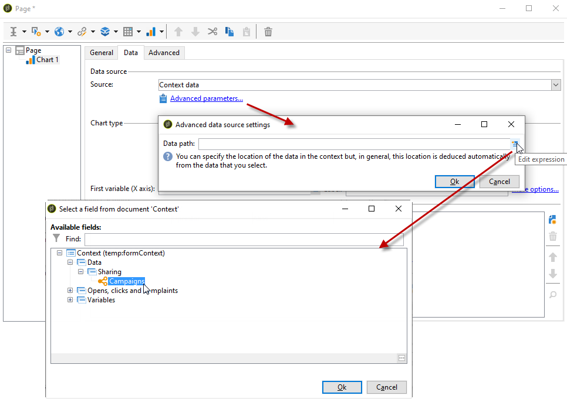
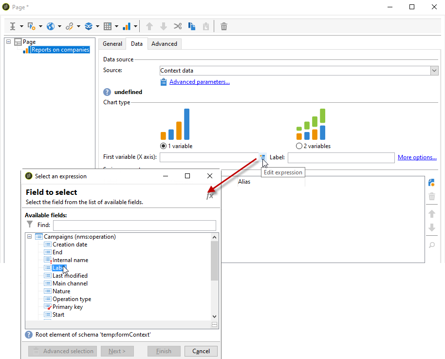

# 차트 만들기{#creating-a-chart}

데이터베이스의 데이터를 수집하여 차트로 표시할 수도 있습니다. Adobe Campaign은 그래픽 표현 집합을 제공합니다. 구성은 아래에 자세히 설명되어 있습니다.

차트는 마우스 오른쪽 버튼 클릭 메뉴 또는 도구 모음을 통해 보고서 페이지에 직접 삽입됩니다.

## 만들기 단계 {#creation-steps}

보고서에서 차트를 생성하려면 다음 단계를 적용합니다.

1. 차트를 표시할 페이지를 편집하고 도구 모음에서 차트 유형을 선택합니다.

   

1. 이름과 캡션을 입력합니다. 필요한 경우 드롭다운 목록을 사용하여 캡션의 위치를 변경할 수 있습니다.

   

1. 계산할 데이터 원본 및 계열을 정의하려면 **[!UICONTROL Data]** 탭을 클릭하십시오.

   차트에 표시되는 통계는 쿼리 또는 컨텍스트 데이터, 즉 현재 페이지의 인바운드 전환에서 제공된 데이터를 기반으로 계산할 수 있습니다(자세한 내용은 [컨텍스트 데이터 사용](../../reporting/using/using-the-context.md#using-context-data) 참조).

   * **[!UICONTROL Filter data...]** 링크를 클릭하여 데이터베이스의 데이터에 대한 필터링 기준을 정의합니다.

     

   * 컨텍스트 데이터를 사용하려면 **[!UICONTROL Source]** 드롭다운에서 **[!UICONTROL Context data]**&#x200B;을(를) 선택하고 **[!UICONTROL Advanced settings...]** 링크를 클릭합니다. 그런 다음 통계가 고려될 데이터를 선택합니다.

     

     그런 다음 컨텍스트 데이터에 액세스하여 차트에 표시할 값을 정의할 수 있습니다.

     

## 차트 유형 및 변형 {#chart-types-and-variants}

Adobe Campaign은 다양한 유형의 그래픽 표현을 제공합니다. 자세한 내용은 아래에 설명되어 있습니다.

페이지에 삽입할 때 차트 유형을 선택합니다.

차트에서 **[!UICONTROL General]** 탭의 **[!UICONTROL Chart type]** 섹션을 통해 변경할 수도 있습니다.

변형은 선택한 차트 유형에 따라 다릅니다. **[!UICONTROL Variants...]** 링크를 통해 선택합니다.

### 분류: 파이 차트 {#breakdown--pie-charts}

이 유형의 그래픽 표현을 사용하면 측정된 요소의 개요를 표시할 수 있습니다.

파이 차트를 사용하면 하나의 변수만 분석할 수 있습니다.

**[!UICONTROL Variants]** 링크를 통해 차트의 전체 렌더링을 개인화할 수 있습니다.

파이 차트를 사용하면 해당 필드에 내부 반경의 값을 입력할 수 있습니다.

예제:

0.00 전체 원을 추적합니다.

0.40은 반지름이 40%인 원을 추적합니다.

1.00은 원의 바깥쪽만 추적합니다.

### 진화: 곡선 및 영역 {#evolution--curves-and-areas}

이 유형의 그래픽 표현을 사용하면 시간에 따른 하나 이상의 측정 단위 진화를 이해할 수 있습니다.

### 비교: 히스토그램 {#comparison--histograms}

히스토그램을 사용하면 하나 이상의 변수의 값을 비교할 수 있습니다.

이러한 유형의 차트의 경우 **[!UICONTROL Variants]** 창에서 다음 옵션이 제공됩니다.

차트와 함께 캡션을 표시하려면 **[!UICONTROL Display caption]** 옵션을 선택하고 해당 위치를 선택하십시오.

필요한 경우 값을 함께 스택할 수 있습니다.

필요한 경우 값 표시 순서를 반대로 할 수 있습니다. 이렇게 하려면 **[!UICONTROL Reverse stacking]** 옵션을 선택하십시오.

### 전환: 단계 {#conversion--funnel}

이 유형의 차트를 사용하면 측정된 요소의 대화율을 추적할 수 있습니다.

## 차트와의 상호 작용 {#interaction-with-the-chart}

사용자가 차트를 클릭할 때 동작을 정의할 수 있습니다. **[!UICONTROL Interaction events]** 창을 열고 수행할 작업을 선택합니다.

가능한 상호 작용 형식 및 구성은 [이 섹션](../../web/using/static-elements-in-a-web-form.md#inserting-html-content)에 자세히 설명되어 있습니다.

## 통계 계산 {#calculating-statistics}

차트를 사용하면 수집된 데이터에 대한 통계를 표시할 수 있습니다.

이러한 통계는 **[!UICONTROL Data]** 탭의 **[!UICONTROL Series parameters]** 섹션을 통해 정의됩니다.

새 통계를 만들려면 **[!UICONTROL Add]** 아이콘을 클릭하고 적절한 창을 구성합니다. 사용 가능한 계산 유형은 다음과 같습니다.

이 작업에 대한 자세한 정보는 [이 섹션](../../reporting/using/using-the-descriptive-analysis-wizard.md#statistics-calculation)을 참조하십시오.
