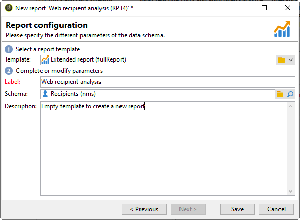

# 새 보고서 만들기{#creating-a-new-report}

보고서를 만들려면 다음 단계를 적용합니다.

1. Adobe Campaign 탐색기를 열고 **[!UICONTROL Administration > Configuration]** 노드를 선택한 다음 **[!UICONTROL Reports]** 폴더를 삭제합니다.
1. 다음을 클릭합니다. **[!UICONTROL New]** 보고서 목록 위에 있는 단추입니다.
1. **[!UICONTROL Create a new report from a template]**&#x200B;을(를) 선택하고 **[!UICONTROL Next]**&#x200B;을(를) 클릭합니다 .

   

1. 드롭다운 목록에서 보고서 템플릿을 선택합니다.

   * 다음 **[!UICONTROL Extended report]** 차트를 사용하여 구성된 보고서를 만들 수 있습니다.
   * 다음 **[!UICONTROL Qualitative distribution]** 보고서를 사용하면 모든 유형의 데이터(회사 이름, 이메일 도메인 등)를 기반으로 통계를 만들 수 있습니다.
   * 다음 **[!UICONTROL Quantitative distribution]** 보고서를 사용하면 측정하거나 계산할 수 있는 데이터(송장 금액, 수신자 기간 등)에 대한 통계를 만들 수 있습니다.

   이러한 보고서 템플릿에 대한 자세한 내용은 다음을 참조하십시오. [이 섹션](../../reporting/using/about-descriptive-analysis.md).

1. 해당 필드에 보고서 이름과 설명을 입력합니다. 다음을 지정합니다. **[!UICONTROL schema]** 보고서를 적용할 대상.

   

1. 이 보고서를 저장합니다.

## 차트 모델링 {#modelizing-the-chart}

보고서를 저장하면 이 항목이 표시됩니다. 이제 보고서의 차트를 작성할 수 있습니다.

보고서 작성의 차트는 활동의 연속으로 구성되어 있습니다.

활동은 화살표로 표시된 전환을 사용하여 연결됩니다.

보고서를 작성하려면 해당 특성 및 컨텍스트에 따라 유용한 요소를 식별하고 해당 논리적 시퀀스를 모델링해야 합니다.

1. 사용 **[!UICONTROL Start]** 활동을 통해 보고서를 작성하기 위해 수행할 첫 번째 프로세스를 구체화합니다. 보고서당 이러한 활동 중 하나만 사용할 수 있습니다.

   차트에 루프가 포함된 경우 필수입니다.

1. 하나 이상 추가 **[!UICONTROL Query]** 활동을 통해 보고서를 작성하는 데 유용한 데이터를 수집합니다. 데이터는 데이터베이스의 스키마에 있는 쿼리를 통해 직접 수집하거나 가져온 목록 또는 기존 큐브를 통해 수집할 수 있습니다.

   자세한 내용은 다음을 참조하십시오. [분석할 데이터 수집](../../reporting/using/collecting-data-to-analyze.md).

   이 데이터는 페이지 구성에 따라 보고서에 표시됩니다.

1. 하나 이상 배치 **[!UICONTROL Page]** 활동을 통해 수집된 데이터의 그래픽 표현을 정의할 수 있습니다. 하나 이상의 페이지 또는 페이지 요소를 표시하는 표, 차트, 입력 필드 및 조건을 삽입할 수 있습니다. 표시된 콘텐츠는 완전히 구성할 수 있습니다.

   자세한 내용은 다음을 참조하십시오. [정적 요소](#static-elements).

1. 사용 **[!UICONTROL Test]** 활동을 사용하여 데이터를 표시하거나 액세스하는 조건을 정의합니다.

   자세한 내용은 다음을 참조하십시오. [컨디셔닝 페이지 디스플레이](../../reporting/using/defining-a-conditional-content.md#conditioning-page-display).

1. 필요한 경우 를 통해 개인화된 스크립트를 추가합니다. **[!UICONTROL Script]** 활동(예: 보고서 이름 계산, 특정 컨텍스트 내의 결과 표시 필터링)

   자세한 내용은 다음을 참조하십시오. [스크립트 활동](../../reporting/using/advanced-functionalities.md#script-activity).

1. 마지막으로, 복잡한 보고서를 보다 쉽게 읽을 수 있도록 하나 이상을 삽입할 수 있습니다 **[!UICONTROL Jump]** 활동을 입력합니다. 이렇게 하면 보고서에서 전환을 실현하지 않고도 한 활동에서 다른 활동으로 이동할 수 있습니다. 다음 **[!UICONTROL Jump]** 활동을 사용하여 다른 보고서를 표시할 수도 있습니다.

   자세한 내용은 다음을 참조하십시오. [이동 활동](../../reporting/using/advanced-functionalities.md#jump-activity).

여러 분기를 동시에 실행할 수 없습니다. 즉, 다음과 같이 작성된 보고서는 작동하지 않습니다.

그러나 여러 개의 분기를 배치할 수 있습니다. 이 중 하나만 실행됩니다.

## 페이지 만들기 {#creating-a-page}

콘텐츠는 차트에 배치된 활동을 통해 구성됩니다. 자세한 내용은 다음을 참조하십시오. [차트 모델링](#modelizing-the-chart).

활동을 구성하려면 해당 아이콘을 두 번 클릭합니다.

표시되는 컨텐츠는 **페이지** 활동을 입력합니다.

보고서에는 하나 이상의 페이지가 포함될 수 있습니다. 페이지는 트리 구조에 입력 필드, 선택 필드, 정적 요소, 차트 또는 표를 삽입할 수 있는 전용 편집기를 통해 만들어집니다. 컨테이너는 레이아웃을 정의하는 데 도움이 됩니다. 자세한 내용은 다음을 참조하십시오. [요소 레이아웃](../../reporting/using/element-layout.md).

페이지에 구성 요소를 추가하려면 도구 모음의 왼쪽 상단 섹션에 있는 아이콘을 사용합니다.

구성 요소를 추가할 노드를 마우스 오른쪽 버튼으로 클릭하고 목록에서 선택할 수도 있습니다.

>[!CAUTION]
>
>보고서를 Excel 형식으로 내보내도록 하려면 복잡한 HTML 형식을 사용하지 않는 것이 좋습니다. 자세한 내용은 다음을 참조하십시오. [보고서 내보내기](../../reporting/using/actions-on-reports.md#exporting-a-report).

A **[!UICONTROL Page]** 에는 다음 요소가 포함될 수 있습니다.

* 막대, 원형, 곡선 유형 **[!UICONTROL charts]**&#x200B;등
* 피벗, 그룹이 포함된 목록 또는 분류 **[!UICONTROL tables]**.
* 텍스트 또는 숫자 유형 **[!UICONTROL Input controls]**.
* 드롭다운 목록, 확인란, 라디오 버튼, 다중 선택, 날짜 또는 매트릭스 유형 **[!UICONTROL Selection controls]**.
* 링크 편집기, 상수, 폴더 선택 유형 **[!UICONTROL Advanced controls]**.
* 값, 링크, HTML, 이미지 등 **[!UICONTROL Static elements]**.
* **[!UICONTROL Containers]** 구성 요소 레이아웃을 제어할 수 있도록 해 줍니다.

페이지 및 해당 구성 요소의 구성 모드는에 자세히 설명되어 있습니다. [이 섹션](../../web/using/about-web-forms.md).

도구 모음을 사용하여 보고서 페이지에서 컨트롤을 추가하거나 제거하고 해당 순서를 구성할 수 있습니다.

### 정적 요소 {#static-elements}

정적 요소를 사용하면 그래픽 요소나 스크립트와 같이 사용자가 상호 작용하지 않는 정보를 보고서에 표시할 수 있습니다. 을(를) 참조하십시오 [이 섹션](../../web/using/static-elements-in-a-web-form.md#inserting-html-content) 추가 정보.

### 보고서에서 정보 필터링 {#filtering-information-in-a-report}

입력 및 선택 컨트롤을 사용하면 보고서에 표시된 정보를 필터링할 수 있습니다. 이러한 유형의 필터링 구현에 대한 자세한 내용은 [쿼리의 필터링 옵션](../../reporting/using/collecting-data-to-analyze.md#filtering-options-in-the-queries).

입력 필드 및 선택 필드 만들기 및 구성에 대한 자세한 내용은 다음을 참조하십시오. [이 섹션](../../web/using/about-web-forms.md).

하나 이상의 입력 컨트롤을 보고서에 통합할 수 있습니다. 이 유형의 컨트롤을 사용하면 입력한 값에 따라 표시되는 정보를 필터링할 수 있습니다.

하나 이상의 선택 컨트롤을 보고서에 통합할 수도 있습니다. 이 유형의 컨트롤을 사용하면 다음과 같이 선택한 값을 기반으로 보고서에 포함된 정보를 필터링할 수 있습니다.

* 라디오 단추 또는 확인란을 통해:

   

* 드롭다운 목록을 통해:

   

* 달력을 통해:

   

마지막으로, 하나 이상의 고급 컨트롤을 보고서에 통합할 수 있습니다. 이러한 유형의 컨트롤을 사용하면 링크, 상수를 삽입하거나 폴더를 선택할 수 있습니다.

여기에서 보고서의 데이터를 필터링하여 트리의 폴더 중 하나에 포함된 정보만 표시할 수 있습니다.

