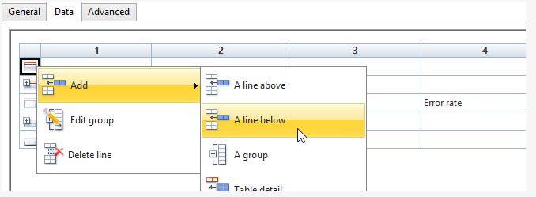
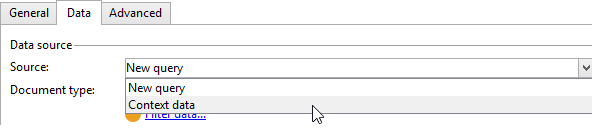

# 표 만들기{#creating-a-table}

데이터를 표시하기 위해 보고서에 표를 추가할 수 있습니다. 큐브 측정을 기반으로 만들어진 피벗 테이블, 그룹이 있는 목록 또는 값 분류가 포함된 테이블일 수 있습니다.


## 그룹을 사용하여 목록 만들기 {#creating-a-list-with-group}

유형 **[!UICONTROL List with group]** 테이블을 사용하면 테이블의 데이터를 그룹화하여 이에 대한 통계를 생성할 수 있습니다. 예를 들어 데이터에 대한 총계 및 소계를 만들 수 있습니다. 각 그룹에는 머리글, 세부 사항 및 바닥글 라인이 있습니다.

>[!CAUTION]
>
>테이블을 포함하는 **[!UICONTROL Page]** 활동에는 보고서에서 분석할 데이터를 수집하기 위한 **[!UICONTROL Query]** 또는 **[!UICONTROL Script]** 활동이 앞에 와야 합니다. 이러한 활동에 대한 자세한 내용은 데이터 수집을 [참조하여 분석](../../reporting/using/collecting-data-to-analyze.md) 및 스크립트 활동을 [](../../reporting/using/advanced-functionalities.md#script-activity)참조하십시오.

### 운영 원칙 {#operating-principle}

여러 데이터 카테고리를 한 번에 분석해야 할 수 있습니다. 그룹이 있는 목록을 사용하면 데이터를 결합하고 동일한 표 내의 다양한 데이터 그룹에 대한 통계를 만들 수 있습니다. 이렇게 하려면 테이블에서 그룹을 만들 수 있습니다.

다음 예에서 그룹은 데이터베이스의 모든 캠페인, 배달, 배달당 및 캠페인당 전송된 메시지 수를 보여줍니다.

캠페인과 연결된 캠페인(**[!UICONTROL Label (Campaign)]**&#x200B;게재의 목록&#x200B;**[!UICONTROL Label]** )을 나열하고 각 캠페인에 대해 추가하기 전에 배달당 전송된 메시지 수를 계산할 수 있습니다(**[!UICONTROL Processed)]****[!UICONTROL Sum(@processed)]** ).


### 구현 단계 {#implementation-steps}

전체 구현 예는 다음과 같습니다.사용 [사례:그룹 목록을](#use-case--create-a-report-with-a-group-list)사용하여 보고서를 만듭니다.

&#39;그룹이 있는 목록&#39; 유형 테이블을 만들려면 다음 단계를 참고하십시오.

1. 보고서 차트로 이동하여 **[!UICONTROL Query]** 활동을 배치합니다. 분석할 [데이터 수집을 참조하십시오](../../reporting/using/collecting-data-to-analyze.md).
1. 소스 테이블을 채우고 통계를 다룰 테이블의 필드를 선택합니다.
1. 차트에 **[!UICONTROL Page]** 활동을 배치합니다. 자세한 내용은 정적 [요소를](../../reporting/using/creating-a-new-report.md#static-elements)참조하십시오.
1. 페이지에 **[!UICONTROL List with group]** 문자 표를 삽입합니다.
1. 데이터 경로 또는 쿼리에서 데이터 소스로 선택한 테이블을 지정합니다.

   나중에 소스 테이블의 필드를 복구하여 표의 셀에 삽입하려는 경우 이 단계는 필수입니다.

1. 테이블 및 해당 컨텐츠 만들기
1. 완성된 보고서를 **[!UICONTROL Preview]** 탭에 표시합니다. 그런 다음 보고서를 게시하고 필요한 경우 다른 형식으로 내보낼 수 있습니다. 자세한 내용은 보고서 [내보내기를](../../reporting/using/actions-on-reports.md#exporting-a-report)참조하십시오.

### 행 및 열 추가 {#adding-lines-and-columns}

기본적으로 **[!UICONTROL List with group]** 유형 표에는 머리글, 세부 줄 및 바닥글 줄이 포함됩니다.

그룹 자체에는 머리글, 세부 사항 및 바닥글 줄이 포함됩니다.

* **헤더 행**:이 줄을 사용하면 표의 열에 제목을 지정할 수 있습니다.

   

* **세부 정보 라인**:이 라인에는 통계 값이 포함되어 있습니다.

   

* **바닥글 선**:이 줄을 사용하면 합계 값을 표시할 수 있습니다.

   

필요에 따라 행과 열을 추가할 수 있습니다.

이 그룹은 표의 모든 행에 배치할 수 있으며 고유한 머리글, 세부 사항 및 바닥글 선을 포함합니다.


**행 및 열**:라인 또는 열을 추가하거나 삭제하려면 기존 행 또는 열로 이동하고 마우스 오른쪽 단추 클릭 메뉴를 사용합니다.


추가한 선의 특성은 커서 위치에 따라 달라집니다. 예를 들어 헤더 행을 추가하려면 커서를 머리글에 놓고 을 클릭합니다 **[!UICONTROL Add > A line above/below]**.



열의 너비는 **[!UICONTROL Column format]** 항목을 통해 수정할 수 있습니다.

**그룹**:그룹을 추가하려면 라인으로 이동하여 드롭다운 메뉴에서 일치하는 항목을 선택합니다.


### 셀 내용 정의 {#defining-cell-content}

표의 셀을 편집하고 내용과 형식을 정의하려면 셀로 이동하여 마우스 오른쪽 단추 클릭 메뉴를 사용합니다.

메뉴 항목을 사용하여 표시할 값을 **[!UICONTROL Expression]** 선택합니다.


* 테이블에 바로 분석할 값을 삽입하려면 사용 가능한 필드 중에서 선택합니다.

   사용 가능한 필드 목록은 보고서 구성 차트의 표 앞에 있는 질의 내용과 일치합니다.

   

* 예를 들어, 셀에 대한 레이블을 입력합니다.

   이렇게 하려면 데이터베이스에 필드를 삽입하는 것과 동일한 프로세스를 사용하되 표현식을 선택하지 마십시오. 필드에 레이블을 **[!UICONTROL Label]** 입력합니다. 그대로 표시됩니다.

* 합계 계산(평균, 합계 등) 그리고 셀에 표시합니다.

   이렇게 하려면 **[!UICONTROL Aggregates]** 메뉴 항목을 사용하고 원하는 캠페인을 선택합니다.

   

### 셀 형식 정의 {#defining-cell-format}


셀 형식을 정의하려면 **[!UICONTROL Cell format...]** 메뉴에서 선택한 셀에 사용할 수 있는 모든 서식 옵션에 액세스할 수 있습니다.

이러한 옵션을 사용하면 보고서의 최종 렌더링을 개인화하고 정보를 쉽게 읽을 수 있습니다.

데이터를 Excel로 내보낼 때 **[!UICONTROL Carriage return]** 필드를 사용합니다.캐리지 리턴을 적용할 **[!UICONTROL Yes]** 값을 선택합니다. 이 값은 내보낼 때 유지됩니다. 자세한 내용은 보고서 [내보내기를](../../reporting/using/actions-on-reports.md#exporting-a-report)참조하십시오.

이 **[!UICONTROL Cell format]** 창에서 다음 탭에 액세스할 수 있습니다.

* The **[!UICONTROL Value]** tab
* The **[!UICONTROL Borders]** tab
* The **[!UICONTROL Click]** tab
* The **[!UICONTROL Extra]** tab

이 **[!UICONTROL Value]** 탭에서는 글꼴과 다양한 값 속성을 변경하거나 해당 특성에 따라 형식을 정의할 수 있습니다.


형식은 데이터 표시를 변경합니다.예를 들어, **[!UICONTROL Number]**&#x200B;및 **[!UICONTROL Monetary]** **[!UICONTROL Percentage]** 형식을 사용하면 오른쪽의 숫자를 정렬하고 소수점을 표시할 수 있습니다.

통화 형식을 구성하는 방법의 예:값을 표시할 통화를 지정하고, 천 단위를 구분할지 여부를 선택하고, 음수 값을 빨간색으로 표시할 수 있습니다. 통화 기호의 위치는 프로필에 정의된 연산자의 언어에 따라 달라집니다.


날짜에 대한 구성 예:시간을 표시할지 여부를 선택할 수 있습니다.


테두리 **탭을** 사용하면 표의 선과 열에 테두리를 추가할 수 있습니다. 셀에 테두리를 추가하면 큰 보고서를 Excel로 내보낼 때 성능 문제가 발생할 수 있습니다.


필요한 경우 표 템플릿(**[!UICONTROL Administration > Configuration > Form rendering]** )에서 테두리를 정의할 수 있습니다.

이 경우 다음 구문을 사용할 수 있습니다.

웹 탭에서 다음을 수행합니다.

```
 .tabular td {
 border: solid 1px #000000;
 }
```

Excel 탭에서 다음을 수행합니다.

```
 <style name="odd" fillColor="#fdfdfd">
  <border>
   <borderTop value="solid 0.05pt #000000" />
   <borderBottom value="solid 0.05pt #000000" />
   <borderLeft value="solid 0.05pt #000000" />
   <borderRight value="solid 0.05pt #000000" />
  </border>
 </style> 
 
 <style name="even" fillColor="#f7f8fa">
  <border>
   <borderTop value="solid 0.05pt #000000" />
   <borderBottom value="solid 0.05pt #000000" />
   <borderLeft value="solid 0.05pt #000000" />
   <borderRight value="solid 0.05pt #000000" />
  </border>
 </style> 
```

이 **[!UICONTROL Click]** 탭에서는 사용자가 셀 또는 표의 컨텐츠를 클릭할 때 동작을 정의할 수 있습니다.

아래 예에서 셀에서 값을 클릭하면 보고서의 두 번째 페이지를 표시할 수 있습니다.셀에서의 전달에 대한 정보가 포함됩니다.


[ **추가** ] 탭에서는 시각적 이미지를 색상 표시 또는 값 막대와 같은 데이터에 연결할 수 있습니다. 색상이 있는 표시는 표가 차트에 범례로 표시될 때 사용됩니다. 자세한 내용은 구현 예를 참조하십시오.5단계 [- 두 번째 페이지 만들기](#step-5---create-the-second-page)


## 사용 사례:그룹 목록을 사용하여 보고서 만들기 {#use-case--create-a-report-with-a-group-list}

이 예에서는 두 페이지 보고서를 만듭니다.첫 번째 페이지에는 캠페인당 목록 및 총 게재 수와 전송된 메시지 수가 포함됩니다. 배달 이름은 클릭 가능한 링크이며, 보고서의 두 번째 페이지로 이동하여 테이블 및 차트와 함께 선택한 배달에 대한 이메일 도메인별 배달 분류를 볼 수 있습니다. 두 번째 페이지에서 표는 차트의 범례 역할을 합니다.


### 1단계 - 보고서 만들기 {#step-1---create-a-report}

캠페인 스키마와 관련된 새 보고서를 만듭니다 **[!UICONTROL Campaigns (nms)]**.


을 **[!UICONTROL Save]** 클릭하여 보고서를 만듭니다.

차트로 이동하여 보고서 컨텐츠를 디자인하는 데 사용할 첫 번째 구성 요소를 추가합니다.첫 번째 쿼리와 첫 번째 페이지.


### 2단계 - 첫 번째 쿼리 만들기 {#step-2---create-the-first-query}

첫 번째 쿼리를 사용하면 각 캠페인에 연결된 배달을 수집할 수 있습니다. 목표는 각 캠페인에 연결된 Adobe Campaign 데이터베이스의 다양한 게재에 대한 보고서를 표시하는 것입니다.

첫 번째 쿼리를 두 번 클릭하여 편집한 다음 다음 다음 단계를 적용하여 구성합니다.

1. 먼저 쿼리의 소스가 적용되는 스키마를 변경합니다.스키마를 **[!UICONTROL Deliveries (nms)]** 선택합니다.
1. 링크를 **[!UICONTROL Edit query]** 클릭하고 고급 필드를 표시합니다.

   

1. 다음 필드를 선택합니다.

   * 배달 레이블,
   * 배달의 주요 열쇠는
   * 캠페인 레이블,
   * 처리된 배달 지표,
   * 캠페인 링크의 외래 키,
   * 오류 비율 표시기.
   

   각 필드에 별칭을 연결합니다.보고서의 첫 번째 페이지에 추가될 테이블에서 데이터를 쉽게 선택할 수 있도록 권장합니다.

   이 예에서는 다음 별칭을 사용합니다.

   * 레이블: **@label**
   * 기본 키: **@deliveryId**
   * 레이블(캠페인): **@label1**
   * 처리됨: **@processed**
   * &#39;Campaign&#39;(&#39;id&#39; 필드) 링크의 외래 키: **@operationId**
   * 오류 비율: **@errorRatio**


1. 이 **[!UICONTROL Next]** 단추를 두 번 클릭하여 **[!UICONTROL Data filtering]** 단계로 이동합니다.

   캠페인에 연결된 배달만 수집하려면 필터링 조건을 추가합니다.

   이 필터의 구문은 다음과 같습니다.&quot;0보다 큰 &#39;캠페인&#39; 링크의 외래 키&quot;

   

1. 을 **[!UICONTROL Finish]** **[!UICONTROL Ok]** 클릭하여 이러한 조건을 저장한 다음 을 클릭하여 쿼리 편집기를 닫습니다.

### 3단계:첫 번째 페이지 만들기 {#step-3--create-the-first-page}

이 단계에서는 보고서의 첫 페이지를 구성합니다. 구성하려면 다음 단계를 수행하십시오.

1. 이 경우 **[!UICONTROL Page]** 활동을 열고 제목을 입력합니다(예: **배달** ).

   

1. 도구 모음을 통해 그룹이 있는 목록을 삽입하고 레이블을 입력합니다. 예:캠페인별 배달 목록입니다.

   

1. 링크를 클릭하고 배달 링크(예: **[!UICONTROL Table data XPath...]**`[query/delivery]` Adobe

   

1. 탭을 **[!UICONTROL Data]** 클릭하고 표의 레이아웃을 변경합니다.오른쪽에 세 개의 열을 추가합니다.

   

1. 그룹을 추가합니다.

   

   이 그룹을 사용하면 캠페인과 캠페인에 연결된 배달을 그룹화할 수 있습니다.

1. 그룹 창에서 &#39;캠페인&#39; **링크의** 외래 키를 참조하고 창을 닫습니다.

   

1. 그룹 헤더의 첫 번째 셀을 편집하고 캠페인 **[!UICONTROL Label]** 필드를 표현식으로 삽입합니다.

   

1. 세부 정보 라인의 두 번째 셀을 편집하고 배달을 **[!UICONTROL Label]**&#x200B;선택합니다.

   

1. 이 셀의 형식을 편집하고 **[!UICONTROL Click]** 탭을 엽니다. 사용자가 배달 이름을 클릭할 때 동일한 창에서 열리도록 적절한 옵션을 구성합니다.

   

   이렇게 하려면 **[!UICONTROL Next page]** 유형 작업을 선택하고 열린 **[!UICONTROL In the same window]** 옵션으로 선택합니다.

   

1. 창의 하단 섹션에서 을 클릭하고 이전에 만든 쿼리에 정의된 대로 게재의 기본 키의 별칭과 일치하는 **[!UICONTROL Add]** 경로와 **`/vars/selectedDelivery`** **[!UICONTROL @deliveryId]** 표현식을 지정합니다. 이 공식을 사용하면 선택한 배달에 액세스할 수 있습니다.

   

1. 그룹의 바닥글 줄의 두 번째 셀을 편집하고 레이블로 **[!UICONTROL Total per campaign]** 입력합니다.

   

1. 그룹의 헤더 줄의 세 번째 셀을 편집하고 레이블로 **[!UICONTROL Number of messages sent]** 입력합니다.

   

   이 정보는 열 제목과 일치합니다.

1. 세부 정보 라인의 세 번째 셀을 편집하고 처리된 메시지 표시기를 표현식으로 선택합니다.

   

1. 그룹의 바닥글 줄의 세 번째 셀을 편집하고 처리된 배달 표시기를 선택한 다음 **[!UICONTROL Sum]** 집계를 적용합니다.

   

1. 세부 정보 라인의 네 번째 셀을 편집하고 **오류 배달 오류 비율을** 표현식으로 선택합니다.

   

1. 배달 오류 비율을 나타내는 값 막대를 표시하려면 이 셀을 선택합니다.

   이렇게 하려면 셀 형식에 액세스한 다음 **[!UICONTROL More]** 탭으로 이동합니다. 드롭다운 목록에서 **[!UICONTROL Value bar]** 항목을 선택하고 **[!UICONTROL Hide the cell value]** 옵션을 선택합니다.

   

   이제 보고서 렌더링을 볼 수 있습니다. 탭을 클릭하고 **[!UICONTROL Preview]** **[!UICONTROL Global]** 옵션을 선택합니다.캠페인과 연결된 Adobe Campaign 데이터베이스의 모든 게재 목록이 표시됩니다.

   

   테이블의 데이터가 제대로 선택되어 구성되어 있는지 확인하려면 **[!UICONTROL Preview]** 탭을 사용하는 것이 좋습니다. 이렇게 하면 표 서식을 지정할 수 있습니다.

1. 캠페인당 합계와 처리된 총 메시지 수를 표시하는 셀에 **[!UICONTROL Bold]** 스타일을 적용합니다.

   

1. 그룹 헤더 라인의 첫 번째 셀인 캠페인 이름을 표시하는 셀을 클릭하고 **[!UICONTROL Edit > Merge to right]**&#x200B;선택합니다.

   

   그룹 헤더 라인의 처음 두 셀을 병합하면 캠페인 제목과 연결된 배달 목록이 다시 정렬됩니다.

   

   >[!CAUTION]
   >
   >병합은 되돌릴 수 없으므로 병합하기 전에 보고서가 작성될 때까지 기다리는 것이 좋습니다.

### 4단계 - 두 번째 쿼리 만들기 {#step-4---create-the-second-query}

두 번째 쿼리와 두 번째 페이지를 추가하여 보고서 사용자가 클릭했을 때 게재의 세부 사항을 표시하려고 합니다. 쿼리를 추가하기 전에 만든 페이지를 편집하고 쿼리에 연결할 수 있도록 나가는 전환을 활성화합니다.

1. 활동 뒤에 새 쿼리를 추가하고 **[!UICONTROL Page]** 스키마를 편집합니다.스키마를 **[!UICONTROL Recipient delivery logs]** 선택합니다.

   

1. 쿼리를 편집하고 출력 열을 정의합니다. 이메일 도메인당 배달 수를 표시하려면 다음을 수행해야 합니다.

   * 기본 키의 합계를 계산하여 배달 로그 수를 계산합니다.

      

   * 수신자 이메일 도메인 및 이 필드에 대한 그룹 정보 수집:이렇게 하려면 도메인 이름 열에서 옵션을 선택합니다 **[!UICONTROL Group]** .
   

   다음 별칭을 필드에 연결합니다.

   * count(기본 키): **@count**
   * 이메일 도메인(수신자): **@domain**

      


1. 다음 **[!UICONTROL Next]** 단추를 두 번 클릭합니다.이렇게 하면 **[!UICONTROL Data filtering]** 단계로 이동합니다.

   필터링 조건을 추가하여 선택한 게재에 연결된 정보만 수집합니다.

   구문은 다음과 같습니다.&#39;Delivery&#39; 링크의 외래 키는 설정의 값과 같습니다. `$([vars/selectedDelivery])`

   

1. 쿼리 구성 창을 닫고 두 번째 쿼리 바로 다음에 페이지를 차트에 추가합니다.

### 5단계 - 두 번째 페이지 만들기 {#step-5---create-the-second-page}

1. 페이지를 편집하고 해당 레이블을 입력합니다.이메일 **도메인**.
1. 다음 **[!UICONTROL Enable output transitions]** 옵션의 선택을 취소합니다.이것은 보고서의 마지막 페이지이며 다른 활동이 뒤따르지 않습니다.

   

1. 마우스 오른쪽 단추 클릭 메뉴를 사용하여 그룹과 함께 새 목록을 추가하고 받는 사람당 **이메일 도메인으로**&#x200B;호출합니다.
1. 을 **[!UICONTROL Table data XPath...]** 클릭하고 **[!UICONTROL Recipient delivery logs]** 링크를 선택합니다.

   

1. 탭에서 표를 다음과 같이 **[!UICONTROL Data]** 조정합니다.

   * 오른쪽에 두 개의 열을 추가합니다.
   * 세부 사항 라인의 첫 번째 셀에서 **[!UICONTROL rowNum()-1]** 표현식을 추가하여 줄 수를 계산합니다. 그런 다음 셀의 형식을 변경합니다.탭에서 **[!UICONTROL Extra]** 을 선택하고 **[!UICONTROL Color tab]** **[!UICONTROL Ok]**&#x200B;클릭합니다.

      

      이 구성을 사용하면 표를 차트에 대한 캡션으로 사용할 수 있습니다.

   * 세부 사항 라인의 두 번째 셀에서 **[!UICONTROL Email domain(Recipient)]** 표현식을 추가합니다.
   * 세부 사항 라인의 세 번째 셀에서 **[!UICONTROL count(primary key)]** 표현식을 추가합니다.
   

1. 마우스 오른쪽 단추 클릭 메뉴를 사용하여 페이지에 파이 차트를 추가하고 **이메일 도메인** 레이블을 할당합니다. 자세한 내용은 차트 [유형 및 변형을](../../reporting/using/creating-a-chart.md#chart-types-and-variants)참조하십시오.
1. 링크를 클릭하고 **[!UICONTROL Variants]** 및 **[!UICONTROL Display label]** **[!UICONTROL Display caption]** 옵션을 선택 취소합니다.
1. 값 정렬이 구성되지 않았는지 확인합니다. For more on this, refer to [this section](../../reporting/using/processing-a-report.md#configuring-the-layout-of-a-descriptive-analysis-report).

   

1. 탭에서 데이터 소스를 **[!UICONTROL Data]** 변경합니다.드롭다운 **[!UICONTROL Context data]** 목록에서 선택합니다.

   

1. 그런 다음 을 클릭하고 수신자 배달 로그에 대한 링크를 **[!UICONTROL Advanced settings]** 선택합니다.

   

1. 섹션에서 **[!UICONTROL Chart type]** **[!UICONTROL Email domain]** 변수를 선택합니다.
1. 그런 다음 수행할 계산을 추가합니다.합계를 연산자로 선택합니다.

   

1. 단추를 **[!UICONTROL Detail]** 클릭하여 카운트와 관련된 필드를 선택한 다음 구성 창을 닫습니다.

   

1. 보고서를 저장합니다.

   이제 페이지가 구성됩니다.

### 6단계 - 보고서 보기 {#step-6---viewing-the-report}

이 구성 결과를 보려면 **[!UICONTROL Preview]** 탭을 클릭하고 **[!UICONTROL Global]** 옵션을 선택합니다.

보고서의 첫 번째 페이지에는 데이터베이스에 포함된 모든 게재 목록이 자세히 표시됩니다.


이러한 배달 중 하나의 링크를 클릭하면 이 게재에 대한 이메일 도메인 분류를 보여주는 차트가 표시됩니다. 이제 보고서의 두 번째 페이지에 있으며 해당 단추를 클릭하여 이전 페이지로 돌아갈 수 있습니다.


## 분류 또는 피벗 테이블 만들기 {#creating-a-breakdown-or-pivot-table}

이 유형의 표를 사용하면 데이터베이스의 데이터에 대해 계산된 통계를 표시할 수 있습니다.

이러한 유형의 보고서는 설명 분석 마법사에 사용되는 보고서와 유사합니다. For more on this, refer to [this page](../../reporting/using/using-the-descriptive-analysis-wizard.md#configuring-the-quantitative-distribution-template).

피벗 테이블 만들기에 대한 자세한 내용은 [이 섹션을](../../reporting/using/using-cubes-to-explore-data.md)참조하십시오.
