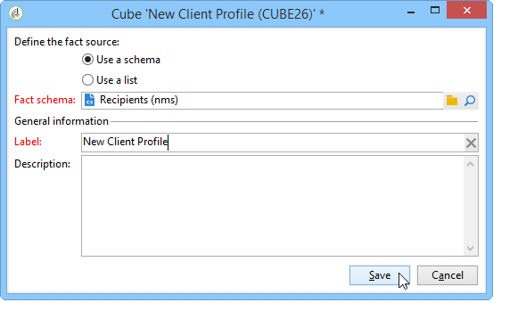

# 표시기 만들기{#creating-indicators}

큐브를 기능적으로 만들려면 관련 차원 및 측정값을 식별하여 큐브에서 만들어야 합니다.

큐브를 만들려면 다음 단계를 적용합니다.

1. 작업 테이블을 선택합니다. 작업 테이블 [을(를) 선택하십시오.](#selecting-the-work-table)
1. 차원을 정의합니다. [차원 정의](#defining-dimensions)를 참조하십시오.
1. 측정값을 정의합니다. [지표 만들기](#building-indicators)를 참조하십시오.
1. 집계 만들기(선택 사항). [집계 및 사용](../../reporting/using/concepts-and-methodology.md#calculating-and-using-aggregates)을 참조하십시오.

이 예에서는 보고서에서 간단한 큐브를 빠르게 만들어 측정값을 내보내는 방법을 보여줍니다.

구현 단계는 아래에 자세히 설명되어 있습니다. 이 장의 다른 섹션에서는 전체 옵션과 설명을 사용할 수 있습니다.

## 작업 테이블 {#selecting-the-work-table} 선택

큐브를 만들려면 큐브 목록 위의 **[!UICONTROL New]** 단추를 클릭합니다.

탐색할 요소가 포함된 스키마(예: 팩트 스키마)를 선택합니다. 이 예에서는 **수신자** 테이블을 선택합니다.

**[!UICONTROL Save]**&#x200B;을 클릭하여 큐브를 만듭니다.큐브의 목록에 나타나며 적절한 탭을 사용하여 구성할 수 있습니다.

데이터베이스의 데이터 선택에 이 큐브의 계산을 적용하려면 **[!UICONTROL Filter the source data...]** 링크를 클릭합니다.

## 차원 정의 {#defining-dimensions}

Dimension은 관련 팩트 스키마를 기준으로 각 큐브에 대해 정의된 분석 축과 일치합니다. 시간(년, 월, 날짜..), 제품 또는 계약의 분류(가족, 참조 등), 인구 세그먼트(구/군/시, 연령 그룹, 상태 등)와 같이 분석에서 탐색된 차원입니다.

이러한 분석 축은 큐브의 **[!UICONTROL Dimension]** 탭에 정의됩니다.

**[!UICONTROL Add]** 단추를 클릭하여 새 차원을 만든 다음 **[!UICONTROL Expression field]**&#x200B;에서 **[!UICONTROL Edit expression]** 아이콘을 클릭하여 관련 데이터가 포함된 필드를 선택합니다.

* 수신자 **연령**&#x200B;을 선택하여 시작합니다. 이 필드의 경우 페이지 그룹화를 정의하고 정보를 더 쉽게 읽을 수 있도록 할 수 있습니다. 여러 개의 개별 값이 있을 가능성이 있는 경우 베이닝을 사용하는 것이 좋습니다.

   이렇게 하려면 **[!UICONTROL Enable binning]** 옵션을 선택합니다. 시작 모드는 [데이터 바인딩](../../reporting/using/concepts-and-methodology.md#data-binning)에 자세히 설명되어 있습니다.

   

* **날짜** 유형 차원을 추가합니다. 여기에서 수신자 프로필 생성 날짜를 표시하려고 합니다.

   이렇게 하려면 **[!UICONTROL Add]**&#x200B;을 클릭하고 수신자 테이블에서 **[!UICONTROL Creation date]** 필드를 선택합니다.

   

   날짜 표시 모드를 선택할 수 있습니다. 이렇게 하려면 사용할 계층과 생성할 레벨을 선택합니다.

   

   이 예에서는 주 및 학기/월을 동시에 사용할 수 없으므로 연도, 월 및 일만 표시해야 합니다.이러한 수준이 호환되지 않습니다.

* 다른 차원을 만들어 수신자 시와 관련된 데이터를 분석합니다.

   이렇게 하려면 새 차원을 추가하고 수신자 스키마의 **[!UICONTROL Location]** 노드에서 구/군/시를 선택합니다.

   

   베이닝을 활성화하여 정보 읽기 작업을 쉽게 만들고 값을 열거에 연결할 수 있습니다.

   

   드롭다운 목록에서 열거형을 선택합니다.

   

   열거형의 값만 표시됩니다. 나머지 항목은 **[!UICONTROL Label of the other values]** 필드에 정의된 레이블로 그룹화됩니다.

   자세한 내용은 [저장소 동적으로 관리](../../reporting/using/concepts-and-methodology.md#dynamically-managing-bins)를 참조하십시오.

## 표시기 {#building-indicators} 만들기

차원이 정의되면 셀에 표시할 값에 대한 계산 모드를 지정해야 합니다. 이렇게 하려면 **[!UICONTROL Measures]** 탭에서 일치하는 표시기를 만듭니다.큐브를 사용할 보고서에 표시할 열을 수만큼 측정합니다.

이렇게 하려면 다음 단계를 적용합니다.

1. **[!UICONTROL Add]** 버튼을 클릭합니다.
1. 적용할 측정 유형과 공식을 선택합니다. 여기 우리는 수혜자 중 여성 수를 세어보고 싶다.

   측정은 팩트 스키마를 기반으로 하며 **[!UICONTROL Count]** 연산자를 사용합니다.

   

   **[!UICONTROL Filter the measure data...]** 링크를 사용하면 여성만 선택할 수 있습니다. 측정값 및 사용 가능한 옵션 정의에 대한 자세한 내용은 [측정값 정의](../../reporting/using/concepts-and-methodology.md#defining-measures)를 참조하십시오.

   

1. 측정 단위 레이블을 입력하고 저장합니다.

   

1. 큐브를 저장합니다.

## 큐브 {#creating-a-report-based-on-a-cube} 기반 보고서 만들기

큐브가 구성되면 새 보고서를 만들기 위한 템플릿으로 사용할 수 있습니다.

방법은 다음과 같습니다.

1. **[!UICONTROL Reports]** 우주의 **[!UICONTROL Create]** 단추를 클릭하고 방금 만든 큐브를 선택합니다.

   

1. **[!UICONTROL Create]** 단추를 클릭하여 확인합니다.보고서 구성 및 보기 페이지로 이동합니다.

   기본적으로 사용할 수 있는 처음 2개의 차원이 행과 열로 제공되지만 테이블에 값이 표시되지 않습니다. 테이블을 생성하려면 기본 아이콘을 클릭합니다.

   

1. 차원의 축을 전환하거나 삭제하고 새 측정값을 추가할 수 있습니다. 가능한 작업은 여기에 자세히 설명되어 있습니다.[큐브를 사용하여 데이터](../../reporting/using/using-cubes-to-explore-data.md) 탐색

   이렇게 하려면 해당 아이콘을 사용합니다.

   

