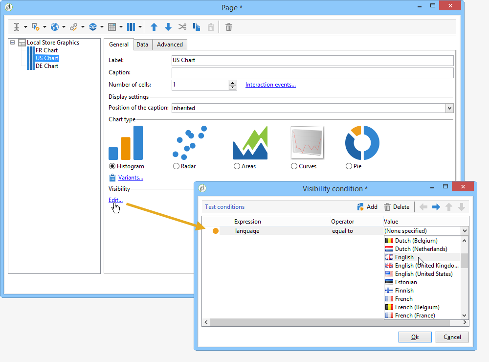

# 조건부 콘텐츠 정의{#defining-a-conditional-content}

특정 보고서 항목 또는 페이지의 표시를 조정할 수 있습니다.

특정 항목을 조건부로 만들려면 표시 설정을 조정합니다. 자세한 내용은 [조건 항목 표시](#conditioning-item-display)를 참조하세요.

하나 이상의 페이지를 조건부로 표시하려면 **[!UICONTROL Test]** 형식 활동을 사용하십시오. 자세한 내용은 [조건 페이지 표시](#conditioning-page-display)를 참조하세요.

## 조건 항목 표시 {#conditioning-item-display}

보고서 일부를 조건부로 표시하려면 가시성 조건을 정의해야 합니다. 이러한 조건이 충족되지 않으면 항목이 표시되지 않습니다.

가시성 조건은 운영자 상태, 보고서 페이지에서 선택하거나 입력한 항목에 따라 달라질 수 있습니다.

페이지에 항목을 조건부로 표시하는 예는 [이 섹션](../../web/using/form-rendering.md#defining-fields-conditional-display)에 나와 있습니다.

다음 예에서 표시 조건은 언어에 따라 다릅니다.

## 조건 페이지 표시 {#conditioning-page-display}

보고서 차트에서 **[!UICONTROL Test]** 활동을 사용하면 하나 이상의 조건에 따라 페이지 순서를 변경할 수 있습니다.

이 활동은 다음 운영 원칙을 기반으로 합니다.

1. 차트에 **[!UICONTROL Test]**&#x200B;을(를) 배치하고 편집합니다.
1. 가능한 다양한 사례를 만들려면 **[!UICONTROL Add]** 단추를 클릭하십시오.

   

   각 경우에 대해 **[!UICONTROL Test]** 활동에 출력 전환이 추가됩니다.

   

1. 구성된 조건 중 하나가 충족되지 않는 경우 전환을 추가하려면 **[!UICONTROL Enable default transition]**&#x200B;을(를) 선택하십시오.

   이 작업에 대한 자세한 정보는 [이 섹션](../../web/using/defining-web-forms-page-sequencing.md#conditional-page-display)을 참조하십시오.

차트 시작 부분에 **[!UICONTROL Test]** 활동을 배치하여 컨텍스트 또는 연산자 프로필에 따라 표시를 조정할 수 있습니다.
