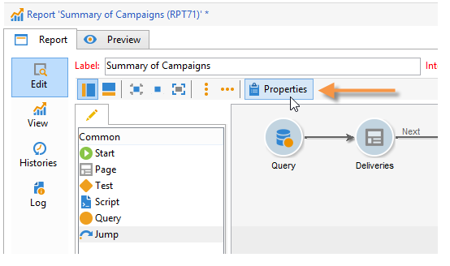
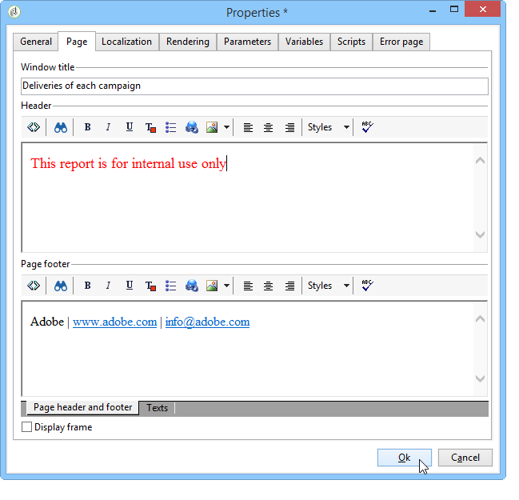

# 요소 레이아웃{#element-layout}

여기에 자세히 설명된 다양한 차트 이외에도 [차트 유형 및 변형](../../reporting/using/creating-a-chart.md#chart-types-and-variants), 표시를 조정하고 보고서 페이지에 요소를 추가할 수 있습니다.

컨테이너를 사용할 수 있습니다.이렇게 하면 페이지의 여러 요소를 연결하고 레이아웃을 열 및/또는 셀로 구성할 수 있습니다. 사용 방법은 [이 섹션에 자세히 설명되어 있습니다](../../web/using/defining-web-forms-layout.md#creating-containers).

트리 루트에서 보고서 레이아웃을 구성하고 각 컨테이너에 대해 오버로드를 수행할 수 있습니다. 페이지는 열로 정렬됩니다. 컨테이너도 열로 정렬됩니다. 정적 및 그래픽 항목만 셀로 정렬됩니다.

## 각 페이지에 대한 옵션 정의 {#defining-the-options-for-each-page}

보고서의 각 페이지에 있는 옵션을 사용할 수 있습니다.

이 **[!UICONTROL General]** 탭에서는 페이지 제목을 변경할 수 있을 뿐만 아니라, 범례 위치를 구성하고 보고서 페이지 간을 탐색할 수 있습니다.

이 **[!UICONTROL Title]** 필드를 사용하면 보고서 페이지의 헤더에 있는 레이블을 개인화할 수 있습니다. 창 제목은 보고서 창을 통해 구성할 수 **[!UICONTROL Properties]** 있습니다. 자세한 내용은 머리글 및 바닥글 [추가를 참조하십시오](#adding-a-header-and-a-footer).

이 옵션을 사용하면 보고서 페이지 내에서 제어 캡션의 위치를 선택하고 페이지의 열 수를 정의할 수 있습니다. **[!UICONTROL Display settings]** 페이지 레이아웃에 대한 자세한 내용은 **이 섹션** 의 [항목 레이아웃](../../web/using/defining-web-forms-layout.md#positioning-the-fields-on-the-page)섹션을 참조하십시오.

한 보고서 페이지에서 다른 보고서 페이지로 이동하여 **[!UICONTROL Browse]** 승인할 섹션의 다양한 옵션을 선택합니다. 또는 옵션 **[!UICONTROL Disable next page]** 을 **[!UICONTROL Disable previous page]** 선택하면 **[!UICONTROL Next]** 및 **[!UICONTROL Previous]** 단추가 보고서 페이지에서 사라집니다.

## 머리글 및 바닥글 추가 {#adding-a-header-and-a-footer}

보고서 속성 창에서 다음과 같은 레이아웃 요소를 정의할 수도 있습니다.창 제목, 머리글 및 바닥글의 HTML 내용

속성 창에 액세스하려면 보고서의 **[!UICONTROL Properties]** 단추를 클릭합니다.

이 **[!UICONTROL Page]** 탭을 사용하여 디스플레이를 개인화할 수 있습니다.

이 탭에 구성된 컨텐츠는 모든 보고서 페이지에 표시됩니다.

하위 **[!UICONTROL Texts]** 탭에서는 변수 컨텐츠를 정의할 수 있습니다.보고서가 여러 언어로 사용하도록 설계된 경우 번역 주기 동안 고려됩니다.

이를 통해 텍스트 조각 목록을 만들어 식별자에 연결할 수 있습니다.

그런 다음 이러한 식별자를 보고서의 HTML 컨텐츠에 삽입합니다.

보고서가 표시되면 해당 컨텐츠가 자동으로 해당 컨텐츠로 대체됩니다.

HTML 텍스트의 경우 이 운영 모드를 사용하면 보고서에서 사용되는 텍스트를 중앙에서 관리하고 해당 번역을 관리할 수 있습니다. 이 탭에서 만든 텍스트는 Adobe Campaign 통합 번역 도구에 의해 자동으로 수집됩니다.
