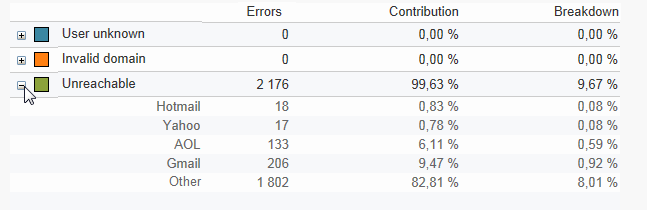
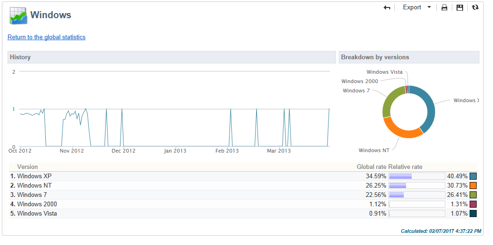

# 글로벌 보고서 {#global-reports}

이러한 보고서는 전체 데이터베이스의 데이터 활동에 영향을 줍니다. 보고서 대시보드를 보려면 **[!UICONTROL Reports]** 탭으로 이동합니다.

보고서를 표시하려면 해당 이름을 클릭합니다. 기본적으로 다음 보고서를 사용할 수 있습니다.

>[!NOTE]
>
>이 섹션에는 게재에 연결된 보고서만 표시됩니다.

* **[!UICONTROL Delivery throughput]** :전달 [처리량을 참조하십시오](#delivery-throughput).
* **[!UICONTROL Browsers]** :브라우저를 [참조하십시오](#browsers).
* **[!UICONTROL Sharing to social networks]** :소셜 [네트워크에](#sharing-to-social-networks)공유를 참조하십시오.
* **[!UICONTROL Statistics on sharing activities]** :공유 [활동에](#statistics-on-sharing-activities)대한 통계를 참조하십시오.
* **[!UICONTROL Operating systems]** :운영 [체제를](#operating-systems)참조하십시오.
* **[!UICONTROL URLs and click streams]** :url을 [참조하고 스트림을](#urls-and-click-streams)클릭합니다.
* **[!UICONTROL Tracking indicators]** :추적 [표시기를](#tracking-indicators)참조하십시오.
* **[!UICONTROL Non-deliverables and bounces]** :비 [산출물 및 바운스를 참조하십시오](#non-deliverables-and-bounces).
* **[!UICONTROL User activities]** :사용자 [활동을](#user-activities)참조하십시오.
* **[!UICONTROL Subscription tracking]** :구독 [추적을](#subscription-tracking)참조하십시오.
* **[!UICONTROL Delivery summary]** :배달 [요약을 참조하십시오](#delivery-summary).
* **[!UICONTROL Delivery statistics]** :게재 [통계를](#delivery-statistics)참조하십시오.
* **[!UICONTROL Breakdown of opens]** :의 [분류를](#breakdown-of-opens)참조하십시오.

## 게재 처리량 {#delivery-throughput}

이 보고서에는 지정된 기간 동안 전체 플랫폼의 배달 처리량에 대한 정보가 포함되어 있습니다. 메시지가 전달되는 속도를 측정하기 위해 기준은 시간당 전송된 메시지 수와 메시지 크기(초당 비트 수)입니다. 아래 예에서 첫 번째 그래프는 성공적인 게재의 파란색과 잘못된 배달 수를 주황색으로 표시합니다.

시간 간격을 변경하여 표시되는 값을 구성할 수 있습니다.1시간 보기, 3시간 보기, 24시간 보기 등 을 **[!UICONTROL Refresh]** 클릭하여 선택을 확인합니다.

## 사용자 활동 {#user-activities}

이 보고서는 차트 형태로 30분, 시간 또는 일별 열기, 클릭 및 거래의 분류를 보여줍니다.

다음 옵션을 사용할 수 있습니다.

* **[!UICONTROL Opens]** :연 총 메시지 수입니다. 텍스트 형식의 이메일은 고려되지 않습니다. 열림 추적에 대한 자세한 내용은 추적 [열기를](#tracking-opens-)참조하십시오.
* **[!UICONTROL Clicks]** :배달에서 링크에 대한 총 클릭 수입니다. 구독 취소 링크 및 미러 페이지의 클릭은 고려되지 않습니다.
* **[!UICONTROL Transactions]** :메시지를 받은 후의 총 트랜잭션 수입니다. 트랜잭션을 고려하려면 트랜잭션 유형 웹 추적 태그를 일치하는 웹 페이지에 삽입해야 합니다. 웹 추적 구성은 [이 섹션에](../../configuration/using/about-web-tracking.md)설명되어 있습니다.

## 게재 불가 및 이탈 {#non-deliverables-and-bounces}

이 보고서는 비 산출물의 분류와 인터넷 도메인별 바운스 수 분류를 보여줍니다.

배달 **[!UICONTROL Number of messages processed]** 서버에서 처리한 총 메시지 수를 나타냅니다. 이 값은 일부 배달이 중지되거나 일시 중지되었을 때(서버에서 처리 전에) 배달될 메시지 수보다 작습니다.

**[!UICONTROL Breakdown of errors by type]**

>[!NOTE]
>
>이 보고서에 표시된 오류는 격리 프로세스를 트리거합니다. 격리 관리에 대한 자세한 내용은 격리 관리를 [참조하십시오](../../delivery/using/understanding-quarantine-management.md).

이 보고서의 첫 번째 섹션에서는 비산출물의 분류를 값 테이블 및 차트 형태로 보여줍니다.

각 오류 유형에 대해 다음과 같은 사항이 있습니다.

* 이 유형의 오류 메시지 수,
* 오류가 있는 총 메시지 수와 이 유형의 오류가 있는 메시지의 비율,
* 처리된 총 메시지 수와 비교하여 이 유형의 오류 메시지의 백분율입니다.

다음 지표가 사용됩니다.

* **[!UICONTROL User unknown]** :배달 중에 이메일 주소가 잘못되었음을 나타내는 오류 유형이 생성되었습니다.
* **[!UICONTROL Invalid domain]** :배달을 보낼 때 생성된 오류 유형으로, 이메일 주소의 도메인이 잘못되었거나 존재하지 않습니다.
* **[!UICONTROL Inbox full]** :수신자의 받은 편지함에 너무 많은 메시지가 포함되어 있음을 나타내는 배달 시도 후 생성된 오류 유형입니다.
* **[!UICONTROL Account disabled]** :주소가 더 이상 존재하지 않음을 나타내기 위해 배달을 보낼 때 생성되는 오류 유형입니다.
* **[!UICONTROL Rejected]** :IAP(Internet Access Provider)에서 보안 규칙(스팸 방지 소프트웨어) 적용 후 주소가 거부될 때 생성되는 오류 유형입니다.
* **[!UICONTROL Unreachable]** :메시지 배포 문자열에서 발생하는 오류 유형:SMTP 릴레이, 일시적으로 도메인에 접근할 수 없는 문제 등
* **[!UICONTROL Not connected]** :전송 시 받는 사람의 휴대 전화기가 꺼졌거나 네트워크에서 연결이 끊겼음을 나타내는 오류 유형입니다.

   >[!NOTE]
   >
   >이 지표는 모바일 채널의 전달에만 적용됩니다. For more on this, refer to [this section](../../delivery/using/sms-channel.md).

   기호를 클릭하여 값 테이블의 각 행을 열 수 `[+]` 있습니다. 각 오류 유형에 대해 도메인별 오류 메시지 분류를 표시할 수 있습니다.

   

**[!UICONTROL Breakdown of errors per domain]**

이 보고서의 두 번째 섹션은 값 테이블 및 차트 형식으로 인터넷 도메인별 오류 분류를 보여줍니다.

각 도메인 이름에 대해 다음과 같은 항목이 있습니다.

* 이 도메인에 오류가 있는 메시지 수,
* 이 도메인에 대해 오류가 있는 메시지의 백분율과 이 도메인에 대해 처리된 총 메시지 수입니다.
* 이 도메인에 대한 오류 메시지의 백분율과 총 오류 메시지 수입니다.

You can open up each line of the value table by clicking the [+] symbol. 각 도메인 유형에 대해 오류 메시지 분류를 오류 유형별로 표시할 수 있습니다.

>[!NOTE]
>
>이 보고서에 표시되는 도메인 이름은 큐브 수준에서 정의됩니다. 이 값을 변경하려면 **[!UICONTROL Delivery logs (broadlogrcp)]** 큐브를 편집합니다. For more on this, refer to [this section](../../reporting/using/about-cubes.md). 범주에는 특정 클래스에 속하지 않는 도메인 이름이 포함되어 **[!UICONTROL Others]** 있습니다.

## 브라우저 {#browsers}

이 보고서는 해당 기간 동안 배달 받는 사람이 사용한 인터넷 브라우저의 분류를 보여줍니다.

>[!NOTE]
>
>이 보고서에 표시되는 값은 예상 값입니다.배달을 클릭한 수신자만 고려됩니다.

**글로벌 통계**

브라우저 사용에 대한 전역 통계는 값 테이블 및 차트 형태로 표시됩니다.

다음 지표가 사용됩니다.

* **[!UICONTROL Visitors]** :한 번 이상 배달을 클릭한 총 타깃팅(인터넷 브라우저당) 받는 사람 수입니다.
* **[!UICONTROL Pages viewed]** :모든 게재에 대한 배달(인터넷 브라우저당)의 링크에 대한 총 클릭 수입니다.
* **[!UICONTROL Usage rate]** :이 비율은 총 방문자 수와 관련된 방문자(인터넷 브라우저당) 분류를 나타냅니다.

**브라우저당 통계**

글로벌 통계 값 테이블에서 각 브라우저 이름을 클릭하여 사용 통계를 볼 수 있습니다.

통계는 곡선, 차트 및 값 표로 표시됩니다.

이 **[!UICONTROL History]** 곡선은 일일 이 브라우저의 참석 비율을 나타냅니다. 비율은 일일 방문자 수(이 브라우저의 방문자 수)의 비율이며 참석률이 가장 높은 날에 측정된 방문자 수와 비교됩니다.

이 **[!UICONTROL Breakdown per version]** 차트는 이 브라우저의 총 방문자 수와 비교하여 버전당 방문자 수를 나타냅니다.

값 표에는 다음 지표가 사용됩니다.

* **[!UICONTROL Global rate]** :이 비율은 모든 브라우저에서 총 방문자 수와 비교하여 버전당 방문자 수를 나타냅니다.
* **[!UICONTROL Relative rate]** :이 비율은 이 브라우저의 총 방문자 수와 비교하여 버전당 방문자 수를 나타냅니다.

### 소셜 네트워크에 공유 {#sharing-to-social-networks}

바이럴 마케팅을 통해 전달 받는 사람이 연락처 네트워크와 정보를 공유할 수 있습니다.프로필(Facebook, Twitter 등)에 링크를 추가할 수 있습니다. 또는 친구에게 메시지를 보냅니다. 각 공유 및 공유 정보에 대한 각 액세스 권한은 배달 내에서 추적됩니다. 바이럴 마케팅에 대한 자세한 내용은 [이 섹션을](../../delivery/using/viral-and-social-marketing.md)참조하십시오.

이 보고서는 소셜 네트워크(Facebook, Twitter 등)당 공유 및 열린 메시지의 분류를 보여줍니다. 및/또는 이메일별.

**[!UICONTROL Email delivery statistics]**

이메일 배달 통계에서 다음 두 값이 표시됩니다.

* **[!UICONTROL Number of messages to be delivered]** :배달 분석 중 처리된 총 메시지 수입니다.
* **[!UICONTROL Number of successful deliveries]** :성공적으로 처리된 메시지 수입니다.

**[!UICONTROL Sharing activities and mail open statistics]**

중앙 표는 이메일 공유에 대한 통계를 보여주고 열립니다.

이 **[!UICONTROL Shares]** 열에는 다음과 같은 지표가 있습니다.

* **[!UICONTROL No. of sharing activities]** :각 소셜 네트워크에서 공유된 총 메시지 수입니다. 이 값은 일치하는 **[!UICONTROL Links for sharing to social networks]** 개인화 블록의 아이콘에 대한 총 클릭 수와 같습니다.
* **[!UICONTROL Breakdown]** :이 비율은 총 공유 수와 관련하여 소셜 네트워크당 공유 분류를 나타냅니다.
* **[!UICONTROL Sharing rate]** :이 비율은 전달할 메시지 수와 관련하여 소셜 네트워크당 공유 분류를 나타냅니다.

이 **[!UICONTROL Opens]** 열에는 다음과 같은 지표가 있습니다.

* **[!UICONTROL No. of opens]** :개인화 블록을 통해 메시지를 전달받은 사람이 연 총 메시지 수입니다. **[!UICONTROL Links for sharing to social networks]** 이 값은 미러 페이지가 표시된 횟수입니다. 배달 받는 사람이 여는 것은 고려되지 않습니다.
* **[!UICONTROL Breakdown]** :이 속도는 총 열기 수와 관련하여 소셜 네트워크당 열기 분류를 나타냅니다.
* **[!UICONTROL Rate of opens]** :이 비율은 총 공유 수와 관련하여 소셜 네트워크당 열기 분류를 나타냅니다.

**[!UICONTROL Breakdown of sharing activities and opens]**

이 섹션에는 공유 활동의 분류를 나타내는 두 개의 차트가 포함되어 있으며 소셜 네트워크별로 열립니다.

## 활동 공유 관련 통계 {#statistics-on-sharing-activities}

이 보고서는 소셜 네트워크(Facebook, Twitter, 이메일 등)로의 공유 진행 상황을 보여줍니다. 정확한 타이밍에

바이럴 마케팅에 대한 자세한 내용은 [이 섹션을](../../delivery/using/viral-and-social-marketing.md)참조하십시오.

통계는 값 테이블 및 차트 형태로 표시됩니다.

다음 지표가 사용됩니다.

* **[!UICONTROL New contacts]** :이메일을 통해 공유된 메시지를 수신한 후 새 구독 수입니다. 이 값은 이메일을 통해 공유된 메시지를 받고, **[!UICONTROL Subscription link]** 클릭하고, 구독 양식에 입력한 사람의 수와 일치합니다.
* **[!UICONTROL Opens]** :개인화 블록을 통해 메시지를 전송한 사람이 연 총 메시지 수입니다. **[!UICONTROL Link for sharing to social networks]** 이 값은 미러 페이지가 표시된 횟수입니다. 배달 받는 사람이 여는 것은 고려되지 않습니다.
* **[!UICONTROL Sharing activities]** :소셜 네트워크를 통해 공유된 총 메시지 수입니다. 이 값은 **[!UICONTROL Links for sharing to social networks]** 개인화 블록의 아이콘에 대한 총 클릭 수와 일치합니다.

## 운영 체제 {#operating-systems}

이 보고서는 해당 기간 동안 배달 받는 사람이 사용한 운영 체제의 분류를 보여줍니다.

>[!NOTE]
>
>이 보고서에 표시되는 값은 예상 값입니다.배달을 클릭한 수신자만 고려됩니다.

**글로벌 통계**

운영 체제의 전역 사용량 통계는 값 테이블 및 차트 형태로 표시됩니다.

다음 지표가 사용됩니다.

* **[!UICONTROL Visitors]** :최소 한 번 이상 배달을 클릭한 대상 받는 사람(운영 체제당)의 총 일별 평균
* **[!UICONTROL Pages viewed]** :모든 게재에 대한 배달 링크(운영 체제당)의 총 클릭 수의 일일 평균입니다.
* **[!UICONTROL Rate of use]** :이 비율은 총 방문자 수와 관련된 방문자(운영 체제당) 분류를 나타냅니다.

**운영 체제별 통계**

글로벌 통계 값 테이블에서 각 운영 체제의 이름을 클릭하여 운영 체제별 통계를 봅니다.

통계는 곡선, 차트 및 값 표로 표시됩니다.

이 **[!UICONTROL History]** 곡선은 일일 이 운영 체제의 사용 비율을 나타냅니다. 이 비율은 하루(이 운영 체제에서) 가장 높은 참석으로 하루 측정된 방문자 수와 관련된 방문자 수의 비율입니다.

이 **[!UICONTROL Breakdown by version]** 차트는 이 운영 체제의 총 방문자 수와 관련된 버전당 방문자 수 분류를 나타냅니다.

값 표에는 다음 지표가 사용됩니다.

* **[!UICONTROL Global rate]** :이 비율은 운영 체제 전체의 총 방문자 수와 관련하여 방문자(버전당)의 분류를 나타냅니다.
* **[!UICONTROL Relative rate]** :이 비율은 이 운영 체제의 총 방문자 수와 관련된 방문자(버전당)의 분류를 나타냅니다.

## 구독 추적 {#subscription-tracking}

이 보고서를 사용하면 정보 서비스 가입을 모니터링할 수 있습니다. 구독 및 구독 취소가 표시됩니다.

홈 페이지의 **[!UICONTROL Profiles and targets > Services and subscriptions]** 노드 또는 탐색기를 클릭하여 구독에 표시할 수 있습니다. 원하는 구독을 선택한 다음 **[!UICONTROL Reports]** 탭을 클릭합니다. 기본적으로 보고서를 사용할 수 **[!UICONTROL Subscriptions tracking]** 있습니다. 구독 및 구독 취소 트렌드와 일정 기간 동안의 충성도 비율을 확인할 수 있습니다. 드롭다운 목록을 통해 이 데이터의 표현을 구성할 수 있습니다. 아이콘을 **[!UICONTROL Refresh]** 클릭하여 선택한 구성을 확인합니다.

자세한 내용은 [이 페이지를](../../delivery/using/managing-subscriptions.md)참조하십시오.

현재 구독한 총 사람 수를 **[!UICONTROL Number subscribed to date]** 나타냅니다.

**[!UICONTROL Overall evolution of subscriptions]**

값 표에는 다음 지표가 사용됩니다.

* **[!UICONTROL Subscribers]** :해당 기간의 총 가입자 수.
* **[!UICONTROL Subscriptions]** :해당 기간에 대한 구독 수입니다.
* **[!UICONTROL Unsubscriptions]** :해당 기간에 대한 가입 취소 수.
* **[!UICONTROL Evolution]** :구독 취소 수에서 구독 수를 뺀 값입니다. 이 비율은 총 가입자 수를 기준으로 계산됩니다.
* **[!UICONTROL Loyalty]** :해당 기간 동안 구독자의 충성도 비율

**[!UICONTROL Subscription evolution curves]**

이 차트는 해당 기간 동안의 가입 및 가입 해지 진행 상태를 보여줍니다.

## 전달 통계 {#delivery-statistics}

이 보고서는 인터넷 도메인, 처리 및 전송되는 모든 메시지, 하드 바운스, 열기, 클릭 수 및 구독 취소 등의 분류를 보여줍니다.

다음 지표가 사용됩니다.

* **[!UICONTROL Emails processed]** :배달 서버에서 처리한 총 메시지 수입니다.
* **[!UICONTROL Delivered]** :성공적으로 처리된 메시지 수와 처리된 총 메시지 수의 백분율입니다.
* **[!UICONTROL Hard bounces]** :처리된 총 메시지 수와 비교하여 &quot;하드&quot; 바운스 수의 백분율입니다.
* **[!UICONTROL Soft bounces]** :처리된 총 메시지 수와 비교하여 &quot;소프트&quot; 바운스 수의 백분율입니다.

   >[!NOTE]
   >
   >하드 및 소프트 바운스에 대한 자세한 내용은 격리 관리를 [참조하십시오](../../delivery/using/understanding-quarantine-management.md).

* **[!UICONTROL Opens]** :메시지를 최소 한 번 이상 연 대상 받는 사람 수와 성공적으로 처리된 메시지 수의 백분율입니다.
* **[!UICONTROL Clicks]** :배달을 한 번 이상 클릭한 사람의 백분율과 처리된 메시지 수를 비교한 것입니다.
* **[!UICONTROL Unsubscription]** :성공적으로 처리된 메시지 수와 비교하여 구독 취소 링크에 대한 클릭 수의 비율입니다.

## 열기 분류 {#breakdown-of-opens}

이 보고서는 해당 기간 동안 운영 체제, 장치 및 브라우저별 열기 분류를 보여줍니다. 각 범주에 대해 두 개의 차트가 사용됩니다. 첫 번째 옵션은 컴퓨터 및 모바일 장치에서 여는 것과 관련된 통계를 표시합니다. 두 번째는 모바일 장치에서 열리는 경우에만 관련된 통계를 표시합니다.

연 수는 열린 총 메시지 수에 해당합니다. 텍스트 형식 이메일은 카운트되지 않습니다. 추적이 열리면 추적 열기 [섹션을 참조하십시오](#tracking-opens-) .

>[!NOTE]
>
>브라우저 및 운영 체제 이름은 손톱이 열려 있는 브라우저의 사용자 에이전트가 보낸 정보의 일부를 구성합니다. Adobe Campaign은 장치 정보를 사용하여 장치 유형을 추론합니다.