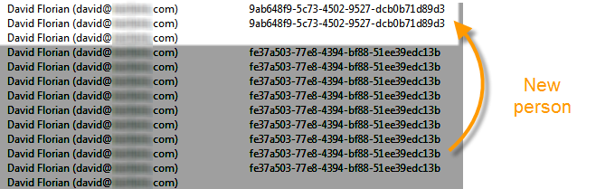

# 개인/사용자 및 수신자 {#person-people-and-recipients}

이 샘플은 Adobe Campaign에서 개인/사람과 받는 사람 간의 차이를 이해하는 데 도움이 됩니다. 다음 지표에 대한 계산 방법에 대해 자세히 설명하면서 사람과 받는 사람 간의 차이를 강조하기 위해 여러 사람에게 배달할 예정입니다.

* **[!UICONTROL Clicks]**
* **[!UICONTROL Distinct clicks for the population reached]**
* **[!UICONTROL Distinct opens for the population reached]**
* **[!UICONTROL Estimation of forwards]**
* **[!UICONTROL Raw reactivity]**

>[!NOTE]
>
>이러한 표시기는 **[!UICONTROL Tracking indicators]** 보고서에서 사용됩니다. 자세한 내용은 추적 [표시기를](#tracking-indicators)참조하십시오.

배달에는 세 개의 링크가 추가됩니다. 수신자 4명에게 전송됩니다.

* **[!UICONTROL John Davis]** :이 수신자는 이메일을 열지 않으므로 링크를 클릭하지 않습니다.
* **[!UICONTROL Marie Stuart]** :이메일이 열리지만 링크를 클릭하지는 않습니다.
* **[!UICONTROL Florian David]** :이메일을 열고 링크를 9번 클릭합니다. 그는 또한 이메일을 열고 두 번 클릭하는 사람에게 이메일을 전달한다.
* **[!UICONTROL Henry Macdonald]** :이 수신자는 쿠키를 거부하도록 인터넷 브라우저를 구성했습니다. 그는 이메일을 열고 링크를 4번 클릭한다.

다음 추적 로그가 반환됩니다.

사람과 수신자의 계산 방법에 대한 명확한 이해를 얻기 위해 각 프로필의 로그를 분석할 것입니다.

## 1단계:존 {#step-1--john}

**[!UICONTROL John Davis]** 은 이메일을 열지 않으므로 링크를 클릭하지 않습니다.

존은 이메일을 열거나 클릭하지 않았기 때문에 로그에 나타나지 않습니다.

**중간 계산:**

|  | 클릭한 받는 사람 | 클릭한 사람 | 연 받는 사람 |
|---|---|---|---|
| 존 | - | - | - |
| 중간 합계 | 0 | 0 | 0 |

## 2단계:마리 {#step-2--marie}

**[!UICONTROL Marie Stuart]** 이메일이 열리지만 링크를 클릭하지는 않습니다.

Marie의 open은 다음 로그에 표시됩니다.

열기는 수신자에게 할당됩니다.마리. 따라서 Adobe Campaign은 카운트에 새 수신자를 추가합니다.

**중간 계산:**

|  | 클릭한 받는 사람 | 클릭한 사람 | 연 받는 사람 |
|---|---|---|---|
| 존 | - | - | - |
| 마리 | - | - | +1 |
| 중간 합계 | 0 | 0 | 1 |

## 3단계:플로리안 {#step-3--florian}

**[!UICONTROL Florian David]** 이메일을 열고 링크를 9번 클릭합니다. 그는 또한 이메일을 열고 두 번 클릭하는 사람에게 이메일을 전달한다.

플로리안의 작업(한 번의 열기 및 9번의 클릭)은 다음 로그에 표시됩니다.

**받는 사람**:열기와 클릭이 동일한 수신자(플로리안)에 할당됩니다. 이 수신자는 이전 수신자(마리)와 다르므로 Adobe Campaign은 새 수신자를 카운트에 추가합니다.

사람:이 받는 사람의 브라우저가 쿠키를 승인하므로 동일한 식별자(UUID)가 모든 클릭 로그에 할당되었음을 확인할 수 있습니다. **`fe37a503 [...]`** Adobe Adobe Campaign은 이러한 클릭을 동일한 사용자에 속한 것으로 올바르게 식별합니다. 새 사람이 카운트에 추가됩니다.

**중간 계산:**

|  | 클릭한 받는 사람 | 클릭한 사람 | 연 받는 사람 |
|---|---|---|---|
| 존 | - | - | - |
| 마리 | - | - | +1 |
| 플로리안 | +1 | +1 | +1 |
| 중간 합계 | 1 | 1 | 2 |

다음 기록들은 플로리안이 이 이메일을 전달한 사람이 수행한 두 번의 클릭과 열린 것이었다:

**받는 사람**:이메일(Florian)을 전달한 수신자에게 열림 및 클릭이 할당됩니다. 이 받는 사람이 이미 계산되었으므로 받는 사람 수는 동일하게 유지됩니다.

**사람**:클릭 수와 관련하여 동일한 식별자(UUID)가 모든 로그에 할당되어 있음을 확인할 수 있습니다. **`9ab648f9 [...]`** Adobe 이 식별자는 아직 계산되지 않았습니다. 따라서 새 사람이 계산에 추가됩니다.

**중간 계산:**

|  | 클릭한 받는 사람 | 클릭한 사람 | 연 받는 사람 |
|---|---|---|---|
| 존 | - | - | - |
| 마리 | - | - | +1 |
| 플로리안 | +1 | +1 | +1 |
| 알 수 없는 사람 | - | +1 | - |
| 중간 합계 | 1 | 2 | 2 |

## 4단계:헨리 {#step-4--henry}

**[!UICONTROL Henry Macdonald]** 쿠키를 거부하도록 인터넷 브라우저를 구성했습니다. 그는 이메일을 열고 링크를 4번 클릭한다.

Henry가 수행한 열기 및 4번의 클릭이 다음 로그에 나타납니다.

**받는 사람**:열기 및 클릭 수가 동일한 수신자(Henry)에 할당됩니다. 이 수신자가 아직 카운트되지 않았기 때문에 Adobe Campaign은 카운트에 수신자를 추가합니다.

**사람**:Henry의 브라우저가 쿠키를 승인하지 않기 때문에 클릭할 때마다 새로운 식별자(UUID)가 생성됩니다. 각 4번의 클릭은 다른 사람의 클릭으로 해석됩니다. 이러한 식별자는 아직 카운트되지 않았으므로 카운트에 추가됩니다.

**중간 계산:**

|  | 클릭한 받는 사람 | 클릭한 사람 | 연 받는 사람 |
|---|---|---|---|
| 존 | - | - | - |
| 마리 | - | - | +1 |
| 플로리안 | +1 | +1 | +1 |
| 알 수 없는 사람 | - | +1 | - |
| 헨리 | +1 | +4 | +1 |
| 중간 합계 | 2 | 6 | 3 |

## 요약 {#summary}

배달 수준에서 다음과 같은 결과가 있습니다.

* **[!UICONTROL Clicks]** (클릭한 받는 사람):2
* **[!UICONTROL Distinct clicks for the population reached]** (클릭한 사람):6
* **[!UICONTROL Distinct opens for the population reached]** (연 받는 사람):3

원시 재활동 및 전달 추정은 다음과 같이 계산됩니다.

* **[!UICONTROL Estimation of forwards]** = **B - A** (따라서 6 - 2 = 4)
* **[!UICONTROL Raw reactivity]** = **A / C** (따라서 2 / 3 = 66,67%)

>[!NOTE]
>
>다음 수식에서:
>
>* A는 **[!UICONTROL Clicks]** 표시기(클릭한 받는 사람)를 나타냅니다.
>* B는 **[!UICONTROL Distinct clicks for the population reached]** 표시기(클릭한 사람)를 나타냅니다.
>* C는 **[!UICONTROL Distinct opens for the population reached]** 표시기(연 받는 사람)를 나타냅니다.