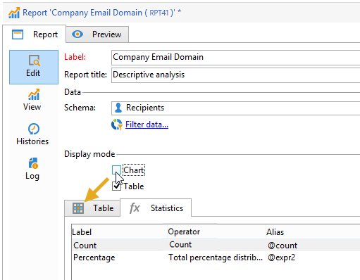

# 분석 보고서 사용{#processing-a-report}

## 분석 보고서 저장 {#saving-an-analysis-report}

적절한 권한이 있는 경우 템플릿에서 만든 분석 보고서를 저장하거나 Excel, PDF 또는 OpenOffice 형식으로 내보낼 수 있습니다.

보고서를 저장하려면 을 클릭하고 보고서에 레이블을 **[!UICONTROL Save]** 지정합니다.

보고서 내역을 만들고 저장 시 보고서 값을 보려면 **[!UICONTROL Also save data]** 선택합니다. 자세한 내용은 분석 보고서 [보관을](#archiving-analysis-reports)참조하십시오.

이 **[!UICONTROL Share this report]** 옵션을 사용하면 다른 연산자가 보고서에 액세스할 수 있습니다.

저장된 후에는 이 보고서를 다시 사용하여 다른 분석 보고서를 생성할 수 있습니다.

이 보고서를 변경하려면 Adobe Campaign 트리의 **[!UICONTROL Administration > Configuration > Adobe Campaign tree reports]** 노드(또는 연산자에 편집 권한이 있는 첫 번째 &#39;보고서&#39; 유형 폴더)를 편집합니다. 자세한 내용은 설명 분석 [보고서의](#configuring-the-layout-of-a-descriptive-analysis-report)레이아웃 구성을 참조하십시오.

## 분석 보고서 추가 설정 {#analysis-report-additional-settings}

설명 분석 보고서가 저장되면 해당 속성을 편집하고 추가 옵션에 액세스할 수 있습니다.

이러한 옵션은 표준 보고서와 동일하며 [이 페이지에](../../reporting/using/properties-of-the-report.md)자세히 설명되어 있습니다.

## 설명 분석 보고서의 레이아웃 구성 {#configuring-the-layout-of-a-descriptive-analysis-report}

설명 분석 차트 및 표에서 데이터의 표시 및 레이아웃을 개인화할 수 있습니다. 모든 옵션은 각 보고서의 **[!UICONTROL Edit]** 탭에 있는 Adobe Campaign 트리를 통해 액세스합니다.

### 분석 보고서 표시 모드 {#analysis-report-display-mode}

템플릿을 사용하여 보고서를 만들 때 기본적으로 **[!UICONTROL qualitative distribution]** 테이블 및 차트 표시 모드가 선택됩니다. 하나의 디스플레이 모드만 원하는 경우 해당 상자를 선택 취소합니다. 즉, 선택한 표시 모드의 탭만 사용할 수 있습니다.

보고서 스키마를 변경하려면 보고서 스키마를 클릭하고 데이터베이스에서 다른 **[!UICONTROL Select the link]** 테이블을 선택합니다.

### 분석 보고서 표시 설정 {#analysis-report-display-settings}

통계 및 소계를 숨기거나 표시할 수 있을 뿐만 아니라 통계의 방향을 선택할 수 있습니다.

통계를 만들 때 레이블을 개인화할 수 있습니다.

보고서에 이름이 표시됩니다.

하지만 레이블 및 하위 합계 표시 옵션을 선택 해제하면 보고서에 표시되지 않습니다. 표 셀 위로 마우스를 가져가면 도구 설명에 이름이 나타납니다.

기본적으로 통계가 온라인으로 표시됩니다. 방향을 변경하려면 드롭다운 목록에서 적절한 옵션을 선택합니다.

다음 예에서는 통계가 열에 표시됩니다.

### 분석 보고서 데이터 레이아웃 {#analysis-report-data-layout}

설명 분석 테이블에서 직접 데이터 레이아웃을 개인화할 수 있습니다. 이렇게 하려면 작업할 변수를 마우스 오른쪽 단추로 클릭합니다. 드롭다운 메뉴에서 사용 가능한 옵션을 선택합니다.

* **[!UICONTROL Pivot]** 를 클릭하여 변수의 축을 변경합니다.
* **[!UICONTROL Up]** / 를 **[!UICONTROL Down]** 줄 단위로 바꿉니다.
* **[!UICONTROL Move to the right]** / **[!UICONTROL Move to the left]** 열의 변수를 바꿉니다.
* **[!UICONTROL Turn]** 를 눌러 변수 축을 반전합니다.
* **[!UICONTROL Sort from A to Z]** 값을 낮음에서 높음으로 정렬하려면
* **[!UICONTROL Sort from Z to A]** 값을 높에서 낮음으로 정렬합니다.

   

초기 디스플레이로 돌아가려면 보기를 새로 고칩니다.

### 분석 보고서 차트 옵션 {#analysis-report-chart-options}

차트에서 데이터 표시를 개인화할 수 있습니다. 이렇게 하려면 차트 유형 선택 단계 동안 사용할 수 있는 **[!UICONTROL Variables...]** 링크를 클릭합니다.

다음 옵션을 사용할 수 있습니다.

* 창의 위쪽 섹션에서 차트 표시 영역을 수정할 수 있습니다.
* 기본적으로 레이블이 차트에 표시됩니다. 옵션을 선택 취소하여 숨길 수 **[!UICONTROL Show values]** 있습니다.
* 이 **[!UICONTROL Accumulate values]** 옵션을 사용하면 한 시리즈에서 다른 시리즈로 값을 추가할 수 있습니다.
* 차트 범례를 표시할지 여부를 결정할 수 있습니다.숨기려면 해당 옵션을 선택 취소합니다. 기본적으로 범례는 오른쪽 상단 모서리의 차트 외부에 표시됩니다.

   표시 공간에 저장하려면 차트 위에도 범례를 표시할 수 있습니다. 이렇게 하려면 옵션을 선택합니다 **[!UICONTROL Include in the chart]**

   드롭다운 목록에서 세로 및 가로 정렬을 **[!UICONTROL Caption position]** 선택합니다.

   

## 분석 보고서 내보내기 {#exporting-an-analysis-report}

분석 보고서에서 데이터를 내보내려면 드롭다운 목록을 클릭하고 원하는 출력 형식을 선택합니다.

For more on this, refer to [this page](../../reporting/using/actions-on-reports.md).

## 기존 보고서 및 분석 다시 사용 {#re-using-existing-reports-and-analyses}

Adobe Campaign에 이미 저장된 기존 보고서를 사용하여 데이터에 대한 설명 분석 보고서를 만들 수 있습니다. 이 모드는 분석이 저장되었거나 보고서가 생성되어 설명 분석 마법사를 통해 액세스하도록 구성된 경우 가능합니다.

설명 분석을 저장하는 방법을 알아보려면 분석 보고서 [저장을 참조하십시오](#saving-an-analysis-report).

설명 분석 보고서를 만들려면 작업 흐름 전환 또는 **[!UICONTROL Tools > Descriptive analysis]** 메뉴를 통해 설명 분석 마법사를 실행해야 합니다.

1. 을 선택하고 **[!UICONTROL Existing analyses and reports]** 클릭합니다 **[!UICONTROL Next]**.
1. 이렇게 하면 사용 가능한 보고서 목록에 액세스할 수 있습니다. 생성할 보고서를 선택합니다.

   

## 분석 보고서 보관 {#archiving-analysis-reports}

기존 분석을 기반으로 설명 분석을 생성할 때 아카이브를 만들어 데이터를 저장하고 보고서 결과를 비교할 수 있습니다.

내역을 생성하려면 다음 단계를 수행하십시오.

1. 기존 분석을 열거나 새로운 설명 분석 마법사를 만듭니다.
1. 보고서 표시 페이지에서 단추를 클릭하여 도구 모음에서 내역을 만든 다음 아래와 같이 확인합니다.

   

1. 이전 분석을 표시하려면 아카이브 액세스 단추를 사용합니다.

   

