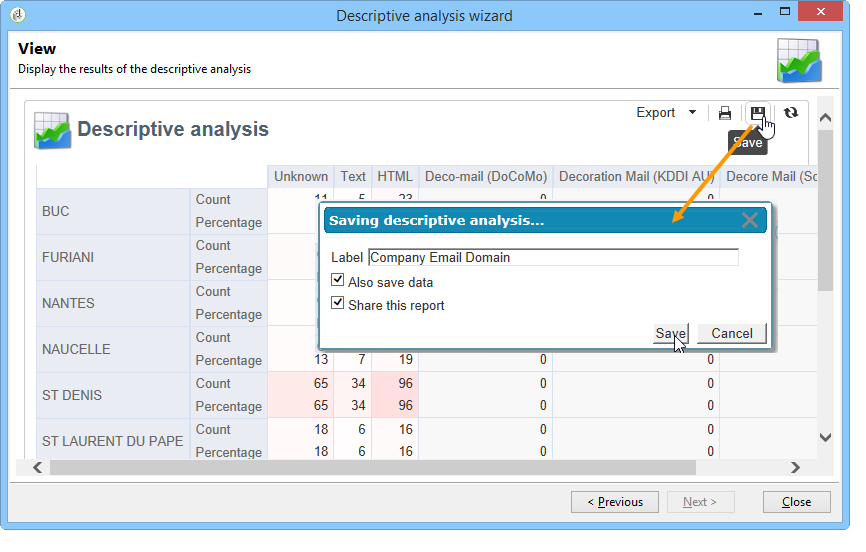
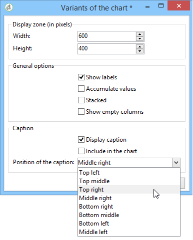

# 분석 보고서 사용{#processing-a-report}

## 분석 보고서 저장 {#saving-an-analysis-report}

적절한 권한이 있는 경우에는 템플릿에서 만든 분석 보고서를 저장하거나 Excel, PDF 또는 OpenOffice 형식으로 내보낼 수 있습니다.

보고서를 저장하려면 **[!UICONTROL Save]** 보고서에 레이블을 지정합니다.

선택 **[!UICONTROL Also save data]** 보고서의 내역을 생성하고 저장할 때 보고서의 값을 보려면, 자세한 내용은 [분석 보고서 보관](#archiving-analysis-reports).

다음 **[!UICONTROL Share this report]** 옵션을 사용하면 다른 운영자가 보고서에 액세스할 수 있습니다.

저장되면 이 보고서를 다시 사용하여 다른 분석 보고서를 생성할 수 있습니다.

이 보고서를 변경하려면 **[!UICONTROL Administration > Configuration > Adobe Campaign tree reports]** Adobe Campaign 트리의 노드(또는 연산자가 편집 권한을 가지고 있는 첫 번째 &#39;보고서&#39; 유형 폴더)입니다. 자세한 내용은 [설명 분석 보고서의 레이아웃 구성](#configuring-the-layout-of-a-descriptive-analysis-report).

## 분석 보고서 추가 설정 {#analysis-report-additional-settings}

설명 분석 보고서가 저장되면 해당 속성을 편집하고 추가 옵션에 액세스할 수 있습니다.

이러한 옵션은 표준 보고서와 동일하며, [이 페이지](../../reporting/using/properties-of-the-report.md).

## 설명 분석 보고서의 레이아웃 구성 {#configuring-the-layout-of-a-descriptive-analysis-report}

설명 분석 차트 및 테이블에서 데이터의 표시 및 레이아웃을 개인화할 수 있습니다. 모든 옵션은 Adobe Campaign 트리의 **[!UICONTROL Edit]** 각 보고서의 탭.

### 분석 보고서 표시 모드 {#analysis-report-display-mode}

를 사용하여 보고서를 만들 때 **[!UICONTROL qualitative distribution]** 기본적으로 템플릿, 테이블 및 차트 표시 모드가 선택됩니다. 하나의 디스플레이 모드만 원하는 경우 해당 상자를 선택 취소합니다. 즉, 선택한 표시 모드의 탭만 사용할 수 있습니다.

보고서의 스키마를 변경하려면 **[!UICONTROL Select the link]** 데이터베이스에서 다른 테이블을 선택합니다.

### 분석 보고서 표시 설정 {#analysis-report-display-settings}

통계 및 소계를 숨기거나 표시하고 통계의 방향을 선택할 수 있습니다.

통계를 만들 때 해당 레이블을 개인화할 수 있습니다.

해당 이름이 보고서에 표시됩니다.

그러나 레이블 및 하위 합계 표시 옵션을 선택 취소하면 보고서에 표시되지 않습니다. 테이블 셀을 마우스로 가리키면 도구 설명에 이름이 나타납니다.

기본적으로 통계가 온라인으로 표시됩니다. 방향을 변경하려면 드롭다운 목록에서 적절한 옵션을 선택합니다.

다음 예에서는 통계가 열에 표시됩니다.

### 분석 보고서 데이터 레이아웃 {#analysis-report-data-layout}

설명 분석 테이블에서 직접 데이터 레이아웃을 개인화할 수 있습니다. 이렇게 하려면 작업할 변수를 마우스 오른쪽 단추로 클릭합니다. 드롭다운 메뉴에서 사용 가능한 옵션을 선택합니다.

* **[!UICONTROL Pivot]** 변수의 축을 변경하려면 다음을 수행하십시오.
* **[!UICONTROL Up]** / **[!UICONTROL Down]** 를 눌러 변수로 바꿉니다.
* **[!UICONTROL Move to the right]** / **[!UICONTROL Move to the left]** 를 눌러 열의 변수를 바꿉니다.
* **[!UICONTROL Turn]** 변수 축을 반전
* **[!UICONTROL Sort from A to Z]** 변수 값을 낮은 값에서 높은 값으로 정렬하려면 다음을 수행하십시오.
* **[!UICONTROL Sort from Z to A]** 변수 값을 높은 값에서 낮은 값으로 정렬하려면 다음을 수행하십시오.

   

초기 디스플레이로 돌아가려면 뷰를 새로 고칩니다.

### 분석 보고서 차트 옵션 {#analysis-report-chart-options}

차트에서 데이터 표시를 개인화할 수 있습니다. 이렇게 하려면 **[!UICONTROL Variables...]** 차트 종류 선택 단계 동안 사용할 수 있는 링크입니다.

다음 옵션을 사용할 수 있습니다.

* 창의 위쪽 섹션에서 차트 표시 영역을 수정할 수 있습니다.
* 기본적으로 차트에는 레이블이 표시됩니다. 을 선택 취소하여 숨길 수 있습니다 **[!UICONTROL Show values]** 선택 사항입니다.
* 다음 **[!UICONTROL Accumulate values]** 옵션을 사용하면 한 시리즈에서 다른 시리즈로 값을 추가할 수 있습니다.
* 차트 범례를 표시할지 여부를 결정할 수 있습니다. 숨기려면 적절한 옵션을 선택 취소합니다. 기본적으로 범례가 오른쪽 상단 모서리의 차트 외부에 표시됩니다.

   표시 공간을 절약하기 위해 차트 위에 범례를 표시할 수도 있습니다. 이렇게 하려면 옵션을 선택합니다 **[!UICONTROL Include in the chart]**

   에서 세로 및 가로 정렬을 선택합니다 **[!UICONTROL Caption position]** 드롭다운 목록.

   

## 분석 보고서 내보내기 {#exporting-an-analysis-report}

분석 보고서에서 데이터를 내보내려면 드롭다운 목록을 클릭하고 원하는 출력 형식을 선택합니다.

자세한 정보는 이 [페이지](../../reporting/using/actions-on-reports.md)를 참조하십시오.

## 기존 보고서 및 분석 다시 사용 {#re-using-existing-reports-and-analyses}

Adobe Campaign에 이미 저장된 기존 보고서를 사용하여 데이터에 대한 설명 분석 보고서를 만들 수 있습니다. 이 모드는 분석이 저장되었거나 보고서가 작성되어 설명 분석 마법사를 통해 액세스하도록 구성된 경우에 사용할 수 있습니다.

설명 분석을 저장하는 방법을 알아보려면 [분석 보고서 저장](#saving-an-analysis-report).

설명 분석 보고서를 만들려면 설명 분석 마법사를 워크플로우 전환 또는 **[!UICONTROL Tools > Descriptive analysis]** 메뉴 아래의 제품에서 사용할 수 있습니다.

1. **[!UICONTROL Existing analyses and reports]**&#x200B;을(를) 선택하고 **[!UICONTROL Next]**&#x200B;을(를) 클릭합니다 .
1. 사용 가능한 보고서 목록에 액세스할 수 있습니다. 생성할 보고서를 선택합니다.

   

## 분석 보고서 보관 {#archiving-analysis-reports}

기존 분석을 기반으로 수사적 분석을 생성하는 경우 데이터를 저장하고 보고서 결과를 비교하는 아카이브를 만들 수 있습니다.

기록을 생성하려면 다음 단계를 수행합니다.

1. 기존 분석을 열거나 새 설명 분석 마법사를 만듭니다.
1. 보고서 표시 페이지에서 버튼을 클릭하여 도구 모음에서 내역을 만든 다음, 아래와 같이 확인합니다.

   

1. 보관 액세스 단추를 사용하여 이전 분석을 표시합니다.

   
