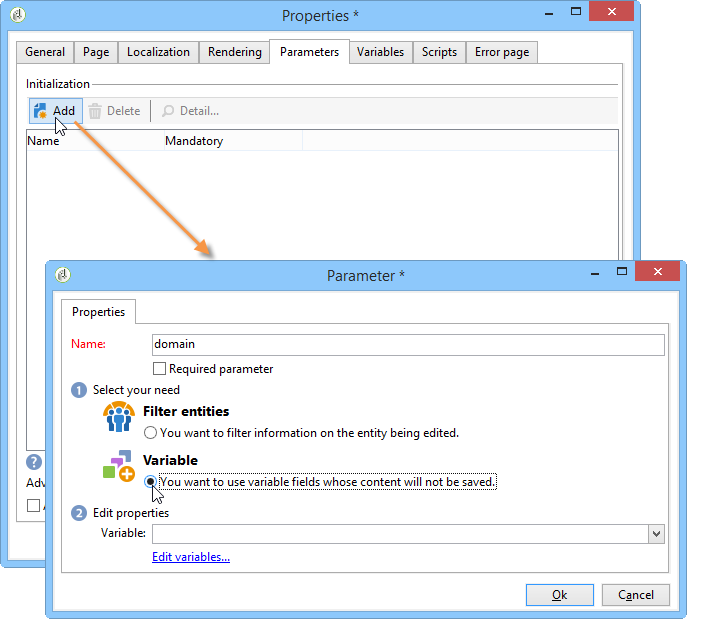

# 보고서의 속성{#properties-of-the-report}

## 개요 {#overview}

필요에 맞게 보고서를 완벽하게 개인화하고 구성할 수 있습니다. 이렇게 하려면 속성을 편집합니다. 보고서 속성은 활동 시퀀스 차트 위에 있는 속성 단추를 통해 액세스합니다.

## 전체 속성 {#overall-properties}

이 **[!UICONTROL General]** 탭에서는 보고서와 관련된 레이블과 스키마를 보거나 변경할 수 있습니다. 이러한 요소는 보고서를 만드는 동안 입력됩니다.

Adobe에서는 **[!UICONTROL Internal name]** :보고서 액세스 URL에 사용됩니다.

보고서 템플릿은 보고서 작성 중에 선택되므로 나중에 변경할 수 없습니다.

보고서에서 사용할 표를 변경하려면 필드 오른쪽에 있는 **[!UICONTROL Select link]** 아이콘을 클릭합니다 **[!UICONTROL Document type]** . 선택한 표에서 사용 가능한 필드를 보려면 **[!UICONTROL Magnifier]** 아이콘을 클릭합니다.

## 보고서 액세스 가능성 {#report-accessibility}

보고서는 웹 브라우저를 통해 Adobe Campaign 콘솔을 넘어 액세스할 수 있습니다. 이 경우, 아래와 같이 보고서 액세스 제어를 구성해야 할 수 있습니다.

전체 원칙은 다음과 같습니다.

* 이 **[!UICONTROL Anonymous access]** 옵션을 사용하면 보고서에 대한 무제한 액세스가 가능합니다. 그러나 조작은 불가능합니다.

   기본(&#39;webapp&#39;) 보고서 연산자의 권한은 보고서 요소를 표시하는 데 사용됩니다.

* 이 **[!UICONTROL Access control]** 옵션을 사용하면 Adobe Campaign 운영자가 로그온한 후 액세스할 수 있습니다.
* 이 **[!UICONTROL Specific account]** 옵션을 사용하면 필드에서 연산자의 권한을 사용하여 보고서를 실행할 수 **[!UICONTROL Operator]** 있습니다.

웹 양식 속성은 [이 페이지에](../../web/using/about-web-forms.md)자세히 설명되어 있습니다.

## 보고서 현지화 관리 {#managing-report-localization}

보고서를 변환할 언어를 구성할 수 있습니다. 이렇게 하려면 **[!UICONTROL Localization]** 탭을 클릭합니다.

편집 언어는 사용자가 쓰는 언어입니다. 언어를 추가하면 보고서 편집 페이지에 하위 탭이 나타납니다.

>[!NOTE]
>
>자세한 내용은 [이 섹션의](../../web/using/translating-a-web-form.md)해당 섹션을 참조하십시오.

## HTML 렌더링 개인화 {#personalizing-html-rendering}

이 **[!UICONTROL Rendering]** 탭에서 페이지의 데이터 표시 모드를 개인화할 수 있습니다. 다음을 선택할 수 있습니다.

* 차트 렌더링 엔진:Adobe Campaign은 차트 렌더링을 생성하기 위한 두 가지 모드를 제공합니다. 기본적으로 렌더링 엔진은 HTML 5입니다. 필요한 경우 Flash 렌더링을 선택할 수 있습니다.
* 보고서의 탐색 유형:를 클릭합니다.
* 보고서 요소에 대한 레이블의 기본 위치입니다. 이 위치는 각 요소에 대해 오버로드될 수 있습니다.
* 보고서 페이지를 생성하는 데 사용되는 템플릿 또는 테마입니다.

웹 양식 속성은 [이 페이지에](../../web/using/about-web-forms.md)자세히 설명되어 있습니다.

## 추가 설정 정의 {#defining-additional-settings}

이 **[!UICONTROL Parameters]** 탭에서는 보고서에 대한 추가 설정을 만들 수 있습니다.이러한 설정은 호출 중에 URL로 전달됩니다.

웹 양식 속성은 [이 페이지에](../../web/using/about-web-forms.md)자세히 설명되어 있습니다.

>[!CAUTION]
>
>보안상의 이유로 이러한 매개 변수는 매우 신중하게 사용해야 합니다.

새 설정을 만들려면:

1. 단추를 **[!UICONTROL Add]** 클릭하고 설정 이름을 입력합니다.

   

1. 필요한 경우 설정이 필수인지 여부를 지정합니다.
1. 만들 설정 유형을 선택합니다. **[!UICONTROL Filter]** 또는 **[!UICONTROL Variable]**.

   이 **[!UICONTROL Filter entities]** 옵션을 사용하면 데이터베이스의 필드를 매개 변수로 사용할 수 있습니다.

   

   데이터는 엔티티 수준에서 직접 복구됩니다. **ctx/recipient/@account**.

   이 **[!UICONTROL Variable]** 옵션을 사용하면 URL의 매개 변수로 전달되고 필터에 사용할 수 있는 변수를 만들거나 선택할 수 있습니다.

를 **[!UICONTROL Response HTTP headers]** 사용하면 iframe을 사용하여 HTML 페이지에 보고서의 페이지를 포함할 때 클릭재킹을 방지할 수 있습니다. 클릭재킹을 방지하려면 다음 **[!UICONTROL X-Frame-options header]** 동작을 선택할 수 있습니다.

* **[!UICONTROL None]**:보고서는 **[!UICONTROL X-Frame-options header]**&#x200B;없습니다.
* **[!UICONTROL Same as origin]**:새 보고서 및 재게시된 보고서에 대해 기본적으로 설정됩니다. 호스트 이름은 보고서의 URL과 같습니다.
* **[!UICONTROL Deny]**:iframe을 사용하여 HTML 페이지에 보고서를 포함할 수 없습니다.

## 변수 추가 {#adding-variables}

이 **[!UICONTROL Variables]** 탭에는 보고서에 구성된 변수 목록이 포함되어 있습니다. 이러한 변수는 보고서 컨텍스트에서 노출되며 계산에 사용할 수 있습니다.

단추를 클릭하여 새 변수를 만듭니다. **[!UICONTROL Add]**

변수의 정의를 보려면 변수 정의를 선택하고 **[!UICONTROL Detail...]** 단추를 클릭합니다.

## 스크립트 참조 {#referencing-scripts}

이 **[!UICONTROL Scripts]** 탭에서는 보고서 페이지가 호출될 때 클라이언트 및/또는 서버측에서 실행되는 JavaScript 코드를 참조할 수 있습니다.

클라이언트측에서 정상적으로 실행하려면 참조된 스크립트가 JavaScript로 작성되어야 하며 대부분의 브라우저와 호환되어야 합니다. For more on this, refer to [this section](../../web/using/web-forms-answers.md).

## 오류 페이지 개인화 {#personalizing-the-error-page}

이 **[!UICONTROL Error page]** 탭에서는 보고서 표시에서 오류가 발생하는 경우에 나타날 메시지를 구성할 수 있습니다.

텍스트를 정의하고 특정 식별자에 연결하여 보고서 현지화를 관리할 수 있습니다. 자세한 내용은 머리글과 [바닥글](../../reporting/using/element-layout.md#adding-a-header-and-a-footer)추가를 참조하십시오.

