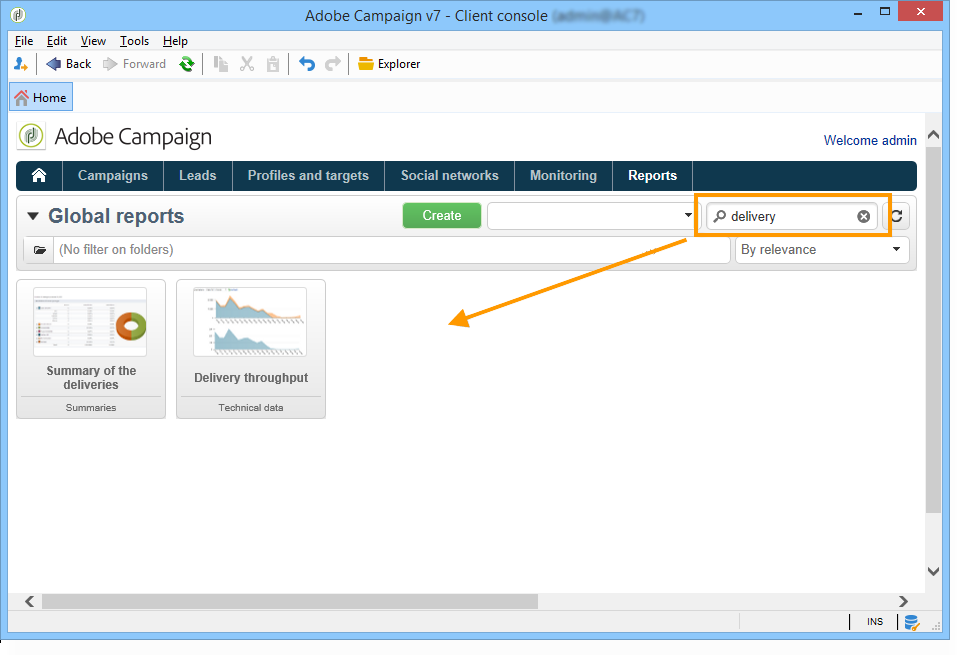

# 배달 보고서 정보{#reports-on-deliveries}

Adobe Campaign은 고객 콘솔 또는 인터넷 브라우저를 통해 액세스할 수 있는 다양한 유형의 보고서를 제공합니다.

다음 유형의 보고서를 사용할 수 있습니다.

* 전체 플랫폼에 대한 보고서는 글로벌 [보고서를](../../reporting/using/global-reports.md)참조하십시오.
* 배달 보고서(배달 [보고서](../../reporting/using/delivery-reports.md))를 참조하십시오.
* 누적 보고서는 누적 [보고서를](../../reporting/using/cumulative-reports.md)참조하십시오.

클라이언트 콘솔 홈 페이지, 보고서 대시보드 또는 배달 목록에서 보고서에 액세스할 수 있습니다. 보고서의 표시 모드는 컨텍스트에 따라 다릅니다. 기본 보고서 목록은 홈 페이지에서 사용할 수 있으며 배달 데이터에 빠르게 액세스할 수 있습니다. 이 목록은 사용자의 요구 사항에 맞게 변경할 수 있습니다. 자세한 내용은 [이 섹션을](../../reporting/using/about-reports-creation-in-campaign.md) 참조하십시오.

## 보고서 사용 {#using-reports}

검색 필드는 보고서 대시보드를 통해 목록에 있는 보고서 중 하나에 빠르게 액세스할 수 있습니다.

보고서가 생성되면 보고서 창 오른쪽의 도구 모음에서 아이콘을 사용하여 다양한 작업을 수행할 수 있습니다.

다음 작업을 수행할 수 있습니다.

* 보고서를 Excel, PDF 또는 문서 열기로 내보내기,
* 보고서 인쇄,
* 보고서 내역 만들기,
* 다른 보고서 내역 표시,
* 보고서의 데이터를 업데이트합니다.

>[!NOTE]
>
>일부 보고서는 차트(곡선, 막대, 단계 등)를 제공합니다. 커서를 차트 위로 이동하여 값을 표시합니다.

이러한 옵션에 대한 자세한 내용은 [이 섹션을](../../reporting/using/about-adobe-campaign-reporting-tools.md)참조하십시오.
