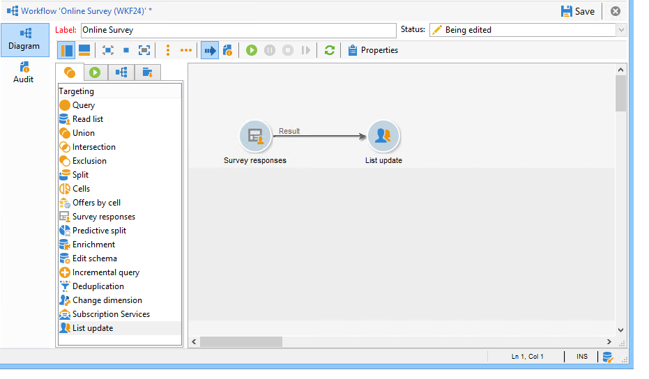
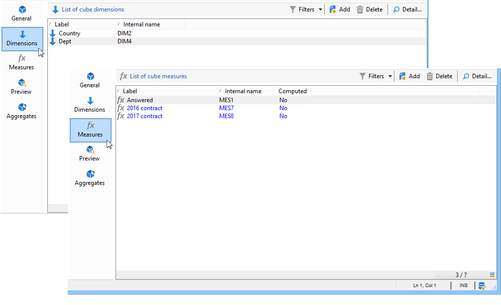

# 사용 사례:온라인 설문 조사에 대한 답변 보고서 표시{#use-case-displaying-report-on-answers-to-an-online-survey}

Adobe Campaign 설문 조사에 대한 답변은 전용 보고서를 사용하여 수집 및 분석할 수 있습니다.

다음 예에서는 온라인 설문 조사에 대한 답변을 수집하여 피벗 테이블에 표시하려고 합니다

다음 단계를 적용합니다.

1. 설문 조사에 대한 답변을 복구하여 목록에 저장하는 워크플로우를 만듭니다.
1. 목록의 데이터를 사용하여 큐브를 만듭니다.
1. 피벗 테이블로 보고서를 만들고 대답 분류를 봅니다.

이 사용 사례를 시작하기 전에 설문 조사와 분석할 수 있는 답변 세트를 액세스해야 합니다.

>[!NOTE]
>
>이 사용 사례는 설문 조사 관리자 옵션을 구입한 경우에만 **구현할 수** 있습니다. 사용권 계약을 확인하십시오.

## 1단계 - 데이터 수집 및 스토리지 워크플로우 만들기 {#step-1---creating-the-data-collection-and-storage-workflow}

설문 조사에 대한 답변을 수집하려면 다음 단계를 수행하십시오.

1. 워크플로우를 만들고 **[!UICONTROL Answers to a survey]** 활동을 배치합니다. 이 활동 사용에 대한 자세한 내용은 [이 섹션을](../../web/using/publish--track-and-use-collected-data.md#using-the-collected-data)참조하십시오.
1. 활동을 편집하고 답변이 분석될 설문 조사를 선택합니다.
1. 모든 정보를 수집하려면 **[!UICONTROL Select all the answer data]** 옵션을 활성화합니다.

   

1. 추출할 열을 선택합니다(이 경우:선택:모든 보관된 필드. 답변이 들어 있는 필드입니다.

   

1. 답변 수집 상자가 구성되면 데이터를 저장할 **[!UICONTROL List update]** 유형 활동을 배치합니다.

   

   이 활동에서 업데이트할 목록을 지정하고 **[!UICONTROL Purge and re-use the list if it exists (otherwise add to the list)]** 옵션을 선택 취소합니다.대답이 기존 표에 추가됩니다. 이 옵션을 사용하면 큐브의 목록을 참조할 수 있습니다. 목록에 연결된 스키마는 각 업데이트에 대해 다시 생성되지 않으므로 이 목록을 사용하는 큐브의 무결성을 보장합니다.

   

1. 워크플로우를 시작하여 구성을 확인합니다.

   

   지정한 목록이 만들어지고 설문 조사에 대한 답변 스키마가 포함됩니다.

1. 스케줄러를 추가하여 일별 대답 및 목록 업데이트를 자동화할 수 있습니다.

   The **[!UICONTROL List update]** and **[!UICONTROL Scheduler]** activities are detailed in.

## 단계 2 - 큐브, 해당 측정값 및 지표 생성 {#step-2---creating-the-cube--its-measures-and-its-indicators}

그런 다음 큐브를 만들고 해당 측정값을 구성할 수 있습니다.보고서에 표시될 지표를 만드는 데 사용됩니다. 큐브 만들기 및 구성에 대한 자세한 내용은 큐브 [정보를 참조하십시오](../../reporting/using/about-cubes.md).

이 예에서는 큐브가 이전에 만든 워크플로우가 제공한 목록의 데이터를 기반으로 합니다.

보고서에 표시할 차원 및 측정값을 정의합니다. 여기에서 계약 날짜와 응답자 국가를 표시하려고 합니다.

이 **[!UICONTROL Preview]** 탭에서는 보고서 렌더링을 제어할 수 있습니다.

## 3단계 - 보고서 생성 및 테이블 내 데이터 레이아웃 구성 {#step-3---creating-the-report-and-configuring-the-data-layout-within-the-table}

그런 다음 이 큐브를 기반으로 보고서를 만들고 데이터 및 정보를 처리할 수 있습니다.

필요에 따라 표시할 정보를 조정할 수 있습니다.

