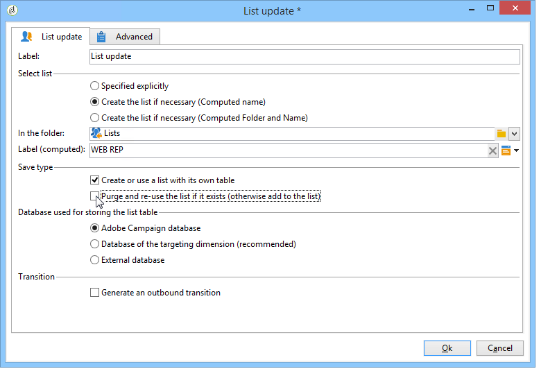

# 사용 사례: 온라인 설문 조사 응답에 대한 보고서 표시{#use-case-displaying-report-on-answers-to-an-online-survey}

Adobe Campaign 설문 조사에 대한 답변은 전용 보고서를 사용하여 수집하고 분석할 수 있습니다.

다음 예제에서는 온라인 설문 조사에 대한 답변을 수집하여 피벗 테이블에 표시하려고 합니다

다음 단계를 적용합니다.

1. 설문 조사에 대한 응답을 복구하고 목록에 저장하는 워크플로우를 만듭니다.
1. 목록의 데이터를 사용하여 큐브 생성.
1. 피벗 테이블을 사용하여 보고서를 만들고 답변 분류를 봅니다.

이 사용 사례를 시작하기 전에 분석할 수 있는 설문 조사 및 답변 세트에 액세스할 수 있어야 합니다.

>[!NOTE]
>
>이 사용 사례는 를 획득한 경우에만 구현할 수 있습니다. **설문 조사 관리자** 옵션을 선택합니다. 사용권 계약을 확인하십시오.

## 1단계 - 데이터 수집 및 저장 워크플로우 만들기 {#step-1---creating-the-data-collection-and-storage-workflow}

설문 조사에 대한 답변을 수집하려면 다음 단계를 적용합니다.

1. 워크플로우 만들기 및 배치 **[!UICONTROL Answers to a survey]** 활동. 이 활동 사용에 대한 자세한 내용은 을 참조하십시오. [이 섹션](../../surveys/using/publish--track-and-use-collected-data.md#using-the-collected-data).
1. 활동을 편집하고 분석할 답변이 있는 설문 조사를 선택합니다.
1. 활성화 **[!UICONTROL Select all the answer data]** 모든 정보를 수집하는 옵션입니다.

   

1. 추출할 열을 선택합니다(이 경우 선택: 모든 보관된 필드). 답변이 포함된 필드입니다.

   

1. 답변 컬렉션 상자가 구성되면 a를 배치합니다. **[!UICONTROL List update]** activity를 입력하여 데이터를 저장합니다.

   

   이 활동에서 업데이트할 목록을 지정하고 **[!UICONTROL Purge and re-use the list if it exists (otherwise add to the list)]** 옵션: 답변이 기존 표에 추가됩니다. 이 옵션을 사용하면 큐브의 목록을 참조할 수 있습니다. 각 업데이트에 대해 목록에 연결된 스키마가 다시 생성되지 않으므로 이 목록을 사용하는 큐브의 무결성을 보장합니다.

   

1. 워크플로우를 시작하여 구성을 확인합니다.

   

   지정된 목록이 생성되고 설문 조사 응답에 대한 스키마를 포함합니다.

1. 일별 답변 수집과 목록 업데이트를 자동화하는 스케줄러를 추가합니다.

   다음 **[!UICONTROL List update]** 및 **[!UICONTROL Scheduler]** 활동은에 자세히 설명되어 있습니다.

## 2단계 - 큐브, 큐브 측정 단위 및 큐브 표시기 만들기 {#step-2---creating-the-cube--its-measures-and-its-indicators}

그런 다음 큐브를 만들고 해당 측정 단위를 구성할 수 있습니다. 이 측정 단위는 보고서에 표시될 지표를 만드는 데 사용됩니다. 큐브 생성 및 구성에 대한 자세한 내용은 을 참조하십시오. [큐브 정보](../../reporting/using/ac-cubes.md).

이 예에서 큐브는 이전에 만든 워크플로우에서 제공한 목록의 데이터를 기반으로 합니다.

보고서에 표시할 차원 및 측정값을 정의합니다. 여기에서는 계약일자와 피신청인의 국가를 표시하고자 한다.

다음 **[!UICONTROL Preview]** 탭에서는 보고서 렌더링을 제어할 수 있습니다.

## 3단계 - 보고서 만들기 및 테이블 내 데이터 레이아웃 구성 {#step-3---creating-the-report-and-configuring-the-data-layout-within-the-table}

그런 다음 이 큐브를 기반으로 보고서를 만들고 데이터 및 정보를 처리할 수 있습니다.

필요에 따라 정보를 표시하도록 조정하십시오.

