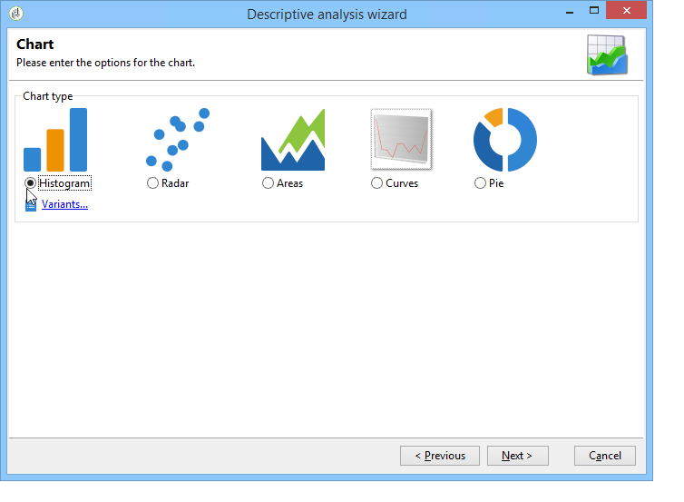
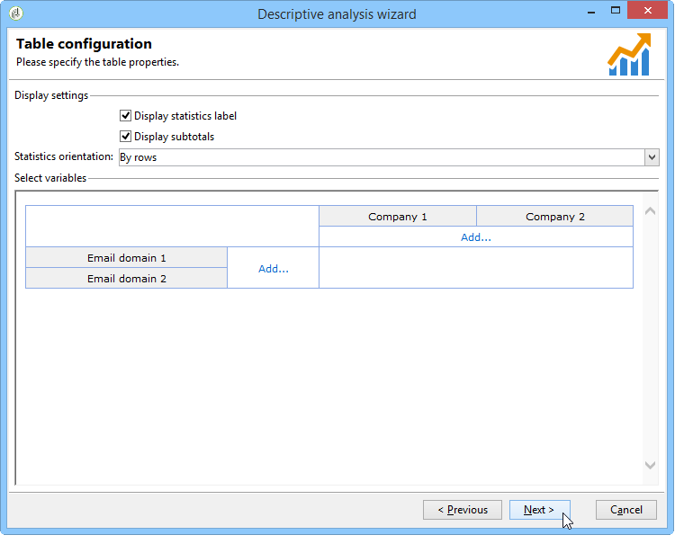
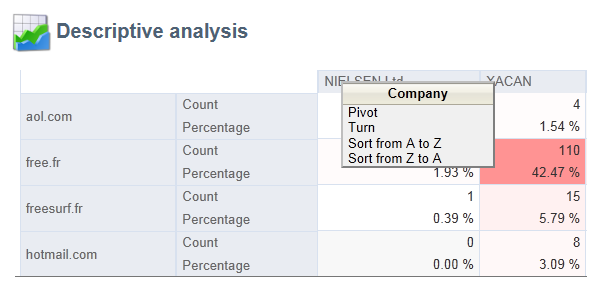

# 사용 사례{#use-cases}

## 모집단 분석 {#analyzing-a-population}

다음 예에서는 설명 분석 마법사를 사용하여 뉴스레터 세트로 타깃팅된 모집단을 탐색할 수 있습니다.

구현 단계는 아래에 자세히 설명되어 있지만 이 장의 다른 섹션에서는 전체 옵션 및 설명 목록을 사용할 수 있습니다.

### 분석할 모집단 식별 {#identifying-the-population-to-analyze}

이 예에서는 Newsletters 폴더에 포함된 게재의 대상 모집단 **을** 탐색하려고 합니다.

이 작업을 수행하려면 관련 배달을 선택한 다음 마우스 오른쪽 버튼을 클릭하고 선택합니다 **[!UICONTROL Action > Explore the target...]**.


### 분석 유형 선택 {#selecting-a-type-of-analysis}

길잡이의 첫 번째 단계에서 사용할 설명 분석 템플릿을 선택할 수 있습니다. 기본적으로 Adobe Campaign은 **[!UICONTROL Qualitative distribution]** 및 **[!UICONTROL Quantitative distribution]**. For more on this refer to the [Configuring the qualitative distribution template](../../reporting/using/using-the-descriptive-analysis-wizard.md#configuring-the-qualitative-distribution-template) section. 다양한 렌더링은 설명 분석 [정보 섹션에](../../reporting/using/about-descriptive-analysis.md) 표시됩니다.

이 예에서는 템플릿을 선택하고 **[!UICONTROL Qualitative distribution]** 차트 및 테이블(배열)이 있는 디스플레이를 선택합니다. 보고서 이름(&quot;설명 분석&quot;)을 지정하고 클릭합니다 **[!UICONTROL Next]**.


### 표시할 변수 선택 {#selecting-the-variables-to-display}

다음 단계에서는 테이블에 표시할 데이터를 선택할 수 있습니다.

표시할 데이터가 포함된 변수를 선택하려면 **[!UICONTROL Add...]** 링크를 클릭합니다. 여기에서 배달 수신자의 도시를 한 줄에 표시하려고 합니다.


열에는 회사당 구매 횟수가 표시됩니다. 이 예에서 금액은 **웹 구매** 필드에 합산됩니다.

이 경우 결과 베이닝을 정의하여 표시 내용을 명확히 표시하려고 합니다. 이렇게 하려면 **[!UICONTROL Manual]** 시작 옵션을 선택하고 표시할 세그먼트의 계산 클래스를 설정합니다.


그런 다음 을 클릭하여 구성 **[!UICONTROL Ok]** 을 승인합니다.

선과 열이 정의되면 도구 모음을 사용하여 변경하거나 이동하거나 삭제할 수 있습니다.


### 표시 형식 정의 {#defining-the-display-format}

마법사의 다음 단계에서는 생성할 차트 유형을 선택할 수 있습니다.

이 경우 막대 그래프를 선택합니다.



다른 그래픽의 가능한 구성은 [분석 보고서 차트 옵션](../../reporting/using/processing-a-report.md#analysis-report-chart-options) 섹션에 자세히 설명되어 있습니다.

### 계산할 통계 구성 {#configuring-the-statistic-to-calculate}

그런 다음 수집된 데이터에 적용할 계산을 지정합니다. 기본적으로 설명 분석 마법사는 값의 간단한 개수를 수행합니다.

이 창에서는 계산할 통계 목록을 정의할 수 있습니다.


새 통계를 만들려면 **[!UICONTROL Add]** 단추를 클릭합니다. For more on this, refer to [Statistics calculation](../../reporting/using/using-the-descriptive-analysis-wizard.md#statistics-calculation).

### 보고서 보기 및 사용 {#viewing-and-using-the-report}

마법사의 마지막 단계는 테이블과 차트를 표시합니다.

표 위의 도구 모음을 사용하여 데이터를 저장, 내보내기 또는 인쇄할 수 있습니다. 자세한 내용은 보고서 [처리를 참조하십시오](../../reporting/using/processing-a-report.md).


## 질적 데이터 분석 {#qualitative-data-analysis}

### 차트 표시 예 {#example-of-a-chart-display}

**Target**:잠재 고객 또는 고객의 위치에 대한 분석 보고서를 생성합니다.

1. 설명 분석 마법사를 열고 **[!UICONTROL Chart]** 하나만 선택합니다.

   

   이 단계 **[!UICONTROL Next]** 를 승인하려면 을 클릭합니다.

1. 그런 다음 **[!UICONTROL 2 variables]** 옵션을 선택하고 수신자 상태(잠재 고객/고객) **[!UICONTROL First variable (abscissa)]** 를 참조하게 하고 두 번째 변수가 국가를 참조하도록 지정합니다.
1. 유형으로 **[!UICONTROL Cylinders]** 선택합니다.

   

1. 을 클릭하고 기본 통계 **[!UICONTROL Next]** 를 그대로 **[!UICONTROL Simple count]** 둡니다.
1. 보고서 **[!UICONTROL Next]** 를 표시하려면 을(를) 클릭합니다.

   

   막대 위로 마우스를 가져가면 해당 국가의 정확한 고객 수 또는 잠재 고객이 표시됩니다.

1. 범례를 기반으로 한 국가 중 하나의 표시를 활성화하거나 비활성화합니다.

   

### 테이블 표시 예 {#example-of-a-table-display}

**Target**:회사 이메일 도메인 분석

1. 설명 분석 마법사를 열고 **[!UICONTROL Array]** 표시 모드만 선택합니다.

   

   이 단계를 승인하려면 **[!UICONTROL Next]** 단추를 클릭합니다.

1. 변수를 **[!UICONTROL Company]** 열로 선택하고 변수를 **[!UICONTROL Email domain]** 행으로 선택합니다.
1. 통계 방향 **[!UICONTROL By rows]** 옵션을 유지합니다.통계 계산은 **[!UICONTROL Email domain]** 변수 오른쪽에 표시됩니다.

   

   이 단계 **[!UICONTROL Next]** 를 승인하려면 을 클릭합니다.

1. 그런 다음 계산할 통계를 입력합니다.기본 카운트를 유지하고 새 통계를 만듭니다. 이렇게 하려면 을 클릭하고 연산자 **[!UICONTROL Add]** 로 **[!UICONTROL Total percentage distribution]** 선택합니다.

   

1. 보고서가 표시될 때 빈 필드가 없도록 통계 레이블을 입력합니다.

   

1. 보고서 **[!UICONTROL Next]** 를 표시하려면 을(를) 클릭합니다.

   

1. 분석 보고서가 생성되면 구성을 변경하지 않고도 필요에 맞게 디스플레이를 조정할 수 있습니다. 예를 들어 다음 축을 전환할 수 있습니다.도메인 이름을 마우스 오른쪽 단추로 클릭하고 바로 가기 메뉴 **[!UICONTROL Turn]** 에서 선택합니다.

   

   표에는 다음과 같은 정보가 표시됩니다.

   

## 양적 데이터 분석 {#quantitative-data-analysis}

**Target**:받는 사람 연령에 대한 양적 분석 보고서를 생성하려면

1. 설명 분석 마법사를 열고 드롭다운 목록 **[!UICONTROL Quantitative distribution]** 에서 선택합니다.

   

   이 단계를 승인하려면 **[!UICONTROL Next]** 단추를 클릭합니다.

1. 변수를 **[!UICONTROL Age]** 선택하고 레이블을 입력합니다. 정수인지 여부를 지정하고 을 클릭합니다 **[!UICONTROL Next]**.

   

1. 다음 **[!UICONTROL Deciles]**&#x200B;및 통계 **[!UICONTROL Distribution]** 를 **[!UICONTROL Sum]** 삭제합니다.여긴 필요 없어

   

1. 보고서 **[!UICONTROL Next]** 를 표시하려면 을(를) 클릭합니다.

   

## 워크플로우에서 전환 대상 분석 {#analyzing-a-transition-target-in-a-workflow}

**Target**:타깃팅 워크플로의 모집단 보고서를 생성하려면

1. 원하는 타깃팅 워크플로우를 엽니다.
1. 수신자 테이블을 가리키는 전환을 마우스 오른쪽 단추로 클릭합니다.
1. 드롭다운 메뉴 **[!UICONTROL Analyze target]** 에서 을 선택하여 설명 분석 창을 엽니다.

   

1. 이 시점에서는 **[!UICONTROL Existing analyses and reports]** 옵션을 선택하고 이전에 만든 보고서를 사용할 수 있습니다(기존 보고서 및 분석 [다시 사용 참조](../../reporting/using/processing-a-report.md#re-using-existing-reports-and-analyses)). 또는 새로운 설명 분석을 만들 수 있습니다. 이렇게 하려면 기본적으로 옵션을 선택한 상태로 **[!UICONTROL New descriptive analysis from a template]** 두십시오.

   나머지 구성은 모든 설명 분석과 동일합니다.

### Target 권장 사항 분석 {#target-analyze-recommendations}

워크플로우에서 모집단 분석을 수행하려면 모집단 이 전환 중에 있어야 합니다. 워크플로우가 실행되면 모집단 관련 결과가 전환에서 삭제될 수 있습니다. 분석을 실행하려면 다음 중 하나를 수행할 수 있습니다.

* 전환 대상을 대상 활동에서 분리하고 워크플로우를 시작하여 활성 상태로 만듭니다. 전환이 flash로 시작되면 평소대로 마법사를 시작합니다.

   

* 옵션을 선택하여 워크플로우의 속성을 **[!UICONTROL Keep the result of interim populations between two executions]** 수정합니다. 그러면 워크플로우가 끝난 경우에도 선택한 전환 분석을 시작할 수 있습니다.

   

   모집단이 전환에서 삭제된 경우 설명 분석 마법사를 시작하기 전에 관련 옵션을 선택하라는 오류 메시지가 표시됩니다.

   

>[!CAUTION]
>
>이 **[!UICONTROL Keep the result of interim populations between two executions]** 옵션은 개발 단계에서만 사용해야 하며 프로덕션 환경에서는 사용할 수 없습니다.\
>임시 모집단들은 그들의 보유 마감일이 되면 자동으로 삭제됩니다. 이 마감일은 워크플로우 속성 **[!UICONTROL Execution]** 탭에 지정됩니다.

## 수신자 추적 로그 분석 {#analyzing-recipient-tracking-logs}

설명 분석 마법사는 다른 작업 테이블에 대한 보고서를 생성할 수 있습니다. 즉, 전용 보고서를 만들어 배달 로그를 분석할 수 있습니다.

이 예에서는 뉴스레터 수신자의 재활동 비율을 분석하려고 합니다.

이렇게 하려면 다음 단계를 적용합니다.

1. 메뉴를 통해 설명 분석 마법사를 열고 **[!UICONTROL Tools > Descriptive analysis]** 기본 작업 테이블을 변경합니다. 필터 **[!UICONTROL Recipient tracking log]** 를 선택하고 추가하여 교정본을 제외하고 뉴스레터를 포함합니다.

   

   표 표시를 선택하고 을 클릭합니다 **[!UICONTROL Next]**.

1. 다음 창에서 분석에 배달이 포함되도록 지정합니다.

   

   여기에서 배달 레이블이 첫 번째 열에 표시됩니다.

1. 기본 카운트를 삭제하고 3개의 통계를 만들어 테이블에 표시할 통계를 구성합니다.

   여기에 각 뉴스레터에 대한 표가 표시됩니다.열기 횟수, 클릭 수, 재활동 비율(백분율)입니다.

1. 클릭 수를 계산하기 위한 통계를 추가합니다.탭에서 관련 필터를 **[!UICONTROL Filter]** 정의합니다.

   

1. 그런 다음 **[!UICONTROL General]** 탭을 클릭하여 통계 레이블과 별칭의 이름을 변경합니다.

   

1. 열기 수를 계산하기 위한 두 번째 통계를 추가합니다.

   

1. 그런 다음 **[!UICONTROL General]** 탭을 클릭하여 통계 레이블과 별칭의 이름을 변경합니다.

   

1. 세 번째 통계를 추가하고 연산자를 선택하여 재활동 비율을 **[!UICONTROL Calculated field]** 측정합니다.

   

   필드로 이동하여 **[!UICONTROL User function]** 다음 공식을 입력합니다.

   ```
   @clic / @open * 100
   ```

   다음과 같이 통계 레이블을 조정합니다.

   

   마지막으로 값을 백분율로 표시할지 여부를 지정합니다.이렇게 하려면 탭의 옵션 **[!UICONTROL Default formatting]** 을 **[!UICONTROL Advanced]** 선택 취소하고 소수점 **[!UICONTROL Percentage]** 없이 선택합니다.

   

1. 보고서 **[!UICONTROL Next]** 를 표시하려면 을(를) 클릭합니다.

   

## 배달 제외 로그 분석 {#analyzing-delivery-exclusion-logs}

분석에 배달이 포함된 경우 제외된 인구를 분석할 수 있습니다. 이렇게 하려면 분석할 배달을 선택하고 마우스 오른쪽 단추를 클릭하여 **[!UICONTROL Action > Explore exclusions]** 메뉴에 액세스합니다.


이를 통해 설명 분석 마법사로 이동하며 분석에서는 받는 사람 제외 로그에 대해 우려됩니다.

예를 들어 제외된 모든 주소의 도메인을 표시하고 제외 날짜별로 정렬할 수 있습니다.


이렇게 하면 다음과 같은 유형의 보고서가 생성됩니다.


