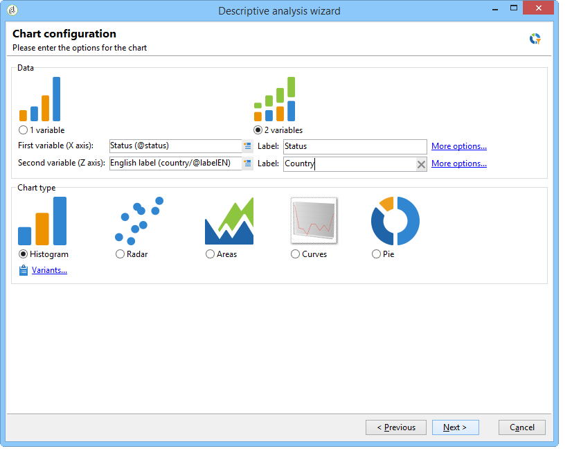
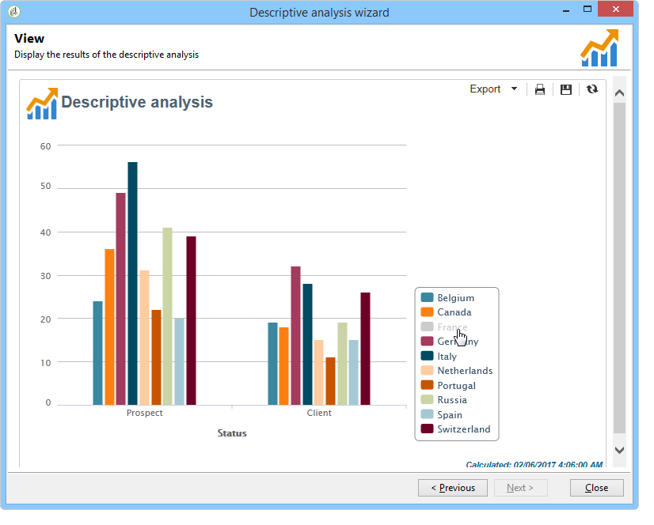
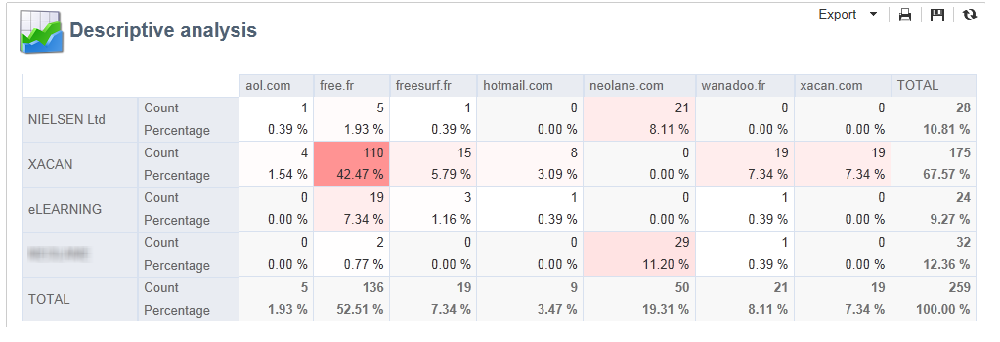
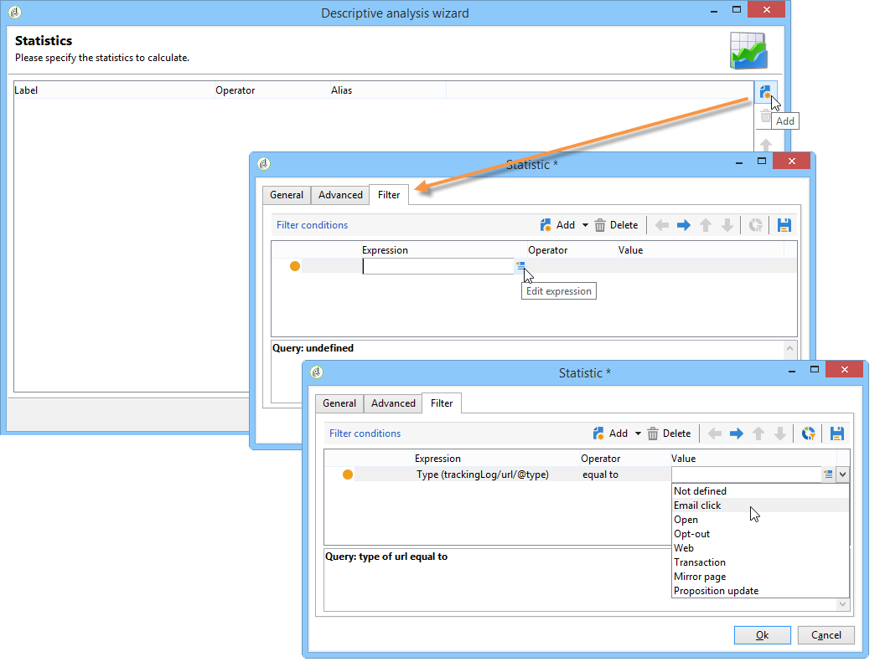

# 활용 사례{#use-cases}


## 모집단 분석 {#analyzing-a-population}

다음 예제에서는 설명 분석 마법사를 사용하여 뉴스레터 세트별로 타겟팅된 모집단을 탐색할 수 있습니다.

구현 단계는 아래에 자세히 설명되어 있으며 전체 옵션 및 설명 목록은 이 장의 다른 섹션에서 확인할 수 있습니다.

### 분석할 모집단 식별 {#identifying-the-population-to-analyze}

이 예제에서는 에 포함된 게재의 대상 모집단을 살펴보려고 합니다 **뉴스레터** 폴더를 입력합니다.

이렇게 하려면 관련 게재를 선택한 다음 마우스 오른쪽 단추를 클릭하고 을(를) 선택합니다 **[!UICONTROL Action > Explore the target...]**.


### 분석 유형 선택 {#selecting-a-type-of-analysis}

도우미의 첫 번째 단계에서 사용할 설명 분석 템플릿을 선택할 수 있습니다. 기본적으로 Adobe Campaign에서는 두 가지 템플릿을 제공합니다. **[!UICONTROL Qualitative distribution]** 및 **[!UICONTROL Quantitative distribution]**. 자세한 내용은 [질적 배포 템플릿 구성](../../reporting/using/using-the-descriptive-analysis-wizard.md#configuring-the-qualitative-distribution-template) 섹션을 참조하십시오. 다양한 렌더링은 [설명 분석 기본 정보](../../reporting/using/about-descriptive-analysis.md) 섹션을 참조하십시오.

이 예제에서는 **[!UICONTROL Qualitative distribution]** 템플릿을 사용하여 차트와 테이블(배열)이 있는 표시를 선택합니다. 보고서 이름(&quot;설명 분석&quot;)을 지정하고 **[!UICONTROL Next]**.


### 표시할 변수 선택 {#selecting-the-variables-to-display}

다음 단계에서는 테이블에 표시할 데이터를 선택할 수 있습니다.

을(를) 클릭합니다. **[!UICONTROL Add...]** 링크를 클릭하여 표시할 데이터가 포함된 변수를 선택합니다. 여기에서는 게재 수신자의 도시를 한 줄로 표시하려고 합니다.


열에는 회사당 구매 수가 표시됩니다. 이 예에서 금액은 **웹 구매** 필드.

여기에서는 결과를 정의하여 표시를 명확하게 하려고 합니다. 이렇게 하려면 **[!UICONTROL Manual]** 시작 옵션을 설정하고 표시할 세그먼트의 계산 클래스를 설정합니다.


그런 다음 **[!UICONTROL Ok]** 구성을 승인하려면 다음을 수행하십시오.

선과 열이 정의되면 도구 모음에서 변경, 이동 또는 삭제할 수 있습니다.


### 표시 형식 정의 {#defining-the-display-format}

마법사의 다음 단계에서는 생성할 차트 유형을 선택할 수 있습니다.

이 경우 히스토그램을 선택합니다.


다른 그래픽의 가능한 구성은 [분석 보고서 차트 옵션](../../reporting/using/processing-a-report.md#analysis-report-chart-options) 섹션을 참조하십시오.

### 계산할 통계 구성 {#configuring-the-statistic-to-calculate}

그런 다음 수집된 데이터에 적용할 계산을 지정합니다. 기본적으로 설명 분석 마법사는 간단한 값 개수를 수행합니다.

이 창에서는 계산할 통계 목록을 정의할 수 있습니다.


새 통계를 만들려면 **[!UICONTROL Add]** 버튼을 클릭합니다. 자세한 내용은 [통계 계산](../../reporting/using/using-the-descriptive-analysis-wizard.md#statistics-calculation).

### 보고서 보기 및 사용 {#viewing-and-using-the-report}

마법사의 마지막 단계에서 테이블과 차트가 표시됩니다.

표 위의 도구 모음을 사용하여 데이터를 저장, 내보내기 또는 인쇄할 수 있습니다. 자세한 내용은 [보고서 처리](../../reporting/using/processing-a-report.md).


## 정성 데이터 분석 {#qualitative-data-analysis}

### 차트 표시의 예 {#example-of-a-chart-display}

**Target**: 잠재 고객 또는 고객의 위치에 대한 분석 보고서를 생성합니다.

1. 설명 분석 마법사를 열고 을 선택합니다 **[!UICONTROL Chart]** 전용.

   

   클릭 **[!UICONTROL Next]** 이 단계를 승인하려면 다음을 수행하십시오.

1. 그런 다음 **[!UICONTROL 2 variables]** 옵션을 선택하고 **[!UICONTROL First variable (abscissa)]** 은 수신자 상태(잠재 고객/고객)를 참조하고 두 번째 변수는 국가를 참조합니다.
1. 선택 **[!UICONTROL Cylinders]** 유형으로 사용할 수 있습니다.

   

1. 클릭 **[!UICONTROL Next]** 기본값을 그대로 **[!UICONTROL Simple count]** 통계를 참조하십시오.
1. 클릭 **[!UICONTROL Next]** 보고서를 표시합니다.

   

   마우스로 바에 가리키면 해당 국가에 대한 정확한 고객 또는 잠재 고객 수를 확인할 수 있습니다.

1. 범례를 기반으로 한 국가 중 하나의 표시를 활성화 또는 비활성화합니다.

   

### 테이블 표시의 예 {#example-of-a-table-display}

**Target**: 회사 이메일 도메인을 분석합니다.

1. 설명 분석 마법사를 열고 을 선택합니다 **[!UICONTROL Array]** 표시 모드만 표시합니다.

   

   을(를) 클릭합니다. **[!UICONTROL Next]** 단추를 클릭하여 이 단계를 승인합니다.

1. 을(를) 선택합니다 **[!UICONTROL Company]** 변수를 열로 사용하고 **[!UICONTROL Email domain]** 변수로 식별됩니다.
1. 유지 **[!UICONTROL By rows]** 통계 방향 옵션: 통계 계산이 페이지의 오른쪽에 표시됩니다 **[!UICONTROL Email domain]** 변수를 채우는 방법을 설명합니다.

   

   클릭 **[!UICONTROL Next]** 이 단계를 승인하려면 다음을 수행하십시오.

1. 그런 다음 계산할 통계를 입력합니다. 기본 카운트를 유지하고 새 통계를 만듭니다. 이렇게 하려면 **[!UICONTROL Add]** 을(를) 선택합니다. **[!UICONTROL Total percentage distribution]** 를 반환합니다.

   

1. 보고서가 표시될 때 빈 필드가 없도록 통계에 대한 레이블을 입력합니다.

   

1. 클릭 **[!UICONTROL Next]** 보고서를 표시합니다.

   

1. 분석 보고서가 생성되면 구성을 변경하지 않고 필요에 따라 디스플레이를 조정할 수 있습니다. 예를 들어 다음 축을 전환할 수 있습니다. 도메인 이름을 마우스 오른쪽 단추로 클릭하고 를 선택합니다. **[!UICONTROL Turn]** 바로 가기 메뉴에서 을 클릭합니다.

   

   테이블에는 다음과 같은 정보가 표시됩니다.

   

## 수량 데이터 분석 {#quantitative-data-analysis}

**Target**: 수신자 연령을 정량적 분석 보고서를 생성하려면

1. 설명 분석 마법사를 열고 을 선택합니다 **[!UICONTROL Quantitative distribution]** 드롭다운 목록에서 을 선택합니다.

   

   을(를) 클릭합니다. **[!UICONTROL Next]** 단추를 클릭하여 이 단계를 승인합니다.

1. 을(를) 선택합니다 **[!UICONTROL Age]** 변수를 설정하고 해당 레이블을 입력합니다. 정수인지 여부를 지정한 다음 **[!UICONTROL Next]**.

   

1. 삭제 **[!UICONTROL Deciles]**, **[!UICONTROL Distribution]** 및 **[!UICONTROL Sum]** 통계: 여긴 필요 없어요

   

1. 클릭 **[!UICONTROL Next]** 보고서를 표시합니다.

   

## 워크플로우에서 전환 타겟 분석 {#analyzing-a-transition-target-in-a-workflow}

**Target**: 타겟팅 워크플로우의 모집단에 대한 보고서를 생성하려면

1. 원하는 타겟팅 워크플로우를 엽니다.
1. 수신자 테이블을 가리키는 전환을 마우스 오른쪽 단추로 클릭합니다.
1. 선택 **[!UICONTROL Analyze target]** 드롭다운 메뉴에서 설명 분석 창을 엽니다.

   

1. 여기에서 **[!UICONTROL Existing analyses and reports]** 옵션 및 이전에 만든 보고서를 사용합니다(참조). [기존 보고서 및 분석 다시 사용](../../reporting/using/processing-a-report.md#re-using-existing-reports-and-analyses)) 또는 새로운 설명 분석을 만듭니다. 이렇게 하려면 **[!UICONTROL New descriptive analysis from a template]** 기본적으로 선택된 옵션입니다.

   나머지 구성은 모든 설명 분석에 대해 동일합니다.

### Target 권장 사항 분석 {#target-analyze-recommendations}

워크플로우에서 모집단을 분석하려면 모집단이 여전히 전환에 있어야 합니다. 워크플로우가 실행되면 모집단 관련 결과가 전환에서 삭제될 수 있습니다. 분석을 실행하려면 다음 중 하나를 수행할 수 있습니다.

* 대상 활동에서 전환을 분리하고 워크플로우를 시작하여 활성 상태로 만듭니다. 전환이 flash로 시작되면 일반적인 방법으로 마법사를 시작합니다.

   

* 을(를) 선택하여 워크플로우의 속성을 수정합니다 **[!UICONTROL Keep the result of interim populations between two executions]** 선택 사항입니다. 워크플로우가 완료된 경우에도 선택한 전환의 분석을 시작할 수 있습니다.

   

   모집단이 전환에서 삭제된 경우 설명 분석 마법사를 시작하기 전에 관련 옵션을 선택하라는 오류 메시지가 표시됩니다.

   

>[!CAUTION]
>
>다음 **[!UICONTROL Keep the result of interim populations between two executions]** 옵션은 개발 단계에서만 사용해야 하지만 프로덕션 환경에는 사용하지 않아야 합니다.\
>보존 기간이 만료되면 임시 모집단은 자동으로 삭제됩니다. 이 마감일은 워크플로우 속성에 지정됩니다 **[!UICONTROL Execution]** 탭.

## 수신자 추적 로그 분석 {#analyzing-recipient-tracking-logs}

설명 분석 마법사는 다른 작업 테이블에 대한 보고서를 생성할 수 있습니다. 즉, 전용 보고서를 만들어 게재 로그를 분석할 수 있습니다.

이 예에서는 뉴스레터 수신자의 반응성 비율을 분석하려고 합니다.

그렇게 하려면 다음 단계를 적용합니다.

1. 를 통해 설명 분석 마법사를 엽니다 **[!UICONTROL Tools > Descriptive analysis]** 메뉴를 표시하고 기본 작업 테이블을 변경합니다. 선택 **[!UICONTROL Recipient tracking log]** 증명을 제외하고 뉴스레터를 포함할 필터를 추가합니다.

   

   표 표시를 선택하고 를 클릭합니다 **[!UICONTROL Next]**.

1. 다음 창에서 분석이 게재와 관련되도록 지정합니다.

   

   여기서는 게재 레이블이 첫 번째 열에 표시됩니다.

1. 기본 카운트를 삭제하고 3개의 통계를 만들어 테이블에 표시할 통계를 구성합니다.

   여기서는 각 뉴스레터에 대해 테이블에 다음이 표시됩니다. 열기 수, 클릭 수, 반응성 비율(백분율)

1. 클릭 수를 계산할 통계를 추가합니다. 에서 관련 필터 정의 **[!UICONTROL Filter]** 탭.

   

1. 그런 다음 **[!UICONTROL General]** 탭하여 통계 레이블 및 별칭의 이름을 변경할 수 있습니다.

   

1. 열기 수를 계산할 두 번째 통계를 추가합니다.

   

1. 그런 다음 **[!UICONTROL General]** 탭하여 통계 레이블과 해당 별칭의 이름을 변경합니다.

   

1. 세 번째 통계를 추가하고 **[!UICONTROL Calculated field]** 연산자를 사용하여 반응성 비율을 측정합니다.

   

   로 이동합니다. **[!UICONTROL User function]** 필드를 입력하고 다음 공식을 입력합니다.

   ```
   @clic / @open * 100
   ```

   다음과 같이 통계 레이블을 조정합니다.

   

   마지막으로 값을 백분율로 표시할지 여부를 지정합니다. 이렇게 하려면 선택을 취소합니다 **[!UICONTROL Default formatting]** 옵션 **[!UICONTROL Advanced]** 탭을 선택하고 **[!UICONTROL Percentage]** 소수점이 없는 경우

   

1. 클릭 **[!UICONTROL Next]** 보고서를 표시합니다.

   

## 게재 제외 로그 분석 {#analyzing-delivery-exclusion-logs}

분석에서 게재와 관련된 경우 제외된 모집단을 분석할 수 있습니다. 이렇게 하려면 분석할 게재를 선택하고 마우스 오른쪽 단추를 클릭하여 속성에 액세스합니다 **[!UICONTROL Action > Explore exclusions]** 메뉴 아래의 제품에서 사용할 수 있습니다.


이렇게 하면 설명 분석 마법사로 이동하며 분석에서 수신자 제외 로그에 문제가 발생합니다.

예를 들어 제외된 모든 주소의 도메인을 표시하고 제외 날짜별로 정렬할 수 있습니다.


이렇게 하면 다음과 같은 유형의 보고서가 생성됩니다.


