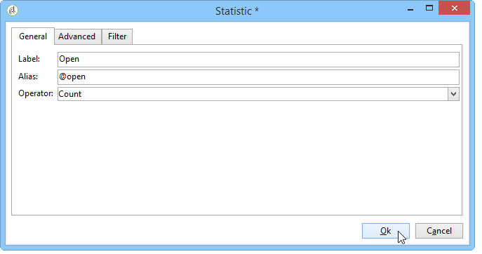

# 활용 사례{#use-cases}


## 모집단 분석 {#analyzing-a-population}

다음 예에서는 설명 분석 마법사를 사용하여 뉴스레터 세트에서 타겟팅한 모집단을 탐색할 수 있습니다.

구현 단계는 아래에 자세히 설명되어 있으며 옵션 및 설명의 전체 목록은 이 장의 다른 섹션에서 사용할 수 있습니다.

### 분석할 모집단 식별 {#identifying-the-population-to-analyze}

이 예제에서는 **Newsletters** 폴더에 포함된 게재의 대상 모집단을 살펴보고자 합니다.

이렇게 하려면 관련 게재를 선택한 다음 마우스 오른쪽 단추를 클릭하고 **[!UICONTROL Action > Explore the target...]**&#x200B;을(를) 선택합니다.


### 분석 유형 선택 {#selecting-a-type-of-analysis}

도우미의 첫 번째 단계에서는 사용할 설명 분석 템플릿을 선택할 수 있습니다. 기본적으로 Adobe Campaign에서는 **[!UICONTROL Qualitative distribution]**&#x200B;과(와) **[!UICONTROL Quantitative distribution]** 두 개의 템플릿을 제공합니다. 자세한 내용은 [정성적 배포 템플릿 구성](../../reporting/using/using-the-descriptive-analysis-wizard.md#configuring-the-qualitative-distribution-template) 섹션을 참조하세요. [설명 분석 정보](../../reporting/using/about-descriptive-analysis.md) 섹션에 다양한 렌더링이 나와 있습니다.

이 예제에서는 **[!UICONTROL Qualitative distribution]** 템플릿을 선택하고 차트 및 테이블(배열)이 있는 표시를 선택합니다. 보고서에 이름(&quot;설명 분석&quot;)을 지정하고 **[!UICONTROL Next]**&#x200B;을(를) 클릭합니다.


### 표시할 변수 선택 {#selecting-the-variables-to-display}

다음 단계에서는 표에 표시할 데이터를 선택할 수 있습니다.

표시할 데이터가 포함된 변수를 선택하려면 **[!UICONTROL Add...]** 링크를 클릭하십시오. 여기에서는 한 줄에 게재 수신자의 도시를 표시하려고 합니다.


열에는 회사당 구매 횟수가 표시됩니다. 이 예제에서는 금액이 **웹 구매** 필드에서 집계됩니다.

여기서는 결과 비닝을 정의하여 표시를 명확하게 합니다. 이렇게 하려면 **[!UICONTROL Manual]** 빈 옵션을 선택하고 표시할 세그먼트에 대한 계산 클래스를 설정하십시오.


**[!UICONTROL Ok]**&#x200B;을(를) 클릭하여 구성을 승인합니다.

선과 열이 정의되면 도구 모음을 사용하여 해당 선과 열을 변경, 이동 또는 삭제할 수 있습니다.


### 표시 형식 정의 {#defining-the-display-format}

마법사의 다음 단계에서는 생성할 차트 유형을 선택할 수 있습니다.

이 경우 히스토그램을 선택합니다.


[분석 보고서 차트 옵션](../../reporting/using/processing-a-report.md#analysis-report-chart-options) 섹션에서 다른 그래픽에 대해 가능한 구성을 자세히 설명합니다.

### 계산할 통계 구성 {#configuring-the-statistic-to-calculate}

그런 다음 수집된 데이터에 적용할 계산을 지정합니다. 기본적으로 설명 분석 마법사는 값의 간단한 카운트를 수행합니다.

이 창에서는 계산할 통계 목록을 정의할 수 있습니다.


새 통계를 만들려면 **[!UICONTROL Add]** 단추를 클릭합니다. 자세한 내용은 [통계 계산](../../reporting/using/using-the-descriptive-analysis-wizard.md#statistics-calculation)을 참조하세요.

### 보고서 보기 및 사용 {#viewing-and-using-the-report}

마법사의 마지막 단계에 테이블과 차트가 표시됩니다.

표 위에 있는 도구 모음을 사용하여 데이터를 저장, 내보내기 또는 인쇄할 수 있습니다. 자세한 내용은 [보고서 처리](../../reporting/using/processing-a-report.md)를 참조하세요.


## 정성적 데이터 분석 {#qualitative-data-analysis}

### 차트 표시의 예 {#example-of-a-chart-display}

**Target**: 잠재 고객 또는 고객의 위치에 대한 분석 보고서를 생성합니다.

1. 설명 분석 마법사를 열고 **[!UICONTROL Chart]**&#x200B;만 선택합니다.

   

   이 단계를 승인하려면 **[!UICONTROL Next]**&#x200B;을(를) 클릭하십시오.

1. 그런 다음 **[!UICONTROL 2 variables]** 옵션을 선택하고 **[!UICONTROL First variable (abscissa)]**&#x200B;이(가) 수신자 상태(잠재 고객/고객)를 참조하고 두 번째 변수가 국가를 참조하도록 지정합니다.
1. **[!UICONTROL Cylinders]**&#x200B;을(를) 형식으로 선택하십시오.

   

1. **[!UICONTROL Next]**&#x200B;을(를) 클릭하고 기본 **[!UICONTROL Simple count]** 통계를 그대로 둡니다.
1. 보고서를 표시하려면 **[!UICONTROL Next]**&#x200B;을(를) 클릭하십시오.

   

   바 위로 마우스를 가져가 이 국가의 정확한 고객 수 또는 잠재 고객을 확인하십시오.

1. 범례를 기반으로 한 국가 중 하나의 표시를 활성화 또는 비활성화합니다.

   

### 표 표시의 예 {#example-of-a-table-display}

**Target**: 회사 전자 메일 도메인을 분석합니다.

1. 설명 분석 마법사를 열고 **[!UICONTROL Array]** 표시 모드만 선택합니다.

   

   이 단계를 승인하려면 **[!UICONTROL Next]** 단추를 클릭하십시오.

1. **[!UICONTROL Company]** 변수를 열로 선택하고 **[!UICONTROL Email domain]** 변수를 행으로 선택합니다.
1. 통계 방향에 대한 **[!UICONTROL By rows]** 옵션을 유지합니다. 통계 계산은 **[!UICONTROL Email domain]** 변수의 오른쪽에 표시됩니다.

   

   이 단계를 승인하려면 **[!UICONTROL Next]**&#x200B;을(를) 클릭하십시오.

1. 그런 다음 계산할 통계를 입력합니다. 기본 수를 유지하고 새 통계를 생성합니다. 이렇게 하려면 **[!UICONTROL Add]**&#x200B;을(를) 클릭하고 **[!UICONTROL Total percentage distribution]**&#x200B;을(를) 연산자로 선택합니다.

   

1. 보고서가 표시될 때 빈 필드가 없도록 통계에 대한 레이블을 입력합니다.

   

1. 보고서를 표시하려면 **[!UICONTROL Next]**&#x200B;을(를) 클릭하십시오.

   

1. 분석 보고서가 생성되면 구성을 변경하지 않고도 사용자의 요구 사항에 맞게 표시를 조정할 수 있습니다. 예를 들어 축을 전환할 수 있습니다. 도메인 이름을 마우스 오른쪽 단추로 클릭하고 바로 가기 메뉴에서 **[!UICONTROL Turn]**&#x200B;을(를) 선택합니다.

   

   이 표에는 다음과 같은 정보가 표시됩니다.

   

## 정량적 데이터 분석 {#quantitative-data-analysis}

**대상**: 받는 사람 연령에 대한 정량적 분석 보고서를 생성합니다.

1. 설명 분석 마법사를 열고 드롭다운 목록에서 **[!UICONTROL Quantitative distribution]**&#x200B;을(를) 선택합니다.

   

   이 단계를 승인하려면 **[!UICONTROL Next]** 단추를 클릭하십시오.

1. **[!UICONTROL Age]** 변수를 선택하고 해당 레이블을 입력합니다. 정수인지 여부를 지정한 다음 **[!UICONTROL Next]**&#x200B;을(를) 클릭합니다.

   

1. **[!UICONTROL Deciles]**, **[!UICONTROL Distribution]** 및 **[!UICONTROL Sum]** 통계를 삭제하십시오. 여기에서 필요하지 않습니다.

   

1. 보고서를 표시하려면 **[!UICONTROL Next]**&#x200B;을(를) 클릭하십시오.

   

## 워크플로우에서 전환 대상 분석 {#analyzing-a-transition-target-in-a-workflow}

**Target**: 타깃팅 워크플로우의 모집단에 대한 보고서를 생성합니다.

1. 원하는 타겟팅 워크플로우를 엽니다.
1. 수신자 테이블을 가리키는 전환을 마우스 오른쪽 단추로 클릭합니다.
1. 설명 분석 창을 열려면 드롭다운 메뉴에서 **[!UICONTROL Analyze target]**&#x200B;을(를) 선택합니다.

   

1. 이 시점에서 **[!UICONTROL Existing analyses and reports]** 옵션을 선택하고 이전에 만든 보고서를 사용하거나([기존 보고서 및 분석 다시 사용](../../reporting/using/processing-a-report.md#re-using-existing-reports-and-analyses) 참조) 새 설명 분석을 만들 수 있습니다. 이렇게 하려면 기본적으로 **[!UICONTROL New descriptive analysis from a template]** 옵션을 선택한 상태로 두십시오.

   나머지 구성은 모든 설명 분석과 동일합니다.

### 타겟 분석 권장 사항 {#target-analyze-recommendations}

워크플로우의 모집단을 분석하려면 전환 시 모집단이 계속 존재해야 합니다. 워크플로우가 시작되면 모집단과 관련된 결과가 전환에서 삭제될 수 있습니다. 분석을 실행하기 위해 다음 중 하나를 수행할 수 있습니다.

* 전환을 대상 활동에서 분리하고 워크플로우를 시작하여 활성화하십시오. 전환이 깜박이기 시작하면 일반적인 방법으로 마법사를 시작합니다.

  

* **[!UICONTROL Keep the result of interim populations between two executions]** 옵션을 선택하여 워크플로우의 속성을 수정합니다. 이를 통해 워크플로우가 완료된 경우에도 선택한 전환에 대한 분석을 시작할 수 있습니다.

  

  전환에서 모집단을 삭제한 경우 설명 분석 마법사를 시작하기 전에 관련 옵션을 선택하라는 오류 메시지가 표시됩니다.

  

>[!CAUTION]
>
>**[!UICONTROL Keep the result of interim populations between two executions]** 옵션은 개발 단계에서만 사용해야 하며 프로덕션 환경에서는 사용하지 않아야 합니다.\
>보존 기한에 도달하면 중간 모집단을 자동으로 삭제합니다. 이 기한은 워크플로 속성 **[!UICONTROL Execution]** 탭에 지정됩니다.

## 수신자 추적 로그 분석 {#analyzing-recipient-tracking-logs}

설명 분석 마법사는 다른 작업 표에 대한 보고서를 생성할 수 있습니다. 즉, 전용 보고서를 만들어 게재 로그를 분석할 수 있습니다.

이 예제에서는 뉴스레터 수신자의 반응성 비율을 분석하려고 합니다.

그렇게 하려면 다음 단계를 적용합니다.

1. **[!UICONTROL Tools > Descriptive analysis]** 메뉴를 통해 설명 분석 마법사를 열고 기본 작업 표를 변경합니다. **[!UICONTROL Recipient tracking log]**&#x200B;을(를) 선택하고 필터를 추가하여 증명을 제외하고 뉴스레터를 포함하십시오.

   

   표 표시를 선택하고 **[!UICONTROL Next]**&#x200B;을(를) 클릭합니다.

1. 다음 창에서 분석이 게재와 관련됨을 지정합니다.

   

   여기에서 게재 레이블은 첫 번째 열에 표시됩니다.

1. 기본 카운트를 삭제하고 세 개의 통계를 만들어 테이블에 표시할 통계를 구성합니다.

   여기에서 각 뉴스레터에 대해 오픈 수, 클릭 수, 반응성 비율(백분율)이 표에 표시됩니다.

1. 클릭 수 계산을 위한 통계를 추가합니다. **[!UICONTROL Filter]** 탭에서 관련 필터를 정의합니다.

   

1. **[!UICONTROL General]** 탭을 클릭하여 통계 레이블 및 별칭의 이름을 바꿉니다.

   

1. 열기 수를 계산하기 위한 두 번째 통계를 추가합니다.

   

1. **[!UICONTROL General]** 탭을 클릭하여 통계 레이블 및 해당 별칭의 이름을 바꿉니다.

   

1. 세 번째 통계를 추가하고 **[!UICONTROL Calculated field]** 연산자를 선택하여 반응성 비율을 측정합니다.

   

   **[!UICONTROL User function]** 필드로 이동하여 다음 수식을 입력하십시오.

   ```
   @clic / @open * 100
   ```

   아래와 같이 통계 레이블을 조정합니다.

   

   마지막으로 값을 백분율로 표시할지 여부를 지정합니다. 이렇게 하려면 **[!UICONTROL Advanced]** 탭에서 **[!UICONTROL Default formatting]** 옵션의 선택을 취소하고 소수점 없이 **[!UICONTROL Percentage]**&#x200B;을(를) 선택하십시오.

   

1. 보고서를 표시하려면 **[!UICONTROL Next]**&#x200B;을(를) 클릭하십시오.

   

## 게재 제외 로그 분석 {#analyzing-delivery-exclusion-logs}

분석이 게재와 관련된 경우 제외된 모집단을 분석할 수 있습니다. 이렇게 하려면 분석할 게재를 선택하고 마우스 오른쪽 단추를 클릭하여 **[!UICONTROL Action > Explore exclusions]** 메뉴에 액세스합니다.


이렇게 하면 설명 분석 마법사로 이동하며 분석은 수신자 제외 로그와 관련이 있습니다.

예를 들어 제외된 모든 주소의 도메인을 표시하고 제외 날짜별로 정렬할 수 있습니다.


이렇게 하면 다음 유형의 보고서가 생성됩니다.


