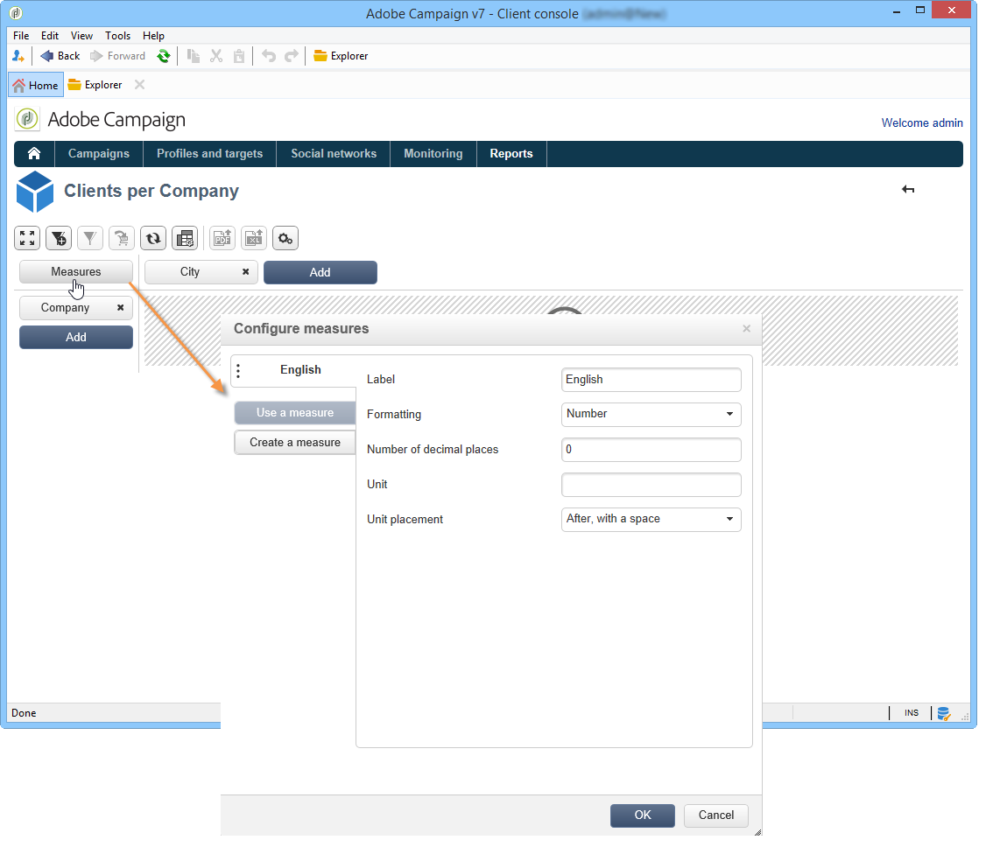

# 육면체를 사용하여 데이터 탐색{#using-cubes-to-explore-data}

Marketing Analytics를 사용하면 보고서를 더 쉽게 만들고 큐브를 통해 데이터베이스에서 데이터를 식별하고 선택할 수 있습니다. 이를 통해 다음을 수행할 수 있습니다.

* 큐브를 기반으로 보고서를 만듭니다. 이 프로세스는 다음과 같이 자세히 설명되어 있습니다.보고서에서 [데이터](#exploring-the-data-in-a-report)탐색
* 데이터베이스의 데이터를 수집하고 목록으로 그룹화하여 타겟과 전달을 식별하고 작성합니다. 자세한 내용은 타겟 [모집단](#building-a-target-population)만들기를 참조하십시오.
* 보고서에 피벗 테이블을 삽입하고 보고서의 기존 큐브를 참조합니다. 자세한 내용은 보고서에 [피벗 테이블 삽입을 참조하십시오](#inserting-a-pivot-table-into-a-report).

>[!NOTE]
>
>Marketing Analytics는 큐브를 만들거나 수정하는 데 필요합니다. 자세한 내용은 큐브 정보를 [참조하십시오](../../reporting/using/about-cubes.md).

## 보고서에서 데이터 탐색 {#exploring-the-data-in-a-report}

### 1단계 - 큐브를 기반으로 보고서 만들기 {#step-1---creating-a-report-based-on-a-cube}

큐브를 기반으로 보고서를 만들려면 **[!UICONTROL Create]** 우주의 **[!UICONTROL Reports]** 단추를 클릭하고 사용할 큐브를 선택합니다.

이 프로세스는 다음과 같이 자세히 설명되어 있습니다.큐브를 [기반으로 보고서 만들기](../../reporting/using/creating-indicators.md#creating-a-report-based-on-a-cube).

### 2단계 - 라인 및 열 선택 {#step-2---selecting-lines-and-columns}

기본 표시는 큐브의 처음 두 차원(이 경우 연령 및 도시)을 표시합니다.

각 축에 있는 **[!UICONTROL Add]** 단추를 사용하여 차원을 추가할 수 있습니다.

1. 표의 선과 열에 표시할 차원을 선택합니다. 이렇게 하려면 아래 표시된 대로 사용 가능한 차원을 드래그하여 놓습니다.
1. 목록에서 테이블에 추가할 차원을 선택합니다.

   

1. 그런 다음 이 차원의 매개변수를 선택합니다.

   

   매개변수는 선택한 차원의 데이터 유형에 따라 달라집니다.

   예를 들어 날짜의 경우 몇 가지 수준을 사용할 수 있습니다. 자세한 내용은 측정값 [표시를](../../reporting/using/concepts-and-methodology.md#displaying-measures)참조하십시오.

   이 경우 다음과 같은 옵션이 제공됩니다.

   

   다음 중 하나를 수행할 수 있습니다.

   * 로드 중 데이터 확장:보고서가 업데이트될 때마다 기본적으로 값이 표시됩니다(기본값:아니요).
   * 라인 끝에 합계를 표시합니다.데이터를 열로 표시할 때 추가 옵션을 사용하여 라인 끝에 합계를 표시할 수 있습니다.열이 표에 추가됩니다(기본값:예)
   * 정렬 적용:열 값은 값, 레이블 또는 측정값을 기준으로 정렬할 수 있습니다(기본값:값 기준).
   * 값을 오름차순(a-z, 0-9) 또는 내림차순(z-a, 9-0) 순서로 표시합니다.
   * 로드 시 표시할 열 수를 변경합니다(기본적으로:200).

1. 다음을 **[!UICONTROL Ok]** 확인하려면 클릭하십시오.차원이 기존 차원에 추가됩니다.

   표 위의 노란색 배너는 사용자가 변경한 내용을 보여 줍니다.단추를 클릭하여 **[!UICONTROL Save]** 저장합니다.

   

### 3단계 - 표시할 측정값 구성 {#step-3---configuring-the-measures-to-display}

선과 열이 배치되면 표시할 측정값과 표시 모드를 표시합니다.

기본적으로 하나의 측정단위만 표시됩니다. 측정값을 추가하거나 구성하려면:

1. 단추를 **[!UICONTROL Measures]** 클릭합니다.

   

1. 이 **[!UICONTROL Use a measure]** 단추를 사용하면 기존 측정값 중 하나를 선택할 수 있습니다.

   

   표시할 정보와 서식 유형을 선택합니다. 옵션 목록은 구성된 측정 유형에 따라 다릅니다.

   

   전체 측정 구성은 헤더의 **[!UICONTROL Edit the configuration of the pivot table]** 아이콘을 통해 사용할 수도 있습니다.

   

   그런 다음 측정값 레이블을 표시할지 여부를 선택할 수 있습니다. 자세한 내용은 디스플레이 [구성을 참조하십시오](../../reporting/using/concepts-and-methodology.md#configuring-the-display).

1. 기존 방식을 통해 새로운 방식을 구축할 수 있습니다. 이렇게 하려면 을 클릭하고 **[!UICONTROL Create a measure]** 구성합니다.

   

   다음 유형의 조치를 사용할 수 있습니다.

   * 측정 단위 조합:이 유형의 측정을 사용하면 기존 측정값을 사용하여 새 측정값을 작성할 수 있습니다.

      사용 가능한 연산자는 다음과 같습니다.합, 차이, 곱하기, 그리고 비율을 합합니다.

   * 비율:이 유형의 측정을 사용하면 주어진 차원에 대해 측정된 레코드 수를 계산할 수 있습니다. 차원이나 하위 차원을 기반으로 비례성을 계산할 수 있습니다.
   * 변형:이 측정을 사용하면 레벨 값의 변형을 계산할 수 있습니다.
   * 표준 편차:이 유형의 측정을 사용하면 값의 평균과 비교하여 각 셀 그룹 내의 편차를 계산할 수 있습니다. 예를 들어 모든 기존 세그먼트에 대한 구매 볼륨을 비교할 수 있습니다.
   생성된 측정값이 보고서에 추가됩니다.

   

   측정 단위를 생성한 후 이를 편집하고 필요한 경우 해당 구성을 변경할 수 있습니다. 이렇게 하려면 **[!UICONTROL Measures]** 단추를 클릭한 다음 편집할 측정 단위 탭으로 이동합니다.

   그런 다음 을 **[!UICONTROL Edit the dynamic measure]** 클릭하여 설정 메뉴에 액세스합니다.

## 타겟 모집단 구축 {#building-a-target-population}

큐브를 사용하여 보고서를 만들면 테이블에서 데이터를 수집하고 목록에 저장할 수 있습니다.

이렇게 하려면 장바구니에 추가한 다음 해당 컨텐츠를 처리합니다.

모집단을 목록으로 그룹화하려면 다음 단계를 적용합니다.

1. 수집할 모집단이 들어 있는 셀을 클릭하여 선택한 다음 **[!UICONTROL Add to cart]** 아이콘을 클릭합니다.

   

   다양한 프로파일을 수집하는 데 필요한 만큼

1. 내보내기를 실행하기 전에 단추를 클릭하여 컨텐츠를 봅니다. **[!UICONTROL Show cart]**

   

1. 이 **[!UICONTROL Export]** 단추를 사용하면 장바구니의 항목을 목록으로 그룹화할 수 있습니다.

   목록의 이름과 수행할 내보내기 유형을 지정해야 합니다.

   

   을 **[!UICONTROL Start]** 클릭하여 내보내기를 실행합니다.

1. 내보내기가 완료되면, 메시지가 실행과 처리된 레코드 수를 확인합니다.

   

   장바구니의 컨텐츠를 저장하거나 비울 수 있습니다.

   관련 목록은 **[!UICONTROL Profiles and targets]** 우주를 통해 액세스합니다.

   

## 보고서에 피벗 테이블 삽입 {#inserting-a-pivot-table-into-a-report}

테이블을 만들고 큐브의 데이터를 탐색하려면 다음 단계를 적용합니다.

1. 단일 페이지로 새 보고서를 만들고 여기에 피벗 테이블을 삽입합니다. For more on this, refer to [this page](../../reporting/using/creating-a-table.md#creating-a-breakdown-or-pivot-table).

   

1. 페이지의 **[!UICONTROL Data]** 탭에서 큐브를 선택하여 포함된 차원을 처리하고 계산된 측정값을 표시합니다.

   

   이렇게 하면 표시할 보고서를 만들 수 있습니다. 자세한 내용은 2단계 - [라인 및 열](#step-2---selecting-lines-and-columns)선택을 참조하십시오.

