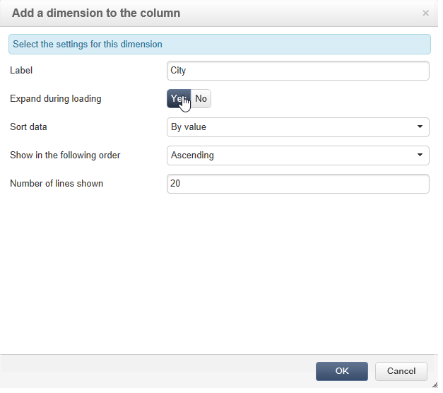
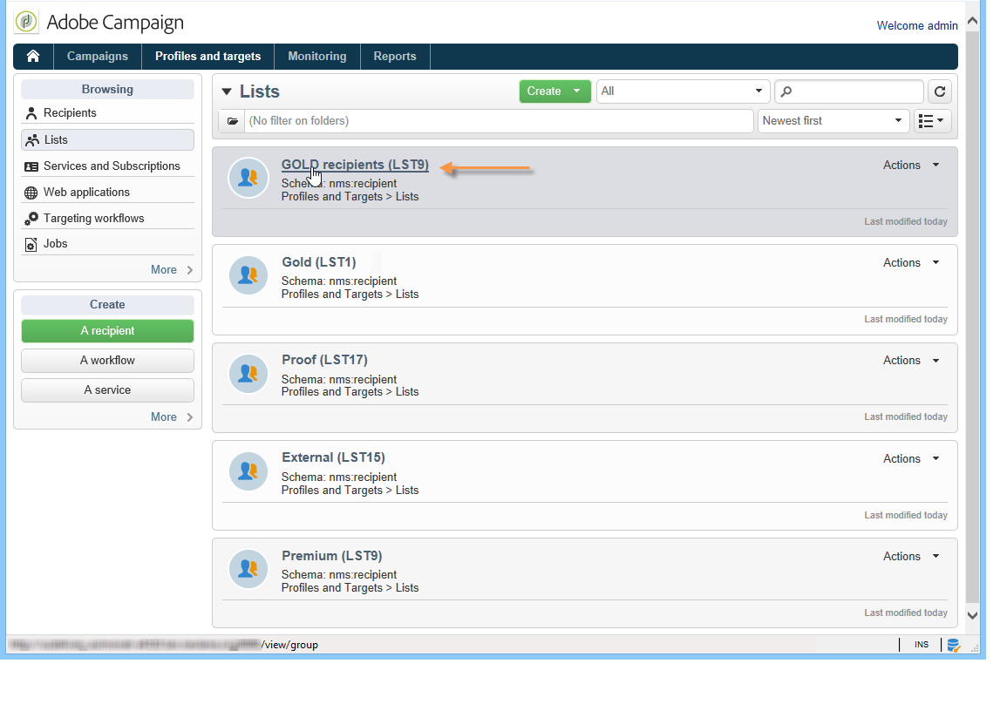

# 큐브로 데이터 탐색{#using-cubes-to-explore-data}

Marketing Analytics를 사용하면 보고서를 더 쉽게 만들고 큐브를 통해 데이터베이스에서 데이터를 식별하고 선택할 수 있습니다. 이렇게 하면 다음 작업을 수행할 수 있습니다.

* 큐브를 기반으로 보고서를 만듭니다. 프로세스는 여기에 자세히 설명되어 있습니다. [보고서의 데이터 탐색](#exploring-the-data-in-a-report).
* 데이터베이스에서 데이터를 수집하고 목록으로 그룹화합니다(예: 타겟 및 게재를 식별하고 빌드함). 자세한 내용은 다음을 참조하십시오. [대상 모집단 작성](#building-a-target-population).
* 피벗 테이블을 보고서에 삽입하고 기존 큐브를 참조합니다. 자세한 내용은 다음을 참조하십시오. [보고서에 피벗 테이블 삽입](#inserting-a-pivot-table-into-a-report).

>[!NOTE]
>
>큐브를 만들거나 수정하려면 Marketing Analytics가 필요합니다. 자세한 내용은 다음을 참조하십시오. [큐브 정보](../../reporting/using/ac-cubes.md).

## 보고서의 데이터 탐색 {#exploring-the-data-in-a-report}

### 1단계 - 큐브를 기반으로 보고서 만들기 {#step-1---creating-a-report-based-on-a-cube}

큐브를 기반으로 보고서를 만들려면 **[!UICONTROL Create]** 의 단추 **[!UICONTROL Reports]** 을(를) 탭하고 사용할 큐브를 선택합니다.

프로세스는 여기에 자세히 설명되어 있습니다. [큐브를 기반으로 보고서 만들기](../../reporting/using/creating-indicators.md#creating-a-report-based-on-a-cube).

### 2단계 - 라인 및 열 선택 {#step-2---selecting-lines-and-columns}

기본 표시에는 큐브의 처음 두 차원(이 경우 연령 및 도시)이 표시됩니다.

다음 **[!UICONTROL Add]** 각 축의 단추를 사용하면 차원을 추가할 수 있습니다.

1. 테이블의 행과 열에 표시할 차원을 선택합니다. 이렇게 하려면 아래와 같이 사용 가능한 차원을 드래그하여 놓습니다.
1. 목록에서 테이블에 추가할 차원을 선택합니다.

   

1. 그런 다음 이 차원의 매개 변수를 선택합니다.

   

   매개변수는 선택한 치수의 데이터 유형에 따라 다릅니다.

   예를 들어 날짜의 경우 여러 수준을 사용할 수 있습니다. 자세한 내용은 다음을 참조하십시오. [측정값 표시](../../reporting/using/concepts-and-methodology.md#displaying-measures).

   이 경우 다음과 같은 옵션이 제공됩니다.

   

   다음 중 하나를 수행할 수 있습니다.

   * 로드하는 동안 데이터를 확장합니다. 보고서가 업데이트될 때마다 기본적으로 값이 표시됩니다(기본값: 아니요).
   * 라인 끝에 합계 표시: 데이터가 열에 표시되면 추가 옵션을 사용하여 라인 끝에 합계를 표시할 수 있습니다. 열이 테이블에 추가됩니다(기본값: 예).
   * 정렬 적용: 열의 값은 값, 레이블 또는 측정값을 기준으로 정렬할 수 있습니다(기본값: 값 기준).
   * 오름차순(a-z, 0-9) 또는 내림차순(z-a, 9-0)으로 값을 표시합니다.
   * 로드 시 표시할 열 수를 변경합니다(기본값: 200).

1. 클릭 **[!UICONTROL Ok]** 확인: 차원이 기존 차원에 추가됩니다.

   표 위에 있는 노란색 배너는 변경 내용을 표시합니다. **[!UICONTROL Save]** 단추를 클릭하여 저장합니다.

   

### 3단계 - 표시할 측정값 구성 {#step-3---configuring-the-measures-to-display}

선과 열이 제자리에 있으면 표시할 측정값과 표시 모드를 나타냅니다.

기본적으로 측정 단위는 하나만 표시됩니다. 측정값을 추가하거나 구성하려면

1. **[!UICONTROL Measures]** 버튼을 클릭합니다.

   

1. 다음 **[!UICONTROL Use a measure]** 버튼을 사용하면 기존 측정 단위 중 하나를 선택할 수 있습니다.

   

   표시할 정보 및 서식 유형을 선택합니다. 옵션 목록은 구성된 측정 유형에 따라 다릅니다.

   

   전체 측정 구성은 를 통해서도 사용할 수 있습니다. **[!UICONTROL Edit the configuration of the pivot table]** 아이콘으로 표시됩니다.

   

   그런 다음 측정값 레이블을 표시할지 여부를 선택할 수 있습니다. 자세한 내용은 다음을 참조하십시오. [디스플레이 구성](../../reporting/using/concepts-and-methodology.md#configuring-the-display).

1. 기존의 것을 이용하여 새로운 척도를 구축할 수 있다. 이렇게 하려면 다음을 클릭하십시오. **[!UICONTROL Create a measure]** 및 를 구성합니다.

   

   다음 측정 유형을 사용할 수 있습니다.

   * 측정 조합: 이 측정 유형을 사용하면 기존 측정 단위를 사용하여 새 측정 단위를 작성할 수 있습니다.

      사용 가능한 연산자는 합계, 차이, 곱하기 및 비율입니다.

   * 비율: 이 측정 유형을 사용하면 지정된 차원에 대해 측정된 레코드 수를 계산할 수 있습니다. 차원 또는 하위 차원을 기반으로 비례성을 계산할 수 있습니다.
   * 변형: 이 측정값을 사용하여 레벨 값의 변형을 계산할 수 있습니다.
   * 표준 편차: 이 유형의 측정값을 사용하면 값의 평균과 비교하여 각 셀 그룹 내의 편차를 계산할 수 있습니다. 예를 들어 기존의 모든 세그먼트에 대한 구매 수량을 비교할 수 있습니다.

   생성된 측정값이 보고서에 추가됩니다.

   

   측정값을 만든 후에는 해당 측정값을 편집하고 필요한 경우 구성을 변경할 수 있습니다. 이렇게 하려면 **[!UICONTROL Measures]** 단추를 누른 다음 편집할 측정값의 탭으로 이동합니다.

   그런 다음 **[!UICONTROL Edit the dynamic measure]** 설정 메뉴에 액세스합니다.

## 대상 모집단 작성 {#building-a-target-population}

큐브를 사용하여 작성된 보고서를 사용하면 테이블에서 데이터를 수집하고 목록에 저장할 수 있습니다.

이렇게 하려면 장바구니에 추가하고 콘텐츠를 처리합니다.

모집단을 목록으로 그룹화하려면 다음 단계를 적용합니다.

1. 수집할 모집단을 포함하는 셀을 클릭하여 선택한 다음 **[!UICONTROL Add to cart]** 아이콘.

   

   이를 위해 필요한 만큼 여러 프로필을 수집합니다.

1. 다음을 클릭합니다. **[!UICONTROL Show cart]** 단추를 클릭하여 내보내기를 실행하기 전에 콘텐츠를 봅니다.

   

1. 다음 **[!UICONTROL Export]** 버튼을 사용하면 장바구니의 항목을 목록으로 그룹화할 수 있습니다.

   수행할 목록의 이름과 내보내기 유형을 지정해야 합니다.

   

   클릭 **[!UICONTROL Start]** 내보내기를 실행합니다.

1. 내보내기가 완료되면 실행 및 처리된 레코드 수를 확인하는 메시지가 표시됩니다.

   

   장바구니의 컨텐츠를 저장하거나 장바구니를 비울 수 있습니다.

   관련 목록은 **[!UICONTROL Profiles and targets]** 탭.

   

## 보고서에 피벗 테이블 삽입 {#inserting-a-pivot-table-into-a-report}

테이블을 만들고 큐브의 데이터를 탐색하려면 다음 단계를 적용합니다.

1. 단일 페이지로 새 보고서를 만들고 피벗 테이블을 삽입합니다. 자세한 정보는 이 [페이지](../../reporting/using/creating-a-table.md#creating-a-breakdown-or-pivot-table)를 참조하십시오.

   

1. 다음에서 **[!UICONTROL Data]** 페이지의 탭에서 큐브를 선택하여 포함된 차원을 처리하고 계산된 측정 단위를 표시합니다.

   

   이렇게 하면 표시할 보고서를 작성할 수 있습니다. 자세한 내용은 다음을 참조하십시오. [2단계 - 선 및 열 선택](#step-2---selecting-lines-and-columns).
