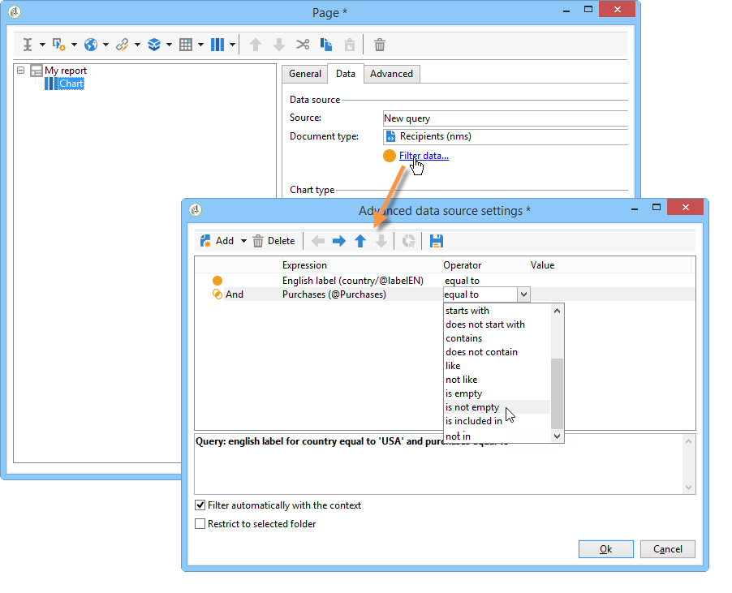

# 컨텍스트 사용{#using-the-context}

또는 형식의 데이터를 나타내려면 두 소스 **[!UICONTROL tables]** 에서 데이터를 **[!UICONTROL charts]**&#x200B;가져올 수 있습니다.새 쿼리(데이터에 대한 직접 필터 [정의 참조](#defining-a-direct-filter-on-data)) 또는 보고서 컨텍스트(컨텍스트 데이터 [를 참조하십시오](#using-context-data)).

## 데이터에 대한 직접 필터 정의 {#defining-a-direct-filter-on-data}

### 데이터 필터링 {#filtering-data}

보고서를 작성할 때 **[!UICONTROL Query]** 유형 활동을 사용해야 하는 것은 아닙니다. 보고서를 구성하는 테이블 및 차트에서 직접 데이터를 필터링할 수 있습니다.

이렇게 하면 보고서의 활동을 통해 보고서에 직접 표시할 데이터를 선택할 수 **[!UICONTROL Page]** 있습니다.

이렇게 하려면 탭에서 **[!UICONTROL Filter data...]** 링크를 **[!UICONTROL Data]** 클릭합니다.이 링크를 사용하면 표현식 편집기에 액세스하여 분석할 데이터에 대한 쿼리를 정의할 수 있습니다.

### 예:차트의 필터 사용 {#example--use-a-filter-in-a-chart}

다음 예에서는 프랑스에 거주하는 수신자 프로필과 해당 연도 동안 구매한 고객만 차트에 표시하려고 합니다.

이 필터를 정의하려면 차트에 페이지를 놓고 편집합니다. 링크를 **[!UICONTROL Filter data]** 클릭하고 표시할 데이터와 일치하는 필터를 만듭니다. Adobe Campaign에서 쿼리 작성에 대한 자세한 내용은 [이 섹션을 참조하십시오](../../platform/using/about-queries-in-campaign.md).

여기에서 선택한 수신자 구/군/시별로 분류를 표시하려고 합니다.

렌더링은 다음과 같습니다.

### 예:피벗 테이블에 필터 사용 {#example--use-a-filter-in-a-pivot-table}

이 예에서 필터를 사용하면 피벗 테이블에 다른 쿼리를 미리 사용하지 않고 비파리 고객만 표시할 수 있습니다.

다음 단계를 적용합니다.

1. 차트에 페이지를 놓고 편집합니다.
1. 피벗 테이블을 만듭니다.
1. 탭으로 **[!UICONTROL Data]** 이동하여 사용할 큐브를 선택합니다.
1. 링크를 **[!UICONTROL Filter data...]** 클릭하고 다음 쿼리를 정의하여 회사 목록에서 Adobe을 제거합니다.

   

필터링 기준을 충족하는 수신자만 보고서에 표시됩니다.

## 컨텍스트 데이터 사용 {#using-context-data}

데이터를 하나 **[!UICONTROL table]** 또는 **[!UICONTROL chart]**&#x200B;의 형식으로 나타내기 위해 보고서 컨텍스트에서 데이터를 가져올 수 있습니다.

표 또는 차트가 포함된 페이지에서 데이터 소스를 선택할 수 **[!UICONTROL Data]** 있습니다.

* 이 **[!UICONTROL New query]** 옵션을 사용하면 데이터를 수집하는 쿼리를 작성할 수 있습니다. 자세한 내용은 데이터에 [대한 직접 필터 정의를 참조하십시오](#defining-a-direct-filter-on-data).
* 이 **[!UICONTROL Context data]** 옵션을 사용하면 입력 데이터를 사용할 수 있습니다.보고서의 컨텍스트는 차트나 테이블을 포함하는 페이지의 인바운드 변환에 포함된 정보와 일치합니다. 예를 들어, 이 컨텍스트는 활동 앞에 배치된 **[!UICONTROL Query]** 활동을 통해 수집된 데이터를 포함할 수 있으며, 여기에는 **[!UICONTROL Page]** 보고서와 보고서에 관심 있는 필드를 지정해야 합니다.

예를 들어 쿼리 상자에서 수신자에 대한 다음 쿼리를 작성합니다.

그런 다음 보고서의 데이터 소스를 가리킵니다. 이 경우: **[!UICONTROL Data from the context]**.

데이터 위치는 자동으로 유추됩니다. 필요한 경우 데이터 경로를 강제 적용할 수 있습니다.

통계가 중요한 데이터를 선택하면 사용 가능한 필드는 쿼리에 지정된 데이터와 일치합니다.

