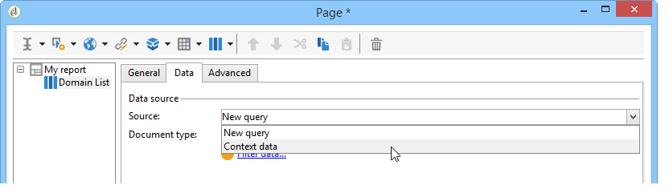

# 보고서의 컨텍스트 사용{#using-the-context}

데이터를 **[!UICONTROL tables]** 또는 **[!UICONTROL charts]** 형식으로 나타내려면 새 쿼리([데이터에 대한 직접 필터 정의](#defining-a-direct-filter-on-data) 참조) 또는 보고서 컨텍스트([컨텍스트 데이터 사용](#using-context-data) 참조), 두 원본에서 가져올 수 있습니다.

## 데이터에 대한 직접 필터 정의 {#defining-a-direct-filter-on-data}

### 데이터 필터링 {#filtering-data}

보고서를 작성할 때 **[!UICONTROL Query]** 유형 활동을 사용해야 하는 것은 아닙니다. 데이터는 보고서를 구성하는 표 및 차트에서 직접 필터링할 수 있습니다.

이렇게 하면 보고서의 **[!UICONTROL Page]** 활동을 통해 보고서에 직접 표시할 데이터를 선택할 수 있습니다.

이렇게 하려면 **[!UICONTROL Data]** 탭에서 **[!UICONTROL Filter data...]** 링크를 클릭합니다. 이 링크를 사용하면 표현식 편집기에 액세스하여 분석할 데이터에 대한 쿼리를 정의할 수 있습니다.

### 예: 차트에서 필터 사용 {#example--use-a-filter-in-a-chart}

다음 예제에서는 프랑스에 거주하고 해당 연도 동안 구매한 수신자 프로필만 차트에 표시하도록 하려고 합니다.

이 필터를 정의하려면 차트에 페이지를 배치한 다음 편집합니다. **[!UICONTROL Filter data]** 링크를 클릭하고 표시할 데이터와 일치하는 필터를 만듭니다. Adobe Campaign에서 쿼리를 작성하는 방법에 대한 자세한 내용은 [이 섹션](../../platform/using/about-queries-in-campaign.md)을 참조하세요.

여기에서는 선택한 수신자의 도시별 분류를 표시하려고 합니다.

렌더링은 다음과 같이 표시됩니다.

### 예: 피벗 테이블에서 필터 사용 {#example--use-a-filter-in-a-pivot-table}

이 예에서 필터를 사용하면 다른 쿼리를 미리 사용하지 않고 피벗 테이블에 파리가 아닌 고객만 표시할 수 있습니다.

다음 단계를 적용합니다.

1. 차트에 페이지를 배치한 다음 편집합니다.
1. 피벗 테이블을 만듭니다.
1. **[!UICONTROL Data]** 탭으로 이동하여 사용할 큐브를 선택하십시오.
1. 회사 목록에서 Adobe을 제거하려면 **[!UICONTROL Filter data...]** 링크를 클릭하고 다음 쿼리를 정의하십시오.

   

필터링 기준을 충족하는 수신자만 보고서에 표시됩니다.

## 컨텍스트 데이터 사용 {#using-context-data}

데이터를 **[!UICONTROL table]** 또는 **[!UICONTROL chart]** 형식으로 나타내기 위해 보고서 컨텍스트에서 데이터를 가져올 수 있습니다.

테이블 또는 차트가 포함된 페이지에서 **[!UICONTROL Data]** 탭을 사용하여 데이터 원본을 선택할 수 있습니다.

* **[!UICONTROL New query]** 옵션을 사용하면 데이터를 수집하기 위한 쿼리를 작성할 수 있습니다. 자세한 내용은 [데이터에 대한 직접 필터 정의](#defining-a-direct-filter-on-data)를 참조하세요.
* **[!UICONTROL Context data]** 옵션을 사용하면 입력 데이터를 사용할 수 있습니다. 보고서의 컨텍스트는 차트 또는 표를 포함하는 페이지의 인바운드 전환에 포함된 정보와 일치합니다. 예를 들어, 이 컨텍스트에는 **[!UICONTROL Page]** 활동 전에 배치된 **[!UICONTROL Query]** 활동을 통해 수집된 데이터를 포함할 수 있으며, 이에 대해 보고서와 관련된 테이블 및 필드를 지정해야 합니다.

예를 들어 쿼리 상자에서 수신자에 대해 다음 쿼리를 작성합니다.

그런 다음 보고서에 데이터 원본을 지정하십시오(이 경우: **[!UICONTROL Data from the context]**).

데이터 위치는 자동으로 추론됩니다. 필요한 경우 데이터 경로를 강제 적용할 수 있습니다.

통계가 관련된 데이터를 선택하면 사용 가능한 필드가 쿼리에 지정된 데이터와 일치합니다.

