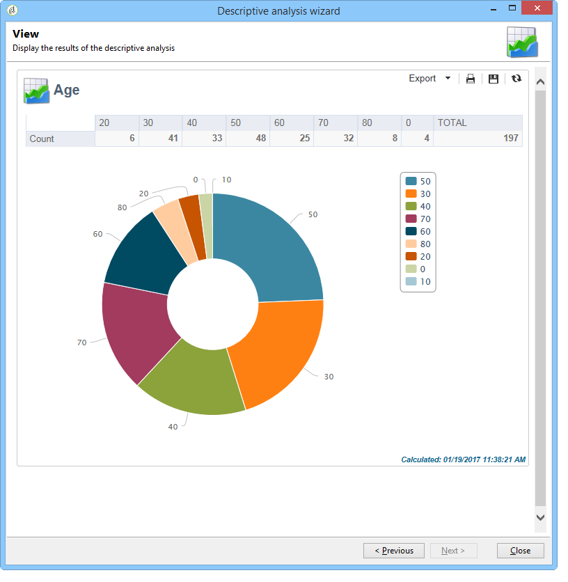
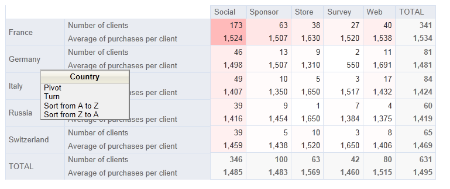

# 설명 분석 마법사 사용{#using-the-descriptive-analysis-wizard}

설명 분석 보고서를 만들려면 전용 마법사를 사용합니다. 구성은 분석할 데이터와 원하는 렌더링에 따라 달라집니다.

## 데이터베이스의 데이터 분석 {#analyzing-data-in-the-database}

설명 분석 마법사는 **[!UICONTROL Tools > Descriptive analysis]** 메뉴를 통해 실행할 수 있습니다.이 경우 분석은 기본적으로 받는 사람(**nms:recipient**)에게 영향을 줍니다. Adobe Campaign 데이터베이스의 모든 데이터에 적용됩니다.

표준 받는 사람 하나(**nms:recipient**)가 아닌 테이블을 분석하려면 마법사의 마지막 단계에서 **[!UICONTROL Advanced settings...]** 링크를 클릭하고 설정과 일치하는 테이블을 선택합니다(이 경우 **cus:individual**:

데이터의 일부에 대한 통계를 만들려면 필터를 정의할 수 있습니다.이렇게 하려면 아래 표시된 대로 **[!UICONTROL Advanced settings...]** 링크를 클릭하고 적용할 필터를 정의합니다.

이 분석은 런던 거주 16세 이상의 데이터베이스 수신자에게만 문제가 될 것이다.

## 데이터 집합 분석 {#analyzing-a-set-of-data}

다른 컨텍스트를 통해 설명 분석 마법사를 사용할 수 있습니다.목록, 워크플로우 전환, 하나 이상의 전달, 수신자 선택 등

수신자 테이블을 가리키는 Adobe Campaign 트리의 여러 노드를 통해 액세스할 수 있습니다.

항목을 선택하고 마우스 오른쪽 단추를 클릭하여 설명 분석 마법사를 엽니다. 선택한 데이터만 분석됩니다.

* 받는 사람 **집합에 대해 분석할 받는 사람을 선택한 다음 마우스 오른쪽 단추를 클릭하고 위에 표시된****[!UICONTROL Actions > Explore...]**&#x200B;대로 선택합니다. 받는 사람 목록에 필터가 적용되면 해당 컨텐츠만 분석됩니다.

   폴더 또는 현재 필터의 모든 수신자를 선택하려면 CTRL+A 단축키를 사용합니다. 이는 표시되지 않은 받는 사람까지도 선택됨을 의미합니다.

   수신자를 설명하는 분석의 예는 다음을 참조하십시오. [질적 데이터 분석](../../reporting/using/use-cases.md#qualitative-data-analysis).

* 워크플로우 **컨텍스트에서**&#x200B;수신자 테이블을 가리키는 전환 위에 커서를 놓고 마우스 오른쪽 단추를 클릭하고 선택합니다 **[!UICONTROL Analyze target]**. 자세한 내용은 워크플로우에서 전환 대상 [분석의 예를 참조하십시오](../../reporting/using/use-cases.md#analyzing-a-transition-target-in-a-workflow).
* 목록 **에**&#x200B;대해 하나 이상의 목록을 선택하고 수신자와 동일한 프로세스를 적용합니다.
* 배달 **컨텍스트에서, 분석할 대상이 있는**&#x200B;배달을 선택하고 마우스 오른쪽 단추를 클릭한 후 아래 **[!UICONTROL Actions > Explore the target]**&#x200B;와 같이 선택합니다.

   

   게재에 대한 설명 분석의 예는 다음과 같습니다. [모집단 분석](../../reporting/using/use-cases.md#analyzing-a-population) 및 위치: [수신자 추적 로그를 분석합니다](../../reporting/using/use-cases.md#analyzing-recipient-tracking-logs).

## 질적 배포 템플릿 구성 {#configuring-the-qualitative-distribution-template}

템플릿을 사용하면 모든 데이터 유형(예: 회사 이름, 이메일 도메인)에 대한 통계를 만들 수 있습니다. **[!UICONTROL Qualitative distribution]**

템플릿을 통해 만든 보고서에 사용할 수 있는 구성 옵션은 테이블의 데이터 표시 **[!UICONTROL Qualitative distribution]** 에 자세히 설명되어 있습니다 . 전체 예는 인구 [분석에서 자세히 설명합니다](../../reporting/using/use-cases.md#analyzing-a-population).

설명 분석 마법사를 사용하여 데이터를 분석할 때 사용 가능한 옵션은 선택한 설정에 따라 다릅니다. 아래에 자세히 나와 있습니다.

### 데이터 시작 {#data-binning}

표시할 변수를 선택할 때 선택한 데이터에 대한 그룹화 기준을 구성하는 방식으로 데이터 베이닝을 정의할 수 있습니다.

>[!NOTE]
>
>계산으로 관련된 필드가 합계를 사용하여 계산되면 성능 개선 **[!UICONTROL The data is already aggregated]** 을 확인하십시오.

필드의 내용에 따라 옵션이 달라집니다.

* **[!UICONTROL None]** :이 옵션을 사용하면 변수를 사용하지 않고 사용할 수 있는 모든 값을 표시할 수 있습니다.

   >[!CAUTION]
   >
   >이 옵션은 주의해서 사용해야 합니다.보고서 및 시스템 성능에 큰 영향을 줄 수 있습니다.

* **[!UICONTROL Auto]** :이 옵션을 사용하면 가장 자주 표현되는 값 n개를 표시할 수 있습니다. 이 변수들은 자동으로 계산되며, 각 변수는 저장소 수와 비교하여 변수의 백분율을 나타냅니다. 숫자 값의 경우, Adobe Campaign은 데이터를 정렬하기 위해 자동으로 n 클래스를 생성합니다.
* **[!UICONTROL Manual]** :이 옵션은 이러한 값을 수동으로 설정할 수 있다는 점을 제외하고 **[!UICONTROL Auto]** 옵션과 동일하게 작동합니다. 이렇게 하려면 값 테이블 오른쪽에 있는 **[!UICONTROL Add]** 단추를 클릭합니다.

   개인화를 시작하기 전에 Adobe Campaign이 값을 자동으로 초기화할 수 있습니다.이렇게 하려면 생성할 저장소 수를 입력하고 아래와 같이 **[!UICONTROL Initialize with]** 링크를 클릭합니다.

   

   고객의 요구 사항에 맞게 컨텐츠를 조정할 수 있습니다.

   

   원하는 정밀도 수준에 따라 날짜가 포함된 필드를 시간, 일, 월, 년 등으로 그룹화할 수 있습니다.

   

* **[!UICONTROL Modulo]** :숫자 값의 경우 값 그룹을 만들 수 있습니다. 예를 들어 값이 10인 모듈에서는 10씩 변경되는 값의 간격을 만들 수 있습니다.

   

   이 예에서는 연령 그룹별 수신자 분류를 볼 수 있습니다.

   

### 테이블에 데이터 표시 {#displaying-data-in-the-table}

도구 모음을 사용하여 표의 변수 표시를 개인화합니다.열을 삭제하거나, 열이 아닌 줄로 데이터를 표시하고, 열을 왼쪽 또는 오른쪽으로 이동하거나, 값 계산을 보거나 변경합니다.

창의 위쪽 섹션에서 표시 설정을 선택할 수 있습니다.

통계 이름 및 소계를 표시하거나 숨길 수 있으며 통계의 방향을 선택할 수 있습니다. 자세한 내용은 [분석 보고서 표시 설정을 참조하십시오](../../reporting/using/processing-a-report.md#analysis-report-display-settings).

### 차트에 데이터 표시 {#displaying-data-in-the-chart}

설명 분석 마법사의 첫 번째 단계에서는 테이블 없이 차트 양식으로만 데이터를 표시하도록 선택할 수 있습니다. 이 경우 그래픽을 구성할 때 변수를 선택해야 합니다. 먼저 표시할 변수의 수를 선택하고 관련 데이터베이스에서 필드를 선택해야 합니다.

그런 다음 원하는 차트 유형을 선택합니다.

>[!NOTE]
>
>차트와 표에 변수를 동시에 표시할 수 있습니다. 이렇게 하려면 **[!UICONTROL Table configuration]** 창에 변수를 입력합니다. 차트 구성 창 **[!UICONTROL Next]** 에서 차트 유형을 클릭하고 선택합니다. 하위 차원이 테이블에 정의된 경우 차트에 표시되지 않습니다.

차트 속성을 수정하려면 **[!UICONTROL Variants]** 링크를 클릭합니다.

제공되는 옵션은 선택한 차트 유형에 따라 다릅니다. 자세한 정보는 [이 페이지](../../reporting/using/creating-a-chart.md#chart-types-and-variants)를 참조하십시오.

### 통계 계산 {#statistics-calculation}

설명 분석 마법사를 사용하면 데이터에 대한 여러 유형의 통계를 계산할 수 있습니다. 기본적으로 하나의 간단한 카운트만 구성됩니다.

Click **[!UICONTROL Add]** to create a new statistic.

다음 작업을 수행할 수 있습니다.

* **[!UICONTROL Count]** 합계 필드의 중복 값(합계 필드)을 포함하여, 수집할 필드의 null이 아닌 모든 값을 카운트하려면
* **[!UICONTROL Average]** 숫자 필드에 있는 값의 평균을 계산하려면
* **[!UICONTROL Minimum]** 숫자 필드의 최소값을 계산하려면
* **[!UICONTROL Maximum]** 숫자 필드의 최대값을 계산하려면
* **[!UICONTROL Sum]** 숫자 필드에 있는 값의 합을 계산하려면
* **[!UICONTROL Standard deviation]** 반환되는 값이 평균에 어떻게 분산되는지 계산하려면,
* **[!UICONTROL Row percentage distribution]** to calculate the ratio of a column and the value in a row (available for tables),
* **[!UICONTROL Column percentage distribution]** 행의 값 대 열의 값 비율(테이블에만 사용 가능)을 계산하려면
* **[!UICONTROL Total percentage distribution]** 값을 기준으로 받는 사람의 분포를 계산하려면

   

* **[!UICONTROL Calculated field]** 를 클릭하여 개인화된 연산자를 만듭니다(테이블에만 사용 가능). 이 **[!UICONTROL User function]** 필드를 사용하면 데이터에 적용할 계산을 입력할 수 있습니다.

   예:국가 및 출처를 기준으로 고객당 평균 구매 금액 계산

   

   위 정보를 표에 표시하려면 고객당 평균 구매 금액을 저장하기 위한 계산된 필드를 만들어야 합니다.

   방법은 다음과 같습니다.

   1. 구매 합계를 계산합니다.

      

   1. 이 통계는 표에 표시되지 않습니다. 탭의 옵션 **[!UICONTROL Display in the table]** 을 **[!UICONTROL Advanced]** 선택 취소해야 합니다.

      

   1. 새 **[!UICONTROL Calculated field]** 유형 통계를 생성하고 필드에 다음 공식을 **[!UICONTROL User function]** 입력합니다. **@purchases/@count**.

      

### 보고서 표시 {#displaying-the-report}

마법사의 마지막 단계에서는 보고서(예: 구성된 표 또는 차트)를 표시할 수 있습니다.

보고서에 표가 있으면 계산 결과 셀에 색상이 지정됩니다. 결과가 높을수록 색상이 더 강해집니다.

결과 레이아웃을 변경할 수 있습니다. 이렇게 하려면 관련 변수를 마우스 오른쪽 단추로 클릭하고 바로 가기 메뉴에서 입력을 선택합니다.

보고서에 차트가 포함되어 있으면 범례의 레이블을 사용하여 표시되는 정보를 필터링할 수 있습니다.차트를 활성화/비활성화하려면 레이블을 클릭합니다.

## 수량 배포 템플릿 구성 {#configuring-the-quantitative-distribution-template}

설명 분석을 직접 생성하려면 기본적으로 설정되지 않은 경우 템플릿에서 **새 설명 분석** 옵션을 선택합니다.

측정 또는 계산될 수 있는 데이터(예: 송장 금액, 수신자 연령)에 대한 통계를 생성할 수 있는 템플릿입니다. **[!UICONTROL Quantitative distribution]**

템플릿을 통해 생성된 분석 보고서의 구성 모드는 구현 예제 **[!UICONTROL Quantitative distribution]** 수량 데이터 분석에서 자세히 설명합니다 .

설명 분석 마법사를 사용하여 양적 보고서를 만들 때 사용할 수 있는 옵션은 아래에 자세히 설명되어 있습니다.

계산에서 중요한 변수를 선택하여 시작합니다.

기본적으로, Adobe Campaign은 선택한 데이터에 대해 계산될 일련의 통계를 제공합니다. 필요에 따라 이 목록을 변경하거나, 목록에 추가하거나, 통계를 삭제할 수 있습니다.

다음 작업을 수행할 수 있습니다.

* **[!UICONTROL Count]** 합계 필드의 중복 값(합계 필드)을 포함하여, 수집할 필드의 null이 아닌 모든 값을 카운트하려면
* **[!UICONTROL Average]** 숫자 필드에 있는 값의 평균을 계산하려면
* **[!UICONTROL Minimum]** 숫자 필드의 최소값을 계산하려면
* **[!UICONTROL Maximum]** 을 사용하여 숫자 필드에 있는 값의 최대값을 계산합니다.
* **[!UICONTROL Sum]** 숫자 필드에 있는 값의 합을 계산하려면
* **[!UICONTROL Standard deviation]** 반환되는 값이 평균을 기준으로 배포되는 방식을 계산하기 위해.
* **[!UICONTROL Number of missing values]** 을 클릭하여 정의된 값이 없는 숫자 필드 수를 계산합니다.
* **[!UICONTROL Decile distribution]** 반환되는 값을 배포하려면 각 값이 숫자 필드에 있는 값의 1/10을 나타내도록 하십시오.
* **[!UICONTROL Custom distribution]** 사용자 정의 임계값을 기준으로 반환된 값을 배포하려면 다음을 수행합니다.

   이 **[!UICONTROL Detail...]** 단추를 사용하여 통계를 편집하고 필요한 경우 계산 또는 표시를 개인화할 수 있습니다.

   

   마법사의 마지막 단계에서는 수량 분석 보고서가 표시됩니다.

   

   보고서를 변경하려면 보고서 [처리를 참조하십시오](../../reporting/using/processing-a-report.md).

