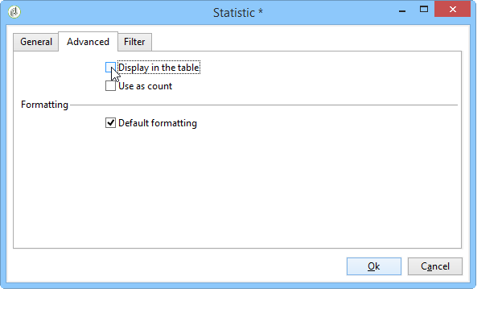

# 기술적 분석 마법사 사용{#using-the-descriptive-analysis-wizard}

설명 분석 보고서를 생성하려면 전용 마법사를 사용합니다. 구성은 분석할 데이터와 원하는 렌더링에 따라 다릅니다.

## 데이터베이스에서 데이터 분석 {#analyzing-data-in-the-database}

설명 분석 마법사는 **[!UICONTROL Tools > Descriptive analysis]** 메뉴: 이 경우 분석은 기본적으로 수신자에 대한 관심입니다(**nms:recipient**). Adobe Campaign 데이터베이스의 모든 데이터에 적용됩니다.

표준 수신자 이외의 테이블을 분석하려면 다음을 수행합니다(**nms:recipient**)을 클릭하고 **[!UICONTROL Advanced settings...]** 마법사의 마지막 단계에서 연결하고 설정과 일치하는 표를 선택합니다(이 경우 ) **cus:개별**:

데이터의 일부에 대한 통계를 생성하려는 경우 필터를 정의할 수 있습니다. 이렇게 하려면 **[!UICONTROL Advanced settings...]** 아래와 같이 적용할 필터를 링크하고 정의합니다.

이 분석은 런던에서 16세 이상 거주 중인 데이터베이스 수신자에게만 관심을 가질 것이다.

## 데이터 집합 분석 {#analyzing-a-set-of-data}

다른 컨텍스트를 통해 설명 분석 마법사를 사용할 수 있습니다. 목록, 워크플로우 전환, 하나 이상의 게재, 수신자 선택 등

수신자 테이블을 가리키는 Adobe Campaign 트리의 여러 노드를 통해 액세스할 수 있습니다.

항목을 선택하고 마우스 오른쪽 단추를 클릭하여 설명 분석 마법사를 엽니다. 선택한 데이터만 분석됩니다.

* 세트 **수신자**&#x200B;을 클릭하고 분석할 수신자를 선택한 다음 마우스 오른쪽 단추를 클릭하고 을 선택합니다 **[!UICONTROL Actions > Explore...]**, 위에 표시된 것처럼. 필터를 수신자 목록에 적용하면 해당 콘텐츠만 분석됩니다.

   폴더 또는 현재 필터의 모든 수신자를 선택하려면 Ctrl+A 단축키를 사용합니다. 즉, 표시되지 않은 수신자도 선택됩니다.

   수신자를 설명하는 분석의 예는 다음을 참조하십시오. [정성 데이터 분석](../../reporting/using/use-cases.md#qualitative-data-analysis).

* 의 컨텍스트에서 **워크플로우**&#x200B;을 눌러 수신자 테이블을 가리키는 변환에 커서를 놓고 마우스 오른쪽 버튼을 클릭한 다음 을 선택합니다 **[!UICONTROL Analyze target]**. 자세한 내용은 의 예를 참조하십시오. [워크플로우에서 전환 타겟 분석](../../reporting/using/use-cases.md#analyzing-a-transition-target-in-a-workflow).
* 대상 **목록**&#x200B;을(를) 한 개 이상의 목록을 선택하고 수신자와 동일한 프로세스를 적용합니다.
* 의 컨텍스트에서 **게재**&#x200B;을(를) 클릭한 후 대상을 분석할 게재를 선택하고 마우스 오른쪽 단추로 클릭한 다음 을(를) 선택합니다 **[!UICONTROL Actions > Explore the target]**&#x200B;를 아래와 같이 표시합니다.

   

   게재에 대한 설명 분석 예는 다음과 같습니다. [모집단 분석](../../reporting/using/use-cases.md#analyzing-a-population) 여기에서 다음을 수행합니다. [수신자 추적 로그 분석](../../reporting/using/use-cases.md#analyzing-recipient-tracking-logs).

## 질적 배포 템플릿 구성 {#configuring-the-qualitative-distribution-template}

다음 **[!UICONTROL Qualitative distribution]** 템플릿을 사용하면 모든 유형의 데이터(예: 회사 이름, 이메일 도메인)에 대한 통계를 만들 수 있습니다.

구성 옵션은 를 통해 작성된 보고서에 사용할 수 있습니다 **[!UICONTROL Qualitative distribution]** 템플릿은 다음 위치에 자세히 설명되어 있습니다. [표에 데이터 표시](#displaying-data-in-the-table). 전체 예제는 [모집단 분석](../../reporting/using/use-cases.md#analyzing-a-population).

설명 분석 마법사를 사용하여 데이터를 분석하는 경우 사용 가능한 옵션은 선택한 설정에 따라 다릅니다. 다음은 아래에 자세히 설명되어 있습니다.

### 데이터 바인딩 {#data-binning}

표시할 변수를 선택할 때 데이터 바인딩을 정의할 수 있습니다. 즉, 선택한 데이터에 대한 그룹화 기준을 구성합니다.

>[!NOTE]
>
>합계를 사용하여 계산으로 관련 필드를 계산하면 다음을 확인합니다 **[!UICONTROL The data is already aggregated]** 공연을 향상시키기 위해

옵션은 필드의 컨텐츠에 따라 달라집니다.

* **[!UICONTROL None]** : 이 옵션을 사용하면 시작 없이 변수에 사용 가능한 모든 값을 표시할 수 있습니다.

   >[!CAUTION]
   >
   >이 옵션은 주의해서 사용해야 합니다. 보고서 및 시스템 성능에 큰 영향을 줄 수 있습니다.

* **[!UICONTROL Auto]** : 이 옵션을 사용하면 가장 자주 표시되는 값 n개를 표시할 수 있습니다. 자동으로 계산되며, 각각 저장소 수와 비교하여 변수의 백분율을 나타냅니다. 숫자 값의 경우 Adobe Campaign은 자동으로 n 클래스를 생성하여 데이터를 로 정렬합니다.
* **[!UICONTROL Manual]** : 이 옵션은 다음과 같이 작동합니다 **[!UICONTROL Auto]** 옵션을 선택하지 않으면 이러한 값을 수동으로 설정할 수 없습니다. 이렇게 하려면 **[!UICONTROL Add]** 값 테이블 오른쪽에 있는 단추입니다.

   개인화 전에 Adobe Campaign에서 값을 자동으로 초기화할 수 있습니다. 이렇게 하려면 생성할 저장소 수를 입력하고 **[!UICONTROL Initialize with]** 링크는 아래와 같습니다.

   

   그런 다음 필요에 맞게 컨텐츠를 조정할 수 있습니다.

   

   원하는 정밀도 수준에 따라 날짜가 포함된 필드를 시간, 일, 월, 년 등으로 그룹화할 수 있습니다.

   

* **[!UICONTROL Modulo]** : 숫자 값의 경우 값 그룹을 만들 수 있습니다. 예를 들어 값이 10인 모듈로를 사용하면 10씩 변경되는 값의 간격을 만들 수 있습니다.

   

   이 예를 사용하면 연령 그룹별로 수신자 분류를 볼 수 있습니다.

   

### 표에 데이터 표시 {#displaying-data-in-the-table}

도구 모음을 사용하여 표에 있는 변수 표시를 개인화합니다. 열을 삭제하고, 데이터를 열이 아닌 라인으로 표시하고, 열을 왼쪽이나 오른쪽으로 이동하거나, 값 계산을 보거나 변경할 수 있습니다.

창의 위쪽 섹션에서 표시 설정을 선택할 수 있습니다.

통계 이름과 소계를 표시하거나 숨기고 통계 방향을 선택할 수 있습니다. 자세한 내용은 [분석 보고서 표시 설정](../../reporting/using/processing-a-report.md#analysis-report-display-settings).

### 차트에 데이터 표시 {#displaying-data-in-the-chart}

설명 분석 마법사의 첫 번째 단계에서는 테이블 없이 데이터를 차트 양식으로만 표시하도록 선택할 수 있습니다. 이 경우 그래픽을 구성할 때 변수 선택을 수행해야 합니다. 먼저 표시할 변수 수를 선택하고 관련 데이터베이스에서 필드를 선택해야 합니다.

그런 다음 원하는 차트 유형을 선택합니다.

>[!NOTE]
>
>변수와 변수를 차트와 테이블에 동시에 표시할 수 있습니다. 이렇게 하려면 **[!UICONTROL Table configuration]** 창을 엽니다. 클릭 **[!UICONTROL Next]** 차트 구성 창에서 차트 유형을 선택합니다. 하위 차원이 테이블에 정의되어 있으면 차트에 표시되지 않습니다.

을(를) 클릭합니다. **[!UICONTROL Variants]** 를 눌러 차트 등록 정보를 수정합니다.

제공된 옵션은 선택한 차트 유형에 따라 다릅니다. 자세한 정보는 [이 페이지](../../reporting/using/creating-a-chart.md#chart-types-and-variants)를 참조하십시오.

### 통계 계산 {#statistics-calculation}

설명 분석 마법사를 사용하여 데이터에 대한 여러 유형의 통계를 계산할 수 있습니다. 기본적으로 단순 카운트는 하나만 구성됩니다.

클릭 **[!UICONTROL Add]** 새 통계를 만들려면

다음 작업을 수행할 수 있습니다.

* **[!UICONTROL Count]** 합계 필드의 중복 값을 포함하여 집계할 필드의 null이 아닌 모든 값을 계산하려면 다음을 수행합니다.
* **[!UICONTROL Average]** 숫자 필드에 있는 값의 평균을 계산하려면,
* **[!UICONTROL Minimum]** 숫자 필드에 있는 값의 최소값을 계산하려면,
* **[!UICONTROL Maximum]** 숫자 필드에 있는 값의 최대 개수를 계산하려면,
* **[!UICONTROL Sum]** 숫자 필드에 있는 값의 합계를 계산하려면,
* **[!UICONTROL Standard deviation]** 반환된 값이 평균 주위에 분산되는 방식을 계산하려면,
* **[!UICONTROL Row percentage distribution]** 열의 값 비율과 행의 값 비율을 계산하려면(테이블에만 사용 가능)
* **[!UICONTROL Column percentage distribution]** 행의 값 비율과 열의 값 비율(테이블에만 사용 가능)을 계산하려면
* **[!UICONTROL Total percentage distribution]** 값에 관련된 수신자의 분포를 계산하려면,

   

* **[!UICONTROL Calculated field]** 개인화된 연산자를 만들려면(테이블에만 사용 가능) 다음 **[!UICONTROL User function]** 필드를 사용하면 데이터에 적용할 계산을 입력할 수 있습니다.

   예: 국가 및 출처를 기준으로 고객당 평균 구매 금액 계산

   

   위의 정보를 테이블에 표시하려면 고객당 평균 구매 금액을 저장할 계산된 필드를 만들어야 합니다.

   방법은 다음과 같습니다.

   1. 구매 합계를 계산합니다.

      

   1. 이 통계는 테이블에 표시되지 않습니다. 의 선택을 취소해야 합니다 **[!UICONTROL Display in the table]** 옵션 **[!UICONTROL Advanced]** 탭.

      

   1. 새 만들기 **[!UICONTROL Calculated field]** 통계를 입력하고 다음 공식을 입력합니다 **[!UICONTROL User function]** 필드: **@purchases/@count**.

      

### 보고서 표시 {#displaying-the-report}

마법사의 마지막 단계에서는 구성된 대로 보고서나 테이블 또는 차트를 표시할 수 있습니다.

보고서에 테이블이 있으면 계산 결과 셀이 색칠됩니다. 결과가 높을수록 색이 강해진다.

결과 레이아웃을 변경할 수 있습니다. 이렇게 하려면 관련 변수를 마우스 오른쪽 단추로 클릭하고 바로 가기 메뉴에서 입력을 선택합니다.

보고서에 차트가 포함되어 있으면 범례 레이블을 사용하여 표시된 정보를 필터링할 수 있습니다. 차트에서 표시를 활성화/비활성화하려면 레이블을 클릭합니다.

## 수량 배포 템플릿 구성 {#configuring-the-quantitative-distribution-template}

설명 분석을 직접 생성하려면 **템플릿의 새로운 설명 분석** 기본적으로 설정되지 않은 경우 선택합니다.

다음 **[!UICONTROL Quantitative distribution]** 측정하거나 계산할 수 있는 데이터(예: 송장 금액, 수신자 연령)에 대한 통계를 생성할 수 있는 템플릿입니다.

를 통해 생성된 분석 보고서의 구성 모드 **[!UICONTROL Quantitative distribution]** 템플릿은 구현 예제에 자세히 설명되어 있습니다 [수량 데이터 분석](../../reporting/using/use-cases.md#quantitative-data-analysis).

설명 분석 마법사를 사용하여 양적 보고서를 만들 때 사용할 수 있는 옵션은 아래에 자세히 설명되어 있습니다.

먼저 계산이 중요한 변수를 선택합니다.

기본적으로 Adobe Campaign에서는 선택한 데이터에 대해 계산되는 일련의 통계를 제공합니다. 필요에 따라 이 목록을 변경하거나, 목록에 추가하거나, 통계를 삭제할 수 있습니다.

다음 작업을 수행할 수 있습니다.

* **[!UICONTROL Count]** 합계 필드의 중복 값을 포함하여 집계할 필드의 null이 아닌 모든 값을 계산하려면 다음을 수행합니다.
* **[!UICONTROL Average]** 숫자 필드에 있는 값의 평균을 계산하려면,
* **[!UICONTROL Minimum]** 숫자 필드에 있는 값의 최소값을 계산하려면,
* **[!UICONTROL Maximum]** 숫자 필드에 있는 값의 최대값을 계산하기 위해.
* **[!UICONTROL Sum]** 숫자 필드에 있는 값의 합계를 계산하려면,
* **[!UICONTROL Standard deviation]** 반환되는 값이 평균 주위에 분배되는 방식을 계산하기 위해.
* **[!UICONTROL Number of missing values]** 정의된 값이 없는 숫자 필드 수를 계산하려면
* **[!UICONTROL Decile distribution]** 반환된 값을 배포하려면 각각 숫자 필드에 있는 값의 1/10을 나타냅니다.
* **[!UICONTROL Custom distribution]** 사용자 정의 임계값을 기준으로 반환된 값을 분배하려면 다음을 수행합니다.

   다음 **[!UICONTROL Detail...]** 버튼을 사용하면 통계를 편집하고 필요한 경우 계산 또는 표시를 개인화할 수 있습니다.

   

   마법사의 마지막 단계에서는 수량 분석 보고서를 보여줍니다.

   

   보고서를 변경하려면 [보고서 처리](../../reporting/using/processing-a-report.md).
