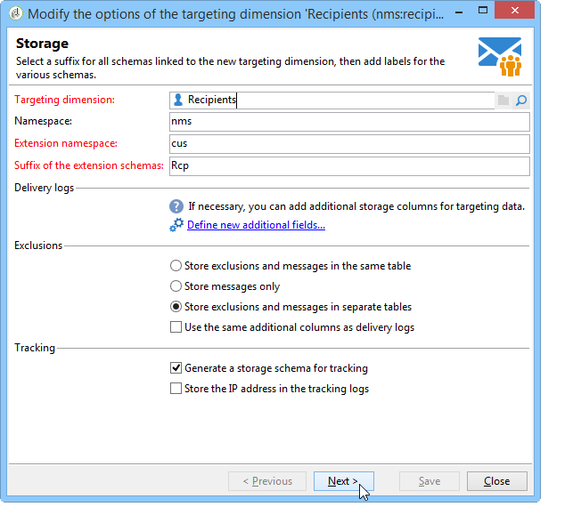

# 캠페인 응답 관리자 구성{#configuration}


이 섹션은 응답 관리 구성을 담당하는 사람을 위한 것입니다. 스키마 확장, 워크플로우 정의 및 SQL 프로그래밍에 대한 특정 지식이 있다고 가정합니다.

이렇게 하면 개인 사용자 테이블로 Adobe Campaign 외부에 있는 트랜잭션 표의 특정 특성에 표준 데이터 모델을 적용하는 방법을 이해할 수 있습니다. 이 개인 테이블은 Adobe Campaign의 사용 가능한 개인 테이블 또는 다른 테이블과 일치할 수 있습니다

측정 가설은 작업 프로세스 워크플로우( **[!UICONTROL operationMgt]** ). 각 가설은 실행 상태(편집 중, 보류 중, 완료됨, 실패 등)와 함께 비동기적으로 실행되는 별도의 프로세스를 나타냅니다. 우선 순위 제한, 동시 프로세스 수 제한, 낮은 활동 페이지 및 빈도로 자동 실행을 관리하는 스케줄러가 제어합니다.

## 스키마 구성 {#configuring-schemas}

>[!CAUTION]
>
>애플리케이션의 기본 제공 스키마를 수정하지 않고 스키마 확장 메커니즘을 사용합니다. 그렇지 않으면 수정된 스키마는 나중에 애플리케이션을 업그레이드할 때 업데이트되지 않습니다. 이로 인해 Adobe Campaign 사용 중 오작동이 발생할 수 있습니다.

애플리케이션 통합은 반응 모듈을 사용하기 전에 측정해야 하는 다양한 테이블(트랜잭션, 트랜잭션 세부 정보)뿐만 아니라 게재, 오퍼 및 개인과의 관계를 정의하기 위해 필요합니다.

### 표준 스키마 {#standard-schemas}

기본 제공 **[!UICONTROL nms:remaMatch]** 스키마에는 반응 로그 테이블, 즉 개인, 가설 및 트랜잭션 테이블 간의 관계가 포함되어 있습니다. 이 스키마는 반응 로그의 최종 대상 테이블에 대한 상속 스키마로 사용됩니다.

다음 **[!UICONTROL nms:remaMatchRcp]** 스키마도 표준으로 제공되며 Adobe Campaign 수신자에 대한 반응 로그 저장소가 포함됩니다( **[!UICONTROL nms:recipient]** ). 사용하려면 트랜잭션 표(구매 등 포함)에 매핑되도록 확장해야 합니다.

### 트랜잭션 테이블 및 트랜잭션 세부 정보 {#transaction-tables-and-transaction-details}

거래 표에는 개인에 대한 직접 링크가 포함되어야 합니다.

트랜잭션 세부 사항이 포함된 테이블을 추가할 수도 있습니다. 이는 개인과 직접적으로 연결되어 있지 않다.

예를 들어 수금을 받는 경우, 트랜잭션 테이블은 담당자(수금 테이블)에 연결되고 수금 라인 테이블은 수금 테이블(상세 테이블)에만 연결됩니다. 그런 다음 수금 라인 테이블이 수금 테이블에 연결된 레벨에서 가설을 직접 구성할 수 있습니다.

>[!NOTE]
>
>가설에서 예상되는 동작을 설명하는 영수증 식별자를 유지하려면 nms:remaMatchRcp 테이블 템플릿을 확장하여 식별자를 여기에 추가할 수 있습니다(이 경우 이러한 필드에 ROI 계산이 연결되어 있지 않음).

이벤트 날짜를 추가하는 것이 좋습니다.

다음 스키마는 구성이 완료되면 서로 다른 테이블 간의 조인을 보여 줍니다.


### 응답 관리 및 수신자 {#response-management-with-adobe-campaign-recipients}

이 예에서는 Adobe Campaign 기본 제공 수신자 테이블을 사용하여 응답 관리 모듈의 구매 테이블을 통합합니다 **[!UICONTROL nms:recipient]**.

다음에 대한 응답 로그 테이블 **[!UICONTROL nms:remaMatchRcp]** 수신자가 확장되어 구매 테이블 스키마에 링크가 추가됩니다. 다음 예에서는 구매 테이블이 호출됩니다. **demo:purchase**.

1. Adobe Campaign 탐색기를 통해 **[!UICONTROL Administration]** > **[!UICONTROL Campaign management]** > **[!UICONTROL Target mappings]**.
1. 마우스 오른쪽 버튼 클릭 **수신자** 그런 다음 선택 **[!UICONTROL Actions]** 및 **[!UICONTROL Modify the options of the targeting dimensions]**.

   

1. 다음을 개인화할 수 있습니다. **[!UICONTROL Extension namespace]** 다음 창에서 를 클릭합니다. **[!UICONTROL Next]**.

   

1. 다음에서 **[!UICONTROL Response management]** 범주, 다음을 확인합니다. **[!UICONTROL Generate a storage schema for reactions]** 확인란이 선택되어 있습니다.

   그런 다음 **[!UICONTROL Define additional fields...]** 관련 트랜잭션 표를 선택하고 원하는 필드를 nms:remaMatchRcp 스키마의 확장에 추가합니다.

   

생성된 스키마는 다음과 같습니다.

```
<srcSchema _cs="Reactions (Recipients) (cus)" entitySchema="xtk:srcSchema" extendedSchema="nms:remaMatchRcp" 
img="nms:remaMatch.png" implements="xtk:persist" label="Reactions (Recipients)" mappingType="sql"
name="remaMatchRcp" namespace="cus">  
 <element label="Reactions (Recipients)" name="remaMatchRcp">    
  <key internal="true" name="match">      
   <keyfield xlink="hypothesis"/>      
   <keyfield xlink="broadLog"/>      
   <keyfield xlink="proposition"/>    
  </key>    
  <attribute label="Quantity" name="quantity" type="long"/>    
  <element name="purchase" target="demo:purchase" type="link"/>    
  <element name="hypothesis" revLabel="Reactions (Recipients)" revLink="remaMatchRcp"/>    
  <element applicableIf="HasPackage('nms:coreInteraction')" label="Proposition" name="proposition" target="nms:propositionRcp" type="link"/>   
  <element desc="Message (Delivery log)" label="Message" name="broadLog" target="nms:broadLogRcp" type="link"/>    
  <element label="Respondent" name="responder" target="nms:recipient" type="link"/>  
 </element>  
 <createdBy _cs="Administrator (admin)"/>  
 <modifiedBy _cs="Administrator (admin)"/>
</srcSchema>
```

### 개인화된 수신자 테이블을 사용한 응답 관리 {#response-management-with-a-personalized-recipient-table}

이 예에서는 Adobe Campaign에서 사용할 수 있는 수신자 테이블 이외의 개인 테이블을 사용하여 응답 관리 모듈의 구매 테이블을 통합합니다.

* 에서 파생된 새 응답 로그 스키마 만들기 **[!UICONTROL nms:remaMatch]** 스키마.

  개인 사용자 테이블은 Adobe Campaign 수신자 테이블과 다르므로 을(를) 기반으로 응답 로그의 새 스키마를 만들어야 합니다. **[!UICONTROL nms:remaMatch]** 스키마. 그런 다음 게재 로그 및 구매 테이블에 대한 링크를 포함하여 완료합니다.

  다음 예제에서는 **demo:broadLogPers** 스키마 및 **demo:purchase** 트랜잭션 테이블:

  ```
  <srcSchema desc="Linking of a recipient transaction to a hypothesis"    
  img="nms:remaMatch.png" label="Responses on persons" labelSingular="Responses on a person" name="remaMatchPers" namespace="nms">
    <element name="remaMatchPers" template="nms:remaMatch">
      <key internal="true" name="match">
        <keyfield xlink="hypothesis"/>
       <keyfield xlink="purchase"/>
      </key>
  
      <element name="hypothesis" revLabel="Response logs for persons" revLink="remaMatchPers"/>
      <element applicableIf="HasPackage('nms:interaction')" label="Proposition" name="proposition"
               target="demo:propositionPers" type="link"/>
      <element label="Delivery log" name="broadLog" target="demo:broadLogPers" type="link"/>
    </element>
  </srcSchema>
  ```

* 에서 가설 양식 수정 **[!UICONTROL nms:remaHypothesis]** 스키마.

  기본적으로 응답 로그 목록은 수신자 로그에 표시됩니다. 따라서 이전 단계에서 생성된 새 응답 로그를 보려면 가설 양식을 수정해야 합니다.

  예제:

  ```
   <container type="visibleGroup" visibleIf="[context/@remaMatchStorage]= 'demo:remaMatchPers'">
                <input hideEditButtons="true" img="nms:remaMatch.png" nolabel="true" refresh="true"
                 toolbarCaption="Responses generated by the hypothesis" type="linklist"
                 xpath="remaMatchPers">
            <input xpath="[.]"/>
            <input xpath="@controlGroup"/>
          </input>
     </container> 
  ```

## 지표 관리 {#managing-indicators}

응답 관리자 모듈에는 사전 정의된 지표 목록이 제공됩니다. 그러나 다른 개인화된 측정 지표를 추가할 수 있습니다.

이렇게 하려면 각 새 지표에 대해 두 개의 필드를 삽입하여 가설 테이블을 확장해야 합니다.

* 대상 모집단의 첫 번째
* 컨트롤 그룹에 대한 두 번째

예제:

```
<srcSchema entitySchema="xtk:srcSchema" extendedSchema="nms:remaHypothesis" label="Measurement hypothesis" 
md5="1D4DED54FF8EC2432AED6736EDE6F547" name="remaHypothesis" namespace="demo" xtkschema="xtk:srcSchema">  
    <element name="remaHypothesis">    
        <element name="indicators">      
            <!-- Quantity -->      
            <attribute label="Total contacted" name="contactReactedTotalQuantity" type="long"/>
            <attribute label="Total number of people in the control group" name="proofReactedTotalquantity" type="long"/> 
        </element> 
    </element>
</srcSchema>
```
