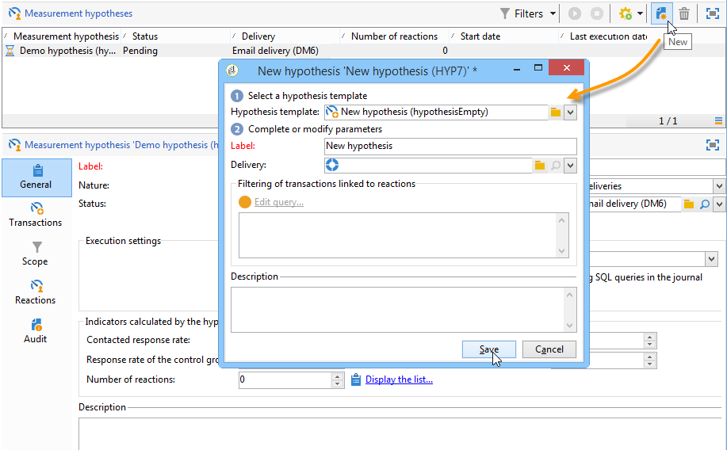
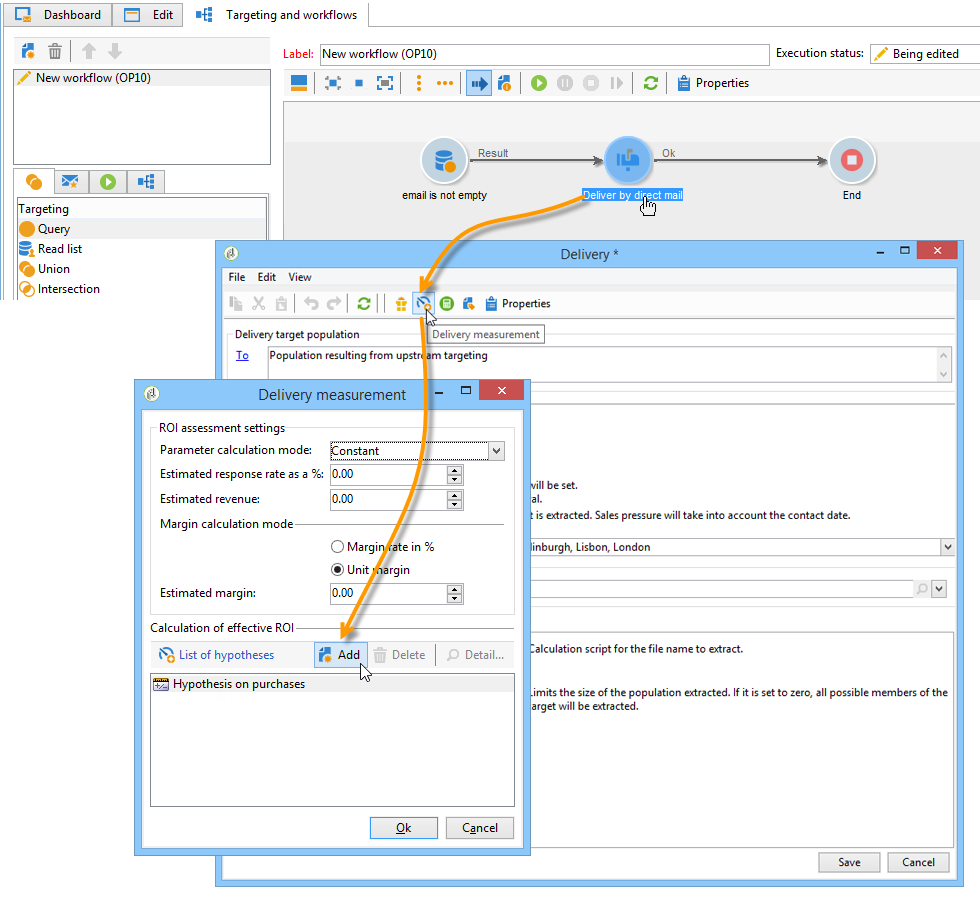
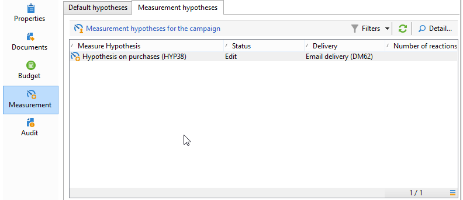

# 가설 만들기{#creating-hypotheses}

가설을 생성/캠페인 오퍼 또는 게재에 연결하는 다양한 가능성이 있습니다.

* 를 통해 **[!UICONTROL Measurement hypotheses]** 기존 템플릿을 기반으로 새 가설을 만들어 기존 게재에 연결하여 폴더를 작성합니다.
* 를 통해 **[!UICONTROL Edit]** > **[!UICONTROL Measurement]** 캠페인의 탭입니다.
* 를 통해 **[!UICONTROL Measurement]** 캠페인에서 생성된 게재 옵션.

가설은 마케팅 캠페인이 시작되고 수신자가 게재를 받은 후에만 계산할 수 있습니다. 가설이 오퍼 제안에 근거한다면, 후자는 적어도 제시될 필요가 있고 여전히 적극적일 필요가 있다. 오퍼 및 게재 가설은 **[!UICONTROL Measurement hypotheses]** 폴더와 는 가설 템플릿을 기반으로 합니다. 그러나 캠페인이 시작되기 전에 게재 또는 캠페인에서 직접 가설을 참조할 수 있습니다. 이 경우, 가설은 마케팅 캠페인이 시작되면 실행 설정을 기반으로 자동으로 계산됩니다. [자세히 알아보기](hypothesis-templates.md#hypothesis-template-execution-settings)

## 게재 시 즉석으로 가설 만들기 {#creating-a-hypothesis-on-the-fly-on-a-delivery}

기존 게재에 대한 가설을 생성하려면 다음 프로세스를 적용합니다.

>[!NOTE]
>
>이 작업은 보류 중인 게재에만 가능합니다.

1. Adobe Campaign 트리에서 로 이동합니다. **[!UICONTROL Campaign management > Measurement hypotheses]**.
1. 다음을 클릭합니다. **[!UICONTROL New]** 가설 목록을 버튼 또는 마우스 오른쪽 버튼으로 클릭하고 다음을 선택합니다. **[!UICONTROL New]** 을 클릭합니다.

   

1. 가설 창에서 이전에 만든 템플릿을 선택합니다. [자세히 알아보기](hypothesis-templates.md)

   

   선택한 모형에서 정의된 가설 문맥이 창에 표시된다.

   >[!NOTE]
   >
   >템플릿에 정의되어 있으며 이 단계에서 표시되지 않는 설정도 메모리에 유지되며 진행 중인 가설에 재할당됩니다.

   

1. 가설을 생성할 게재를 선택합니다.

   

1. 다음을 편집하여 가설을 개인화할 수 있습니다. **[!UICONTROL General]**, **[!UICONTROL Transactions]** 및 **[!UICONTROL Scope]** 탭. [자세히 알아보기](hypothesis-templates.md#creating-a-hypothesis-model)
1. 다음을 클릭하여 가설 시작 **[!UICONTROL Start]**.

   측정을 수행하기 위한 워크플로는 자동으로 만들어집니다. 가설 구성에 따라 이름이 자동으로 정의됩니다.

   >[!CAUTION]
   >
   >다음을 확인한 경우 이에 액세스할 수 있습니다. **[!UICONTROL Keep execution workflow]** 상자.\
   >이 옵션은 가설을 실행하는 동안 오류가 발생한 경우에만 디버깅을 위해 활성화해야 합니다. 자동으로 생성된 워크플로우는 **[!UICONTROL Administration]** > **[!UICONTROL Production]** > **[!UICONTROL Objects created automatically]** > **[!UICONTROL Campaign workflows]** Adobe Campaign 탐색기의 폴더입니다.
   > 
   >또한 자동으로 생성된 워크플로는 수정해서는 안 됩니다. 최종 수정 사항은 나중에 계산할 때 다른 곳에 고려되지 않습니다.
   >
   >이 옵션을 선택한 경우 워크플로우를 실행한 후 삭제합니다.

   

   계산이 완료되면 측정 지표가 자동으로 업데이트됩니다.

   

1. 필요한 경우 설정을 변경하고 가설을 다시 시작합니다.

## 캠페인 게재에서 가설 참조 {#referencing-a-hypothesis-in-a-campaign-delivery}

시작하기 전에 마케팅 캠페인에서 가설을 참조할 수 있습니다. 이 경우, 게재가 전송되면 가설 템플릿에 정의된 실행 설정을 기반으로 가설이 자동으로 실행됩니다. 게재에서 가설을 생성하려면 다음 프로세스를 적용합니다.

1. 필요에 따라 하나 이상을 만들 수 있습니다 **[!UICONTROL Delivery]** 에 설명된 대로 템플릿을 입력합니다. [이 섹션](hypothesis-templates.md#creating-a-hypothesis-model)
1. 마케팅 캠페인 및 타기팅 워크플로우를 만듭니다.
1. 게재 창에서 **[!UICONTROL Delivery measurement]** 아이콘.
1. 가설 템플릿을 선택합니다(모델에 구성된 쿼리가 가설 창에 표시됨).

   가설은 캠페인이 완료되면 모델에 구성된 날짜를 기반으로 자동으로 계산됩니다. [자세히 알아보기](hypothesis-templates.md#hypothesis-template-execution-settings)

   

## 캠페인 게재에 기본 가설 추가 {#adding-a-default-hypothesis-to-deliveries-for-a-campaign}

캠페인 수준에서 가설을 직접 참조할 수 있습니다. 이 경우 가설은 캠페인에서 생성된 모든 게재에 자동으로 연결됩니다. 방법은 다음과 같습니다.

1. 로 이동 **[!UICONTROL Edit]** 캠페인의 탭.
1. 측정 섹션에서 다음을 클릭합니다. **[!UICONTROL Default hypotheses]** 탭.

   

1. 클릭 **[!UICONTROL Add]** 가설 템플릿을 선택합니다.

   

   이제 이 템플릿을 기반으로 하는 가설이 캠페인의 각 새 게재에서 기본적으로 참조됩니다.

   

가설 결과는 다음 위치에서 볼 수 있습니다. **[!UICONTROL General]** 및 **[!UICONTROL Reactions]** 가설의 탭입니다. [자세히 알아보기](hypothesis-tracking.md)

자세한 내용은 다음을 참조하십시오 [이 샘플](#example--creating-a-hypothesis-linked-to-a-delivery).

## 오퍼에 대한 가설 만들기 {#creating-a-hypothesis-on-an-offer}

오퍼 제안에 대한 가설을 생성하는 것은 즉석 전달 가설을 생성하는 것과 유사하다. 오퍼가 활성화된 경우 가설을 실행할 수 있습니다. 계산 기간은 오퍼 제안 일자를 기반으로 합니다. 가설을 통해 수신자를 구매에 연결할 수 있는 경우 수락될 가능성이 있는 오퍼 제안의 상태는 자동으로 변경될 수 있습니다. [자세히 알아보기](hypothesis-templates.md#transactions)

1. 하나 이상 만들기 **[!UICONTROL Offer]** 에 설명된 대로 모델 입력 [이 섹션](hypothesis-templates.md#creating-a-hypothesis-model).
1. 로 이동 **[!UICONTROL Campaign management > Measurement hypotheses]** 노드.
1. 만들기 **[!UICONTROL Offers]** 이전에 만든 모델을 선택하여 가설을 입력합니다.

   

   모델에서 생성된 질의가 창에 나타납니다.

   

1. 가설을 생성할 오퍼를 선택합니다.

   

1. 필요한 경우 쿼리를 세분화합니다.
1. 클릭 **[!UICONTROL Start]** 을 클릭하여 가설을 실행합니다.
1. 가설 결과는 다음과 같이 볼 수 있습니다 **[!UICONTROL General]** 및 **[!UICONTROL Reactions]** 탭. [자세히 알아보기](hypothesis-tracking.md)

   오퍼에 대한 가설은 **[!UICONTROL Measurement]** 탭.

   

   다음과 같은 경우 **[!UICONTROL Update offer proposition status]** 옵션이 가설 템플릿에서 활성화되었으며, 오퍼 제안 상태가 자동으로 변경되어 캠페인의 영향에 대한 피드백을 제공합니다(자세한 내용은 다음을 참조하십시오.) [트랜잭션](hypothesis-templates.md#transactions)).

## 예: 게재에 연결된 가설 만들기 {#example--creating-a-hypothesis-linked-to-a-delivery}

이 예제에서는 게재에 연결된 가설을 만들려고 합니다. 이 가설은 이전에 만들어진 모형을 기반으로 할 것이다. [자세히 알아보기](hypothesis-templates.md#example--creating-a-hypothesis-template-on-a-delivery)

그런 다음 모델에서 상속된 쿼리를 세분화하여 구매 테이블의 특정 기사에 대해 가설을 세웁니다.

1. 캠페인 및 게재를 만듭니다. [자세히 알아보기](../../campaign/using/setting-up-marketing-campaigns.md#creating-a-campaign)

   이 예제에서는 DM 유형 게재를 사용합니다.

1. 시드 주소 구성: 이전에 만든 가설 템플릿이 반응 결과에서 컨트롤 그룹을 고려하도록 구성되었습니다.

   

   >[!NOTE]
   >
   >자세한 정보는 [이 섹션](../../campaign/using/marketing-campaign-deliveries.md#defining-a-control-group)을 참조하십시오.

1. 를 엽니다. **[!UICONTROL Direct mail delivery]** 을(를) 클릭하고 **[!UICONTROL Delivery measurement]** 아이콘을 클릭한 다음 **[!UICONTROL Add]**.

   

1. 드롭다운 목록에서 이전에 만든 가설 템플릿을 선택합니다.

   

   모델에서 생성된 쿼리가 표시됩니다.

   

1. 클릭 **[!UICONTROL Edit query...]** 가설이 관심을 가질 제품을 입력하여 쿼리를 세분화합니다.

   

   다음에서 가설이 게재에 연결되어 있는지 확인할 수 있습니다. **[!UICONTROL Edit]** > **[!UICONTROL Measurement]** 캠페인의 탭.

   

1. 타겟팅 워크플로우를 시작하고 캠페인이 완료될 때까지 필요한 검사를 실행합니다. [자세히 알아보기](../../campaign/using/marketing-campaign-deliveries.md#starting-a-delivery)

   

1. Adobe Campaign 트리에서 **[!UICONTROL Campaign management > Measurement hypotheses]** 노드가 가설로 계산된 지표를 확인합니다.

   
