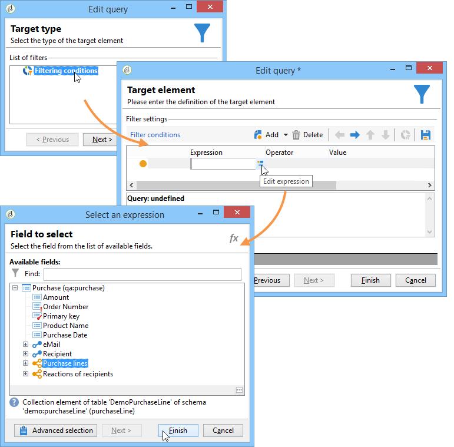

# 가설 템플릿{#hypothesis-templates}

## 가설 모델 만들기 {#creating-a-hypothesis-model}

가설 템플릿을 구성하면 전달 또는 오퍼에 대해 반응 측정 컨텍스트를 정의할 수 있습니다. 여기서 개인, 가설 및 트랜잭션 테이블 간의 관계를 정의하는 테이블 등 다양한 측정 테이블이 참조됩니다.

가설 템플릿을 만들려면 다음 단계를 수행합니다.

1. Adobe Campaign 탐색기에서 **[!UICONTROL Resources>Templates>Hypothesis templates]**.

   

1. 클릭 **[!UICONTROL New]** 템플릿 목록을 마우스 오른쪽 단추로 클릭하고 **[!UICONTROL New]** 를 클릭합니다.
1. 가설 레이블을 입력합니다.
1. 템플릿을 **[!UICONTROL Hypothesis type]**.
1. 대상 **[!UICONTROL Delivery]** 템플릿 유형, 컨트롤 그룹을 사용하여 측정을 수행할지 아니면 사용하지 않아야 할지를 지정합니다. [자세히 알아보기](#properties-of-a-hypothesis-template)
1. 대상 **[!UICONTROL Delivery]** 유형 템플릿, 특정 채널을 선택하거나 템플릿을 Adobe Campaign에서 사용 가능한 모든 채널에 적용하도록 결정할 수 있습니다 **[!UICONTROL Channel]** 드롭다운 목록. [자세히 알아보기](#properties-of-a-hypothesis-template)
1. 을(를) 선택합니다 **[!UICONTROL Execution folder]** 이 템플릿에서 만들 가설을 만들고 자동으로 실행하려는 경우입니다.
1. 실행 설정을 선택합니다. [자세히 알아보기](#hypothesis-template-execution-settings)
1. 가설 계산 기간을 지정합니다. [자세히 알아보기](#hypothesis-template-execution-settings)

   >[!CAUTION]
   >
   >이 기간은 연락 날짜로부터 결정됩니다.

1. 에서 **[!UICONTROL Transactions]** 탭에서 가설 계산에 필요한 테이블 및 필드를 지정합니다. [자세히 알아보기](#transactions)
1. 템플릿이 **[!UICONTROL Offer]** 가설을 입력하면 다음을 사용할 수 있습니다 **[!UICONTROL Update offer proposition status]** 옵션: 이 경우 변경할 오퍼 제안 상태를 선택합니다.
1. 가설 응용 프로그램의 범위를 지정합니다. [자세히 알아보기](#hypothesis-perimeter)
1. 필요한 경우 스크립트를 사용하여 필터링을 완료합니다. [자세히 알아보기](#hypothesis-perimeter)

### 가설 템플릿의 속성 {#properties-of-a-hypothesis-template}

템플릿의 **[!UICONTROL General]** 탭에서는 일반 템플릿 옵션을 지정할 수 있습니다. 사용 가능한 필드는 다음과 같습니다.

* **[!UICONTROL Hypothesis type]**: 템플릿에 게재 또는 오퍼에 대한 가설을 지정할지 여부를 결정할 수 있습니다.

   게재와 오퍼 모두에 적용되는 가설을 생성하도록 선택할 수도 있습니다.

   >[!NOTE]
   >
   >템플릿이 오퍼에 적용되는 경우, **[!UICONTROL Update offer proposition status]** 옵션은 **[!UICONTROL Transactions]** 탭.

* **[!UICONTROL Measurement with control group]**: 컨트롤 그룹이 게재에 대해 정의되었는지 아니면 캠페인에 정의되어 있는지 여부를 나타내며 측정 지표에 포함할 수 있습니다. 게재를 받지 않는 제어 그룹은 게재를 받은 대상 모집단과 비교하여 게재 후의 캠페인 영향을 측정할 수 있도록 해줍니다.

   >[!NOTE]
   >
   >템플릿이 컨트롤 그룹을 고려하도록 구성되었지만 가설이 우려되는 게재 내에 그룹이 정의되지 않은 경우 결과는 타깃팅된 수신자만을 기반으로 합니다.

   컨트롤 그룹 정의 및 구성에 대한 자세한 내용은 [이 섹션](../../campaign/using/marketing-campaign-deliveries.md#defining-a-control-group).

* **[!UICONTROL Channel]**: 을(를) 선택하여 Adobe Campaign 콘솔의 모든 채널에 대해 특정 채널을 선택하거나 가설 템플릿을 사용할 수 있도록 할 수 있습니다 **[!UICONTROL All channels]** 를 클릭합니다. 특정 채널에 대한 템플릿을 구성하면 가설을 만들 때 채널당 게재를 자동으로 필터링할 수 있습니다. [자세히 알아보기](creating-hypotheses.md)

   

* **[!UICONTROL Execution folder]**: 가설을 위한 실행 폴더를 지정할 수 있도록 해줍니다.
* **[!UICONTROL Taken into account in campaign ROI calculation]**: 관련 캠페인에 대한 ROI 계산을 통해 가설 결과를 고려합니다.

### 가설 템플릿 실행 설정 {#hypothesis-template-execution-settings}

템플릿의 **[!UICONTROL General]** 또한 탭에서는 가설 실행 매개 변수를 지정할 수 있습니다. 사용 가능한 옵션은 다음과 같습니다.

* **[!UICONTROL Schedule execution for a time of low activity]**: Adobe Campaign 성능을 최적화하기 위해 가설 시작을 예약할 수 있습니다. 이 옵션을 선택하면 캠페인의 처리 워크플로우는 가동 중지 시간 동안 가설 계산을 실행합니다.

   

* **[!UICONTROL Priority]**: 동시 실행이 있는 경우 가설 계산 순서를 확장하기 위해 가설에 적용되는 레벨입니다.

   

* **[!UICONTROL Automatic execution]**: 필요한 경우 가설 재계산을 예약할 수 있습니다(예를 들어 게재 종료 시까지 지표를 정기적으로 업데이트하려면).

   

   스케줄을 지정하려면 다음 프로세스를 적용합니다.

   1. 을(를) 클릭합니다. **[!UICONTROL Frequency of execution...]** 링크를 클릭한 다음 **[!UICONTROL Change...]** 버튼을 클릭합니다.

      

   1. 빈도, 관련 이벤트 및 유효 기간을 구성합니다.

      

   1. 클릭 **[!UICONTROL Finish]** 일정을 저장합니다.

      

* **[!UICONTROL Log SQL queries in journal]**: 이 함수는 전문가 사용자를 위해 예약되어 있습니다. 이 옵션을 사용하면 측정 가설 감사에 탭을 추가하여 SQL 쿼리를 표시할 수 있습니다. 이렇게 하면 시뮬레이션이 오류와 함께 완료되면 가능한 오동작을 감지할 수 있습니다.
* **[!UICONTROL Keep execution workflow]**: 가설 계산 시작 시 자동으로 생성된 워크플로우를 유지할 수 있습니다. 이 옵션을 선택한 템플릿에서 만든 가설을 사용하면 생성된 워크플로우를 프로세스를 따를 수 있습니다.

   >[!CAUTION]
   >
   >가설을 실행하는 동안 오류가 발생하는 경우 디버깅 목적으로만 이 옵션을 활성화해야 합니다.\
   >또한 자동으로 생성된 워크플로우는 수정하면 안 됩니다. 최종 수정은 이후의 계산을 위해 다른 곳에서 고려되지 않습니다.\
   >이 옵션을 선택한 경우 워크플로우를 실행한 후 삭제합니다.

### 트랜잭션 {#transactions}

이 탭에는 거래의 관점에서 수신자 반응 내역을 저장할 수 있는 다양한 필드와 테이블이 포함되어 있습니다. 다음을 참조하십시오 [섹션](../../configuration/using/about-schema-reference.md) 를 참조하십시오.

* **[!UICONTROL Schema (reaction log storage)]**: 수신자 반응 테이블을 선택합니다. Adobe Campaign의 기본 테이블은 다음과 같습니다 **NmsRemaMatchRcp**.
* **[!UICONTROL Transaction schema]**: 가설이 우려되는 테이블(예: 거래 또는 구매 테이블)을 선택합니다.
* **[!UICONTROL Querying schema]**: 가설 필터링 기준을 선택합니다.
* **[!UICONTROL Link to individuals]**: 개인 및 트랜잭션 스키마로 사용되는 테이블 간의 링크를 선택합니다.
* **[!UICONTROL Link to the household]**: 가설을 포함하려면 트랜잭션 스키마에서 가고에 대한 링크를 선택합니다. 이 필드는 선택 사항입니다.
* **[!UICONTROL Transaction date]**: 이 필드는 선택 사항이지만 가설 계산의 범위를 정의할 수 있으므로 권장됩니다.
* **[!UICONTROL Measurement period]**: 가설이 실행되고 구매 라인이 복구되는 시작 및 종료 날짜를 구성할 수 있습니다.

   가설이 게재에 연결되면 DM 게재에 대한 연락 날짜 이후 또는 이메일 또는 SMS 게재의 게재 날짜 이후 며칠 후에 측정이 자동으로 트리거됩니다.

   

   가설이 바로 시작된다면, 즉시 그것을 시작하려 한다면, 그것은 강요될 수 있습니다. 그렇지 않으면 가설 생성 날짜를 기반으로 하는 구성된 계산 종료 날짜를 기반으로 자동으로 트리거됩니다. [자세히 알아보기](creating-hypotheses.md#creating-a-hypothesis-on-the-fly-on-a-delivery)).

* **[!UICONTROL Transaction/Margin amount]**: 이러한 필드는 선택적이며 자동으로 이직률 지표를 계산할 수 있습니다. [자세히 알아보기](hypothesis-tracking.md#indicators)
* **[!UICONTROL Unit amount]**: 수입을 계산할 금액을 설정할 수 있도록 해줍니다. [자세히 알아보기](hypothesis-tracking.md#indicators)

   

* **[!UICONTROL Additional measures and data]**: 다른 테이블의 필드에서 추가 보고 측정값 또는 축을 지정할 수 있도록 해줍니다.
* **[!UICONTROL Update offer proposition status]**: 오퍼 수신자가 가설로 식별되는 경우 오퍼 제안 상태를 변경할 수 있습니다.

   

### 가설 경계 {#hypothesis-perimeter}

트랜잭션 표와 가설이 우려되는 필드를 정의한 후에는 필터를 사용하여 타깃팅된 트랜잭션 및 게재를 지정하여 가설 범위를 세분화할 수 있습니다. JavaScript 스크립트를 사용하여 트랜잭션 테이블에서 참조되는 제품을 명시적으로 가리키도록 할 수도 있습니다.

* **트랜잭션 필터링**: 에서 **[!UICONTROL Scope]** 탭에서는 가설에 대한 필터를 구성할 수 있습니다. 방법은 다음과 같습니다.

   1. **[!UICONTROL Edit query]** 링크를 클릭합니다.

      

   1. 필터링 조건을 지정합니다.

      

   1. 가설이 관련되는 거래를 선택합니다.

      

* **수신자에 대한 필터링**: 에서 **[!UICONTROL Scope]** 탭에서는 메시지에 연결된 정보(게재, 수신자, 이메일 주소, 서비스 등)로 가설을 제한할 수 있습니다.

   1. 을(를) 클릭합니다. **[!UICONTROL Add a filter]** 링크를 클릭한 다음 **[!UICONTROL Edit query]**.

      

   1. 필터링 조건을 지정합니다.

      

   1. 클릭 **[!UICONTROL Finish]** 쿼리를 저장하려면 다음을 수행하십시오.

      

* **스크립트**: JavaScript 스크립트를 사용하여 실행 중에 가설 설정을 동적으로 오버로드할 수 있습니다.

   이렇게 하려면 **[!UICONTROL Advanced settings]** 링크를 클릭한 다음 원하는 스크립트를 입력합니다.

   >[!NOTE]
   >
   >이 옵션은 전문가 사용자용입니다.

   

## 예: 게재에서 가설 템플릿 만들기 {#example--creating-a-hypothesis-template-on-a-delivery}

이 예제에서는 DM 유형 게재에 대한 가설 템플릿을 만듭니다. 트랜잭션 표(**구매** 이 예에서는 가설을 기반으로 하는 가설)에는 문서 또는 제품에 연결된 구매 라인이 포함되어 있습니다. 구매 테이블의 문서 또는 제품에 대한 가설을 작성하도록 모델을 구성하려고 합니다.

1. Adobe Campaign 탐색기에서 **[!UICONTROL Resources > Templates > Hypothesis templates]** 노드 아래에 있어야 합니다.
1. 클릭 **[!UICONTROL New]** 템플릿을 만들려면 다음을 수행하십시오.

   

1. 템플릿 레이블을 변경합니다.

   

1. 선택 **[!UICONTROL Deliveries]** 가설 유형으로.
1. 관련 상자를 선택하여 게재에 컨트롤 그룹이 포함될 수 있도록 지정합니다.
1. 을(를) 선택합니다 **[!UICONTROL Direct mail]** 채널.

   >[!NOTE]
   >
   >템플릿은 DM 게재에만 해당되므로 이 모델을 사용하여 작성된 가설이 다른 배달 유형에 연결되지 않을 수 있습니다.

1. 에서 **[!UICONTROL Transactions]** 탭에서 수신자 반응 표를 선택합니다.

   

1. 에서 **[!UICONTROL Transactions schema]** 필드에서 구매 테이블을 선택합니다.

   

1. 에서 구매 라인 선택 **[!UICONTROL Querying schema]** 필드.

   

1. 구매 테이블에 연결된 수신자를 선택합니다.

   

1. 구매 날짜에 연결된 필드를 선택합니다.

   이를 통해 가설을 위한 시간대를 정의할 수 있습니다. 이 단계는 필수가 아니지만, 권장됩니다.

   

1. 5~25일 동안 계산 기간을 구성합니다.

   

1. 에서 **[!UICONTROL Scope]** 탭, **[!UICONTROL Edit query]** 를 입력하여 가설 필터를 만듭니다.

   

   이렇게 생성된 템플릿을 사용하면 구매 테이블의 제품이나 문서에 대한 가설을 실행할 수 있습니다.

1. 클릭 **[!UICONTROL Save]** 템플릿을 기록하려면 다음을 수행하십시오.
