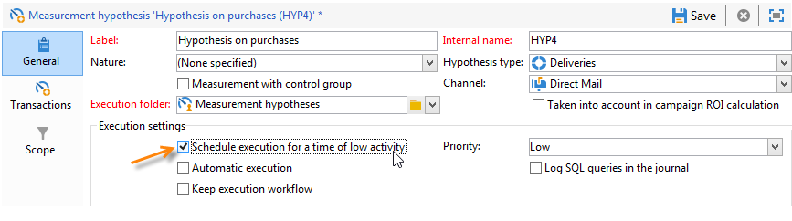
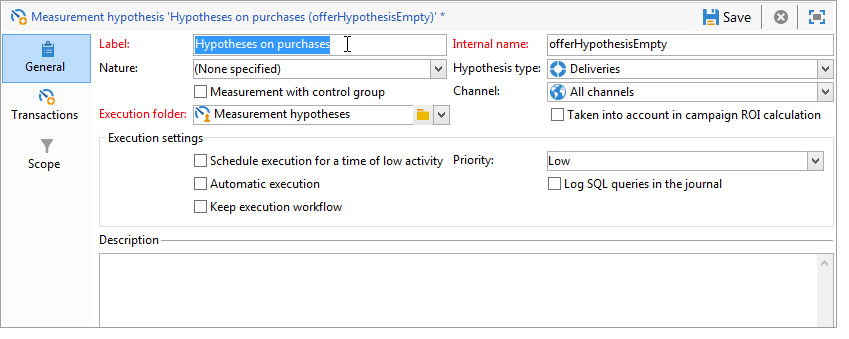

# 가설 템플릿{#hypothesis-templates}

## 가설 모델 만들기 {#creating-a-hypothesis-model}

가설 템플릿을 구성하면 게재 또는 오퍼 여부에 관계없이 반응을 측정하기 위한 컨텍스트를 정의할 수 있습니다. 개인 간 관계, 가설 및 거래표를 정의하기 위한 측정표를 포함하여 다양한 측정표가 참조되는 곳이다.

가설 템플릿을 만들려면 다음 단계를 적용합니다.

1. Adobe Campaign 탐색기에서 **[!UICONTROL Resources>Templates>Hypothesis templates]**.

   

1. 클릭 **[!UICONTROL New]** 또는 템플릿 목록을 마우스 오른쪽 버튼으로 클릭하고 **[!UICONTROL New]** 을 클릭합니다.
1. 가설 레이블을 입력합니다.
1. 템플릿을 통해 오퍼 또는 게재에 대한 가설을 지정할지 여부를 지정합니다. **[!UICONTROL Hypothesis type]**.
1. 대상 **[!UICONTROL Delivery]** 템플릿을 입력하고 컨트롤 그룹을 사용하여 측정을 수행할지 또는 컨트롤 그룹을 사용하지 않고 수행할지 여부를 지정합니다. [자세히 알아보기](#properties-of-a-hypothesis-template)
1. 대상 **[!UICONTROL Delivery]** 템플릿을 입력합니다. 특정 채널을 선택하거나 다음을 사용하여 Adobe Campaign에서 사용 가능한 모든 채널에 템플릿을 적용하기로 결정할 수 있습니다. **[!UICONTROL Channel]** 드롭다운 목록입니다. [자세히 알아보기](#properties-of-a-hypothesis-template)
1. 다음 항목 선택 **[!UICONTROL Execution folder]** 이 템플릿에서 생성할 가설을 생성하고 자동으로 실행할 수 있도록 합니다.
1. 실행 설정을 선택합니다. [자세히 알아보기](#hypothesis-template-execution-settings)
1. 가설 계산 기간을 지정합니다. [자세히 알아보기](#hypothesis-template-execution-settings)

   >[!CAUTION]
   >
   >이 기간은 연락 날짜로부터 결정됩니다.

1. 다음에서 **[!UICONTROL Transactions]** 탭에서 가설 계산에 필요한 표와 필드를 지정합니다. [자세히 알아보기](#transactions)
1. 템플릿이에 대해 구성된 경우 **[!UICONTROL Offer]** 가설을 입력하면 **[!UICONTROL Update offer proposition status]** 옵션: 이 경우 변경할 오퍼 제안의 상태를 선택합니다.
1. 가설 응용 프로그램의 범위를 지정하십시오. [자세히 알아보기](#hypothesis-perimeter)
1. 필요한 경우 스크립트를 사용하여 필터링을 완료합니다. [자세히 알아보기](#hypothesis-perimeter)

### 가설 템플릿의 속성 {#properties-of-a-hypothesis-template}

템플릿의 **[!UICONTROL General]** 탭에서는 일반 템플릿 옵션을 지정할 수 있습니다. 사용 가능한 필드는 다음과 같습니다.

* **[!UICONTROL Hypothesis type]**: 게재 또는 오퍼에 대한 가설을 위해 템플릿을 지정할지 여부를 결정할 수 있습니다.

   게재 및 오퍼 모두에 적용할 가설을 만들도록 선택할 수도 있습니다.

   >[!NOTE]
   >
   >템플릿이 오퍼에 적용되는 경우 **[!UICONTROL Update offer proposition status]** 옵션은에서 사용할 수 있습니다 **[!UICONTROL Transactions]** 탭.

* **[!UICONTROL Measurement with control group]**: 컨트롤 그룹이 게재에 대해 정의되었는지 또는 캠페인에 대해 정의되었는지 여부를 표시하고 측정 지표에 포함할 수 있습니다. 게재를 받지 않는 컨트롤 그룹을 사용하면 게재를 받은 대상 모집단과 비교하여 게재 후 캠페인의 영향을 측정할 수 있습니다.

   >[!NOTE]
   >
   >제어 그룹을 고려하도록 템플릿을 구성했지만 가설에 관련된 게재에 그룹이 정의되지 않은 경우 결과는 타겟팅된 수신자만 기반으로 합니다.

   컨트롤 그룹 정의 및 구성에 대한 자세한 내용은 [이 섹션](../../campaign/using/marketing-campaign-deliveries.md#defining-a-control-group).

* **[!UICONTROL Channel]**: 을 선택하여 특정 채널을 선택하거나 Adobe Campaign 콘솔의 모든 채널에서 가설 템플릿을 사용할 수 있도록 할 수 있습니다 **[!UICONTROL All channels]** 을 클릭합니다. 특정 채널에 대해 템플릿을 구성하는 경우 가설을 생성할 때 채널당 게재를 자동으로 필터링할 수 있습니다. [자세히 알아보기](creating-hypotheses.md)

   

* **[!UICONTROL Execution folder]**: 가설에 대한 실행 폴더를 지정할 수 있습니다.
* **[!UICONTROL Taken into account in campaign ROI calculation]**: 관련 캠페인에 대한 ROI 계산에서 가설 결과를 고려합니다.

### 가설 템플릿 실행 설정 {#hypothesis-template-execution-settings}

템플릿의 **[!UICONTROL General]** 탭에서는 가설 실행 매개 변수도 지정할 수 있습니다. 사용 가능한 옵션은 다음과 같습니다.

* **[!UICONTROL Schedule execution for a time of low activity]**: 가설 시작을 예약하여 Adobe Campaign 성능을 최적화할 수 있습니다. 이 옵션을 선택하면 캠페인 처리 워크플로우가 중단 시간 동안 가설 계산을 실행합니다.

   

* **[!UICONTROL Priority]**: 동시 실행이 있는 경우 가설 계산 명령의 공간을 확보하기 위해 가설에 적용되는 레벨입니다.

   

* **[!UICONTROL Automatic execution]**: 필요한 경우 가설 재계산을 예약할 수 있도록 해줍니다(예: 게재 끝까지 지표를 정기적으로 업데이트하려는 경우).

   

   스케줄을 지정하려면 다음 프로세스를 적용합니다.

   1. 다음을 클릭합니다. **[!UICONTROL Frequency of execution...]** 링크를 클릭한 다음 **[!UICONTROL Change...]** 단추를 클릭합니다.

      

   1. 빈도, 관련 이벤트 및 유효 기간을 구성합니다.

      

   1. 클릭 **[!UICONTROL Finish]** 일정을 저장합니다.

      

* **[!UICONTROL Log SQL queries in journal]**: 이 함수는 전문가 사용자용으로 예약되어 있습니다. 측정 가설 감사에 탭을 추가하여 SQL 쿼리를 표시할 수 있습니다. 이를 통해 시뮬레이션이 오류로 종료될 경우 발생 가능한 오동작을 감지할 수 있다.
* **[!UICONTROL Keep execution workflow]**: 가설 계산이 시작될 때 자동으로 생성된 워크플로우를 유지할 수 있습니다. 이 옵션이 선택된 템플릿에서 생성된 가설에서 생성된 워크플로는 프로세스를 따를 수 있습니다.

   >[!CAUTION]
   >
   >이 옵션은 가설을 실행하는 동안 오류가 발생한 경우에만 디버깅을 위해 활성화해야 합니다.\
   >또한 자동으로 생성된 워크플로는 수정해서는 안 됩니다. 최종 수정 사항은 나중에 계산할 때 다른 곳에 고려되지 않습니다.\
   >이 옵션을 선택한 경우 워크플로우를 실행한 후 삭제합니다.

### 거래 {#transactions}

이 탭에는 트랜잭션 측면에서 수신자 반응 내역을 저장할 수 있는 다양한 필드와 테이블이 포함되어 있습니다. 다음을 참조하십시오. [섹션](../../configuration/using/about-schema-reference.md) 응답 관리 전용 테이블에 대한 자세한 내용을 참조하십시오.

* **[!UICONTROL Schema (reaction log storage)]**: 수신자 반응 테이블을 선택합니다. Adobe Campaign의 기본 테이블은 **NmsRemaMatchRcp**.
* **[!UICONTROL Transaction schema]**: 가설에 관한 테이블(예: 거래 또는 구매 테이블)을 선택합니다.
* **[!UICONTROL Querying schema]**: 가설을 필터링하는 기준을 선택합니다.
* **[!UICONTROL Link to individuals]**: 개인과 트랜잭션 스키마로 사용되는 테이블 간의 링크를 선택합니다.
* **[!UICONTROL Link to the household]**: 가정에 속한 모든 구성원을 가설에 포함하려면 거래 스키마에서 세대 링크를 선택합니다. 이 필드는 선택 사항입니다.
* **[!UICONTROL Transaction date]**: 이 필드는 선택 사항이지만 가설 계산을 위한 범위를 정의할 수 있도록 하므로 권장됩니다.
* **[!UICONTROL Measurement period]**: 가설이 실행되고 구매 라인이 복구되는 시작 및 종료 날짜를 구성할 수 있습니다.

   가설이 게재에 연결되면 측정은 DM 게재의 경우 연락일로부터 며칠 후 또는 이메일 또는 SMS 게재의 경우 게재일 후에 자동으로 트리거됩니다.

   

   가설이 즉시 실행되면 즉시 트리거하려면 강제 적용할 수 있습니다. 그렇지 않으면 구성된 계산 종료일을 기준으로 자동으로 트리거되며, 이는 가설 생성일을 기준으로 합니다. [자세히 알아보기](creating-hypotheses.md#creating-a-hypothesis-on-the-fly-on-a-delivery)).

* **[!UICONTROL Transaction/Margin amount]**: 이 필드는 선택 사항이며 이직률 지표를 자동으로 계산할 수 있습니다. [자세히 알아보기](hypothesis-tracking.md#indicators)
* **[!UICONTROL Unit amount]**: 수익 계산을 위한 금액을 설정할 수 있도록 해줍니다. [자세히 알아보기](hypothesis-tracking.md#indicators)

   

* **[!UICONTROL Additional measures and data]**: 다른 테이블의 필드에서 추가 보고 측정값이나 축을 지정할 수 있습니다.
* **[!UICONTROL Update offer proposition status]**: 오퍼 수신자가 가설에 의해 식별되는 경우, 오퍼 제안의 상태를 변경할 수 있습니다.

   

### 가설 경계 {#hypothesis-perimeter}

가설에 관한 트랜잭션 표와 필드를 정의한 후에는 필터를 사용하여 타겟팅된 트랜잭션 및 게재를 지정하여 가설의 범위를 세분화할 수 있습니다. JavaScript 스크립트를 사용하여 트랜잭션 표에서 참조되는 제품을 명시적으로 가리킬 수도 있습니다.

* **트랜잭션 필터링**: **[!UICONTROL Scope]** 탭에서는 가설에 대한 필터를 구성할 수 있습니다. 방법은 다음과 같습니다.

   1. **[!UICONTROL Edit query]** 링크를 클릭합니다.

      

   1. 필터링 조건을 지정합니다.

      

   1. 가설에 관한 트랜잭션을 선택합니다.

      

* **수신자에 대한 필터**: **[!UICONTROL Scope]** 탭에서는 메시지에 연결된 정보(게재, 수신자, 이메일 주소, 서비스 등)로 가설을 제한할 수 있습니다.

   1. 다음을 클릭합니다. **[!UICONTROL Add a filter]** 링크를 클릭한 다음 **[!UICONTROL Edit query]**.

      

   1. 필터링 조건을 지정합니다.

      

   1. 클릭 **[!UICONTROL Finish]** 을 클릭하여 쿼리를 저장합니다.

      

* **스크립트**: JavaScript 스크립트를 사용하여 실행 중에 가설 설정을 동적으로 오버로드할 수 있습니다.

   이렇게 하려면 **[!UICONTROL Advanced settings]** 링크를 클릭하고 원하는 스크립트를 입력합니다.

   >[!NOTE]
   >
   >이 옵션은 전문 사용자용입니다.

   

## 예: 게재에 대한 가설 템플릿 만들기 {#example--creating-a-hypothesis-template-on-a-delivery}

이 예제에서는 DM 유형 게재에 대한 가설 템플릿을 만들려고 합니다. 트랜잭션 테이블(**구매** 이 예제에서) 가설의 기반이 되는 에는 문서 또는 제품에 연결된 구매 라인이 포함되어 있습니다. 구매 테이블의 문서나 제품에 대한 가설을 만들도록 모델을 구성하려고 합니다.

1. Adobe Campaign 탐색기에서 **[!UICONTROL Resources > Templates > Hypothesis templates]** 노드.
1. 클릭 **[!UICONTROL New]** 템플릿을 만듭니다.

   

1. 템플릿 레이블을 변경합니다.

   

1. 선택 **[!UICONTROL Deliveries]** 가설 유형으로 사용할 수 없습니다.
1. 관련 상자를 선택하여 게재에 컨트롤 그룹을 포함할 수 있도록 지정합니다.
1. 다음을 선택합니다. **[!UICONTROL Direct mail]** 채널.

   >[!NOTE]
   >
   >템플릿은 DM 게재에만 해당하므로 이 모델을 사용하여 생성된 가설은 다른 게재 유형에 연결되지 않을 수 있습니다.

1. 다음에서 **[!UICONTROL Transactions]** 탭에서 수신자 반응 테이블을 선택합니다.

   

1. 다음에서 **[!UICONTROL Transactions schema]** 필드에서 구매 테이블을 선택합니다.

   

1. 에서 구매 라인 선택 **[!UICONTROL Querying schema]** 필드.

   

1. 구매 테이블에 연결된 수신자를 선택합니다.

   

1. 구매 날짜에 연결된 필드를 선택합니다.

   이를 통해 가설을 위한 시간대를 정의할 수 있습니다. 이 단계는 필수는 아니지만 권장됩니다.

   

1. 5일에서 25일 동안 계산 기간을 구성합니다.

   

1. 다음에서 **[!UICONTROL Scope]** 탭을 클릭하고 **[!UICONTROL Edit query]** 가정에 대한 필터를 생성합니다.

   

   이렇게 만들어진 템플릿을 사용하면 구매 테이블의 제품이나 문서에 대한 가설을 실행할 수 있습니다.

1. 클릭 **[!UICONTROL Save]** 템플릿을 기록합니다.
