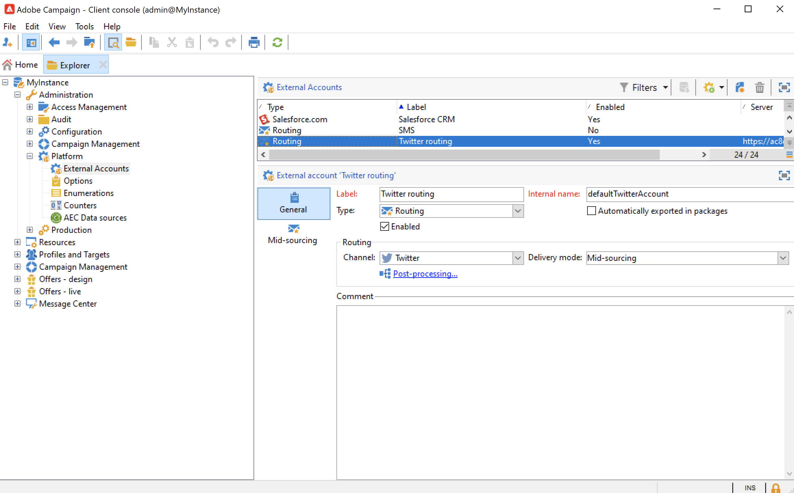

# 소셜 마케팅 정보{#about-social-marketing}

다음 **소셜 네트워크 관리** (소셜 마케팅) 소셜 네트워크 관리를 위해 설계된 애플리케이션을 사용하면 Twitter을 통해 고객 및 잠재 고객과 상호 작용할 수 있습니다.

에서 Campaign과 Twitter을 통합하는 주요 단계를 알아봅니다 [Campaign v8 설명서](https://experienceleague.adobe.com/docs/campaign/campaign-v8/connect/ac-tw.html){target="_blank"}.

온-프레미스 또는 하이브리드 고객은 Twitter 외부 계정을 구성하고 활성화해야 합니다. 하이브리드 구성의 경우 **중간 소싱** 중간 소싱 플랫폼에 대한 활성 연결과 함께 탭도 설정해야 합니다.

