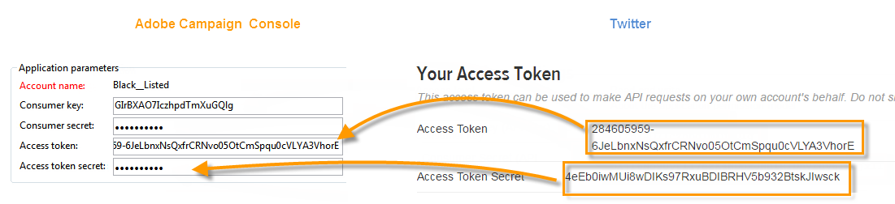

# Twitter에서 게시 구성{#configuring-publishing-on-twitter}

Adobe Campaign이 Twitter 계정으로 트윗을 전송하려면 해당 계정에 대해 Adobe Campaign에 대한 쓰기 액세스 권한을 위임해야 합니다. 이렇게 하려면 다음 구성 단계를 적용합니다.

* Twitter 계정 만들기를 참조하십시오.
* 증명 전송을 위한 Twitter 테스트 계정을 만듭니다.
* Twitter 계정당 하나의 Twitter 애플리케이션을 만듭니다.
* 각 Twitter 응용 프로그램에 대해 새 **[!UICONTROL Twitter]** 유형 서비스를 만듭니다.

## 사전 요구 사항 {#prerequisites}

먼저 하나 이상의 Twitter 계정을 만들어 트윗을 보낼 수 있습니다.

Twitter 계정을 만들려면 http://twitter.com으로 [이동하십시오](http://twitter.com).

## Twitter에서 테스트 계정 만들기 {#creating-a-test-account-on-twitter}

또한 트윗 교정본을 보내는 데 사용할 수 있는 비공개 Twitter 계정을 만드는 것이 좋습니다(자세한 내용은 증명 [보내기](../../social/using/publishing-on-twitter.md#sending-the-proof)참조).

* 새 Twitter 계정을 만듭니다.
* 오른쪽 상단 모서리의 메뉴를 클릭하고 **[!UICONTROL Settings]**&#x200B;선택합니다.
* 탭을 **[!UICONTROL Security and privacy]** 선택하고 **[!UICONTROL Protect my Tweets]** 상자를 선택합니다.
* 페이지 아래쪽에 있는 **[!UICONTROL Save Changes]** 단추를 클릭합니다.

## Twitter에서 응용 프로그램 만들기 {#creating-an-application-on-twitter}

Adobe Campaign이 Twitter 계정으로 트윗을 전송하려면 Twitter 계정당 하나의 Twitter 애플리케이션을 만들어야 합니다. 이렇게 하려면 다음 단계를 적용합니다.

1. Twitter 계정에 로그온합니다.
1. 인터넷 브라우저에 다음 주소를 입력합니다.https://apps.twitter.com/ .
1. 그런 다음 오른쪽에 있는 **[!UICONTROL Create New App]** 단추를 클릭합니다.

   

1. 마법사가 프로세스를 안내합니다.

   이 응용 프로그램이 Adobe Campaign에서 트윗을 계정에 전송하도록 허용하려면 응용 프로그램의 **[!UICONTROL Permissions]** 탭으로 이동하여 **[!UICONTROL Read and Write]** 섹션에 **[!UICONTROL Access]** 대해 선택합니다. 또한 **[!UICONTROL Settings]** 탭에서는 **[!UICONTROL Callback URL]** 필드를 비워 두어야 합니다.

   

## Adobe Campaign에 대한 쓰기 액세스 권한 위임 {#delegating-write-access-to-adobe-campaign}

각 Twitter 응용 프로그램에 대해 응용 프로그램 설정을 포함할 다른 **[!UICONTROL Twitter]** 유형 서비스를 만들어야 합니다.

이 단계를 수행하려면 Adobe Campaign 콘솔 및 Twitter 계정에 로그인한 인터넷 브라우저에 동시에 액세스해야 합니다.

* **Twitter**:이전에 만든 응용 프로그램([https://dev.twitter.com/apps](https://dev.twitter.com/apps))을 선택하고 **[!UICONTROL Keys and Access Tokens]** 탭을 클릭합니다.

   

* **Adobe Campaign**:우주로 **[!UICONTROL Profiles and targets]** 이동하고 **[!UICONTROL Services and Subscriptions]** 링크를 클릭한 다음 **[!UICONTROL Create]** 단추를 클릭합니다.

   

1. 유형을 **[!UICONTROL Twitter]** 선택합니다.

   

   >[!NOTE]
   >
   >이 **[!UICONTROL Synchronize subscriptions]** 옵션은 기본적으로 활성화되어 있습니다. 이 상자를 선택하면 Twitter 계정 동기화 작업 과정(Twitter 계정 [동기화](#synchronizing-twitter-accounts)참조)이 Twitter 팔로우어 목록을 복구하여 직접 메시지를 보낼 수 있습니다(구독자에게 [쪽지 보내기 참조](../../social/using/publishing-on-twitter.md#sending-direct-messages-to-subscribers)). 팔로워 목록을 복구하지 않으려면 이 상자의 선택을 취소합니다.

1. 서비스의 레이블과 내부 이름을 입력합니다.

   

   >[!CAUTION]
   >
   >서비스의 **[!UICONTROL Internal name]** 이름은 Twitter 계정의 이름과 동일해야 합니다. 입력 오류가 없는지 확인하려면 아래 단계를 수행하십시오.

   * 단추를 **[!UICONTROL Save]** 클릭합니다.
   * 서비스 개요에서 방금 만든 Twitter 유형 서비스를 클릭합니다.
   * 탭을 **[!UICONTROL Twitter page]** 선택합니다. Twitter 계정이 표시되어야 합니다.

      

1. 필드에서 팔로우어가 생성될 방문자 폴더를 **[!UICONTROL Visitor folder]** 선택합니다. 자세한 내용은 운영 원칙을 [참조하십시오](../../social/using/publishing-on-twitter.md#operating-principle). 기본적으로 **[!UICONTROL Visitors]** 폴더 루트에 팔로우어가 만들어집니다.

   

1. Twitter에서 **[!UICONTROL Consumer Key (API Key)]** 및 **[!UICONTROL Consumer Secret (API Secret)]** 필드의 컨텐츠를 복사하여 콘솔의 **[!UICONTROL Consumer key]** 및 **[!UICONTROL Consumer secret]** 필드에 붙여넣습니다.

   

1. Twitter에서 **[!UICONTROL Access Token]** 및 **[!UICONTROL Access Token Secret]** 필드의 컨텐츠를 복사하여 콘솔의 **[!UICONTROL Access token]** 및 **[!UICONTROL Access token secret]** 필드에 붙여넣습니다.

   

1. Adobe Campaign 콘솔에서 을 클릭합니다 **[!UICONTROL Save]**. 이제 Adobe Campaign에 대한 쓰기 액세스 위임이 완료되었습니다.

   

>[!NOTE]
>
>Twitter 응용 프로그램당 하나의 **[!UICONTROL Twitter]** 유형 서비스를 만들어야 합니다.

이 **[!UICONTROL Twitter account Synchronization]** 워크플로우는 Adobe Campaign에서 Twitter 계정을 동기화합니다. 자세한 내용은 Facebook 페이지 [동기화를 참조하십시오](../../social/using/publishing-on-facebook-walls.md#synchronizing-facebook-pages).

## Twitter 계정 동기화 {#synchronizing-twitter-accounts}

>[!CAUTION]
>
>워크플로우가 Twitter 가입자 목록을 복구하려면 계정에 연결된 서비스의 편집 섹션에서 **[!UICONTROL Twitter account synchronization]** 상자를 선택해야 합니다. 자세한 내용은 Adobe Campaign에 [대한 쓰기 액세스 권한 위임을 참조하십시오](#delegating-write-access-to-adobe-campaign).

노드를 통해 액세스하는 **[!UICONTROL Twitter account synchronization]** 워크플로우에서는 이전에 Adobe Campaign과 구성된 Twitter 계정을 동기화할 수 **[!UICONTROL Administration > Production > Technical workflows > Managing social networks]** 있습니다. 기본적으로 이 워크플로우는 매주 목요일 오전 7:30에 실행됩니다.

>[!NOTE]
>
>예상 작업 처리를 실행하여 언제든지 워크플로우를 시작할 수 있습니다. 스케줄러를 편집하여 워크플로우 트리거 빈도를 변경할 수도 있습니다. For more on the scheduler, refer to [this section](../../workflow/using/scheduler.md).

이제 트윗을 Twitter 계정으로 전송하고 팔로워에게 쪽지를 보낼 수 있습니다. 자세한 내용은 다음을 참조하십시오.Twitter [에서 게시](../../social/using/publishing-on-twitter.md).
