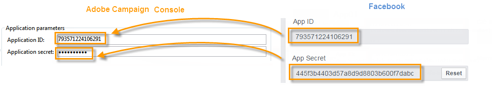
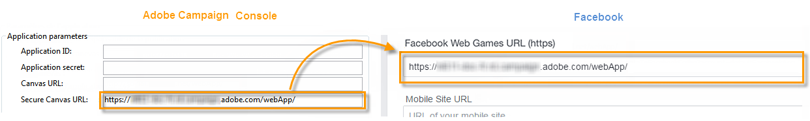
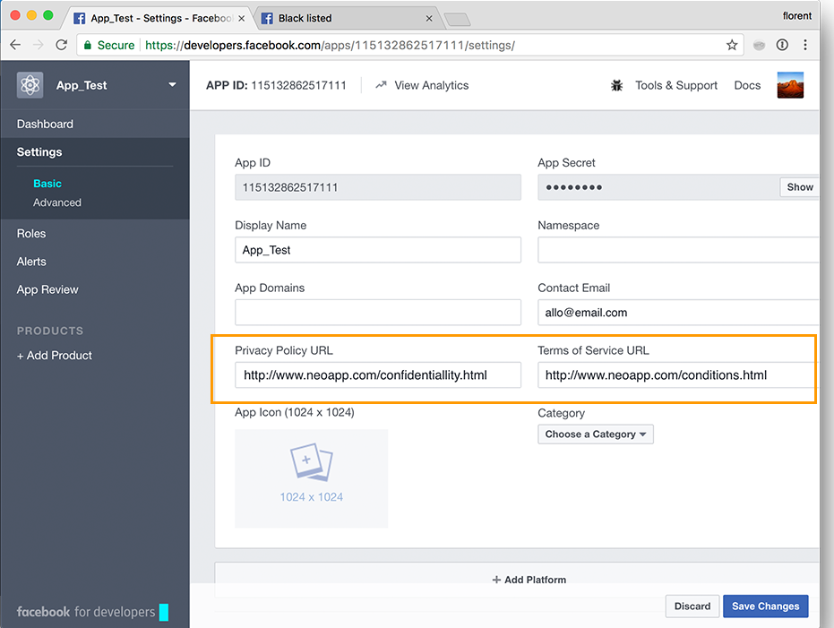

# Facebook 애플리케이션 만들기{#creating-a-facebook-application}

웹 애플리케이션 덕분에 Social Marketing을 사용하면 Facebook 애플리케이션에 개인화된 컨텐츠를 표시할 수 있으므로 이 소셜 네트워크를 통해 잠재 고객을 더 쉽게 확보할 수 있습니다. Facebook 유형 웹 애플리케이션에 대한 자세한 예는 Facebook [앱의](../../social/using/examples-of-facebook-apps.md)예를 참조하십시오.

>[!NOTE]
>
>파트너가 개발한 Facebook 애플리케이션과 Adobe Campaign을 통합할 수도 있습니다. 이 경우 Facebook 프로필을 얻기 위해 Adobe Campaign 웹 애플리케이션을 사용할 필요가 없습니다. 자세한 내용은 외부 계정 [구성을 참조하십시오](#configuring-external-accounts).

다음 구성 단계를 적용합니다.

1. 하나 이상의 Facebook 애플리케이션을 만듭니다. 자세한 내용은 다음을 참조하십시오.Facebook [애플리케이션](../../social/using/publishing-on-facebook-walls.md#creating-a-facebook-application)만들기를 참조하십시오.
1. Facebook 권한 요청 화면에 표시할 **[!UICONTROL terms of service]** 및 **[!UICONTROL Privacy policy]** 링크를 입력합니다. 자세한 내용은 다음을 참조하십시오.서비스 [약관 및 개인 정보 보호 정책 링크를](#entering-the-terms-of-service-and-privacy-policy-links)입력합니다.
1. 각 Facebook 애플리케이션에 대해 **[!UICONTROL Facebook Connect]** 유형 외부 계정을 만듭니다. 자세한 내용은 다음을 참조하십시오.외부 [계정](#configuring-external-accounts)구성
1. 각 Facebook 애플리케이션에 대해 Adobe Campaign에서 Facebook 유형 웹 애플리케이션을 만듭니다. 자세한 내용은 다음을 참조하십시오.Facebook [유형 웹 애플리케이션](#creating-a-facebook-type-web-application)만들기.
1. Facebook 페이지에서 탭으로 표시되도록 Facebook 애플리케이션을 구성합니다. 자세한 내용은 다음을 참조하십시오.Facebook [탭](#configuring-facebook-tabs)구성을 참조하십시오.

## 외부 계정 구성 {#configuring-external-accounts}

각 Facebook 애플리케이션에 대해 **[!UICONTROL Facebook Connect]** 유형 외부 계정을 만들어야 합니다.

이 단계를 수행하려면 Adobe Campaign 콘솔과 페이지 관리에 사용하는 Facebook 계정에 로그인한 인터넷 브라우저에 액세스할 수 있어야 합니다.

* **Facebook**:이전에 만든 응용 프로그램(https://developers.facebook.com/apps) [을](https://developers.facebook.com/apps)선택하고 **[!UICONTROL Settings]** > **[!UICONTROL Basic]** 탭을 선택합니다.

   

   >[!NOTE]
   >
   >섹션이 나타나지 않으면 페이지 아래쪽에 있는 **[!UICONTROL Facebook Web Games]** 단추를 클릭하고 **[!UICONTROL Add Platform]** **[!UICONTROL Facebook Web Games]**&#x200B;선택합니다.

* **Adobe Campaign**:트리의 **[!UICONTROL Administration > Platform > External accounts]** 노드로 이동하고 을 클릭합니다 **[!UICONTROL New]**.

   

1. 레이블과 내부 이름을 입력하고 **[!UICONTROL Facebook Connect]** 유형을 선택합니다.

   

1. 응용 프로그램의 호스팅 모드를 선택합니다. **[!UICONTROL hosted by a partner]** 또는 **[!UICONTROL hosted by this instance]**.

   

   **파트너가 호스팅하는 애플리케이션**

   파트너가 개발한 Facebook 애플리케이션과 Adobe Campaign을 통합할 수 있습니다. 이 경우 Facebook 프로필을 얻기 위해 Adobe Campaign 웹 애플리케이션을 사용할 필요가 없습니다. Facebook 사용자가 애플리케이션을 설치하면 키(액세스 토큰)가 생성됩니다. 파트너는 웹 서비스를 호출하여 이 액세스 토큰을 Adobe Campaign으로 전달합니다. 그러면 Adobe Campaign은 이 토큰을 사용하여 Facebook 데이터베이스에 로그온하고 애플리케이션을 통해 사용자가 공유하는 데이터를 수집합니다.

   >[!NOTE]
   >
   >웹 서비스의 매개 변수는 다음 WSDL 파일에 자세히 설명되어 있습니다. **`https://<Instance name>/nl/jsp/schemawsdl.jsp?schema=nms:visitor`**

   타사 애플리케이션을 Adobe Campaign에 통합하려면 **[!UICONTROL App ID]** 및 **[!UICONTROL App Secret]** Facebook 필드의 컨텐츠를 복사하여 콘솔의 **[!UICONTROL Application ID]** 및 **[!UICONTROL Application secret]** 필드에 붙여 넣어야 합니다.

   

   **이 인스턴스에서 호스팅하는 응용 프로그램**

   이 인스턴스에서 애플리케이션을 호스팅하려면(타사 애플리케이션이 없는 경우) Adobe Campaign 웹 애플리케이션을 사용하여 Facebook 프로필을 가져와야 합니다. 자세한 내용은 Facebook [앱의](../../social/using/examples-of-facebook-apps.md)예를 참조하십시오.

   Adobe Campaign 콘솔에서 **[!UICONTROL Secure Canvas URL]** 필드에 포함된 주소를 복사하여 Facebook의 **[!UICONTROL Facebook Web games (https)]** 필드( **[!UICONTROL Facebook Web Games]** 섹션)에 붙여넣습니다.

   

   >[!IMPORTANT]
   >
   >어떤 경우에도 안전하지 않은 URL을 사용해서는 안 됩니다.

   Facebook에서 **[!UICONTROL App ID]** 및 **[!UICONTROL App Secret]** 필드의 컨텐츠를 복사하여 콘솔의 **[!UICONTROL Application ID]** 및 **[!UICONTROL Application secret]** 필드에 붙여넣습니다.

   

1. Facebook에서 페이지 아래쪽에 있는 **[!UICONTROL Save Changes]** 단추를 클릭합니다.
1. Adobe Campaign 콘솔에서 **[!UICONTROL Subscribe]** 단추를 클릭하여 팬이 이 애플리케이션을 통해 로그인할 때마다 Adobe Campaign이 실시간으로 데이터를 복구할 수 있도록 합니다. 자세한 내용은 다음을 참조하십시오.Facebook 앱의 [예](../../social/using/examples-of-facebook-apps.md).

   

## 서비스 약관 및 개인 정보 보호 정책 링크 입력 {#entering-the-terms-of-service-and-privacy-policy-links}

Facebook 권한 요청 화면에 표시할 **[!UICONTROL Terms of service]** 및 **[!UICONTROL Privacy policy]** 링크를 추가하는 것이 좋습니다.

구성 단계는 다음과 같습니다.

1. 다음 주소를 입력합니다.https://developers.facebook.com/apps 다음에 Facebook 애플리케이션을 선택합니다.
1. 탭을 **[!UICONTROL Settings > Basic]** 선택하고 **[!UICONTROL Privacy Policy URL]** 및 **[!UICONTROL Terms of Service URL]** 필드를 입력합니다.

   

## Facebook 유형 웹 애플리케이션 만들기 {#creating-a-facebook-type-web-application}

Adobe Campaign Facebook 애플리케이션을 사용하면 Facebook 애플리케이션에 개인화된 컨텐츠를 표시할 수 있습니다. 각 Facebook 애플리케이션에 대해 Adobe Campaign에서 웹 애플리케이션을 만들어야 합니다. Facebook 웹 애플리케이션을 만들려면 다음과 같이 하십시오.

1. 우주로 **[!UICONTROL Social networks]** 이동하고 **[!UICONTROL Applications]** 링크를 클릭한 다음 **[!UICONTROL Create]** 단추를 클릭합니다.

   

1. 목록에서 Facebook 웹 애플리케이션 템플릿을 선택하고 레이블을 입력합니다.

   

   >[!NOTE]
   >
   >기본적으로 제공되는 Facebook 웹 애플리케이션 템플릿에는 4가지가 있습니다.
   >
   >* **[!UICONTROL New Facebook application]**:빈 애플리케이션에서 시작하려면 이 템플릿을 선택합니다.
   >* **[!UICONTROL Pre-entered form]**:사용자가 프로필의 데이터를 사용하여 양식 필드를 자동으로 채울 수 있는 양식과 &quot;Facebook 로그인&quot; 단추가 있는 Facebook 애플리케이션입니다. 이를 통해 사용자는 양식을 보다 신속하게 완성할 수 있고 브랜드는 더 나은 품질의 정보를 얻을 수 있습니다.
   >* **[!UICONTROL "Canvas page" competition]**:사용자에게 더 나은 시각적 경험을 제공하기 위해 화면에 표시되는 Facebook 애플리케이션입니다.
   >* **[!UICONTROL "Page Tab" competition]**:Facebook 애플리케이션이 브랜드 페이지 탭에 완전히 통합되었습니다.

1. 필드에 Facebook 애플리케이션에 연결된 외부 계정을 **[!UICONTROL Application]** 입력합니다. 자세한 내용은 다음을 참조하십시오.외부 [계정](#configuring-external-accounts)구성

   

1. 탭을 **[!UICONTROL Edit]** 선택한 다음 웹 애플리케이션을 편집합니다. 자세한 내용은 다음을 참조하십시오.Facebook 앱의 [예](../../social/using/examples-of-facebook-apps.md).

   

1. 웹 응용 프로그램이 완료되면 **[!UICONTROL Dashboard]** **[!UICONTROL Publish]** 탭을 선택한 다음 을 클릭하여 온라인으로 게시합니다.

   

## Facebook 탭 구성 {#configuring-facebook-tabs}

Facebook 페이지에서 탭으로 표시되도록 Facebook 애플리케이션을 구성할 수 있습니다. 이렇게 하려면 다음 단계를 적용합니다.

1. Facebook 애플리케이션(https://developers.facebook.com/apps)[을](https://developers.facebook.com/apps)선택하고 **[!UICONTROL Settings > Basic]** 탭을 선택합니다.

   

1. 페이지 하단에서 **[!UICONTROL Add Platform]** 단추를 클릭하고 **[!UICONTROL Page Tab]**&#x200B;선택합니다.

   

1. 섹션의 **[!UICONTROL Page Tab Name]** 필드에 Facebook **[!UICONTROL Page Tab]** 페이지에 표시할 레이블을 입력합니다.

   

1. 필드에 웹 애플리케이션의 공개 URL을 **[!UICONTROL Secure Page Tab URL]** 입력합니다. 이 URL은 웹 애플리케이션의 **[!UICONTROL Dashboard]** 탭을 통해 액세스할 수 있습니다. Facebook 유형 웹 애플리케이션 만들기에 대한 자세한 내용은 Facebook [유형 웹 애플리케이션](#creating-a-facebook-type-web-application)만들기를 참조하십시오.

   

1. 웹 응용 **[!UICONTROL Dashboard]** 프로그램의 링크를 클릭합니다 **[!UICONTROL Add a page tab]** .

   

1. 탭을 추가할 Facebook 페이지를 선택하고 **[!UICONTROL Add Page Tab]**&#x200B;클릭합니다.

   

