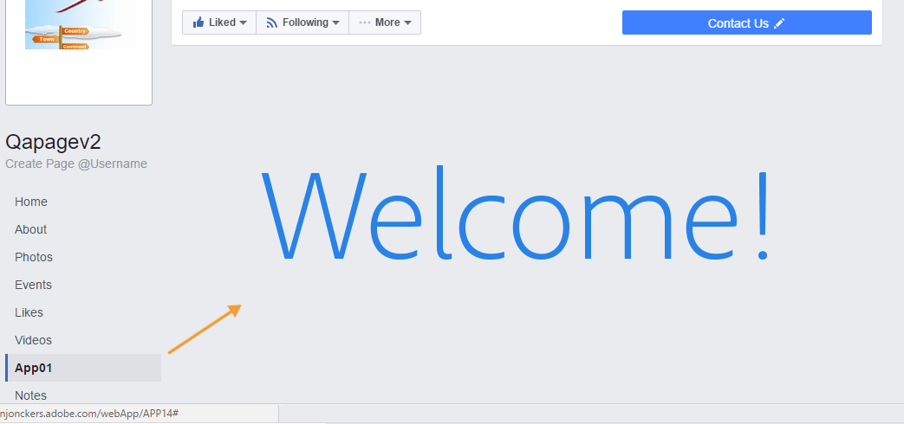
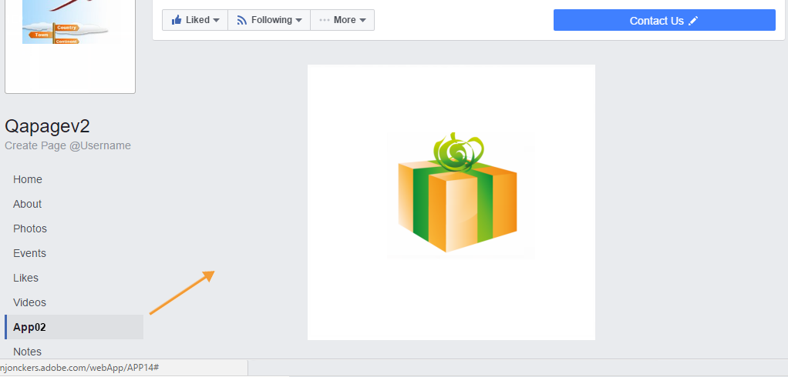
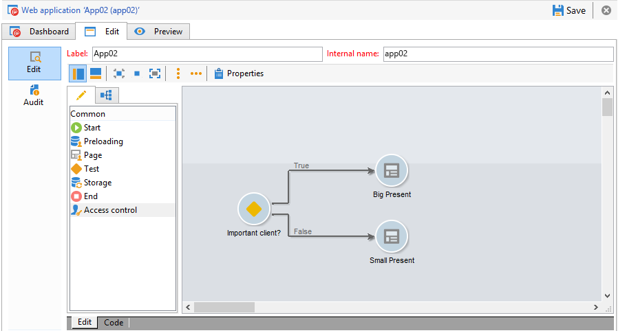
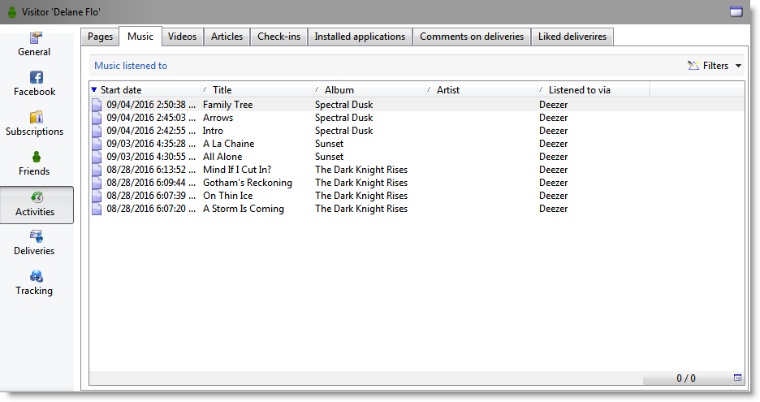

# Facebook 앱의 예{#examples-of-facebook-apps}

사용자가 Facebook 애플리케이션의 탭을 클릭하면 폭이 810픽셀인 공간에 표시됩니다. Adobe Campaign은 Facebook 유형 웹 애플리케이션을 사용하여 Facebook 애플리케이션에 표시되는 컨텐츠를 정의하고 개인화할 수 있으므로 프로파일을 손쉽게 확보할 수 있습니다.

>[!NOTE]
>
>파트너가 개발한 Facebook 애플리케이션과 Adobe Campaign을 통합할 수도 있습니다. 이 경우 Facebook 프로필을 얻기 위해 Adobe Campaign 웹 애플리케이션을 사용할 필요가 없습니다. 자세한 내용은 외부 계정 [구성을 참조하십시오](../../social/using/creating-a-facebook-application.md#configuring-external-accounts).

>[!CAUTION]
>
>Facebook 애플리케이션 만들기에 설명된 구성 단계를 따르십시오.

>[!NOTE]
>
>이 섹션에서는 Facebook 유형 웹 애플리케이션에 연결된 요소에 대해 자세히 설명합니다. 표준 웹 애플리케이션과 공유되는 모든 요소는 [이 섹션에](../../web/using/about-web-applications.md)자세히 설명되어 있습니다.

다음은 Facebook 유형 웹 애플리케이션의 예입니다.

* 7단계에서 Facebook 애플리케이션을 만드는 방법입니다. 빠른 [시작을 참조하십시오.7단계로](#quick-start--creating-a-facebook-application-in-7-steps)Facebook 애플리케이션 만들기를 참조하십시오.
* Facebook 애플리케이션에 설정을 전달하는 방법입니다. Facebook [애플리케이션에 설정을 전달하는 방법을 참조하십시오](#how-to-forward-settings-to-a-facebook-application-).
* 팬 데이터를 얻는 방법 팬 [데이터를 얻는 방법을 참조하십시오](#how-to-acquire-fan-data-).

>[!CAUTION]
>
>이러한 간단한 사용 사례는 Facebook 유형 웹 애플리케이션의 기능을 설명하기 위한 예로 제공됩니다.

## Recommendations {#recommendations}

다음 제한 사항은 Facebook에 직접 연결됩니다.

* 모든 웹 응용 프로그램을 HTTPS로 빌드해야 합니다.
* 탭을 통해 표시되는 Facebook 애플리케이션의 너비는 810픽셀입니다.

## 빠른 시작:7단계로 Facebook 애플리케이션 만들기 {#quick-start--creating-a-facebook-application-in-7-steps}

이 예에서는 Facebook에서 Adobe Campaign 빌드 애플리케이션을 표시하는 방법에 대한 단계별 프로세스를 제공합니다. 이 경우 사용자가 응용 프로그램 탭(App01 **)을** 클릭할 때 시작 메시지를 표시할 수 있는 응용 프로그램을&#x200B;**만듭니다**.

이 응용 프로그램을 만들려면 다음 단계를 적용합니다.

1. Facebook에서 애플리케이션을 만듭니다( https://developers.facebook.com/apps ). 자세한 내용은 다음을 참조하십시오.Facebook [애플리케이션](../../social/using/publishing-on-facebook-walls.md#creating-a-facebook-application)만들기를 참조하십시오.

   

1. 외부 계정 **[!UICONTROL Facebook Connect]** 유형을 만들고 Facebook 애플리케이션의 매개 변수를 입력합니다. 자세한 내용은 다음을 참조하십시오.외부 [계정](../../social/using/creating-a-facebook-application.md#configuring-external-accounts)구성

   

1. Facebook 권한 요청 화면에 표시할 **[!UICONTROL Terms of service]** 및 **[!UICONTROL Privacy policy]** 링크를 입력합니다. 자세한 내용은 다음을 참조하십시오.서비스 [약관 및 개인 정보 보호 정책 링크를](../../social/using/creating-a-facebook-application.md#entering-the-terms-of-service-and-privacy-policy-links)입력합니다.

   

1. Adobe Campaign에서 Facebook 유형 웹 애플리케이션을 만듭니다. 자세한 내용은 다음을 참조하십시오.Facebook [유형 웹 애플리케이션](../../social/using/creating-a-facebook-application.md#creating-a-facebook-type-web-application)만들기.

   

1. 웹 애플리케이션을 편집합니다. 이 예에서는 **[!UICONTROL Page]** 활동을 추가하고 제목을 정의했습니다.

   

1. 애플리케이션을 배포합니다.

   

1. Facebook 페이지에서 탭으로 표시되도록 Facebook 애플리케이션을 구성합니다. 자세한 내용은 다음을 참조하십시오.Facebook [탭](../../social/using/creating-a-facebook-application.md#configuring-facebook-tabs)구성을 참조하십시오.

   

App01 애플리케이션의 탭이 **Facebook** 페이지에 표시되는지 확인하십시오. 이 아이콘을 클릭하면 환영 **메시지가** 표시됩니다.

## Facebook 애플리케이션에 설정을 전달하는 방법 {#how-to-forward-settings-to-a-facebook-application-}

>[!CAUTION]
>
>Facebook 애플리케이션 만들기에 설명된 구성 단계를 따르십시오.

예 1에서는 **[!UICONTROL Fan of the page]** 필드의 값에 따라 Facebook 페이지 표시를 개인화했습니다. 또한 **[!UICONTROL Application settings]** 필드를 처리할 수도 있습니다. 이 필드를 사용하면 Facebook을 통해 Adobe Campaign에서 생성된 링크에 포함된 데이터를 복구할 수 있습니다.

이메일 캠페인을 보내는 회사의 예를 들어보겠습니다. 배달에서 링크는 Facebook 애플리케이션을 가리킵니다. 이 링크는 URL 끝에 추가된 **[!UICONTROL app_data]** 매개 변수 덕분에 개인화됩니다. 이 매개 변수의 값은 고객 중요성을 반영하는 지표일 수 있습니다. 이 예에서는 **[!UICONTROL app_data]** 매개 변수 값이 **[!UICONTROL big]** (중요한 고객) 및 **[!UICONTROL small]** (덜 중요한 고객)입니다.

개인화된 URL은 다음과 같습니다.

* `http://<path of the Facebook application>&app_data=big` (중요한 고객의 경우)
* `http://<path of the Facebook application>&app_data=small` (덜 중요한 고객의 경우)

Facebook에서 Adobe Campaign으로 전달된 익명의 데이터 중 필드 값이 수집되므로 Adobe Campaign에서 이 매개 변수를 기반으로 애플리케이션 표시를 개인화할 수 있습니다. **[!UICONTROL Application parameters]**

사용자가 중요한 고객인 경우( **[!UICONTROL app_data]** 매개 변수의 값이 **[!UICONTROL big]**&#x200B;해당) 다음 이미지가 표시됩니다.

사용자가 덜 중요한 고객인 경우( **[!UICONTROL app_data]** 매개 변수의 값이 **[!UICONTROL small]**&#x200B;해당) 다음 이미지가 표시됩니다.

이 사용 사례를 다시 만들기 위해 다음 요소로 구성된 웹 응용 프로그램을 만들었습니다.

* 필드를 기반으로 하는 **[!UICONTROL Test]** 활동 **[!UICONTROL Application parameter]** .
* 필드의 값에 따라 표시할 이미지가 들어 있는 두 **[!UICONTROL Application parameter]** 페이지.

## 팬 데이터를 얻는 방법 {#how-to-acquire-fan-data-}

>[!CAUTION]
>
>Facebook 애플리케이션 만들기에 설명된 구성 단계를 따르십시오.

이 예에서는 Facebook 사용자와 연락하고 프로필 정보를 공유할 수 있도록 오퍼를 제공하는 방법을 보여줍니다. 잠재 고객을 확보하고 자사의 Facebook 페이지에 경쟁업체를 배치하여 고객을 유치하는 예를 들어보겠습니다.

사용자가 **[!UICONTROL App03]** 탭을 클릭할 때마다 대회에 참가할지 묻습니다.

그들이 그 대회에 참가하기로 결정한다면, 우리는 그들이 그들의 프로필 정보를 공유할 것을 제안합니다.

사용자가 정보를 공유하기로 동의하면 다음 화면이 표시됩니다.

이 사용 사례를 만들기 위해 다음 요소를 포함하는 웹 응용 프로그램을 만들었습니다.

* 활동 **[!UICONTROL Test]** 활동
* 3페이지
* 활동 **[!UICONTROL Access control]** 활동
* 활동 **[!UICONTROL Pre-loading]** 활동
* 활동 **[!UICONTROL Save]** 활동
* 활동 **[!UICONTROL End]** 활동

### 활동 테스트 {#test-activity}

활동은 **[!UICONTROL Test]** 및 **[!UICONTROL ID]** **[!UICONTROL Application parameters]** 필드를 기반으로 합니다.

그것은 세 개의 지기로 구성되어 있습니다.

* **[!UICONTROL identifier (UID) is empty]** :이 식별자는 사용자가 이미 정보를 공유하기로 동의한 경우에만 Facebook에서 전달됩니다. 활동의 첫 번째 분기를 사용하면 **[!UICONTROL Test]** 입력한 적이 없는 사용자(예: 빈 ID가 있는 사용자)만 경쟁을 사용할 수 있도록 만들 수 있습니다.
* **[!UICONTROL application parameter equals 'thanks']** :facebook에 연결된 표시 오류를 사이드 단계로 이동하려면 웹 애플리케이션 종료 페이지가 Facebook 애플리케이션의 URL을 가리키며 이 **[!UICONTROL app_data]** 매개 변수가 **[!UICONTROL thanks]** 값 사용에 추가됩니다(자세한 내용은 다음을 참조하십시오.)활동 [종료](#end-activity)). 두 번째 분기를 사용하면 사용자가 첫 번째 분기의 **[!UICONTROL End]** 활동에서 왔는지(그리고 방금 경쟁업체에 입장) 여부를 확인하여 감사 메시지를 표시할 수 있습니다. 추가 URL 매개 변수 사용에 대한 자세한 내용은 다음을 참조하십시오.Facebook [애플리케이션에 설정을 전달하는 방법](#how-to-forward-settings-to-a-facebook-application-).
* **[!UICONTROL Default branch]** :사용자가 이전 날짜(애플리케이션 매개 변수와 다른)에 이미 경쟁 제품(ID)에 입장한 경우 이미 입력했음을 나타내는 페이지가 **[!UICONTROL thanks]**&#x200B;표시됩니다.

### 대회 페이지 {#competition-page}

Facebook에 연결된 표시 오류를 사이드 단계로 이동하려면 경쟁업체 페이지의 **[!UICONTROL Parent window]** 필드를 선택하거나 **[!UICONTROL In the top window]** **[!UICONTROL Window]** 필드를 선택해야 합니다.

### 액세스 제어 활동 {#access-control-activity}

이 **[!UICONTROL Access control]** 활동에서는 사용자가 경쟁에 들어올 때 Facebook 권한 요청 페이지를 표시할 수 있습니다. 사용자가 정보를 공유하기로 동의하면 사전 로드 중에 복구됩니다. 자세한 내용은 다음을 참조하십시오.사전 [로드 활동](#pre-loading-activity).

이전에 웹 애플리케이션을 만들 때 외부 계정을 입력한 경우(Facebook [유형 웹 애플리케이션](../../social/using/creating-a-facebook-application.md#creating-a-facebook-type-web-application)만들기 참조) 활동을 편집할 필요가 없습니다. 그렇지 않은 경우 **[!UICONTROL Application]** 필드로 이동하여 Facebook 애플리케이션에 연결된 외부 계정을 선택합니다.

### 사전 로드 활동 {#pre-loading-activity}

사전 로딩에 사용할 데이터 소스를 선택합니다.

* **[!UICONTROL Marketing database]** :이 옵션을 사용하면 Adobe Campaign 데이터베이스를 통해 데이터를 미리 로드할 수 있습니다.
* **[!UICONTROL Facebook]** :이 옵션을 사용하면 Facebook을 사용하여 데이터를 미리 로드할 수 있습니다.

**마케팅 데이터베이스**

이 옵션을 사용하면 방문자 테이블에 있는 프로필의 데이터를 복구할 수 있습니다. 사용자가 Facebook 애플리케이션 탭을 클릭할 때 복구된 외부 Facebook ID를 기반으로 확인이 수행됩니다. 활동 후에 양식을 추가하면 데이터베이스에 정보가 들어 있는 필드가 미리 로드됩니다. **[!UICONTROL Pre-loading]**

>[!NOTE]
>
>Adobe Campaign 데이터베이스를 통해 데이터를 미리 로드하는 방법에 대한 자세한 내용은 [이 섹션을](../../web/using/publishing-a-web-form.md#pre-loading-the-form-data)참조하십시오.

**Facebook**

이 옵션을 사용하면 사용자가 공유하기로 동의한 정보 중 수집할 Facebook 프로필 정보를 저장할 수 있습니다.

이 **[!UICONTROL Database information]** 옵션을 사용하여 다음 데이터를 수집할 수 있습니다.

* **[!UICONTROL External ID]**:사용자 ID
* **[!UICONTROL Gender]**:사용자 성별
* **[!UICONTROL Verified]** :이 필드는 사용자가 확인된 Facebook 계정을 가지고 있는지 여부를 지정합니다.
* **[!UICONTROL Full name]**:사용자 전체 이름
* **[!UICONTROL First name]**:사용자 이름
* **[!UICONTROL Last name]**:사용자의 성
* **[!UICONTROL Language]**:사용자 언어

해당 상자를 선택하여 프로필 사진, 친구 목록, 이메일 주소, 생년월일, 관심사 및 위치를 수집할 수도 있습니다.

클릭하기 **[!UICONTROL Ok]**&#x200B;전에 **[!UICONTROL I agree to comply with Facebook conditions of use]** 상자를 선택합니다.

>[!NOTE]
>
>섹션에서 하나 이상의 상자를 선택하면 Facebook 권한 요청 화면에 해당 데이터에 대한 액세스 요청이 자동으로 표시됩니다. **[!UICONTROL Private information]**
>
>선택한 정보를 수집하려면 사용자가 정보에 대한 공유에 동의해야 합니다.
>
>Adobe Campaign과 Facebook을 통해 두 가지 유형의 미리 로드 유형을 모두 사용하려면 미리 로드 상자를 하나씩 추가합니다.

### 활동 저장 {#save-activity}

이 **[!UICONTROL Save]** 활동을 사용하면 이전 단계 동안 수집된 정보를 방문자 테이블에 저장할 수 있습니다.

프로필이 방문자 테이블에 이미 존재하는 경우 해당 데이터가 수집된 새 데이터로 업데이트됩니다.

프로필이 데이터베이스에 없고 Facebook 사용자의 이메일 주소가 수집된 경우 방문자 테이블에 방문자가 만들어집니다.

1. 필드에서 프로필을 만들 폴더를 **[!UICONTROL Visitor creation folder]** 선택합니다. Facebook 유형 웹 애플리케이션의 경우 기본 생성 폴더는 **[!UICONTROL Visitors]**&#x200B;입니다.
1. 필드에서 **[!UICONTROL Reconciliation mode]** 사용할 조정 모드를 선택합니다.

   * **[!UICONTROL Automatic]** :화해는 이메일, 성, 성, 성, 생년월일을 기준으로 한다.
   * **[!UICONTROL Manual]** :조정 키를 하나 이상 선택하십시오.
   * **[!UICONTROL None]** :어떠한 화해도 일어나지 않을 것입니다.

1. 필드에서 조정을 수행할 스키마를 **[!UICONTROL Mapping]** 선택합니다.

   >[!CAUTION]
   >
   >배달 매핑에서 **[!UICONTROL Social networks]** 탭의 필드를 올바르게 입력했는지 확인합니다. 배달 매핑은 **[!UICONTROL Administration > Campaign management > Target mappings]** 노드를 통해 액세스합니다.

1. 조정을 위한 검색 폴더 및 새 프로필에 대한 생성 폴더를 선택할 수 있습니다. 필드가 비어 있으면 프로파일이 검색 및 매핑 스키마의 기본 폴더에 생성됩니다.

### 종료 활동 {#end-activity}

Facebook에 연결된 표시 오류를 사이드 단계로 이동하려면 **[!UICONTROL Use an external URL]** 상자를 선택하고 Facebook 애플리케이션의 URL을 입력한 다음 **[!UICONTROL app_data]** 매개 변수와 값을 입력해야 합니다. 이 값은 사용자가 경쟁업체에 막 입장했는지 여부를 감지하고 해당되는 경우 감사 메시지를 표시하는 데 사용됩니다. **[!UICONTROL Test]** 자세한 내용은 다음을 참조하십시오.활동 [테스트](#test-activity).

이 예에서는 사용된 값이 **감사합니다**.

### 방문자의 세부 사항 화면 {#details-screen-of-a-visitor}

Twitter 팔로워의 경우처럼운영 [원칙](../../social/using/publishing-on-twitter.md#operating-principle)) 복구된 Facebook 프로필은 방문자 표에 저장됩니다. 방문자 목록을 표시하려면 **[!UICONTROL Profiles and Targets > Visitors]** 노드로 이동합니다.

프로필 정보를 공유하기로 동의하는 각 Facebook 잠재 고객이 방문자 목록에 추가됩니다. 이 **[!UICONTROL Friends]** 상자가 **[!UICONTROL Pre-load]** 활동에서 선택된 경우(사전 [로딩 활동](#pre-loading-activity)) 친구도 추가됩니다.

방문자 세부 사항 창의 **[!UICONTROL Summary]** **[!UICONTROL New Contact]** 섹션에는 표시기에 대해 두 가지 가능한 상태가 있습니다.

녹색 확인 표시가 표시되면 방문자가 수신자와 화해하지 않은 것입니다. 이 경우 받는 사람 목록에 새 프로필이 만들어집니다.

빨간색 십자는 방문자가 수신자와 화해했음을 의미합니다. 필드 오른쪽의 돋보기를 클릭하여 일치하는 수신자를 표시할 수 **[!UICONTROL Recipient]** 있습니다.

해당하는 경우 수신자의 세부 정보 창으로 이동하여 일치하는 방문자를 표시합니다. 탭을 **[!UICONTROL Others]** 선택한 다음 **[!UICONTROL Web identities]** 섹션에서 방문자 이름을 두 번 클릭합니다.

방문자 세부 사항 페이지의 **[!UICONTROL Activities]** 화면에는 다음 정보가 포함됩니다.

* &quot;Open Graph&quot; 유형 팬 활동:음악 재생, 비디오 시청, 아티클 읽기 및 설치된 응용 프로그램 정보(Deezer, Spotify, Dailymotion, Yahoo News 등)

   

* Adobe Campaign에서 보낸 전달 후 팬이 추가한 &quot;좋아요&quot; 및 댓글
* 팬이 좋아한 페이지
* 팬의 체크인

   

   >[!NOTE]
   >
   >Adobe Campaign에서 팬의 체크 인을 수집하려면 서비스 구성 화면에서 **[!UICONTROL Subscribe]** 단추를 클릭해야 합니다. 자세한 내용은 외부 계정 [구성을 참조하십시오](../../social/using/creating-a-facebook-application.md#configuring-external-accounts).

## Facebook 프로필 데이터를 사용하여 양식 필드를 미리 로드하는 방법 {#how-to-pre-load-the-fields-of-a-form-using-facebook-profile-data}

또한 이 **[!UICONTROL Social Marketing]** 애플리케이션을 사용하면 Facebook 프로필 정보를 사용하여 필드를 미리 로드하는 단추를 양식에 추가할 수 있습니다. 모든 웹 애플리케이션 템플릿(**[!UICONTROL Page]** 유형 활동)에서 사용할 수 있는 이 옵션은 [이 섹션에](../../web/using/static-elements-in-a-web-form.md#inserting-html-content)자세히 설명되어 있습니다.

>[!NOTE]
>
>이 기능을 사용하기 전에 Facebook 애플리케이션과 **[!UICONTROL Facebook Connect]** 유형 외부 계정을 만들어야 합니다. 자세한 내용은 외부 계정 [구성을 참조하십시오](../../social/using/creating-a-facebook-application.md#configuring-external-accounts).

