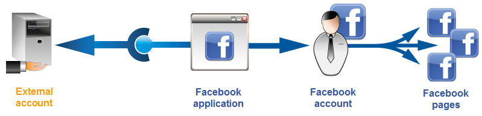
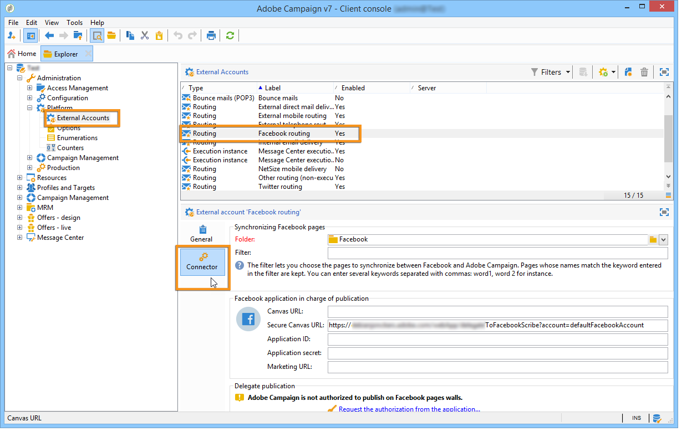

# Facebook 담벼락에 게시{#publishing-on-facebook-walls}

Adobe Campaign에서 발행물을 Facebook 담벼락에 보낼 수 있으려면 이러한 페이지에 대한 쓰기 액세스 권한을 Adobe Campaign에 위임해야 합니다. 여기에는 다음 구성 단계가 포함됩니다.

1. 하나 이상의 페이지로 Facebook 계정을 만듭니다.
1. 교정본을 보낼 Facebook 테스트 페이지를 만듭니다.
1. Facebook 애플리케이션을 만듭니다.
1. Facebook 애플리케이션 설정을 **[!UICONTROL Facebook routing]** 외부 계정의 Adobe Campaign에 입력합니다.

## 사전 요구 사항 {#prerequisites}

먼저 Facebook 계정 및 여러 페이지를 만듭니다.발행물을 전송하는 데 사용됩니다.

* Facebook 계정을 만들려면 https://www.facebook.com [링크를](https://www.facebook.com) 사용하십시오.
* Facebook 페이지를 만들려면 https://www.facebook.com/pages/create.php [링크를](https://www.facebook.com/pages/create.php) 사용하십시오.

   동일한 Facebook 계정을 사용하여 모든 페이지를 관리하는 것이 좋습니다. 이렇게 하면 계정의 모든 페이지에 한 개의 Facebook 애플리케이션과 하나의 외부 계정만 작성하면 됩니다.

   

## 테스트 Facebook 페이지 만들기 {#creating-a-test-facebook-page}

게시 교정본을 제공하기 위해 비공개 Facebook 페이지를 만드는 것이 좋습니다(자세한 내용은 [증명](#sending-the-proof)보내기 참조).

1. 페이지를 관리하는 데 사용하는 Facebook 계정에 로그온합니다.
1. 새 Facebook 페이지를 만듭니다.
1. 오른쪽 상단 모서리의 **[!UICONTROL Settings]** 단추를 클릭합니다.
1. 탭에서 페이지의 가시성 매개 변수를 **[!UICONTROL General]** 수정합니다.확인란을 **[!UICONTROL Page unpublished]** 선택합니다.
1. 단추를 **[!UICONTROL Save Changes]** 클릭합니다.

## Facebook 애플리케이션 만들기 {#creating-a-facebook-application}

Adobe Campaign을 페이지 담벼락에 게시하려면 Facebook 애플리케이션을 만들어야 합니다. 이렇게 하려면 다음 단계를 적용합니다.

1. 페이지를 관리하는 데 사용하는 Facebook 계정에 로그온합니다.
1. 브라우저에 다음 주소를 입력합니다.https://developers.facebook.com/apps .

   >[!CAUTION]
   >
   >보유하고 있는 계정의 유형에 따라 하나 이상의 인증이 필요할 수 있습니다.
   >
   >Facebook 애플리케이션을 만들려면 **확인된** Facebook 계정이 필요합니다.

1. 페이지의 오른쪽 위 모서리에 있는 **[!UICONTROL Add a New App]** 단추를 클릭합니다. 앱 이름과 연락처 이메일을 입력한 다음 보안 검사를 전달합니다.

   

1. 아래에서 **[!UICONTROL Settings > Basic]**&#x200B;을 **[!UICONTROL Add a platform]** 클릭하고 **[!UICONTROL Facebook Web Games]** 유형을 선택합니다.

   

1. 왼쪽 **[!UICONTROL Products]** 메뉴의 섹션에서 제품이 표시되는지 확인합니다 **[!UICONTROL Facebook Login]** . 그렇지 않은 경우 새 제품을 추가하고 **[!UICONTROL Facebook Login]**&#x200B;선택합니다.

   

1. 응용 프로그램이 만들어지면 **[!UICONTROL App Review]** 탭을 선택하고 응용 프로그램을 게시합니다.

   

## Adobe Campaign에 대한 쓰기 액세스 권한 위임 {#delegating-write-access-to-adobe-campaign}

페이지 담벼락에 게시하기 위해 Adobe Campaign에 대한 쓰기 액세스 권한을 위임하려면 이전에 만든 Facebook 애플리케이션의 매개 변수를 입력해야 합니다.

이 단계를 수행하려면 Adobe Campaign 콘솔과 페이지 관리에 사용하는 Facebook 계정에 로그인한 인터넷 브라우저에 액세스할 수 있어야 합니다.

>[!CAUTION]
>
>이 구성을 수행하려면 Adobe Campaign 운영자에게 관리 권한이 있어야 합니다.

* **Facebook**:이전에 만든 응용 프로그램(https://developers.facebook.com/apps) [을](https://developers.facebook.com/apps)선택하고 **[!UICONTROL Settings > Basic]** 탭을 선택합니다.

   

   >[!NOTE]
   >
   >섹션이 나타나지 않으면 페이지 아래쪽에 있는 **[!UICONTROL Facebook Web Games]** 단추를 클릭하고 **[!UICONTROL Add Platform]** **[!UICONTROL Facebook Web Games]**&#x200B;선택합니다.

* **Adobe Campaign**:트리의 **[!UICONTROL Administration > Platform > External Accounts]** 노드로 이동하여 **[!UICONTROL Facebook routing]** 외부 계정을 선택하고 **[!UICONTROL Connector]** 탭을 클릭합니다.

   

1. Adobe Campaign 콘솔에서 **[!UICONTROL Secure Canvas URL]** 필드에 포함된 주소를 복사하여 Facebook의 **[!UICONTROL Secure Web Games URL (https)]** 필드( **[!UICONTROL Facebook Web Games]** 섹션)에 붙여넣습니다.

   

   >[!CAUTION]
   >
   >어떤 경우에도 안전하지 않은 URL을 사용해서는 안 됩니다.

   이 URL을 복사하여 > **[!UICONTROL Products]** > **[!UICONTROL Facebook Login]** > **[!UICONTROL Settings]** > **[!UICONTROL Valid OAuth Redirect URIs]**&#x200B;아래에 붙여넣을 수도 있습니다. URL의 유효성을 확인하려면 응용 프로그램을 저장하고 **[!UICONTROL Redirect URI to Check]** 필드에 URL을 복사하여 붙여 넣은 다음 을 클릭합니다 **[!UICONTROL Check URI]**.

   

1. Facebook에서 **[!UICONTROL App ID]** 및 **[!UICONTROL App Secret]** 필드의 컨텐츠를 복사하여 콘솔의 일치하는 필드에 붙여 넣습니다.

   

1. Facebook에서 페이지 아래쪽에 있는 **[!UICONTROL Save Changes]** 단추를 클릭합니다.
1. Adobe Campaign 콘솔로 이동하여 외부 계정을 저장합니다.

   >[!NOTE]
   >
   >이 **[!UICONTROL Marketing URL]** 필드는 선택 사항입니다.

1. Adobe Campaign 콘솔에서 탭 하단의 **[!UICONTROL Request the authorization from the application]** 링크를 클릭합니다 **[!UICONTROL Connector]** . 워크플로우는 자동으로 **[!UICONTROL Synchronize Facebook pages]** 트리거되며 관리자가 관리하는 모든 Facebook 페이지를 수집합니다. 자세한 내용은 Facebook 페이지 [동기화를 참조하십시오](#synchronizing-facebook-pages).

   

   >[!NOTE]
   >
   >기본적으로 페이지는 **[!UICONTROL Facebook]** 노드를 통해 사용 가능한 서비스 **[!UICONTROL Profiles and Targets > Services and Subscriptions]** 폴더에 추가됩니다. 탭의 **[!UICONTROL Folder]** 필드를 사용하면 **[!UICONTROL Connector]** 동기화 후 Facebook 페이지가 생성되는 서비스 폴더를 변경할 수 있습니다. 필드 덕분에 Adobe Campaign에서 동기화할 Facebook 페이지를 선택할 수도 **[!UICONTROL Filter]** 있습니다. 이 필드를 비워 두면 관리자가 관리하는 모든 Facebook 페이지가 동기화됩니다.

1. 대화 상자는 다양한 Facebook 권한 설정과 함께 표시됩니다. 이렇게 하면 Adobe Campaign에서 발행물을 Facebook 계정 페이지로 보낼 수 있습니다.

   다양한 권한 요청을 수락합니다.

   

1. Adobe Campaign은 Facebook 계정 페이지의 담벼락에 게시할 권한이 부여되었습니다.

   

>[!NOTE]
>
>Facebook 계정이 여러 페이지를 관리하는 경우 Facebook 계정의 모든 페이지에 쓰도록 하나의 외부 계정을 구성하면 됩니다. 새 Facebook 계정마다 새 **[!UICONTROL Routing]** 유형의 외부 계정을 만들어야 합니다.

워크플로우는 Facebook 계정에서 관리하는 모든 페이지를 동기화하여 Adobe Campaign을 통해 해당 담벼락에 직접 게시할 수 있도록 합니다. **[!UICONTROL Synchronization of Facebook pages]** 자세한 내용은 Facebook 페이지 [동기화를 참조하십시오](#synchronizing-facebook-pages).

## Facebook 페이지 동기화 {#synchronizing-facebook-pages}

노드를 통해 액세스하는 **[!UICONTROL Synchronization of Facebook pages]** **[!UICONTROL Administration > Production > Technical workflows > Managing social networks]** 워크플로우에서는 이전에 구성된 Facebook 계정의 페이지를 동기화(Adobe Campaign에서)할 수 있습니다. 기본적으로 이 워크플로우는 관리자가 서비스 구성 화면에서 **[!UICONTROL Request an authorization from the application]** 링크를 클릭할 때마다 하루에 한 번 실행되도록 구성됩니다(Adobe Campaign에 [대한 쓰기 액세스 권한 위임 참조](#delegating-write-access-to-adobe-campaign)).

동기화가 완료되면 수집된 페이지가 외부 계정에 입력된 서비스 폴더에 나타납니다(Adobe Campaign에 대한 쓰기 [액세스 권한 위임 참조](#delegating-write-access-to-adobe-campaign)). 기본적으로 페이지는 메뉴를 통해 사용할 수 있는 **[!UICONTROL Facebook]** 서비스 폴더의 루트에 추가됩니다 **[!UICONTROL Profiles and Targets > Services and subscriptions]** .

이제 Adobe Campaign을 통해 Facebook 페이지의 담벼락에 직접 게시할 수 있습니다. 자세한 내용은 Facebook에서 [게시를 참조하십시오](#publishing-on-facebook-walls).
